# Table of Contents

# Open Systems Pharmacology Suite Manual

Version 7.0

Publication date February 2017

Copyright © 2017 Open Systems Pharmacology Suite Community

License Owners of Open Systems Pharmacology Suite are allowed to print and use the PK-Sim® User Manual without fee, provided that the above copyright notice and this paragraph appear in all copies.

The manual is provided “as is” without expressed or implied warranty. You may not modify it in any way.

**Trademark information:** All trademarks within this manual belong to their legitimate owners. PK-Sim® and MoBi® use the CVODE solver:

©2002 The Regents of the University of California. Produced at the Lawrence Livermore National Laboratory (LLNL). Please, refer to the LLNL website for detailed information on licensing: 
*	http://www.llnl.gov/CASC/sundials/download/license.html
*	https://computation.llnl.gov/casc/sundials/main.html

Internet:
*	http://www.systems-biology.com 
*	http://www.pk-sim.com
*	https://github.com/Open-Systems-Pharmacology

Email:
*	support@systems-biology.com (for technical support)
*	info@systems-biology.com (for general information)

##   Mechanistic Modeling of Pharmacokinetics and Dynamics
    
*  Modeling Concepts
    
# PBPK Modeling - Systems Biology

Systems biology is a multidisciplinary and not clearly defined field of research. From an abstract point of view it is about understanding and investigating biology from a systems perspective. That is to say, the focus is not on isolated parts or processes, but on their interaction by which a certain behavior is generated or a certain task is fulfilled.

In modern science and engineering, systems are often studied using mathematical models for example in order to aggregate, integrate, formalize and challenge distributed existing knowledge, systematically analyse system behavior, develop and test hypotheses, and plan next experimental steps. Of course, the idea of using mathematical models also to investigate biology is not new. However, the more widespread use has strongly developed in the last decade as well as the increasing recognition and appreciation that mathematical models are needed besides, e.g. experimental and graphical models that have traditionally been used in biology, in order to cope with the ever increasing amount of data and information that are generated in life sciences. Considering the molecular complexity that forms the basis of life, it is clear that system boundaries and level of detail of any kind of model are limited. While experiments are and will remain an essential part of biological (and systems biological) research, in line with many "sytems biologists", we consider mathematical models as the core discipline of systems biology distinguishing it from other research approaches. Consequently, in this manual we mean mathematical models, if we speak simply of models and indicate, if we mean another form of model.

The content of this manual naturally is selected and biased. While systems biology includes biological diversity, we will focus on organisms and topics of broader relevance in pharmaceutical research and development, i.e. systems pharmacology, even though large parts of this software platform can also be used to address questions way beyond. But if we consider biochemical reactions or networks, for example, we often do that in a whole-body context to address the interaction of an active substance with an organism - this is where the software platform has unique capabilities and strengths.

While the very early phases of drug development do not involve work on whole organisms (animals or humans), the late preclinical phase includes animal experiments, mainly in mammals such as mice, rats, dogs, or monkeys before entering the clinical phase where the focus is on trials on humans as outlined below. Different modeling approaches have been developed to support investigations on different scales \[[39](../references.md#39)\]. As outlined above, we will focus on systems pharmacology, which can be viewed as a mechanistic approach to study pharmacodynamics and pharmacokinetics as illustrated below.

    
# PK and PD modeling

Pharmacokinetics (PK) may be defined as what the body does to the drug, as opposed to pharmacodynamics (PD) which may be defined as what the drug does to the body \[[4](../references.md#4)\].

The site of action of a pharmacological substance might be restricted to certain tissues or cells, which is why a quantitative estimate of the amount of administered substance that is available at the site of action is required. This question is the subject of pharmacokinetics and different modeling techniques are well- established in pharmaceutical research to support its investigation. So far, the most widely used approach is to establish descriptive and comparatively simple compartmental PK models that can be well identified based on available data. Often these models are applied to population PK data using nonlinear mixed-effect techniques (NLME), e.g. to quantify sources of population variability or covariate effects. Besides PK, such models may also include a description of a compound's effects (PD), for example, in the form of a simple hyperbolic or sigmoid concentration-effect relation (Michaelis-Menten, Hill, or Emax type).

Thus, in classical pharmacokinetic modeling, the aim is to fit a comparatively simple model to experimental data in order to determine pharmacokinetic parameters from the fitted concentration-time-course. These parameters are then used to characterize and quantify the behavior of the investigated substance in general or in a certain clinical trial and, potentially, to make extrapolations to situations that have not been already investigated.

In contrast to the rather phenomenological consideration of drug PK in compartmental models, physiologically–based pharmacokinetic (PBPK) models aim for a detailed representation of physiological processes as will be summarized in the following. Consequently, PBPK-modeling is based on the mathematical description of physical and physiological processes and in the framework of PBPK modeling a genuine simulation of the pharmacokinetic behavior using this description is performed. Also, the pharmacodynamics can be represented in more mechanistic detail as briefly discussed in [Modeling Concepts - PD and Reaction Network Modeling](06-modeling-concepts-pd-and-reaction-network-modeling.md). A good starting point for further reading can be found in \[[65](../references.md#65)\].

    
# Principles of PBPK Modeling

## Introduction to PBPK Modeling

Physiologically-based pharmacokinetic modeling is a mechanistic approach to describe the pharmacokinetics of a substance based on substance-specific properties and mammalian physiology, for which a substantial amount of prior biological information is used for model building, \[[92](../references.md#92)\], \[[93](../references.md#93)\], \[[95](../references.md#95)\], \[[96](../references.md#96)\], \[[97](../references.md#97)\], \[[14](../references.md#14)\], \[[22](../references.md#22)\], \[[69](../references.md#69)\].

The general idea, introduced as early as 1924 \[[31](../references.md#31)\], is to divide the body into physiologically relevant compartments, essentially important organs, and to set up a mass balance equation for each compartment describing the fate of the substance within that compartment \[[76](../references.md#76)\]. In PK-Sim® a physiological framework model is provided where the mammalian body is divided into containers representing relevant organs or tissues as well as arterial and venous blood pools connecting the different organs through the blood flow. Organs are further sub-divided into several sub-compartments that describe essentially the vascular space divided into plasma and (red) blood cells as well as the avascular space divided into interstitial and cellular space. Such a model framework corresponds to a detailed compartmental model and provides the structural basis to describe the behavior of a substance.

For the simulation of the whole body, all mass balance equations are combined in a system of interdependent differential equations. In the simplest version of this system, all organs are connected in parallel between the arterial and venous blood pools such that blood flows from arteries to veins, except in the lung where the circulation is closed by a blood flow in the opposite direction.

When carrying out a simulation, this system of time-dependent differential equations is solved numerically. The primary results of such PBPK simulations are concentration-time-courses of the compound in the various compartments explicitly described in the equations. This means, besides the plasma concentration, at least one concentration curve for each organ is included in the output. Of course, derived PK parameter such as the area under the curve (AUC) or the maximum concentration (Cmax) can be calculated based on the primary output.

PBPK can also be well understood within ADME logics which is further detailed below:

## (L)ADME logic and routes of administration‌

The pharmacokinetics of a substance can be understood by considering its (liberation), absorption, distribution, metabolism, and excretion (ADME). While intravenously administered substances are directly available in the systemic circulation for distribution, substances administered e.g. orally, subcutaneously, or via inhalation need to be absorbed first. Also, in some cases the substance might not be directly available for absorption, but needs to be liberated first, in case an extended LADME scheme is of relevance.

### Liberation‌

Depending on the formulation of a substance, it might not be directly available for absorption processes. Certain formulations liberate the substance in a more or less controlled fashion and these processes can be included in PBPK models. Further details on modeling liberation in PK-Sim® [are described in [PK-Sim® - Formulations](../part-3/11-pk-sim-formulations.md).

### Absorption‌

Substances not administered intravenously, generally have to be absorbed before being available in the systemic circulation. The most common route of administration for which absorption is a very important issue, is oral (per os, PO) administration. Factors such as gastric emptying and intestinal transit time, stability and solubility of a substance or formulation, as well as the permeability across the intestinal wall based on passive and active transport processes are important for the fraction of a substance that is absorbed into the systemic circulation. Bioavailability is further determined by potential first pass metabolization as described below. Further details on modeling absorption in PK- Sim® are described in ???. Historically, a plug-flow-with-dispersion model was used in PK-Sim® \[[93](../references.md#93)\]. From version 5.0 on, a compartmental gastro-intestinal model is used, which is further detailed and discussed in \[[79](../references.md#79)\] and \[[80](../references.md#80)\].

### Distribution‌

After having reached the systemic circulation, the compound may distribute into tissue and organs, which leads to a decrease in the plasma concentration. The (apparent) volume of distribution is an important PK descriptor, theoretically defined as the volume in which the total amount of drug would need to be uniformly distributed to produce the given plasma concentration of a compound. However, the physiological processes that determine this volume may be complex.

The basic passive processes, which determine the behavior of a substance in an organ, are mass transport via the blood flow, permeation from vascular space into organ tissue and partitioning between blood plasma and organ tissue. The level of detail used for the description of these processes in a PBPK model can vary significantly. For the description of the passive physical processes involved in partitioning into the organs, usually two concepts are distinguished: blood flow limited and permeation limited partitioning. In the first case, all organs are assumed to be well-stirred compartments that equilibrate instantaneously with the plasma, and the time constant for the distribution of a substance into the peripheral organ is determined only by the blood flow rates. Alternatively, in models with permeation limitation, a permeation barrier is assumed between blood and organ tissue, resulting in a permeability dependence of the distribution and the corresponding time constants. Other important parameters determining the distribution behavior are the partition coefficients between the organ tissues and the blood plasma. These partition coefficients are given by the tissue to plasma concentration ratio under steady state conditions.

Apart from the passive processes described above, active transport processes or binding to proteins, including the target, can strongly influence the distribution behavior.

The relative contribution of different processes to distribution also depends on the type of molecule. For small molecules, the blood endothelial in the different organs often does not constitute a major distribution hurdle. An exception is the very important blood-brain barrier. For larger molecules such as biologics endothelial permeation can have a significant impact on the PK and additional processes such as the lymph flow is important for recirculation.

Further details and options for modeling distribution in PK-Sim® are described in Partition coefficient calculation methods”.

### Metabolism‌

Most substances are metabolized by enzymes in the organism. Often two distinct phases are distinguished: Phase I enzymes catalyze modifications that generally add functional groups to non-polar molecules; Phase II enzymes can then conjugate soluble molecules to these groups to allow a better elimination via the kidney or the gall bladder.

The products of such biotransformation steps are referred to as metabolites. If they are not active, they are often not further considered. However, metabolites can also constitute the pharmacologically active form of the substance or be responsible for side-effects.

Generally, the liver is considered as the most relevant organ for biotransformation. However, most metabolizing enzymes are also expressed in various other organs, even though often to a lower extent. Nevertheless, extra-hepatic metabolization can be very important. Mucosal clearance in the intestinal wall is just one prominent example. Together with first pass clearance in the liver this process also influences the bioavailability of a substance [77](../references.md#77).

Metabolism is generally an active and substance-specific process. While the enzyme equipment is a property of the organism, it has to be considered for each substance which enzymes are relevant. Further details on modeling metabolization in PK-Sim® [are described in [ADME Properties](../part-3/07-pk-sim-compounds-definition-and-work-flow.md#adme-properties).

### Excretion/Elimination‌

Compounds and their metabolites are generally removed from the body via excretion or elimination processes. The two most prominent routes of excretion are via the kidney into urine and via biliary excretion into the intestine and further into the feces. During the latter process, re-absorption can lead to entero-hepatic circulation of a substance. While biliary secretion is generally mediated via active transport, urinary secretion can be passive (glomerular filtration) or also due to active transport (tubular secretion). Other special routes of elimination can include exhalation via the lungs.

Just as the metabolization processes, the transporter "equipment" is a property of each individual organism. It has to be considered for each substance which transporters are relevant and whether or not the substance is subject to glomerular filtration. Further details on modeling excretion and elimination in PK-Sim® are described in [ADME Properties](../part-3/07-pk-sim-compounds-definition-and-work-flow.md#adme-properties).

## PBPK model parameterization‌

Due to its physiological basis, most parameters in a PBPK model are independent of substance knowledge or PK measurements. For example, information on blood flow rates, compartment volumes or composition, e.g. in terms of volume fractions of water, proteins, and lipids, can be implemented independently of the substance.

For establishing PBPK models to describe virtual humans, the physiological knowledge is not restricted to average individuals. For many parameters their distribution within different populations is known in an age-dependent or subject- specific manner allowing population PK predictions or extrapolations rather than fitting to data for interpolation. PBPK models can also be established for different animal species. With an established animal PBPK model at hand, for example, the physiological parameters can be substituted to make a first prediction for humans. The physiological correspondence of parameters enables both a good interpretation of results as well as a translation to new scenarios of application. Consequently, PBPK models are well-established in environmental toxicology and risk assessment fields and are becoming increasingly popular also in pharmaceutical research. In addition, PBPK models automatically provide exposure estimates at the site of action and, therefore, provide a natural basis to build multiscale PK/PD models and thereby provide a good platform for knowledge integration along the pharmaceutical research and development process \[[85](../references.md#85)\].

Besides this general information on mammalian physiology, PBPK models make use of generic distribution models. Using these models, only a few basic physico- chemical parameters of the substance such as molecular weight, lipophilicity, and protein binding can be used to determine relevant passive processes such as permeabilities across membranes and partition coefficients between compartments in order to describe the PK behavior. Additional parameters are required for the representation of active processes such as transport or enzyme- catalyzed metabolization.
        
# Expression data for PBPK modeling‌

Proteins play an important role for the PK of many substances. Most prominent examples are enzymes that catalyze the metabolization of drugs or transporters that can heavily influence drug absorption or distribution. Other examples include proteins a drug binds to, either by design (drug-target interaction) or as an off- target or side-effect. Such a binding can also influence distribution as well as metabolization and elimination of the drug.

In physiologically-based modeling approaches it is desirable to mechanistically reflect such relevant drug-protein interactions. While it might sometimes be sufficient to add one specific protein into the most relevant organ and describe the effects it has, e.g. cytochrome P450 3A4 mediated metabolization in the liver, it is in other cases preferable to consider additional organs and proteins. When doing so, it can be challenging to identify or assign parameter values to the involved proteins or processes. In order to assist the expert user in structurally modeling proteins and processes in relevant organs and to reduce the number of involved free parameters to a minimum, we have integrated protein expression databases.

Expert users may query and choose proteins of interest from this database and integrate them into the virtual individuals. Publicly available protein expression differences among organs are already included in this database. The user can choose to only have one parameter to describe the absolute amount of protein in one reference organ and thereby, indirectly, via the included relative expression differences, also fix the absolute amount in all other organs. Similarly, the user can assign one set of kinetic parameters characterizing the drug-protein interaction (e.g. kcat and Km, or kon and koff) and use it in all organs. Details on how to use the protein expression database are described in [PK-Sim® - Expression Data](../part-3/06-pk-sim-expression-data.md). See \[[46](../references.md#46)\] for an example that demonstrates that taking protein expression into account leads to an increase in PBPK model quality.
    
# Modeling Concepts - Modeling of Proteins‌

Therapeutic proteins are an increasingly important class of drugs. Particularly, monoclonal antibodies are used for different indications including cancer, inflammatory and autoimmune diseases \[[88](../references.md#88)\]. Engineered antibody fragments with tailored pharmacokinetic properties have potential as diagnostic and therapeutic agents \[[34](../references.md#34)\].

The pharmacokinetics of protein therapeutics are governed by a number of unspecific and specific processes, most of which play either no or only a minor role in small molecule drug kinetics. Processes which have to be covered in order to describe the pharmacokinetics of protein therapeutics include \[[42](../references.md#42)\]:

*   Exchange across the vascular endothelium between plasma and interstitial space by convection and diffusion.
    
*   Return of the drug from interstitial space of the organs to circulation by lymph flow.
    
*   Degradation and protection from degradation by neonatal Fc receptor (FcRn) in cellular endosomes.‌
    
*   Target-mediated deposition and clearance.
    
PK-Sim® offers a model specifically designed to describe the pharmacokinetics of proteins and other macromolecules. This model was developed by extending the standard model for small molecules by a description of the transcapillary drug exchange, lymph flows and endosomal space including drug degradation and protection from degradation by the FcRn receptor.

Within this model, the transcapillary exchange of the drug is described by the two-pore formalism \[[58](../references.md#58)\], \[[57](../references.md#57)\], \[[3](../references.md#3)\]. According to this theory, the barrier between plasma and interstitial space is described as a membrane consisting of two types of pores: a few large and many small ones. Macromolecules can pass through these pores by convection as well as diffusion. In order to describe these processes, the endothelial permeabilities and osmotic reflection coefficients of the drug for the different organs are calculated within PK-Sim® from the Stokes radius of the drug and endothelial properties like pore radii and hydraulic conductivity \[[58](../references.md#58)\].

The FcRn sub-model is based on the model published by Garg and Balthasar \[[26](../references.md#26)\]. The fraction of drug that is bound to FcRn within the endosomal space is recycled to plasma and the interstitial space whereas the fraction not bound to FcRn is cleared from the endosomal space. In PK-Sim®, endosomes represent the endosome in the vascular endothelium only and serve as compartment for protein.

degradation and recycling of large proteins. Endogenous IgG is also represented which competes with the drug for the FcRn receptor. The clearance of the drug thus depends on its affinity to the FcRn receptor, the endosomal concentration of endogenous IgG and the endosomal concentration of the FcRn receptor. The main difference to the model published by Garg and Balthasar \[[26](../references.md#26)\] is that in the PK-Sim® model the binding to the FcRn receptor is explicitly represented and, thus, different affinities to the FcRn receptor can be specified for the drug and the endogenous IgG, respectively.

Nonspecific binding or specific binding of the therapeutic protein to its target can be added within PK-Sim®. Specific binding within a tumor or a detailed description of target mediated clearance by receptor internalization can be added within MoBi® based on a PK-Sim® protein model.
    
# Modeling Concepts - PD and Reaction Network Modeling‌

Pharmacodynamics (PD) describes interactions of drugs with the organisms.

This includes binding of drugs to their targets (which may also be relevant for understanding the PK) and resulting direct or indirect effects. Pharmacodynamics can also relate drug concentration profiles (PK) to clinical endpoints, which usually requires consideration of disease progression. Various modeling approaches are used to either analyze PD or disease progression alone or in combination with PK. Simple models use a sigmoidal function to relate a concentration to its effects (e.g. Hill, IC50, Emax-shape) - here the maximum effect as well as the concentration that corresponds to half the maximum effect are typical curve characteristics. Such approaches can be combined with advanced statistical methods as the effect of a drug is rarely fully deterministic. Inter- individual or inter-occasion differences can be investigated and quantified in such a way see also [Modeling Concepts - PK and PD Modeling](02-modeling-concepts-pk-and-pd-modeling.md)

It is often not straightforward to transfer or translate such models to new scenarios of application. This, however, may be desirable in order to make predictions. A typical question to answer would be how the curve characteristics is expected to change in the new situation. However, if the model explicitly considers the crucial physiologic and mechanistic aspects, and it is known from independent experiments how these change in certain scenarios, a translation and prediction can become feasible. The level of mechanistic detail needed depends on the particular problem. In certain cases the desired detail might include sophisticated reaction networks. Sometimes these are on their own sufficient to understand relevant PD behavior . Detailed pathway modeling is also a major activity in systems biology in academia. Many excellent reviews are devoted to this topic, which will not be further detailed here.

In other cases or for other questions the PK/PD interaction is important to be considered. Here, PBPK models offer an intuitive framework to couple PK with simple or mechanistic PD models. See \[[18](../references.md#18)\] for a recent example.

##   Open Systems Pharmacology Suite

# Modules, Philosophy and Building Blocks

## Introduction

The Open Systems Pharmacology Suite contains different software tools and has been designed using a modular concept to allow efficient multi-scale modeling and simulation. The overall platform with its various software tools is implemented in a modular way as will be explained in more detail in “Modular Structure”. The central software tools PK-Sim® and MoBi® make use of building blocks as introduced in [PK-Sim® and its building blocks](#pk-sim) and [MoBi® and its building blocks](#mobi).
        
While PK-Sim® is based on a whole-body concept, the focus of its counterpart, MoBi®, is at the molecular level. However, both tools extend to additional physiological scales as illustrated below.

\])](images/Eissing_et_al_Frontiers_2011_Figure1.jpg)

## PK-Sim®

PK-Sim® is a comprehensive software tool for whole-body physiologically based pharmacokinetic modeling \[[92](../references.md#92)\]. It enables rapid access to all relevant anatomical and physiological parameters for humans and the most common laboratory animals (mouse, rat, minipig, dog, and monkey) that are contained in the integrated database. Moreover, access to different PBPK calculation methods to allow for fast and efficient model building and parameterization is provided. Relevant generic passive processes, such as distribution through blood flow as well as specific active processes such as metabolization by a certain enzyme are automatically taken into account by PK-Sim®. Like most PBPK modeling tools, PK-Sim® is designed for use by non-modeling experts and only allows for minor structural model modifications. Unlike most PBPK modeling tools though, PK-Sim® offers different model structures to choose from, e.g. to account for important differences between small and large molecules (see [Model settings](../part-3/12-pk-sim-simulations.md#model-settings)). More importantly, PK-Sim® is fully compatible with the expert modeling software tool MoBi®, thereby allowing full access to all model details including the option for extensive model modifications and extensions. This way customized systems pharmacology models may be set up to deal with the challenges of modern drug research and development.

PK-Sim® uses building blocks that are grouped into Individuals, Populations, Compounds, Formulations, Administration Protocols, Events, and Observed Data. The different building blocks are described in detail in “Working with PK-Sim®”. Building blocks from these groups are combined to produce a model. The advantage of building blocks is that they can be reused. For example, after having established a model for a drug after single dose intravenous administration to an animal species, just substitute the individual by a suitably parameterized virtual human population and obtain a first in man simulation model. Further substitute the formulation, to obtain a controlled-release per oral simulation model, substitute the protocol to a obtain a multiple dose simulation model, or substitute the compound to obtain a simulation model for another drug.

PK-Sim® will be described in detail in [Working with PK-Sim®](../part-3/01-pk-sim-quick-guide‌.md).

## MoBi®
        
MoBi® is a systems biology software tool for multiscale physiological modeling and simulation. Within the restrictions of ordinary differential equations, almost any kind of (biological) model can be imported or set up from scratch. Examples include biochemical reaction networks, compartmental disease progression models, or PBPK models. However, de novo development of a PBPK model, for example, is very cumbersome such that the preferred procedure is to import them from PK-Sim®. Importantly, MoBi® also allows for the combination of the described examples and thereby is a very powerful tool for modeling and simulation of multi-scale physiological systems covering molecular details on the one hand and whole-body architecture on the other hand.

De novo model establishment and simulation is supported by graphical tools and building blocks to support expert users. MoBi® [uses building blocks that are grouped into Molecules, Reactions, Spatial Structures, Passive Transports, Observers, Events, Molecule Start Values, Parameter Start Values, and Observed Data. The different building blocks are described in detail in Part IV, “Working with MoBi®”. Building blocks out of the above-mentioned groups can be combined to generate models. The advantage of building blocks is that they can be reused. For example, a different set of starting values may define a new scenario, situation, or individual. Refine a Reaction(s) network and update it in all tissues where it should be considered.

MoBi® will be described in detail in [Working with MoBi®](../part-4/01-first-steps.md).

## Modular Structure‌

The modular architecture of the software platform is outlined in screenshot below.

Apart from the two central, graphical user interface (GUI) based software tools PK-Sim® and MoBi®, the software platform has a common core, import and export options, as well as interfaces to general computing environments, as detailed in the following.

### Common XML and solver core‌
    
The common core components consist of a specification of the mathematical model in XML-file format and the simulation kernels. The XML file is arranged in a hierarchical manner and does not only include information on the different parts of the mathematical model, but also e.g. solver parameters. The simulation kernel currently contains the CVODE solver for (stiff) ordinary differential equations \[[18](../references.md#18)\], \[[6](../references.md#6)\]. A plug-in interface enables the straightforward integration of further ODE and DDE solvers. The XML model can be formulated with different software tools of the platform.

### Toolboxes‌

The MoBi® toolboxes for R and Matlab® are interfaces to the common statistical and technical computing environments, respectively. Basically, the toolboxes can be used to access and modify model parameters as well as to execute simulations and retrieve results. That way, the toolboxes can be used to script or code batch simulations, analysis tasks, or customized workflows to any complexity. Results can be visualized using the options available in the respective environment.

### Import and Export‌

Apart from the communication and exchange via Matlab®, PK-Sim® and MoBi® have import and export functions for MS Excel® that allow for the import of experimental data or the export of simulation results, for example. The SBML and SCAMP import functionalities for MoBi® are currently being updated to new versions and will soon be integrated.

                
# Getting Started

## Software and Hardware Requirements

| OS         	| Windows 7®, Windows 8®, Windows 10®    	|   	|   	|   	|
|------------	|----------------------------------------	|---	|---	|---	|
| Processor  	| minimum 1 GHz (the faster, the better) 	|   	|   	|   	|
| Memory     	| 2 GB RAM, 3+ GB recommended            	|   	|   	|   	|
| Disk space 	| minimum 2 GB                           	|   	|   	|   	|

Information provided above refers to the core components of the Open Systems Pharmacology Suite including PK-Sim®, MoBi®. Both, PK-Sim® and MoBi® can be installed as stand-alone software packages to reduce the disk space required.

 
The Open Systems Pharmacology Suite includes interfaces to MS Excel®, Matlab® (version 2013b or later - 32 bit ) and R (version 3.3 or later, 32 bit). These are separate programs that are not available within the Open Systems Pharmacology Suite. You need to have these programs installed in order to use their interfaces!


### Trademark Information

Excel® is a registered trademark of Microsoft Inc., Redmond, USA; R is a product of the R Foundation for Statistical Computing, Vienna, Austria; Matlab® is a registered trademark of The MathWorks, Inc., Natick, USA.

## Installation and Update

### Core Components
 
To correctly install the software, administrator rights are necessary. If you do not have these rights, your IT-administrator should carry out the installation.


 
The modular structure of the Open Systems Pharmacology Suite is explained in [Modules, Philosophy, and Building Blocks](01-modules-philsophy-building-blocks.md). Both PK-Sim® and MoBi® can be installed stand-alone. However, to obtain full modeling and simulation capabilities, we recommend that both programs are installed.



MoBi® Toolbox for Matlab® is currently only working with the 32- bit version of Matlab®.


To install the Open Systems Pharmacology Suite core components:
            
1.  Obtain installation packages, either distributed via USB flash drive or to be downloaded from https://github.com/Open-Systems-Pharmacology
    
    An internet connection is required as software components such as .NET Framework (in case the required version is not installed on the computer) may need to be downloaded from server.
        
2.  Start the Setup.exe from the menu Start -> Run or from Windows Explorer.
    
3.  Follow the instructions of the installation program. In most cases, the installation should be carried out with the default settings.
    
4.  In most cases, you will have to restart your computer following installation.
    
5.  Download PK-Sim® gene expression databases and copy it to a folder accessible for all users.
    
6.  Configure PK-Sim® gene expression databases (for details see [PK-Sim® - Options](../part-3/02-pk-sim-options.md).

### Third Party Tools

Besides the core components of the Open Systems Pharmacology Suite including PK-Sim®, MoBi®, as well as a compiled Matlab® runtime environment, interfaces are available for MS Excel®, Matlab® and R. For purchasing and installation options, please contact the suppliers indicated in section, “Trademark information”.

## Help: Contact, discussion forum, bug reporting, ...

Additional information on the software is available on http://www.systems-biology.com/products.html and https://www.github.com/Open-Systems-Pharmacology. 

For additional technical support, please contact [support@systems-biology.com](mailto:support@systems-biology.com). For additional general information, please contact [info@systems-biology.com](mailto:info@systems-biology.com). The help you are currently reading is available embedded in the software in HTML-format as well as PDF-format.

##   Working with PK-Sim®

*   PK-Sim® Documentation

#include "part-3/pk-sim-quick-guide‌.md"

# PK-SIM Options

PK-Sim® can be customized using several options. To do this click on the **Options**
    
Button  within the **Utilities** Ribbon Tab.

Within the **User** Tab, you can specify the following user specific options:
    
## Numerical Properties
    
*   Allows scientific notation: You can specify if parameter values and results are displayed in scientific notation and if they are very small or very large.
    
*   Decimal place: You can specify the number of decimal places displayed for parameter values and results.
    
*   Maximum number of processors to use
    
*   Absolute tolerance and Relative tolerance: You can specify the absolute and relative tolerance in order to control the error of the ODE solver. Changes will only effect simulations that are created after changing values.


Setting tolerances lower than default values (absolute tolerance: 1.0E-10; relative tolerance: 1.0E-5) may cause conversion errors in simulations following oral administration.


## Look and Feel

*   Active skin: By changing the skin in the Skins group next to the Options icon the graphical appearance of the program can be changed.
    
*   Number of recent file items shown: Changes the number of recent documents displayed within the File Tab. The program needs to be restarted for the changes to take effect.
    
*   Preferred view layout: Choose from either tabbed or accordion view in e.g. the Compound window.
    
*   Restore opened view when loading project: Open tabs (e.g. particular simulations, individuals or compounds) are saved upon saving and restored when re-opening the project.
    
*   **Show software update notification if available**: When enabled and connected to the internet, a check for new versions of PK-Sim® is done automatically.

##	Defaults

*   Default species and Default population: Changes the default species and default population used for creation of a new individual.      
    
*   Default parameter layout: Changes the default parameter layout used for parameters shown within the Anatomy & Physiology tab of an individual and within the Parameters tab of a simulation.
    
*   Lipophilicity, Fraction unbound and Solubility: You can specify the defaults for the description used for the Experiment input box when a new compound is created.
    
*   Population analysis: After the first simulation run an analysis window opens automatically. The default type of this first analysis ('Time Profile', 'Box Whisker', ...) is set by this option.

## Icon Sizes

You can change the size of the icons displayed within the **Tree view**, the **Tabs** and the **Context menu**

## Template Database Path

You can change the path to the template database or create a new template database by clicking on 

## Colors

*   Formula parameter: Changes the background color for parameters which are calculated by a formula.
    
*   Parameter changed: Changes the background color for formula calculated parameters which have been manually changed by the user.
    
*   Chart background and Chart diagram background: Changes the chart colors. For simulation charts, this is the default if no other color is specified in the Chart Editor of the Results Tab.
    
*   Disabled: Changes the background color of all boxes with non-editable content.
    
Within the **Application** Tab, you can specify the path to a species-specific **Expression Database** you would like to use. To do so, click on the three dots in the **Expression Database** column in the row of the species you require.

The available expression databases can be downloaded from the download section http://www.systems-biology.com/uc/download.html of our web site. More information about the integration of expression data can be found at PK-Sim Express http://www.systems-biology.com/products/preview5/pk-simr-express.html

# PK-Sim Projects

The organization of simulations is supported by PK-Sim® with a building block concept. Each project contains a **Building Block** window that comprises one or several building blocks for individuals, populations, compounds, formulations, protocols, events and observed data. Simulations that are created with the building blocks and comparisons of simulations are organized in a separate window. The user can create subfolders for organization of observed data, simulations and comparison.


Only one project can be opened at a time in one PK-Sim® instance. If you wish to work on more than one project in parallel you may start separate instances of PK-Sim® for each individual project. If the identical project is already being accessed by yourself or by another user, PK-Sim® will warn you and open the project as read-only. You will still be able to use the project but won't be able to save your changes.


The following table gives an overview on how to manage projects using the **File** tab:

|Function, Icon|Shortcut|Description|
|--- |--- |--- |
|Create a new project |Ctrl+N |• A new project is generated. The current project is closed. If you have not saved the current project yet, you will be asked if you want to do so. If you answer Yes, all data belonging to the current project are saved using the current file-name. If the project/file name is undefined, a dialog window will open for you to specify the project name.|
|Open an existing project |Ctrl+O |• Select the *.pksim5 file you want to open.   • Only one project can be opened at a time. If a project is already open, you are asked if the currently open project should be saved before closing.  • If you wish to work on more than one project in parallel, you may start separate instances of PK-Sim® for each individual project.|
|Close the project | |• The project is closed. If you have not yet saved the current project, you are asked if you want to do so. If you answer Yes, all data belonging to the project are saved using the current file-name. If the project/ file name is undefined, a will open for you to specify the project name. A new project can then be created, subsequently.|
|Save the project | |• You can save your project by either selecting Save or Save as.|
|Show or edit project description | |You can enter, show or change a description for the project.|
|About this application | |An overview of the PK-Sim® version and license information is given.|
|Register a new license | |• If you have obtained a new license key you can register it by clicking on this icon.|
|Exit the application |Ctrl+X |• PK-Sim® is closed. If you have not yet saved the current project, you are asked if you want to do so. If you answer Yes, all data belonging to the project are saved using the current file-name. If the project name is undefined, a dialog window will open for you to specify the project name.|

The visualization of a project is organized in different panels. Each panel can be hidden or be made visible by clicking on the respective icon in the **Panel View** group of the **Modeling & Simulation** Tab. The panels have the following meaning:

|Panel, Icon| Description |
|--- |--- |
|Building Block | Within this panel the building blocks **Individual**, **Population**, **Compound**, **Formulation**, **Administration Protocol**, **Event** and **Observed Data** are organized and can be accessed.  Detailed information for each building block can be found in: PK-Sim® - Creating Individuals   PK-Sim® - Creating Populations  PK-Sim®- Compounds: Definition and Work Flows  PK-Sim® - Formulations  PK-Sim® - Administration Protocols  PK-Sim® - Events.|
|Simulations | In this panel all simulations of a project are managed.  A detailed description on how simulations are set up and managed can be found in PK-Sim® - Simulations.|
|History Manager | Every user action performed within a given project work is documented within this panel.  Features of the History Manager are described in Shared Tools - History manager and history reporting.|

# PK-SIM Creating Individuals

In the building block **Individual** the properties of individuals are defined. In the database underlying PK-Sim®, anatomical and physiological information on various animal species as well as humans of different populations, gender, and age are provided. However, the algorithm differs for animals and humans:
    
*   In case of the various **animal species**, no age-dependent distribution information for the anatomical and physiological parameters is included in the database so far. The generation of an animal of a predefined body weight thus simply is done by linear scaling of an average animal of the given species. Consequently, all organs always contribute to the same relative extent to the total body weight and differences e.g. related to growth or to different races of the respective animal species are not taken into account.
    
*   For **humans**, the population parameters database that comes with PK-Sim® includes information on the dependence of anatomical and physiological parameters relevant for PK-Sim® such as organ weights, blood flow rates, or tissue composition on age, gender, body weight, body mass index, which have been collected in a comprehensive literature search. Thus, when creating an individual of a given **Age**, **Weight**, and **Height**, the parameters will be adjusted based on the information included in the underlying database. There are three classes of parameters that will be adjusted:
    
    *   Organ volumes
        
    *   Further parameters for which distribution data are available in the database, e.g. the hematocrit value.
        
    *   The volume fractions, which are scaled using a global scale factor taken from the database


Please note that the volume of fat tissue is not optimized by the algorithm as this value is used to match the target body weight.


### Definition of new Individual in PK-Sim®‌

*   Click on **Individual**  in the **Create New Building Blocks** Group of the Modeling & Simulation Tab
    
*   Right mouse click on **Individuals** in the **Building Block Explorer** and select Add Individual...
    
*   Use the short cut **Ctrl+Alt+I**
    
A dialog will pop up in which the properties of the individual can be specified. First, new individuals are initialized by giving them a **Name** in the respective input field. These names are then used to identify them when their properties are saved in the project and/or as templates. In addition, names are used for identification of individuals in the simulation. Second, the properties of individuals can be set or changed:

The **Create Individual** building block window is subdivided into three tabs: **Biometrics, Anatomy & Physiology**, and **Expression**.

#### Biometrics‌
    
In the first drop-down menu you can choose from the following species:

*   Human

*   Monkey

*   Beagle

*   Dog

*   Minipig

*   Rat

*   Mouse

**Human**

If **Human** is selected, you can select one of the following populations from the next drop-down menu:

*   Asian (Tanaka, 1996) \[[74](../references.md#74)\]

*   Black American (NHANES, 1997) \[[82](../references.md#82)\]

*   European (ICRP, 2002) \[[84](../references.md#84)\]

*   Mexican American -White (NHANES, 1997) \[[82](../references.md#82)\]

*   White American (NHANES, 1997) \[[82](../references.md#82)\]

*   Japanese (2015) \[[67](../references.md#67)\]

*   Preterm

In the following drop-down menu, the gender is specified.

Further below, the **Individual Parameters** can be defined. In the case of the human Asian, Black American, European, Mexican American, and White American populations, the individual is characterized by the following parameters:

*   Age: The age in units of year(s), month(s), week(s), or day(s).

*   Weight: The body weight in units of kg or g.

*   Height: The body height in units of cm or m.

By clicking on the **Mean** button, the average body weight and height of the individuals of the given population as well as gender and age will be generated based on the database information.

If as a special human population **Preterm** is selected, an additional age scale has to be taken into account. Preterm neonates are characterized by their gestational age (GA), which ranges between about 24 and 37 weeks, and their postnatal age (PNA). In the model, preterm neonates catch up growth during their first two years of life so that there are no differences in a >2 years old individual of the same race and gender born preterm or born term.


Oral administration to preterm neonates is, so far, not possible in PK- Sim®. The parameters relevant to oral administration are all set to "0" so that the fraction of dose absorbed and, in addition, the distribution of drugs into the mucosa irrespective of the administration route are disabled.



Please note that gender-specific information for all parameters except body weight and height (biometrics) was not available for preterms.Therefore, it is an assumption that for a given body weight the organ weights and blood flow rates are equal for males and females.


**Animal species**

If one of the animal species, i.e. **Monkey, Beagle, Dog, Minipig, Rat** or **Mouse** is selected, the menu items are slightly different.


Please note that PK-Sim® does currently not distinguish between male and female animals. Animal models represent an average adult animal of the species or breed.


If desired, the body weight of an animal can be changed under **Individual Parameters**. By changing the body weight of the animal, PK-Sim® automatically scales the weight of the different organs ( see **[Anatomy & Physiology](#anatomy-physiology)** tab) by keeping their relative contribution to the total body weight constant. Likewise, the organ blood flow rate will be re-calculated by keeping the organ specific blood flow rate, i.e. the blood flow rate per kg of tissue weight.


Significant breed-specific differences exist for some animal species. For example, a Beagle dog obviously has a different physique than a Labrador and the body weight of an adult Yucatan minipig doubles that of a Göttinger minipig. See below for tips to determine how each species is defined in PK-Sim®.


*   For monkeys, the default values represent an average monkey with a body weight of 5.6 kg. The monkey-specific physiological parameters were derived for macaques such as rhesus and cynomolgus monkeys \[[98](../references.md#98)\].
    
*   The default dog-specific physiological parameters were obtained from literature and represent an average dog with a weight of 13.7 kg. Breed specific differences are not taken into account. Still, for the most popular breed of dogs, the beagle, anatomical and physiological information specifically representing an adult beagle dog that weights 10.5 kg is implemented [1](../references.md#1).
    
*   For minipigs, the default body weight is 40 kg. An important feature of the minipig is the reported delay in gastric emptying. Furthermore, emptying appears to be incomplete, so there may be food present in the stomach for 24 hours a day. The high variability in gastric pH and emptying should be taken into account, particularly when monolithic controlled release and enteric-coated dosage forms are intended to be simulated.

*   For the rat-specific physiological parameters affecting oral absorption from the GI tract see \[[93](../references.md#93)\]. An important feature of this species is that the rat lacks a gallbladder. As a result, bile fluid is secreted continuously in dilute form, which has an important effect on biliary clearance and entero-hepatic circulation (see [PK-Sim® - Events](10-pk-sim-events.md)).
        
*   If mouse is selected, the anatomical and physiological data are set at default values for a mouse with a mean weight of 20 g.
    
*   Currently, only for mouse, monkey and human species specific values for the concentration of the FcRn receptor, the concentration of the endogenous IgG and the affinity of the endogenous IgG to the FcRn receptor (needed for the **Model for proteins and large molecules**) are available. For all other animal species, these values are taken from the monkey model.


Irrespective of the species chosen, the **Calculation Method** for the estimation of the surface area of the capillary endothelium has to be selected. The endothelial surface area is needed for calculation of the rate of permeation through the endothelial barrier between plasma and interstitial space, which is determined by the permeability - surface area product. The drug dependent specific organ permeability can be defined in the **Compound** building block (see [PK-Sim® - Compounds: Definition and Work Flows](07-pk-sim-compounds-definition-and-work-flow.md)).
    
Literature for capillary surface areas for the different organs and species is rather limited. Therefore, PK-Sim® provides two heuristics to estimate the capillary surface area of the organs, which can be selected from the drop-down menu

1.  **Organ vascularization (default method)**. The capillary surface area (SA) is estimated by  , with the constant of proportionality k, the fraction of vascular space of an organ , and the organ volume . The idea behind this heuristics is the following: with the assumption that the morphology of the vascular tree is similar in each organ, the specific surface area per organ volume can be estimated by the capillary density of an organ, which in turn can be estimated by the fraction of vascular space of an organ.
    
2.  **Blood flow.** The capillary surface area is estimated by  , with the constant of proportionality k, the organ blood flow Qorgan, the shape factor beta (default: beta=1). The permeability-surface area product  is related to the extraction E by  \[[8](../references.md#8)\]. With the assumption that the extraction of drug in each organ is equal,  is obtained. If it is further assumed, that the permeability is equal for each organ one obtains .

#### Anatomy & Physiology‌

Anatomical and physiological properties in PK-Sim® are set at default values for a mean representative of a species. These default values were carefully selected from literature. In the human species module, also the mean values for children of all age groups are included. For some purposes, e.g. to simulate pathological disorders, it is desirable to change these values. This can be done in the **Anatomy & Physiology** tab, in which the parameters are, using the default settings, displayed in a tree structure on the left hand side.
        
By default, a **Simple** view of the various properties is displayed, in which only the most relevant parameters are shown. Using the drop-down menu at the bottom of the window, you can switch to the **Advanced** tree view or to the **Hierarchy** view. In the **Simple** and the **Advanced** view, the parameters are grouped based on function whereas in the **Hierarchy** view, they are listed according to the internal model structure. Please note that only containers comprising visible parameters are displayed. There are additional parameters in the model which are not displayed in PK-Sim®. They are, however, displayed in MoBi®. For details please see [Working with MoBi®](../part-4/01-first-steps.md). The tree view shows only drawings that are currently open. To access the various parameters,

1.  Click on the light grey arrow to open the respective tree view node
    
2.  If present, click on the next light grey arrow to open the subsequent level of the tree view
    
3.  Click on the desired parameter group


Use the **Filter** function above the tree view to find parameters more quickly.


In the window on the right hand side, the details of the respective parameter group will be shown.
        
Typically, the first column(s) contains the **Name** of the parameter and/or its location (i.e. the organ or segment). In the next column, the default **Value** for the parameter in the given organ or segment for the species selected is provided together with the corresponding unit. For humans, the column **Percentile** depicts the percentile within the respective population. If an average subject is selected, this bar should be equal or at least close to 50%. In the last column, you can define parameters as **Favorites**  in order to select certain parameters, e.g. if they have to be changed frequently. Parameters defined as favorites will be listed in the undermost node of the tree view and are thereby easily accessible.


The order of the columns can be changed manually. Drag the column header to the desired position to change the sequence of columns.



The column by which the parameters are grouped can be selected. Drag the column header to the top of the table into the group box.


To change the value of a parameter, do one of the following
    
*   Enter a new value in the respective input field

*   Multiply the default values with the scale option There are three types of parameter values:

1.  Parameter values displayed by default on a white background represent constants values. By changing the parameter value, the default value will be overwritten and the background of the field turns yellow. To reset the parameter value to default click **Reset parameter to default**  or use the **Rollback** function of the **History manager**, see [Shared Tools - History manager and history _reporting_](../part-5/10-history-manager-history-reporting‌.md).
    
2.  Parameter values displayed by default on a light blue background represent parameters calculated using a formula. By changing these values, the formula is overwritten and the background of the field turns yellow. To reset to the default value(s) click **Reset parameter to default** .

3.  Parameter values displayed by default on a grey background represent values which cannot be changed by the user, because otherwise a fundamental relationship could be destroyed.


The background colors that indicate the different types of parameters (1.-3.) can be changed by the user. For details please see [PK-Sim® - Options](02-pk-sim-options.md).


For some parameters, reasonable ranges are defined. For example pH values should be less than or equal to 14. In case a value outside this range is defined, a warning appears and the window cannot be closed without setting the parameters to a reasonable value.

From PK-Sim 5.6.2 onwards, the **Advanced** view offers the implementation of a zonated liver into an individual. Metabolic pathways in the liver are spatially separated along the liver sinusoids 29. Splitting the liver into more than one zone will improve simulation accuracy. As shown below, the liver is not zonated per default (only periportal zone). Upon zonation, the liver is split into a periportal and a pericentral zone. The parameter **Fraction of periportal zone** defines the ratio of the zone volumes and the surface areas and is set to 50% per default.

Switching between zonated and non-zonated liver does not alter the model structurally, but changes only the model parameterization.

The relative expressions for enzymes, transporters and binding proteins can be set independently for both zones. The relative expression in the pericentral zone have no effect if the liver is not zonated. Currently, the PK-Sim gene expression database delivers the same relative expression for both zones for all proteins, but this will be improved in the future.


Please note that when switching to another species on the Biometrics tab all parameters of the individual defined in the **Anatomy & Physiology** tab and in the **Expression** tabs, including applied changes (e.g. active processes), are overwritten.


#### Expression‌
    
In the **Expression** tab, all relevant enzymes, transport proteins and protein binding partners can be defined for the selected individual.

For details please see [PK-Sim® - Expression Data](06-pk-sim-expression-data.md).

### Editing and Scaling Individual Properties‌
    
To edit properties of existing individuals:

1.  Right mouse click on the respective individual in the **Building Block Explorer**
    
2.  Select  **Edit...**
    

or simply double click on the existing individual in the **Building Block Explorer**.

This will open the properties window of the individual. The properties defined in the **Anatomy & Physiology** tab and those defined in the **Expression** tab can be set or changed appropriately. Changes are saved by simply closing the window (click on  ).

Please note that the **Biometrics** of an existing individual cannot be changed later on. In order to change the **Biometrics** please create a new individual or use the scale function. Using the scale function transfers modifications at the individual and expression levels to the scaled individual.

In order to **scale** an existing individual:

1.  Right mouse click on the respective individual in the **Building Block Explorer**
    
2.  Select  **Scale...**
    
    The **Scale Individual** dialog opens, which is divided into four tabs: **Biometrics**, **Scaling configuration**, **Anatomy & Physiology**, and **Expression**. Details about the three tabs **Biometrics**, **Anatomy & Physiology**, and **Expression** have already been described for the **Create Individual** dialog (please see above). Here, only details about the tab **Scaling configuration** are given:
    
    If, and only if, certain individual parameters such as organ weights or blood flow rates were modified in the base individual used for scaling, these parameters will be listed in this tab. This is e.g. the case if an individual with specific characteristics due to certain diseases (e.g. renal or hepatic impairment) was created and you would now like to transfer these changes to another individual.
    
    The following six columns appear in the **Scaling configuration** tab:
        
*   Parameter: The name of the parameter modified in the base individual used for scaling.

*   **Source default value**: The original value of the parameter in the base individual according to the database underlying PK-Sim®. The source default value depends on the biometrics (race, age, and gender) of the base individual.

*   Source value: The modified value of the parameter in the base individual.

*   **Default value**: The default value of the parameter in the scaled individual according to the database underlying PK-Sim®. This value will differ from the source default value if the scaled individual is characterized by different biometrics (race, age, and/or gender).

*   Scaled value: The modified value of the parameter in the scaled individual. This value depends on the scaling method selected in the last column (Scaling method):

*   Scaling method: Select between four options for the scaling method from the drop-down menu:

1.  **Same percentile**: This method is only available in the case of distributed parameters such as organ weights and blood flow rates in human populations. If a modification was made in the base individual the parameter value will not represent an average value anymore, i.e. it will not lie on the 50th percentile of the distributed parameters for the given population (characterized by race, age, and gender). Choosing this option, the same percentile will be used for your scaled individual of the selected population based on the PK-Sim® database.
    
2.  **Use default value**: The modification made in the base individual will not be transferred to the scaled individual. Instead, the default value of the parameter in the scaled individual according to the database underlying PK- Sim® will be used.
    
3.  Use source value: If a modification was made in the base individual the identical parameter value will be used in the scaled individual. Please note that for most parameters this is only a reasonable option if the biometrics (race, age, gender) of the base and the scaled individual are identical or at least similar.
    
4.  Same ratio: The ratio of the source value divided by the source default value is multiplied by the default value of the scaled individual.

The line **Target weight**, which appears only on the top of this window if modifications in organ volumes were made in the base individual, indicates the body weight of the scaled individual. A modification of organ volumes will automatically lead to a change in total body weight, which is the sum of all organ weights. Thus, if the default value of an organ weight is changed, the new body weight, which is no longer in agreement with the body weight previously selected on the biometrics tab, will be shown.

### Clone an Individual‌
    
To clone an individual in the project:

1.  Right mouse click on the respective individual in the **Building Block Explorer**
    
2.  Select  **Clone...**
    
3.  Set an alternative name for the clone and enter a description if desired
    
4.  Confirm and close the window by clicking  **OK**

### Saving of Individuals as Templates‌
    
Previously defined individuals can be saved as a template in the template database and then be shared among several projects and users.

To save an existing individual as template:

1.  Right mouse click on the respective individual in the **Building Block Explorer**
    
2.  Select  **Save as Template...**
    
A message will appear confirming that the Individual was successfully saved in the template database.

In case an individual with the same name already exists, a warning message will pop up and you have the following opportunities:

*   Override: This action will override the existing template.
    
*   Save as: You can save the individual under a different name. In this case, you will be asked to Rename the new template.
    
*   Cancel: This action will abort the saving process.

### Loading existing Individuals from Templates‌‌

To load existing individuals from the template database:

1.  Right mouse click on **Individuals** in the **Building Block Explorer**
    
2.  Select  **Load From Template...**
    
3.  Select the desired individual from the user templates. In case an individual with the same name already exists in the project, a warning appears and you will have to **Rename** the individual that is to be loaded from template.
    
4.  Click **OK** 
    
The selected individual will appear in the **Building Block Explorer** view.

In addition, individuals can be directly loaded from the template database within a simulation (see [PK-Sim® - Simulations](12-pk-sim-simulations.md).

### Deleting Individuals‌

To delete individuals from a project:

1.  Right mouse click on the respective individual in the **Building Block Explorer**
    
2.  Select  **Delete...**
    
3.  Confirm to delete the individual by clicking **Yes**


Please note that an individual that is used in any simulation of the project cannot be deleted.


# PK-Sim Creating Populations

The properties of a population of individuals can be defined in the building block **Population** using the physiological database of PK-Sim®.
    
*   In case of the various **animal species**, no age-dependent distribution information for the anatomical and physiological parameters is included in the database so far. The algorithm generates random values in the Minimum Weight, Maximum Weight interval defined by the user. The generation of a population then simply is done by linear scaling of an average animal of the given species. This means, all organs always contribute to the same extent to the total body weight without taking into account differences e.g. related to growth or to different races of the respective animal species.

*   For **humans**, the population parameters database that comes with PK-Sim® includes information on the dependence of anatomical and physiological parameters relevant for PK-Sim® such as organ weights, blood flow rates, or tissue composition on age, gender, body weight, and body mass index, which have been collected in a comprehensive literature search. The algorithm generating a population then involves the following steps which are repeated until the target number of individuals is reached \[[97](../references.md#97)\]:

1.  A list of genders is created according to the settings chosen by the user. Then for each gender, the algorithm tries to create an individual that should fulfill the previously defined criteria:
    
2.  An age value **Age** is drawn from a uniform random number distribution in the Minimum Age, Maximum Age interval.
    
3.  For the **Age** assigned above, a height value **Height** is randomly generated according to the height distribution defined in the database for the given age.
    
4.  Depending on the user inputs, the generation of the height value **Height** might fail (i.e. for **Age** defined in 2., the returned **Height** in 3. is not within the Minimum Height, Maximum Height interval). In that case, the algorithm tries to perform steps 2. and 3. again. After at maximum 100 attempts, there is certainly no data available in the database matching the user inputs and an exception is thrown.
    
5.  With **Age** and **Height** defined, the algorithm tries to create a random individual based on these values. The resulting body weight **Weight** should be in the Minimum Weight, Maximum Weight interval. The organ volumes are randomly generated according to their organ volume distribution. If the resulting weight, i.e. the sum of all organ volumes times their density, is in the desired Minimum Weight, Maximum Weight interval, the individual will be kept. If not, another individual is generated. This step is repeated up to one hundred times. If then still no individual with a BW within the Minimum Weight, Maximum Weight interval is found an exception is thrown.
    
6.  Then, the organ volume fractions of protein, water, and lipids are scaled according to the value defined in the database for the given age.
    
7.  Finally, all parameters other than organ volumes for which also distributions are available in the database (e.g. blood flow rates, hematocrit etc.) are being randomly generated according to their distributions.
    
8.  Finally, the algorithm checks that the **BMI** value corresponding to the generated **Height** \- **Weight** combination resides in the Minimum BMI, Maximum BMI interval. If so, the individual is added to the population. If not, the individual is discarded.
    

The following figures show, as an example, the age dependence of the body weight, body height, and body mass index distribution for a certain population (white males). The data were taken from the NHANES study 82.

### Definition of new Populations in PK- Sim®‌
    
To create a new population, do one of the following:    

*   Click on **Population**  in the **Create New Building Blocks** Group of the

Modeling & Simulation Tab

*   Right mouse click on **Populations** in the **Building Block Explorer** and select

Add Population...

*   Use the short cut **Ctrl+Alt+P**

A dialog box will open where the properties of the population can be selected and/ or defined. The **Create Population** building block is subdivided into three tabs: **Demographics**, **User Defined Variability**, and **Distribution**.

The population is initialized by giving it a **Name** in the respective input field. The name is used to identify the population when its properties are saved in the project and/or as a template. Moreover, the name is used for identification of the population in the simulation.

#### Demographics‌

In the first drop-down menu (**Based on individual**) you can specify an **Individual** that you previously defined in this project. A **Population** can then be created based on any **Individual** already defined. You need to specify the number of individuals in your populations comprises and the percentage of females therein. In the tab **User Defined Variability**, changes in anatomical and physiological properties of the population you chose may be specified, i.e. anatomy and physiology including expression and ontogeny information about metabolizing enzymes, transport proteins and protein binding partners. Likewise, the distribution of the property may specified and results are visualized in the next tab **Distribution**. A population can be based on an individual saved as template:

*   Click on **Load** 

*   Select the individual from **User Templates** or **Predefined Templates**

*   Click OK

*   If the name of the **Individual** loaded from template is already used in the project, a new name has to be defined.

Alternatively, you can create a new individual which serves as a basis individual for the population:

*   Click on **Create** 

*   Define the properties of the **Individual**. For details see [PK-Sim® - Creating Individuals](04-pk-sim-creating-individuals.md).

In the following line, information about the population that will be used based on the selected basis individual is given. For the different animal species no alternative populations are provided, but for humans, the following populations are available:

*   Asian (Tanaka, 1996) \[[74](../references.md#74)\]

*   Black American (NHANES, 1997) \[[82](../references.md#82)\]

*   European (ICRP, 2002) \[[84](../references.md#84)\]

*   Mexican American -White (NHANES, 1997) \[[82](../references.md#82)\]

*   White American (NHANES, 1997) \[[82](../references.md#82)\]

*   Japanese (2015) \[[67](../references.md#67)\]

*   Preterm

In the **Population Properties** the number of individuals can be selected. For humans the individual's gender is defined additionally. You can define a female (proportion of females 100%), male (proportion of females 0%), or a mixed gender (proportion of females 1-99%) virtual population.

Further below, the **Population Parameters Ranges** can be set i.e. the anthropometry of the individuals can be constrained at the lower and/or upper end of the range.

If one of the animal species, i.e. **Monkey, Beagle, Dog, Minipig, Rat** or **Mouse** is selected, solely the minimum and maximum body weight in units of g or kg can be set.


Please note that for animal populations the minimum and maximum body weight represent required input parameters.



Technically, there is no restriction on the Minimum Weight, Maximum Weight interval values. However, please note that the generation of an animal population simply results from linear scaling of the average animal species with the algorithm generating random values in the entire Minimum Weight, Maximum Weight interval defined by the user. Hence, reasonable values should be chosen for this interval.


If a human population is defined, the menu items for the **Population Parameters Ranges** change and ranges for the following parameters can be set:

*   Age: The age range in units of year(s), month(s), week(s), or day(s).

The population database contains physiological information starting from newborns (age "0") to 80 year old individuals. In addition, a preterm model has recently been developed that has been integrated as a special population (see below). When a pediatric or elderly population is simulated, only the age dependence of anatomical properties (size of the organs, blood flow rates, body composition, etc.) is considered. However, important pharmacokinetic differences in children and elderly can be caused by age-related differences in, for example, hepatic metabolic activity. These effects are automatically accounted for if the ontogeny of the elimination process has been defined in the **Expression** tab for the underlying **Individual**. To manually account for variations in elimination, use the **User Defined Variability** tab.

*   Height: The range of body heights of the individuals in units of cm or m.

*   Weight: The range of body weight of the individuals in units of kg or g.

*   BMI: The range of body mass index of the individuals in unit of kg/m2.

The BMI is a measure for the human fat content. It is given by the individual's height (H) and weight (BW) according to: BMI = BW / H2.

If as a special human population **Preterm** is selected, an additional age scale has to be taken into account. Preterm neonates are characterized by their gestational age (GA), which ranges between about 24 and 37 weeks, and their postnatal age (PNA, "Age"). In the model, preterm neonates catch up growth during their first two years of life so that there are no differences between a > 2 year old individual of the same race and gender born either preterm or term.


Please note that for human populations, the minimum and maximum age (and gestational age in case of preterms) are required input parameters. For height, weight and BMI, empty fields indicate the unconstrained state. The population database contains information on the age dependence of the body weight, body height, and body mass index distributions of various human populations. To remove a user input value press the delete button.



The algorithm will only create virtual individuals with reasonable characteristics, i.e. that are in agreement with the database. It is, for example, impossible to create a 30 year old male with a height of 100cm weighing 200 kg. If implausible combinations of weight, height and body mass index are given as constraints, PK-Sim® will not be able to create any individuals.


#### User Defined Variability‌

In the **User Defined Variability** tab, further physiological parameters can be varied, e.g. the gastrointestinal transit pattern, or transport or elimination via active processes, that are not automatically varied in the algorithm. The parameters that are available for additional statistical variation are grouped based on function and displayed, using the default settings, in a tree structure on the left hand side. Two parameter groups will always be available, namely the **Anatomy** and the **Physiology** parameter group. The appearance of a third parameter group, the **Relative expressions** is dependent on the processes defined in the basis individual.

The tree view shows only drawings that are currently open. To select a parameter,

1.  Click the plus sign (+) to open the respective tree view node
    
2.  If present, click the next plus sign (+) to open the subsequent level of the tree view
    
3.  Click on the desired parameter


Use the **Filter** function above the tree view to find parameters more quickly.


Selected parameters can be added to the box on the right hand side by clicking  **Add**. Accordingly, parameters can be removed from the box by clicking  **Remove**. Parameters added to the box on the right hand side can be varied within the population simulation. For each parameter, a type of distribution and associated parameters can be chosen. Four types of distributions are available:
    

*   Normal: The parameter is normally (Gaussian-like) distributed. Mean and standard deviation must be given. Select the unit accordingly.

*   LogNormal: The parameter is log-normally distributed. Mean and geometric standard deviation must be given. Select the unit for the mean value accordingly. The standard deviation can be given as a (dimensionless) relative standard deviation.

*   Uniform: The parameter is evenly distributed between the minimum and maximum value. Select the unit accordingly.

*   Constant: The mean value is used for all individuals. Select the unit accordingly.


Variability in clearance processes does not only originate from variability in the organ volume or blood flow to the eliminating organ, but also from variability in the expression levels of the protein involved. Therefore, variations of the reference concentration of the enzyme or transporter can be taken into account in addition to the variability that automatically results from the physiological variations.



In case of a virtual human population that contains individuals of different ages, PK-Sim® automatically takes into account the developmental changes in the specific glomerular filtration rate, i.e. in the glomerular filtration rate normalized to the volume of the kidney. However, like for active processes, additional variations of the specific glomerular filtration rate can be taken into account.



If for active processes, i.e. metabolizing enzymes, transport proteins, and protein binding partners, an ontogeny function was selected in the **Expression** tab of the **Individual** building block for the basis individual, relative activity as a function of age will be taken into account in the human population.


#### Distribution‌
    
In the **Distribution** tab, the distribution of parameters that are variable in the virtual population are shown. To select a certain parameter, mark it in the parameter tree on the left hand side. Again, you can use the **Filter** function above the tree view to find parameters more quickly. The distribution of the parameter selected will be depicted in the adjacent graphic. The parameter distribution can either be displayed as absolute counts or as percentage. Choose either **Count** or **Percent** from the drop-down menu below the parameter tree. For human populations, the parameter distributions are color coded. In case of a virtual human population that contains male and female individuals, you can select from the first drop-down menu whether all, only male, or only female individuals should be displayed. If **All** is selected, the gender specific data can either be shown as neighboring bars or stacking bars.


The distribution of any parameter can be copied as image via right mouse click on the graphic on the right hand side of the tab.


### Setting or Editing Population Properties‌

To set or edit the properties of an existing population:

1.  Right mouse click on the respective population in the **Building Block Explorer**
    
2.  Select  **Edit...**    

or simply double click on the existing population in the **Building Block Explorer**.

The window with the properties of the population will open. The properties defined in the **Additional Parameters** tab can be set or changed appropriately. Changes can be verified in the **Distribution** tab. After having set or changed the properties, the window can be closed by clicking on  which will save the changed population properties.


Please note that the **Demographics** of an existing population including all parameters automatically generated by the population algorithm cannot be changed later on. In order to change the **Demographics** please create a new population.


### Exporting Populations to CSV‌

Populations generated in PK-Sim® can be exported to a CSV format. The file, which can be opened in Excel®, contains all anatomical and physiological parameter values of each individual of the population. In order to export a population to csv:

1.  Right mouse click on the respective population in the **Building Block Explorer**
    
2.  Select **Export to CSV...**
    
3.  Choose directory and enter file name
    
4.  Click **Save**. The file is saved and can be subsequently opened with excel


In addition to the export of the population parameters to CSV, population simulations can be exported to CSV via the Simulation Explorer. Then, the population parameters file (.CSV), the respective model file (.xml) as well as an information file (.txt) with the relevant information about the PK-Sim® version number will be generated. For details please see (see [PK-Sim® - Importing and Exporting Project Data and Models](13-importing-exporting-project-data-models.md).


### Cloning of Populations‌

To clone populations in the project:

1.  Right mouse click on the respective population in the **Building Block Explorer**
    
2.  Select  **Clone...**
    
3.  Set an alternative name for the population clone and enter a description, if desired
    
4.  Confirm and close the window with **OK** 

### Saving Populations as Templates‌

Previously defined populations can be saved as templates and then be shared among several projects and users.

To save an existing population as template:

1.  Right mouse click on the respective population in the **Building Block Explorer**
    
2.  Select   **Save as Template...**
    
    In case a population with the same name already exists, a warning message will pop up and you have the following options:
    
    *   Override: This action will override the existing template
        
    *   Save as: You can save the population under a different name. In this case, you will be asked to Rename the new template.
        
    *   Cancel: This action will abort the saving process

### Loading of existing Populations from Templates‌‌
    
To load an existing population from the template database:

1.  Right mouse click on **Populations** in the **Building Block Explorer**
    
2.  Select  **Load From Template...**
    
3.  Select the desired population from the user templates
    
    In case a population with the same name already exists in the project, a warning message will pop up and you will have to **Rename** the population that is to be loaded from the template.
    
4.  Click **OK** 
    

The selected population will appear in the **Building Block Explorer** view.

In addition, populations can be directly loaded from the template database within a simulation (see [PK-Sim® - Simulations](12-pk-sim-simulations.md).

### Deleting Populations‌
    

To delete a population from the project:

1.  Right mouse click on the respective population in the **Building Block Explorer**
    
2.  Select  **Delete...**
    
3.  Confirm to delete the population by clicking on **Yes**


Please note that a population that is used in any simulation of the project cannot be deleted.


# PK-SIM Expression Data

## Background: Active Processes in PK-SIM

### The role of proteins in PBPK modeling‌

Small molecules frequently interact with proteins. All aspects of ADME may be influenced to a varying extent by protein/compound interaction. Metabolic and transport processes are of particular importance in this context. Most proteins concentrations vary spatially as well as temporally. PK-Sim® allows the user to model proteins and compound/protein interactions.

Active, protein-mediated processes involved in drug ADME generally occur simultaneously in various organs. A quantitative description of active processes, however, is difficult due to limited experimental accessibility of tissue-specific protein activity _in vivo_. PK-Sim® uses gene expression data as a surrogate for protein abundance to estimate _in vivo_ activity of such enzymes or transporters which have an influence on drug pharmacokinetics. This concept implies that protein availability and catalytic rate constants, which ultimately underlie enzyme and transporter activity, are decoupled. For more detail, please see \[[46](../references.md#46)\].

In brief, the concept of using gene expression data as proxy for protein abundance is based on the definition of the maximum velocity _Vmax_ _µ_mol/l/min. According to the Michaelis-Menten equation, _Vmax_ depends on both the total enzyme or transporter concentration E0 µmol/l and the catalytic rate constant _kcat_ 1/min:

Assuming that kcat is not influenced by _in vivo_ factors, the tissue-specific maximum velocity _Vmax,organ_ is defined as:

By replacing E0, organ by relative expression values erel,organ - times a scaling factor _SF_ µmol/l the absolute _in vivo_ protein concentration is corrected for such that organ specific activity can be rewritten to obtain:

This reformulation enables automatic quantification of the organ specific activity Vmax,organ for each protein-mediated process at the whole-body scale.
        
Notably, there are only two types of parameters in this reformulation of the organ- specific activity:

*   _erel,organ_, which is a tissue specific parameter. This value can be directly taken from the PK-Sim® expression database

*   kcat,s, represents an apparent catalytic rate constant µmol/l/min. kcat,s is a global parameter that implicitly considers translational efficacy and post- transcriptional modifications for a particular protein.

Relative protein abundance can be set according to available expression data while catalytic parameters are described by a global kinetic rate constant that is adjusted during model setup. On the one hand, this method enables direct estimation of _in vivo_ enzyme and transporter activity based on data-based inclusion of tissue-specific protein abundance which represents first-hand experimental- measurements. On the other hand, the number of free model parameters, which would have to be measured or adjusted in case of an exhaustive mechanistic representation in multiple organs, is reduced significantly. Later, we will describe, how such information can be included in PBPK models.

The PK-Sim® library includes large-scale gene-expression data from publicly available sources which were downloaded, processed, stored and customized such that they can be directly utilized in PBPK model building \[[46](../references.md#46)\]. The database needs to be referenced in the PK-Sim® options, see [Options](02-pk-sim-options.md). Public database which were imported are

*   whole genome expression arrays from ArrayExpress (ArrayExpress, 2010)

*   RT-PCR derived gene expression estimates from literature \[[49](../references.md#49)\], \[[50](../references.md#50)\], \[[51](../references.md#51)\]

*   expressed sequence tags (EST) from UniGene.

The consolidated expression data was stored in a database with three sections termed EST (UniGene), Array (ArrayExpress), and RT-PCR (literature cited above), respectively.

It should be noted that the current version of the database only describes spatial distribution of active processes in PBPK models. Temporal aspects such as circadian rhythms underlying chronogenetics are not included in the current version of the database. If necessary, such effects may be considered in a corresponding MoBi® model. Also, the current version of the database is restricted to human expression data. Extensions to other organism are currently under development and will be become available in future versions of PK-Sim®.

### The cellular and tissue specific location of active proteins‌
    
A key feature of biological cells is polarity. Cellular polarity leads to functional differentiation of different sides of a cell. Organs have a spatial organization that reflects function. Active proteins (binding partners, transporters, enzymes that interact with a pharmacologically active enzyme) have to be correctly placed in the context of the cell and the organ. In addition, active transporters have a directionality of the transport, i.e. substance is transported into or out of a cell.

#### Epithelial polarity: Apical, basolateral
        
Organs in PK-Sim® may be covered by an epithelial cell sheet. Epithelial cell membranes have three distinct domains. The apical domain is exposed as 'free' surface. Basolateral surfaces are opposite to the apical surface and interface the 'interior' of an organ. The lateral cell membrane connects epithelial cells to a two dimensional sheet. Tight junctions separate basal and apical membrane domains.
        
If active processes are part of a PK-Sim® project, the localization (apical or basolateral) of transporters have to be set for key organs:
        

*   Liver (Basolateral): Transport between cytosol of liver cells and interstitial space

*   Liver (Apical): Transport between cytosol of liver cells and bile

*   Kidney (Basolateral): Transport between cytosol of kidney cells and interstitial space

*   Kidney (Apical): Transport between cytosol of kidney cells and urine

*   Intestinal mucosa (Basolateral): Transport between cytosol of mucosa cells and the interstitial space

*   Intestinal mucosa (Apical): Transport between cytosol of mucosa cells and the intestinal lumen

*   Brain (Tissue): Transport between cytosol of brain cells and the brain interstitial space

*   Brain (Blood Brain Barrier): Transport between blood plasma and cytosol of brain cells.

#### Transport type: Influx, Efflux, P-gp like‌
    
Transporters are located in the cell membrane, partly restricted to certain areas of the membrane. In general, active transports move a substance against the concentration gradient and the direction is specific for the transporter. In PK- Sim®, three transport directions are distinguished and need to be specified:    

*   Influx: The substance is transported from the interstitial space or lumen to the intracellular space.

*   Efflux: The substance is transported from intracellular space to interstitial space or lumen.

*   P-gp like: The substance is transported from intracellular space and interstitial space to the interstitial space.

#### Location in tissue: Intracellular, Extracellular membrane, Interstitial

The location of protein binding partners and enzymes has to be defined. In PK- Sim®, three distinct locations are available:

*   Intracellular: Protein is located within the cell, the cytosol.

*   Extracellular Membrane: Protein is located within the extracellular membrane.

*   Interstitial: Protein is located between cells, in the interstitial space.

In addition, for the vascular endothelium, proteins can either be located in the cytosol or in endosomes. In PK-Sim®, only the endosomal space of the vascular endothelium is explicitly represented by respective compartments. Since the cytosol of the vascular endothelium is not explicitly represented, cytosolic proteins of the vascular endothelium are technically implemented in the interstitial space of the organs. To account for the true cytosolic location, the respective protein activities are calculated on the basis of an expression value corrected by the ratio of the volumes of vascular endothelium and interstitial space. For this reason, the following selections are possible in the drop-down menu:

*   Location in vasc. endothelium: Endosomal

*   Location in vasc. endothelium: Interstitial as surrogate for cytosolic space

## The workflow‌

If you want to use the gene expression databases, ensure that they are correctly installed and linked to the application, see [Options](02-pk-sim-options.md).

The workflow of integrating protein data with PBPK models comprises the following steps:

1.  Identification of relevant metabolizing enzymes, transport proteins, and protein binding partners for the compound of interest (_your internal research or literature_)
    
2.  Determination of organ and tissue specific distribution of protein concentrations (PK-Sim® supports this task with an in-built data base)
    
3.  Identification of cellular location of proteins (_your internal research or literature_)
    
4.  Devise applicable kinetics and adjust kinetic parameters (_modeling, your internal research or literature_)

## Modeling protein/drug interactions in PK-Sim®‌

Proteins are added to a PBPK model as part of the building block individual. Proteins are added as binding partners, as metabolizing enzymes or as transporters for “compound”. The specifics of the interaction is adjusted in the compounds building block, see [PK-Sim® Compounds: Definition and Work Flows](07-pk-sim-compounds-definition-and-work-flow.md), while the quantities and localization of proteins is parameterized in the individual building block. There are two ways of adding proteins to the building block “ individual”, either via a database query using the PK-Sim® gene expression database, or through direct entering of protein quantities to a list of organs and tissues. In either case, a protein is added either as “Metabolising Enzyme”, as “Transport Protein” or as “Protein Binding Partners”. Below the tab “Expression”, you find an area that lists all possible protein ‘types’. For each type, it is possible to select via right click a context menu with two entries, **Add type… (Default)** or **Add type… (Database Query)** with type being one of “Metabolising Enzyme”, “Transport Protein” or “Protein Binding Partners”.

## Adding protein quantities manually‌

If you know quantities of proteins in one or several organs you can define the expression data manually. Start by selecting the type of protein you have, enzyme, transporter or binding partner.
    
Right click on this type, and select the first entry in the context menu: **Add Metabolizing Enzyme ... (Default)** (assuming you want to add an enzyme).

Next, you will be required to choose a name for your protein. After doing so, an area to configure properties of this protein will appear. It is divided into an upper and a lower panel.


To be able to query expression data from a database you have to select a database for the current species in PK-Sim ®options (see [PK-Sim® Options](02-pk-sim-options.md).


We will explain the upper panel in [Settings in the protein expression tab](#settings-in-the-protein-expression-tab). In the lower panel relative protein quantities per organ are specified. When adding protein quantities manually values for all organ/tissue for which estimates are available should be given as the default values are simply zero. For transporters, more options are available in the lower panel which are explained in [Settings in the protein expression tab](#settings-in-the-protein-expression-tab).

## Adding protein quantities by querying the internal database‌

Use this if you do not know quantities of proteins in all PK relevant organs/tissues. PK-Sim® is shipped with an internal gene expression database. Gene expression is experimentally more amenable then actual protein expression, in particular with the wide spread use of micro array chip technology. Then, a proportionality of gene expression and protein quantities across organs and tissues is assumed.

Start by selecting the type of protein you have, enzyme, transporter or binding partner. Right click on this type, and select the first entry in the context menu: “Add Metabolizing Enzyme (Database query)” (assuming you want to add an enzyme).

Next, a database query wizard will open. This is discussed in more detail in, “[Advanced Analysis](#advanced-analysis)”. Here we walk you through the simplest possible process.

### Adding search criteria‌
        
The first panel of the database search wizard allows you to enter a search term in the search bar

This term can be anything from gene name, gene symbol, or parts of the description.


The term is automatically enclosed by wildcards. You can turn off this default behavior by enclosing the term with “quotes”. As wildcards you can use a percent sign (%) or a star (\*) for multiple characters and a question mark (?) or underscore (\_) for a single character.


Once you hit enter, you will see a list of database entries that match your search. Several details are displayed like:

*   Gene Name

*   Name Type (e.g. is the gene name a synonym)

*   the gene symbol (this is the most authoritative naming convention)

*   the (entrez) gene ID

*   the official full name for the protein or gene

Select the appropriate entry in the list of search results (or refine your search).


The (entrez) gene ID is also a hyper link to the NCBI gene page where you can find additional information about the gene.



A hit row is highlighted in gray if the gene is known in the database but there are no expression data available. In this case the other tabs are disabled.


### Reviewing measured gene expression‌

In the upper panel you can find a table of gene expression values. The table is organized with tissues in rows, and data sources in columns.


You can select one or several cells with the mouse (press left mouse key down), copy the content with **Ctrl+C**, and paste the values into another application, e.g. Microsoft Excel,® with **Ctrl+V**.


The lower panel gives a graphical representation of the gene expression values. In the table (upper panel), the data can be filtered by several criteria. (REF: How to use the database query wizard).
    

### Reviewing data before transfer‌

In the data transfer overview tab the data to be transferred are compiled for reviewing. Note, that relative expression values are given. In the upper part of the windows one or more radio buttons are displayed. The radio buttons are used to select the appropriate data source. Currently, Array, EST or RT-PCR can be selected. After selecting one of the data sources the expression levels in different PBPK containers are displayed in the lower panel. Select the most appropriate data source and click **OK** to close the database query wizard. The expression data is transferred to PK-Sim®


The Array Database is best in terms of the number of genes covered (essentially the complete genome), RT-PCR provides the most accurate measurements, and EST data in some cases covers unusual types of tissue. Use the data soures that has the most appropriate coverage of tissues for your purpose. Array data is usually a good choice.



When using several proteins different data sources for different proteins may safely be used.



The complete data set is stored within the PK-Sim® project. If you re-enter the query by selecting the **Edit...** menu item from the context menu of a defined protein, all data will be taken from the internally saved data set. To force access to the database you need to re-query the protein in the protein selection form.



You can rename a defined protein within your PK-Sim® project by selecting the **Rename...** menu item from the context menu of a defined protein. This name has no impact on the query and is only used to identify the protein within the PK-Sim® project.


## Settings in the protein expression tab‌
    
In the upper section, the following entries can be adjusted:
    
*   Reference concentration: Enter the molar concentration of the protein in the organ with the highest enzyme concentration (typically the liver). This is useful as you will later solely enter relative enzyme concentrations. If you do not know the absolute concentration in the organ with the highest expression level you can leave this entry at its default value of 1.00 pmol/mg and adjust the active process, e.g. via the Vmax value.

See [Reference Concentration](#reference-concentration) for a more detailed discussion of the Reference concentration.

*   Ontogeny like: A list of typical enzymes and locations is shown for which the PK-Sim® software already knows ontogenies. Ontogenies are age-depending changes of enzyme concentrations in the respective organ or tissue.

Currently, ontogeny information is only available for the liver and restricted to a selection of important cytochromes.

If the selected enzyme is recognised and ontogeny information is available, that enzyme is preselected. Otherwise, from this list the ontogeny of an enzyme/ protein may be selected. The button to the right of the list can be used to visualise the ontogeny. The fraction of adult protein content in a specific organ is plotted against age.

The gene expression that is used in the simulation incorporates the age- dependency of the ontogeny.

*   For metabolizing enzymes and protein binding partners:

*   The localization in tissue can be used to specify the localization, in either intra-, extracellular or interstitial space
    
*   The localization in vascular endothelium can be set to endosomal or interstitial
    
*   For transport proteins:

*   Transporter Type can be set to efflux, influx, or Pgp-like.
    
In the lower section, values of relative expression can be edited for individual tissues. For transport proteins and some organs, apical or basolateral can be set (see [The cellular and tissue specific location of active proteins‌](#the-cellular-and-tissue-specific-location-of-active-proteins‌) for explanation of the various parameters).

## Reference Concentration‌
        
Internally, PK-Sim represents the protein expression relative to the expression in the organ with highest concentration of the respective enzyme. This corresponds to 100%. Whenever active processes are used, this relative amount is converted to an actual enzyme concentration by multiplying the relative expression with a reference concentration, i.e. the concentration that is equivalent to 100% in molar units.

For example, CYP3A4 is mainly expressed in the liver of human adults, some in the gastro intestinal tract, and minor amounts are expressed in almost all other tissues. Hence, the relative expression of CYP3A4 in the liver is 100%. A reference concentration can be entered in the protein expression tab which will refer to the expression in liver, while expression in other organs is scaled by the relative expression.

In this example, the concentration of CYP3A4 in the liver is 108 pmol/mg microsomal protein 63. The concentration of microsomal protein in the liver is 40 mg microsomal protein/g Liver. Simple multiplications (and assuming a specific density of 1 g/mL for the liver) results in 4.32 µmol CYP3A4/L liver tissue. This number can be used as reference concentration for the protein expression tab.

The following table shows reference concentrations from a selection of CYP enzymes. The values were derived from measurements of human microsomal samples, see \[[63](../references.md#63)\].

Table: Reference concentration of CYP enzymes

|Enzyme |pmol/mg human liver microsomes |µmol CYP/L liver tissue (Reference concentration)|
|--- |--- |---|
|CYP1A2|45|1.8 |
|CYP2A6|68|2.72|
|CYP2B6|39|1.56|
|CYP2C18|<2.5|<0.1|
|CYP2C19|19|0.76|
|CYP2C8|64|2.56|
|CYP2C9|96|3.84|
|CYP2D6|10|0.4|
|CYP2E1|49|1.96|
|CYP3A4|108|4.32|
|CYP3A5|1|0.04|

Special attention has to be paid when using ontogeny information together with the reference concentration. The reference concentration is subject to an age depending ontogeny, and the underlying implementation assumes that the reference concentration refers to an ontogeny factor of 1. For example: if it is known that for a 0.5 year old individual the ontogeny factor of a particular enzyme is 0.1, and the concentration of the enzyme in individuals of that age is 0.13 µmol/ L, the reference concentration (of an adult) is 1.3 µmol/L (that is 0.13/0.1).

## Advanced Analysis‌

In this section the more advanced features of the expression database integration are explained.

### Pivot Table‌

In the upper section of the “Data Analysis tab page” the expression data is compiled in a pivot table. With the help of a pivot table cross tabulations are easily possible. You can drag fields to use them as additional row or column headers. The table changes dynamically.


You can change the X-Axis field used by the corresponding chart by double clicking on a row header. This feature is only available for fields with no empty values.



You can change the series building field used by the corresponding chart by double clicking on a column header. This feature is only available for fields with no empty values.



You can reset all fields back to their default position by double clicking on a filter field header. The fields used in the chart are also reset by that action.


## Filtering Data‌
            
Each field can be used for filtering. To open the filter dialog click on the filter symbol  which is shown in the field header when hovering over a field.

By ticking the check boxes you can toggle the filtering of individual values.
            


The buttons in the upper area have the following meaning:
*   The  button can be used to limit the list of values to only those that are currently visible. If you would have added a filter on another field some values might are unreachable. Those values would be hidden.
*   The  button can be used to change the check box into an option box which means that you can only select one filter value at a time and that the previously selected value gets automatically deselected by selecting a new value.
*   The  button can be used to invert the selected filter values which means that every selected value gets deselected and vice versa..


The respective active filter is shown right under the table.

Click on **Edit Prefilter** to open a dialog for editing complex filter conditions.

To add a condition for the age of the population used in the expression data measurements you can add a condition in the prefilter dialog with the following steps:
            
*   First save the current condition to the clipboard by selecting the topmost logical operator and pressing **Ctrl+C**.

*   Change the topmost logical operator to “And”.

*   Restore the original condition by pressing **Ctrl+V**.

*   Add a new condition by pressing the button behind the topmost logical operator “And”.

*   Select the column “Age(Minimum)” and select the condition operator “Is greater than or equal to” and enter the value “18”.

Now the condition has changed and only data from adults will be used


For filtering age ranges of populations you might find it more convenient to use the \[Age(Minimum)\] and \[Age(Maximum)\] columns.


### Edit Mapping‌    

A default mapping maps measured expression data of tissues to PK-Sim® containers. This mapping can be changed by users. If you double click on the value of a container or tissue the edit mapping dialog opens.

On the left hand side of the dialog the containers with their corresponding icons are shown and on the right hand side the currently mapped tissue is shown. Blue font means that there is no expression data available for that tissue. At the end of the list all tissues are displayed for which data could be found but which are not already mapped.

It is possible to map one tissue to multiple containers. For example the Small Intestine is mapped by default to several areas of the GI tract.

In the navigator panel of the edit mapping dialog, the following buttons can be used:

*   The  button brings you to the first record.

*   The  button brings you 10 records backwards.

*   The  button brings you to the previous record.

*   The record counter ( ) shows you the actual position and the total number of records.

*   The  button brings you to the next record.

*   The  button brings you 10 records forwards.

*   The  button brings you to the last record.

*   The  button enters the edit mode.

*   The  button leaves the edit mode and accepts the changes.

*   The  button leaves the edit mode and rejects the changes.

Even though you can accept changes in the edit mode, ultimately they will only be saved by leaving the dialog and pressing the **OK** button. Changes done within the dialog are highlighted with orange background color.

If you want to discard all changes you can just leave the dialog with the **Cancel** button.

# PK-Sim Compounds: Definition and Work Flows

A Compound is a set of data that describes the properties of the substance whose behavior is to be simulated. These properties are defined within the building block **Compound**. For each project, several compounds may be defined. The compounds defined can be saved as a templates and then be shared among several projects and users.

## Definition of new Compounds in PK- Sim®‌
    
To create a new compound, do one of the following:

*   Click on **Compound**  in the **Create New Building Blocks** Group of the Modeling & Simulation Tab

*   Right mouse click on **Compounds** in the **Building Block Explorer** and select  **Add Compound...**

*   Use the short cut **Ctrl+Alt+C**

A dialog will open, where the properties of the compound can be defined. The compound is initialized by giving it a **Name** in the respective input field. The name is used to identify the substance when its parameters are saved in the project and/or as a template. The properties of the compound can then be set or changed:

The **Create Compound** building block is subdivided into three tabs: Basic Physico-chemistry, ADME Properties, and Advanced Properties.

### Basic Physico-chemistry‌

In the uppermost checkbox one can define the compound as being a small or a large molecule, such as a protein. If **Is small molecule** is de-selected, the permeability for passive diffusion into blood cells and into the intracellular space of the organs as well as the intestinal permeability will be set to zero. If the drug is a small molecule and is used in a **Model for proteins and large molecules**, the drug will not enter the endosomal space (see [Modeling of Proteins](../part-1/05-modeling-concepts-modeling-of-proteins.md)).

Then, the basic physico-chemical properties have to be specified in the **Basic Physico-chemistry** Tab. For drug properties in many cases numerous values, determined using various methods or assays, are available (e.g. logMA, logP, clogP for lipophilicity). You can therefore specify several alternative values. Later, in the simulation, you can choose the most appropriate value from the list.

To enter an additional value:

1.  Click **Add**  at the end of a row.
    
2.  Enter the alternative name
    
3.  If desired, enter a short description in the respective input field
    
4.  Click **OK** 
    

To delete a value:

1.  Click **Delete** 
    
2.  Click **Yes**

If several alternative values have been defined, you can select a default one by ticking the respective check box. When setting up the simulation, a value set as default will be ranked first. The alternative values can still be selected, if desired.


Please note that a value set as default cannot be deleted. In order to delete the value, define another default value.


**Lipophilicity** 


As lipophicity input, the partition coefficient between lipid membranes and water, i.e. the membrane affinity (logMA) is recommended. Alternatively, other lipophilicity values (e.g. logP, clogP) can be used, but in this case the quality of the simulation results might be affected. The type of lipophilicity measurement can be described in the first column (experiment).



Lipids in organ tissue are predominantly present in the form of phospholipid membranes. The best descriptor for lipophilicity is the partition coefficient between lipid membranes and water, as determined at physiological pH 43. This is called membrane affinity and the value to be entered is the logMA. Therefore, it is recommended to use these membrane affinities as input parameters for PK-Sim®. With their use, it is very likely that specific organ and intestinal permeability coefficients are obtained that require no or only marginal adjustment.



If the membrane affinity is not available, other lipophilicity values can be used as surrogates. The membrane/water partition coefficient is predominantly affected by two contributions. A real lipophilicity, which describes the partitioning into the lipid core of a membrane, and the interaction between a molecule and the phospholipid head groups. Particularly for charged substances this can lead to large differences between membrane affinity and other lipophilicity descriptors. A common observation is that membrane affinity is much less pH dependent than e.g. logD \[[21](../references.md#21)\].

For this reason it is recommended to use a lipophilicity value for the neutral form, e.g. logP, as a replacement for membrane affinity if membrane affinity is not available. A reasonable variation around the logP value should be allowed since this parameter is not 1:1 correlated with membrane affinity.


**Fraction unbound (plasma, reference value)**

The free fraction of drug in plasma (fu) is a mixed parameter depending on both the species and the drug. Thus, it might be necessary to define several values for one compound, namely one for each species to be simulated. The respective species can be selected in the **Species** column from the drop-down menu.

Later, during the create simulation process, the appropriate value can be selected from the alternatives defined here.

In the uppermost row of this field the user is asked to decide whether the drug is predominantly bound to either **albumin** or **alpha1-acid glycoprotein**. Depending on the predominant binding partner in plasma, the corresponding ontogeny function underlying PK-Sim® will be used for scaling the plasma protein binding in children. If this information is not available or needed, you can also select **unknown** and the reference value selected in the simulation will be used irrespective of the age of the individual.

In order to modify the fraction unbound as a function of disease please use the **Plasma protein scale factor** defined in the **Individual building block**. With the help of this factor, the fraction of drug bound to either protein can be scaled up or down. The resulting fraction unbound parameter used in the simulation can be found in the list of parameters of the **Simulation** under the header **Distribution**.


If the fraction unbound is known for one species, e.g. rat, but unknown for another one, e.g. the dog, it is technically possible to simulate pharmacokinetics in the dog using the fraction unbound defined for the rat. In other words, PK-Sim® does not judge the consistence of the combination of the species and the fraction unbound. However, in this case the value should only be considered as a best guess and a reasonable variation around the fu values should be allowed.

Similarly, for the scaling of pharmacokinetics from one species to another, make sure that not only the building block **Individual** is replaced but also mixed parameters such as fraction unbound in plasma and clearance pathways and/or expression data are changed appropriately.


**Molweight**

In the first line the molecular weight (MW) of the substance is specified. For substances containing halogen atoms the number of these atoms should chosen from the drop down menu that can be opened next to the **Has Halogens** field. This input is used to calculate an effective molecular weight, which is needed to estimate permeability values. It takes into account the small contribution of halogens to the molecular volume in relation to their weight. After the nature and number of halogens have been entered, the effective molecular weight is calculated automatically.


Even though the property determining the diffusion coefficient is the molecular volume rather than the weight, only the latter is commonly available and has therefore been chosen as easily accessible input parameter. However, in some cases this leads to inaccurate results, particularly since halogen atoms have a much smaller volume than what would be expected from their weight. Therefore, for substances containing such atoms “effective molecular weights” based on the following corrections are used (N = number of atoms, CF = correction factor):
**Effective Molecular Weight**

with CF = 17 for fluorine, CF = 22 for chloride, CF = 62 for bromine, and CF = 98 for iodine (see \[[93](../references.md#93)\]).


**Compound type / pka**

The type of compound: neutral, base, or acid. In case the compound is a base or an acid choose either **Base** or **Acid** from the drop-down menu. You will then be able to specify the respective pka(s). Up to three pka values can be specified.


pka values always refer to the pka value of the acidic form of the compound. The compound type defines whether the pka value refers to the uncharged acid "HA" (= type acid; the compound is charged when it dissociates to H+ and A-) or to the conjugated acid of a base "BH+" (= type base; the compound is uncharged when it dissociates to H+ und B). In other words, the compound type always refers to the uncharged form of the molecule.



The pka values are used for the calculation of pH-dependent changes in solubility in the gastrointestinal tract. Furthermore, when using the distribution model (see [Creating new simulations in PK-Sim®](12-pk-sim-simulations.md#creating-new-simulations-in-pk-sim)) of Rodgers and Rowland or the model of Schmitt the compound type is a basic parameter for calculating the partition coefficients. It is furthermore used by the two charge-dependent methods of Schmitt to calculate the permeability of the barrier between interstitial and cellular space.


**Solubility**

The solubility of the compound (in the intestine): The solubility can be specified together with the type of measurement or the medium used (first column, **Experiment**). The corresponding unit can be chosen from the drop-down menu in the second column (**Solubility at Ref-pH**). For charged compounds, the pH value at which the solubility of the compound was measured should be given in the third column (**Ref-pH**). In the fourth column, the **Solubility gain per charge** can be modified, which defines the factor by which the solubility increases with each ionization step. In order to calculate the charge of the molecule, the fraction of each microspecies is calculated according to the Henderson-Hasselbalch equation for a given pH. This is done across the entire pH-range such that the fractions are used to calculate the probability with which a molecule is in a certain ionization state. Based on this information, the **pH-dependent solubility** of molecules with one or more ionizable groups is calculated. By clicking on **Show Graph**, the pH-dependent solubility across the whole pH range calculated based on the experimental solubility at the defined pH is shown. For neutral compounds the input fields **Ref-pH** and **Solubility gain per charge** and the graph are irrelevant.


In the simulation, the intestinal solubility can be displayed for each segment based on the inputs made here and the pH values in the gastro-intestinal tract of the individual used in the simulation.



The solubility of the compound is only needed for the oral administration route. Additionally, it can be taken into account if e.g. a Noyes-Whitney dissolution is assumed for other routes of administration such as intramuscular or subcutaneous drug administration. However, for this purpose, the dissolution function has to be defined in MoBi®.



First estimates can be made using water solubility. However, especially for lipophilic compounds this value might underestimate the solubility in the intestine so that it is better to use a value obtained under bio-relevant conditions (e.g. in Fasted State Simulated Intestinal Fluid, FaSSIF). If different values are available for one compound (e.g. in FaSSIF and in Fed State Simulated Intestinal Fluid, FeSSIF), several alternative solubility values can specified and the appropriate value can then chosen in the **Simulation**.


### ADME Properties‌

After having defined the basic physico-chemical properties of the compound, processes known to be involved in its distribution and elimination can be specified in the **ADME** tab. The **ADME** tab is accessible either by clicking Next or by directly clicking on the respective tab in the **Create Compound** window.

Five kinds of processes can be defined in the ADME tab depending on the type of interaction between the compound and the biological entity influencing the pharmacokinetics of the drug in vivo:

*   Absorption

*   Distribution

*   Metabolism

*   Transport & Excretion

*   Inhibition

For each of these items one or more ADME processes can be defined in order to systematically collect all available information on absorption, degradation, transport and binding processes from e.g. _in vitro_ assays and use this information to obtain specific kinetic rates used in the simulation.

A general workflow for defining a specific process in _Protein Binding Partners_, _Metabolizing Enzymes_, _Total Hepatic Clearances_, _Transport Proteins_, _Renal Clearances_, _Biliary Clearances_ is as follows:

*   Right click on the biological process you want to add to (e.g. **Metabolizing Enzymes** in the **Metabolism** branch, **Renal Clearances** in the **Transport & Excretion** branch, …).

*   Click on the **Add …** command (e.g. **Add Metabolizing Enzyme …**).

*   Enter a name for the biological process you want to add.

*   Enter a name for the data source (e.g. in vitro assay, literature, laboratory results).

*   Select the process type from the list.

*   Enter the required input parameters (see tables below for an overview of the input parameters for each process type).

*   If physiological parameters are based on in vivo measurements, e.g. the intrinsic clearance, the respective species used in the experiment has to be selected.

*   Click **OK**.

After definition of the required parameters the specific clearance or kinetic rate constant used in the simulation is automatically calculated taking into account the parameters listed under **Calculation parameters**.


Specifying a value for **Specific clearance**, which is normally calculated automatically by PK-Sim®, will overwrite the original formula. This is indicated by the symbol . The formula can be reset by clicking on 


After having defined the biological properties of the compound, you will have to link specific processes to enzymatic, transport, and binding settings defined for the selected individual/species in the Simulation. This is described in [Select relevant biological processes](12-pk-sim-simulations.md#select-relevant-biological-processes).

In the following an overview of the process types is given that can be defined for the different biological properties including additional information on the required input parameters.

#### Absorption

##### Calculation of Specific Intestinal Permeabilities

Within the PK-Sim® standard package, transcellular specific permeability of the intestinal wall is deduced from physico-chemical properties.

In addition to the calculated specific intestinal permeability, experimentally determined permeabilities, e.g. from Caco-2-cell permeability assays can be used. However, due to the large inter-laboratory variability in Caco-2 permeations, a proper calibration of the measured in vitro values and the calculated in silico permeabilities for a defined set of compounds is necessary. If experimentally determined values for intestinal permeabilities are available and the customized calibration method has been implemented in PK-Sim®, this option is then available in the drop-down menu in the _Calculation methods_ window.

##### Specific Intestinal Permeability

Similarly, the specific intestinal permeability, i.e. the surface area-normalized transcellular permeability of the innermost layer of the intestinal wall, is calculated from the drugs´ lipophilicity and effective molecular weight. The paracellular pathway has been shown to have no impact on the accuracy of prediction of the fraction dose absorbed in humans \[[79](../references.md#79)\] and is therefore not accounted for, i.e. the value for the paracellular specific permeability is not automatically calculated. However, the paracellular pathway can be included in the simulation, if desired. You will find the parameter **Intestinal permeability (paracellular)** in the simulation within the parameter group **Permeability**.

For acids and bases, the transcellular intestinal permeability can be dynamically calculated throughout the intestinal tract based on the pH within the intestinal segments. Per default it is assumed that the pH-effect on the intestinal permeability is already reflected by the measured membrane affinity used as input and thus, the specific transcellular permeability is constant over the whole intestine. However, this parameter can be adjusted manually, if desired. You will find the parameter **Use pH- and pKa-dependent penalty factor for charged molecule fraction** in the simulation within the parameter group **Permeability**.

In case more than one lipophilicity value has been specified all corresponding permeability values calculated are displayed in the drop down list that opens if you click on **Show Values**. Later, in the **Simulation**, you can select which lipophilicity value is to be used for the calculation of the specific intestinal permeability or you can select the manually entered specific intestinal permeability. It is possible to use experimentally determined intestinal permeabilities, e.g. taken from Caco2- cell permeation experiments, as input instead of the calculated permeabilities.


In contrast to the procedure for permeability of organ membranes, the relation between intestinal permeability and the molecular properties of the compound was generated using experimental fraction of dose absorbed values. It was optimized to provide the best prediction of total fraction absorbed (for details see \[[79](../references.md#79)\]).



In the simulation parameters, the calculated specific intestinal permeability (transcellular) cannot be modified under the compound properties of the simulation. The appropriate simulation parameter can be found under the tree header "permeability". Please note that if the (calculated or manually entered) intestinal permeability (transcellular) is modified in the simulation, the permeability between the intracellular and interstitial space within the mucosa (P (intracellular -> interstitial)) will also automatically be scaled by the same factor. Otherwise, a disproportion between in the permeability of the apical and basolateral side of the enterocytes could be produced, leading to an accumulation of drug in the enterocytes. Likewise, a factor between the calculated intestinal permeability (transcellular) and an optional manual entry will be calculated to scale the permeability of the basolateral side of the enterocytes (P (intracellular -> interstitial)) appropriately.



If experimental values for intestinal permeability are available, e.g. from Caco2-cell permeability assays, a calibration of these _in vitro_ values has to be performed for a defined set of compounds before they can be used as input parameters. This is due to the high inter-laboratory variability in absolute permeability values. In this calibration the fractions of dose absorbed of the set of substances are correlated with the measured permeabilities. For new compounds, the corresponding intestinal permeability used in PK- Sim® is automatically calculated based on the Caco2 permeability value input. If you require an expert calibration of a defined set of experimentally determined permeabilities derived from _in vitro_ assays, please contact your PK-Sim® support (support@systems-biology.com).


#### Distribution
    
##### Partition coefficient calculation methods‌

Two parameters determine the rate and extent of passive distribution in the body: steady state organ-plasma partition coefficients as well as permeability surface area (PxSA) products of each organ.

The partition coefficients are calculated from the physico-chemical data of the compound currently active in the simulation.

**How are model parameters predicted in PK-Sim®?**

PBPK modeling requires many substance-specific parameters, which are usually unknown and rarely accessible directly. These include the organ/plasma partition coefficients, the permeability surface area products and intrinsic clearances. The difficulty in gathering this type of data is one of the major reasons that prevented a more widespread use of PBPK-modeling in the past. PK-Sim® addresses and solves this issue by including several published and proprietary methods for parameter deduction from physico-chemical data, which are easily experimentally accessible and are, in most cases, frequently determined during the course of drug development.

**How are organ/plasma partition coefficients deduced from physico-chemical parameters?**

Organ/plasma partition coefficients are based on the concept of partition coefficients between drug binding tissue constituents and water. These include lipid/water and protein/water partition coefficients. Several similar concepts for utilizing such partition coefficients and the composition of organ tissue to calculate the organ/plasma partition coefficients have been published recently (see \[[53](../references.md#53)\],and \[[86](../references.md#86)\]b for examples, an overview is given in \[[32](../references.md#32)\]). Even though the idea is very similar in all cases, they deviate in the kind of parameters that they use. In PK-Sim® there are five ways to calculate the partition coefficients for the organs: The PK-Sim® standard model, which is described in more detail below, and the approaches developed by Rodgers & Rowland, Schmitt, Poulin & Theil, and Berezhkovskiy. The mechanistic equations for the different models are found in the respective literature (\[[53](../references.md#53)\], \[[59](../references.md#59)\], \[[62](../references.md#62)\], \[[60](../references.md#60)\], \[[61](../references.md#61)\], \[[68](../references.md#68)\], \[[54](../references.md#54)\], \[[55](../references.md#55)\], \[[52](../references.md#52)\], \[[5](../references.md#5)\]). In the PK-Sim® standard model the partition coefficients are calculated using the following equation:

with  = volume fraction of water, lipid and protein, 
 = lipid/water partition coefficient,

 = protein/water partition coefficient,

 = free fraction in plasma.

Partition coefficients are derived from input data as follows:

 The value entered as Lipophilicity is directly used.

 Calculated from **Lipophilicity** using a correlation determined experimentally by measuring the unspecific binding to different tissue protein fraction of various organs for a large set of diverse compounds.

Drug partitioning between plasma and red blood cells is calculated in analogous manner to 

The only exceptions are the Schmitt model that additionally takes into account the amount of acidic and neutral phospholipids as well as neutral lipids, and the Rodgers & Rowland model, if experimental data for blood-to-plasma concentration ratios (B:P) are available.
        
The equation for the calculation of Krbc in the Schmitt partition model is:

If a value for B:P is used in the Rodgers & Rowland model, Krbc is calculated as follows:

where HCT is the hematocrit and BPratio is the blood-to-plasma concentration ratio.
        
Five different methods for the calculation of organ-plasma partition coefficients are available in PK-Sim®. No general rules have emerged to determine which distribution model is best suited based on knowledge about the substance properties. However, some trends are contained within the different model foundations and assumptions as outlined below:

|Partition coefficient calculation method |Description |
|--- |--- |
|PK-Sim® Standard (default)|The relevant compound parameters are lipophilicity and binding to plasma proteins. As lipophilicity measure, the membrane affinity (partition coefficient between water and an artificial membrane bilayer) is preferred in this model. The subcompartments of tissue and blood or plasma are assumed to consist of lipids, proteins, and water. Therefore the respective volume fractions as well as lipid/water (Klipid) and protein/ water (Kprotein) partition coefficients of the compound are considered.|
|Rodgers & Rowland|In contrast to the previous models this approach explicitly considers electrostatic interactions between ionized compounds (e.g. moderate-to-strong bases) and anionic phospholipids at physiological pH. It also considers interactions with intracellular neutral phospholipids and neutral lipids. Two additional input parameters are therefore necessary for the calculation of partition coefficients: the blood to plasma concentration ratios BPratio, as a measure for electrostatic interactions of drugs with acidic phospholipids, and the vegetable oil-water partition coefficient (Dvo:w) which is a better surrogate than the octanol-water partition coefficient (Po:w) for neutral lipid \[[59](../references.md#59)\], \[[62](../references.md#62)\], \[[60](../references.md#60)\], \[[61](../references.md61)\].|
|Schmitt|This new approach offers a universally applicable method to calculate organ-plasma partition coefficients under explicit consideration of electrostatic interactions between charged molecules at physiological pH and acidic phospholipids. pH differences between different subcompartments are taken into account, which leads to different amounts of dissociated and undissociated weak acids and bases. In contrast to the Poulin & Theil model the lipid subcompartment is assumed to consist of neutral lipids, neutral phospholipids and acidic phospholipids in order to better describe partitioning into biological membranes – especially of charged drugs. For each of these membrane constituents fractional volumes based on experimental literature data were used 68.|
|Poulin & Theil |The approach developed by Poulin and Theil considers the cell lipid subcompartment as mainly consisting of phospholipids with a lipophilicity-hydrophobicity behavior similar to a mixture of 30 % neutral lipids and 70 % water. Organ-plasma partition coefficients are then calculated using the volume fractions of the aqueous (Fw) and organic subcompartments (Fneutral lipid and Fphospholipid) of the respective organ and plasma for this distribution model (select the combobox "advanced" in Individual --> Anatomy & Physiology and go to Physiology --> Tissue and body fluid physiology --> Tissue composition). For adipose tissue vegetable oil-water partition coefficients (Dvo:w) are used as lipophilicity measures, whereas octanol- water partition coefficients (Po:w) are used for non-adipose tissue \[[53](../references.md#53)\], \[[54](../references.md#54)\], \[[55](../references.md#55)\], \[[52](../references.md#52)\].|
|Berezhkovskiy |The assumptions made to describe drug partitioning into biological membranes as well as the input parameters correspond to those made in the Poulin & Theil model. However, peripheral drug elimination as well as drug exchange between compartments are considered, which leads to a modified version of the equation presented by Poulin and Theil \[[5](../references.md#5)\].|

##### Cellular permeability calculation methods
        
The rates of permeation across the cell membranes (interstitial-cell barrier) depend on the permeability surface area (PxSA) products of each organ. The permeability values (the part of the PxSA-products that is substance-dependent) are proportional to the permeability of a phospholipid bilayer for the simulated substance. They are calculated from the physico-chemical data of the compound currently active in the simulation.

**How are permeability surface-area (PxSA) products predicted in PK-Sim®?**

As a first approximation it can be assumed that all mammalian lipid membranes have the same permeability for a given substance. Of course this it not strictly true, because permeability depends on the composition of a membrane; the types of phospholipids and the content of cholesterol influence the rates with which a substance passes through the membrane \[[24](../references.md#24)\] \[[9](../references.md#9)\]. However, within the accuracy with which it is possible to estimate permeability from compound properties, it is permissible to make this simplifying assumption. Under these presumptions the PxSA-products are composed out of a compound specific term (permeability) and a species or physiology specific term (surface area).

Because it is difficult to determine PxSA-products or their two components explicitly, the calculation method incorporated into PK-Sim® is based on the following procedure \[[36](../references.md#36)\]:

First, PxSA-products were previously determined by fitting simulations to experimental concentration-time curves for the different organs. Secondly, such pinned values are scaled by the organ volume to take the change of surface area, e.g. from species to species, into account. Furthermore, it is assumed that permeability is proportional to the partition coefficient and the diffusion coefficient, the latter of which depends on lipophilicity and molecular size for lipid membranes. This means, that permeability can be scaled with lipophilicity and molecular volume relative to given values. This is done in PK-Sim® using the values derived from the fit described above and dependencies which rely on published and proprietary knowledge.

There are three different methods available in PK-Sim® to calculate the permeability parameters for the barriers between interstitial space and intracellular space which can be chosen from the drop-down menu:

|Permeability parameters calculation method |Description|
|--- |---|
|PK-Sim® Standard (default)|With the method PK-Sim® Standard, the permeability parameters are calculated from the physico-chemical properties given in the Compound Data Window. The degree of dissociation of acids and bases is not taken into account. It is assumed that this value is the same in all organs and species and that differences originate only from size-dependent surface areas.|
|Charge dependent Schmitt |With this method, the degree of dissociation of acids and bases is taken into account assuming that the permeabilities for charged species are significantly smaller than for neutral species. The degree of dissociation is calculated from the pKa-values given for the **Compound** and the pH-values of the interstitial and intracellular spaces given. The permeabilities calculated with the method PK-Sim® Standard P0 are modified by a factor f(pKa- values, pH-value) accounting for the fractions of neutral/charged species: 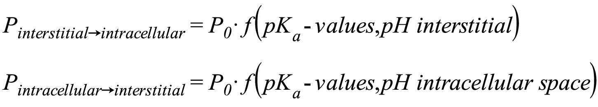 Since the pH-values of the interstitial and intracellular space differ for some organs, the permeability in the direction interstitial space -> intracellular space can differ from the permeability in the direction intracellular -> interstitial space.|
|Charge dependent Schmitt normalized PK-Sim®| This method calculates the permeabilities in a similar way as dependent the method Charge Dependent Schmitt with the difference, that Schmitt the permeabilities are normalized to obtain the values calculated normalized to with the method PK-Sim® Standard:   Thus, the permeability in the direction interstitial -> intracellular is the same as calculated with the method PK-Sim® Standard while the ratio of the permeabilities in the two directions is the same as calculated with the method Charge Dependent Schmitt.

##### Specific organ permeability
        
The specific organ permeability, i.e. the organ permeability normalized to the surface area, represents the part of the permeability times surface area (PxSA)- products that is substance-dependent and they are proportional to the permeability of a phospholipid bilayer for the simulated substance. They are calculated from the physico-chemical data of the compound, namely the lipophilicity and the effective molecular weight. If different lipophilicity values have been specified several permeability values based on these alternative values are displayed in the drop down list that opens if you click on **Show Values**. If available, further permeability values can be entered manually. You can later chose the lipophilicity value that is to be used in the **Simulation** from the values specified here.


As a first approximation it can be assumed that all mammalian lipid membranes have the same permeability for a given substance. Of course, this is not exactly true because organ permeability depends on the composition of the membrane. The types of phospholipids and the content of cholesterol influence the rates with which a substance passes through the membrane \[[24](../references.md#24)\] \[[9](../references.md#)\]. However, within the accuracy with which it is possible to estimate the permeability from compound properties, it is permissible to make this simplifying assumption. Under these presumptions, the organ PxSA-products are composed out of a compound specific term (permeability) and a species or physiology specific term (surface area).



Because it is difficult to determine PxSA-products or their two components explicitly, the calculation method incorporated in PK- Sim® is based on the following procedure \[[36](../references.md#36)\]:

First, PxSA-products were previously determined by fitting simulations to experimental concentration-time curves for the different organs. Second, such pinned values are scaled by the organ volume to take the change of surface area, e.g. from species to species, into account. Furthermore, it is assumed that permeability is proportional to the partition and diffusion coefficient, the latter of which depends on the lipophilicity and molecular size for lipid membranes. This means that permeability can be scaled with lipophilicity and molecular volume relative to given values. This is done in PK-Sim® using the values derived from the fit described above and dependencies which rely on published and proprietary knowledge.


##### Specific Binding

Distribution of a compound is also influenced by specific binding to proteins either in plasma, interstitial or intracellular space. It is possible to define such specific protein binding processes in the **Specific Binding/Protein Binding**

Partners branch. When setting up a simulation the binding partner defined in the Compound Building Block has to be linked to the protein defined in the Individual Building Block as binding partner.

Protein Binding Partners

|Process Type| Description|Necessary Input Parameter|
|--- |--- |
|Specific Binding|If experimental data on binding of the compound to specific protein binding partners are available, these values also suit as input parameters.||


Sometimes enzymes that catalyze a metabolic degradation process can also bind the compound at a binding site different to the catalytically active center. It is therefore possible to link an enzyme defined in the individual/species to both a metabolic and a binding process when setting up a simulation.


### Metabolism
    
Depending on the available experimental information you can either define process types in the **Metabolizing Enzymes** branch or the **Total Hepatic Clearance** branch. Please note that the calculation sheet offered for metabolizing enzymes refers to the liver in case of intrinsic clearance processes and in all other cases to the organ in which the respective enzyme is expressed. Using this calculation sheet, input values will be transferred to specific clearance values which are then used in the simulation. The sheet is only meant to help the user with the calculations. However, processes defined here may also be applied to other organs given that relevant expression levels are appropriately defined in the individual.

##### Metabolizing Enzymes

| Process Type | Description | Required Input Parameters |
|---|---|---|
| Intrinsic clearance – First order| A first order degradation process catalyzed by intracellular enzymesis defined in the liver. The input parameters are intrinsic clearance values which are either estimated orscaled from in vitro data. The specific clearance used in the simulation is obtained by scaling the intrinsic clearance value from liver cellsto the whole organ using the following calculation parameters: • Volume (liver) • Fraction intracellular (liver)| Intrinsic clearance(measured with liver cells or fitted); Volume(liver); Fraction intracellular (liver)|
| Intrinsic clearance – Michaelis-Menten| It is also possible to define a Michaelis-Menten type saturable kinetics processfor intrinsic clearance. The input parameters are Km and Vmax (referring to liver tissue, e.g. liver slices or perfused liver) which were either estimated or scaled from in vitro data.  The specific Vmax value used in the simulation (referring to the cellular volume) is scaled from the Vmax in liver tissue using the following calculation parameters: • Fraction interstitial (liver) • Fraction intracellular (liver) The default value for Km is 1 μmol/l. Itmay be changed manually.| Km; Vmax(measured with liver tissue or fitted); Fraction interstitial (liver);Fraction intracellular (liver)|
| In vitro clearance – First order| By explicitly defining specific clearance values referring to the cellular volume (either estimated orscaled from in vitro data) and the corresponding enzyme concentration aspecific clearance value normalized tothe enzyme concentration is calculated automatically.  The default value for enzyme concentration is 1 μmol/l. It may be changed manually.| Enzyme concentration; Specific clearance(measured with cellular in vitrosystem or fitted)|
| In vitro clearance – Michaelis-Menten| You can also explicitly define specific Vmax values referring to the cellular volume (either estimated or scaled fromin vitro data) to implement a Michaelis-Menten type saturable kinetics process.This value is then used to calculate kcatby normalizing the specific Vmax valueto the respective enzyme concentration.  The default value for Km and the enzyme concentration is 1 μmol/l. It may be changed manually.| Vmax; Km(measured withcellular in vitrosystem or fitted)|
| In vitro clearance – Hill | Metabolic enzyme activity is described as saturable process displaying a cooperativity, which is characterized bythe Hill equation. The corresponding kcat value is calculated from Vmax determined in an in vitro assay. | Enzyme concentration; Vmax; Km; Hill coefficient(measured with cellular in vitro system or fitted)|
| In vitro metabolic rate in the presenceof recombinant CYPs/enzymes – First Order | Some in vitro assays use recombinant CYP enzymes to determine in vitro clearance values. These can be usedas input for PK-Sim® after correction for the enzyme concentration in the assay when implementing a firstorder degradation process. Differences in intrinsic activity (per unit CYP)between rhCYP and human liver enzymes complicate the issue \[[63](../references.md#63)\], \[[56](../references.md#56)\]. Therefore, an intersystem extrapolating factor (ISEF), which is a dimensionless number used as a direct scaler to convert data obtained with a rhCYP system tothe "HLM environment" may be used.This factor has to be calculated by the user.| In vitro clearance / concentration of recombinant enzyme; Intersystem extrapolating factor (ISEF)|
| In vitro metabolic rate in the presence of recombinant CYPs/enzymes – Michaelis-Menten | If Km and Vmax values for a saturable kinetics process were determined experimentally using recombinant CYP enzymes, Km can be directly used as for PK-Sim® where as Vmax has to benormalized to the enzyme concentration in the assay. Differences in intrinsic activity (per unit CYP) between rhCYP and human liver enzymes complicate the issue \[[63](../references.md#63)\], \[[56](../references.md#56)\]. Therefore, an intersystem extrapolating factor (ISEF),which is a dimension less number used as a direct scaler to convert data obtained with a rhCYP system to the "HLM environment" may be used.| In vitro Vmax /concentration of the recombinant enzyme; Km; Intersystem extrapolating factor (ISEF)|
| In vitro metabolic rate in the presence of liver microsomes – First Order| In vitro clearance values obtained from microsome assays can be used as input parameters for definition of a first order metabolization process. If the clearance values are normalized to the amount of microsomal protein present in the assay they can be used without further modification.The in vitro clearance value is scaled to an in vivo specific clearance value using the content of CYP proteins in liver microsomes. The default value is 108 pmol/mg microsomal protein which is the CYP3A4 protein content in liver microsomes (see note under thetable). Please change this value if other enzymes were defined. | In vitro clearance for liver microsomes; Content of CYP proteins in liver microsomes from literature (e.g. \[[63](../references.md#63)\],\[[64](../references.md#64)\]) or measured experimentally |
| In vitro metabolic rate in the presence of liver microsomes – Michaelis-Menten | For the definition of a saturable Michaelis-Menten like kinetics process in vitro Vmax values normalized to the enzyme concentration in the microsomal assay can be used as input parameter.  The in vitro Vmax value is then scaled to an in vivo Vmax value using the content of CYP proteins in liver microsomes. The default value is 108 pmol/mg microsomal protein which is the CYP3A4 protein content in liver microsomes (see note under the table). Please change this value if other enzymes were defined.| In vitro Vmax for liver microsomes; Content of CYP proteins in liver microsomes from literature (e.g. \[[63](../references.md#63)\], \[[64](../references.md#64)\]) or measured experimentally; Km|


For calculation of in vivo clearance or Vmax values from _in vitro_ values obtained from microsomal assays the content of the CYP enzyme defined as the process type has to be specified. The default value in PK-Sim® is 108 pmol/mg microsomal protein which is the CYP3A4 protein content in liver microsomes \[[63](../references.md#63)\]. CYP enzyme contents in liver microsomes from this reference are shown when you move the mouse over the parameter Content of CYP proteins in liver microsomes. If you have defined other than these CYP enzymes, please insert the corresponding value in PK-Sim®.


##### Total Hepatic Clearance

|Process Type |Description | Necessary Input Parameter|
|--- |--- |--- |
|Liver Plasma Clearance| If you have experimental plasma clearance values you can use them by choosing this process type. The specific clearance used in the simulation is then automatically calculated on the basis of the following parameters:  • Body weight  • Volume (liver)  • Hematocrit  • Blood flow rate (liver)  • Blood flow rate (portal vein)  • Fraction intracellular (liver)  • Blood/Plasma concentration ratio  • Fraction unbound in plasma  • Plasma clearance  • Lipophilicity  The default value for fraction unbound (experiment) is 0.5 in PK-Sim®. Please change this parameter if you have experimental data for the fraction unbound.| Fraction unbound (plasma); Plasma clearance; all parameters listed in the left column (if not entered, default values as specified in the Compound building block for the given species are used)|
|In vitro hepatocytes – t1/2 | You can also directly use t1/2 values from hepatocyte assays. The specific clearance used in the simulation is then automatically calculated considering the following parameters:  • Number of cells/g liver tissue  • Number of cell/incubation  • Fraction intracellular (liver)  • Fraction unbound (assay)  • t1/2 (assay)  The default value for fraction unbound (assay) is 0.1 in PK-Sim®. Please change this parameter if you have experimental data for the fraction unbound.|Number of cell/incubation; Fraction unbound (assay); t1/2 (assay)|
|In vitro hepatocytes – residual fraction | If hepatocyte assay data with residual fractions are available, please specify these values in this process type. The specific clearance used in the simulation is then automatically calculatedon the basis of the following parameters:  • Number of cells/g liver tissue  • Fraction intracellular (liver)  • Fraction unbound (assay)  • Measuring time  • Residual fraction The default value for fraction unbound (assay) is 0.1 in PK-Sim®. Please change this parameter if you have experimental data for the fraction unbound.| Number of cell / incubation; Fraction unbound (assay); Measuring time; Residual fraction|
|In vitro liver microsomes – t1/2 | t1/2 values from microsomal assays can be used as input parameters to calculate specific liver clearances. Scaling of the in vitro value is done using the following parameters:  • Microsomal protein mass/g liver  • Amount of protein in the incubation  • Fraction intracellular (liver)  • Fraction unbound (assay)  • t1/2 (microsomal assay) The value for fraction unbound (assay) is calculated in PK-Sim® using the lipophilicity of the compound and the amount of protein in incubation. Please change this parameter if you have experimental data for the fraction unbound.| Amount protein/incubation; Fraction unbound (assay); Measuring time; t1/2 (microsomal assay)|
|In vitro liver microsomes – residual fraction | Residual fractions obtained from liver microsome assays may also serve as input parameters. The value for the specific liver clearance is then calculated using the following parameters:  • Microsomal protein mass/g liver  • Amount protein/incubation  • Fraction intracellular (liver)  • Fraction unbound (assay)  • Measuring time  • Residual fraction  The value for fraction unbound (assay) is calculated in PK-Sim® using the lipophilicity of the compound and the amount of protein in incubation. Please change this parameter if you have experimental data for the fraction unbound. | Amount protein/incubation; Fraction unbound (assay); Measuring time; Residual fraction|


Total hepatic clearance is a systemic process that does not have to be linked to properties defined in an individual/species when generating a simulation.


#### Transport & Excretion

Drug transport across endothelial, epithelial or cellular barriers is responsible for distribution and renal or biliary elimination of a compound. Different experimental approaches are available either to determine rate constants or organ clearances. Depending on the experimental data available you can define different process types for your compound in the **Transport Proteins** branch, the **Renal Clearances** branch or the **Biliary Clearance** branch.

##### Transport Proteins

|Process Type |Description | Necessary Input Parameter|
|--- |--- |--- |
|Intrinsic active transport - Michaelis-Menten| A transporter-mediated unidirectional transfer of a compound across a cellular membrane is described as saturable process following the Michaelis-Menten type kinetics. The specific Vmax value used in the simulation (referring to the cellular volume) is scaled from the Vmax in liver tissue using the following calculation parameters:  • Fraction interstitial (liver)  • Fraction intracellular (liver)  The default value for Km is 1 μmol/l. It may be manually changed.| Km; Vmax (measured with liver tissue or fitted)|
|Specific active transport - Michaelis-Menten | Here a Michaelis-Menten type saturable transport process is defined. The input parameters are Km and Vmax (either estimated or scaled from in vitro data). The kcat value used in the simulation is scaled from the input Vmax value by normalization to the transporter concentration. The default value for Km is 1 μmol/l. It may be manually changed. | Transporter concentration; Vmax; Km (measured with liver tissue or fitted)|
|Specific active transport - Hill| A transporter mediated unidirectional transfer of a compound across a cellular membrane is described as saturable process displaying a cooperativity which is characterized by the Hill equation. The corresponding kcat value is calculated from a specific Vmax as input value.|
|In vitro active transport (vesicular assay) - Michaelis-Menten |A transporter mediated unidirectional transfer of a compound across a cellular membrane is described as saturable process following Michaelis-Menten type kinetics. The corresponding kcat value is calculated from a specific Vmax normalized to the amount of transporter as input value which was determined in a vesicular transport assay. |In vitro Vmax / transporter; Km (measured with cellular in vitro system or fitted)|

##### Renal Clearances

|Process Type |Description | Necessary Input Parameter|
|--- |--- |--- |
|Kidney Plasma Clearance| When choosing this process type experimental values for kidney plasma clearance can be used as input parameters. The specific clearance used in the simulation is then automatically calculated on the basis of the following parameters:  • Body weight  • Volume (kidney)  • Hematocrit  • Blood flow rate (kidney)  • Fraction unbound in plasma  • Plasma clearance  The default value for fraction unbound (experiment) is 0.5 in PK-Sim®. Please change this parameter if you have experimental data for the fraction unbound.| Plasma clearance; Fraction unbound (plasma)|
|Glomerular Filtration | Filtration fractions are used in the case that the renal clearance differs from the GFR according to the properties of the individual. Please note that for small molecules this observation indicates that the compound is either actively reabsorbed or secreted, respectively. The GFR fraction can be used as a surrogate to compensate for active re-absorption (GFR fraction <1) or secretion (GFR fraction >1). The calculation of the resulting "GFR" is done when setting up the simulation. | GFR fraction |
|Tubular Secretion – First Order | For definition of a first order tubular secretion process you can use tubular secretion rates (either estimated or scaled from in vitro data). The specific tubular secretion rate is then calculated on the basis of the kidney volume. | Tubular secretion |
| Tubular Secretion – Michaelis-Menten | You can also define a saturable tubular secretion process by specifying Km and TSmax values (either estimated or scaled from in vitro data). The specific tubular secretion rate is then calculated taking into account the kidney volume. | TSmax; Km|


Kidney Plasma Clearance is a systemic process that does not have to be linked to properties defined in an individual/species in a simulation. In the case of the Glomerular Filtration, the individual/ species-dependent GFR represents a default value defined in the Individual building block.


##### Biliary Clearance

|Process Type |Description | Necessary Input Parameter|
|--- |--- |--- |
|Biliary Plasma Clearance| If you have experimental biliary plasma clearance data you can use them by choosing this process type. The specific clearance used in the simulation is then calculated automatically on the basis of the following parameters:  • Body weight  • Volume (liver)  • Hematocrit  • Blood flow rate (liver)  • Blood flow rate (portal vein)  • Blood/Plasma concentration ratio  • Fraction intracellular (liver)  • Fraction unbound in plasma  • Plasma clearance  The default value for fraction unbound (experiment) is 0.5 in PK-Sim®. Please change this parameter if you have experimental data for the fraction unbound. The amount secreted as bile flow is subsequently split into two fractions: The fraction of hepatic bile that flows into the gallbladder for storage and the fraction that flows straight into the duodenum. | Plasma clearance; Fraction unbound (plasma)|


Biliary clearance is systemic process that does not have to be linked to properties defined for an individual/species when establishing a simulation.


### Definition of a metabolite in an enzymatic process‌

A metabolite of a copound can be defined and used either as a "sink" or treated like any other compound. See [How to set up a parent/metabolite simulation](12-pk-sim-simulations.md#how-to-set-up-a-parent-metabolite-simulation) for details.

### Advanced Parameters‌

After the biological properties have been specified, further parameters can be defined in the **Advanced Parameters** tab. The **Advanced Parameters** tab can be opened either by clicking **Next** or by clicking on the **Advanced Parameters** tab.

Additional compound-related parameters can be defined here that are needed in case the particle dissolution function (see [Formulations](11-pk-sim-formulations.md)) or the model for proteins and large molecules (see [Modeling of Proteins](../part-1/05-modeling-concepts-modeling-of-proteins.md)) are used in the simulation. In all other cases, the parameters defined in the **Advanced Parameters** tab will not be used in the simulation and can be left unchanged.

**Particle dissolution**

The particle dissolution function can be used for the simulation of the dissolution process of spherical particles administered orally and represents a dissolution function of the Noyes-Whitney type that is based on particle size \[[102](../references.md#102)\].

In the **Advanced Parameters** tab the compound-related parameters needed for calculation of dissolution kinetics of spherical particles can be defined, namely:

• how the precipitated drug is treated (either as Soluble or Insoluble)

• the aqueous diffusion coefficient D

• the density of the drug in its solid form

• and the maximum size of particles that dissolves immediately

Further parameters such as the mean particle size and the particle size distribution, the number of bins and the diffusion layer thickness are considered to be related to the formulation and thus can be defined in the Formulation Building Block (see [Formulations](11-pk-sim-formulations.md)).

Model for proteins and large molecules

Four drug-related parameters which are used in the model for proteins and large molecules can be defined in the **Advanced Parameters** tab, namely:

• the solute radius, i.e. the hydrodynamic radius of the drug. The default value for the solute radius is estimated from the molecular weight defined in the **Basic Physico-chemistry** tab

• Kd (FcRn) in endosomal space: the dissociation constant for binding to FcRn in the acidic endosomal space. By default, this value is set to a very high value,

i.e. no binding is assumed.

*   Kd (FcRn) in plasma/interstitial: the dissociation constant for binding to FcRn in plasma and the interstitial space (neutral environment). By default, this value is set to a very high value, i.e. no binding is assumed. For monoclonal antibodies the binding to FcRn in neutral environment is generally very weak or not detectable. In this case the high default value for Kd (FcRn) in plasma/ interstitial space can be kept.

*   kass (FcRn): association rate constant for binding to FcRn for the acidic endosomal space as well as for plasma/interstitial space. The default value is a typical value for monoclonal antibodies and can usually be kept.

After all information about the compound properties has been entered, the **Create Compound** window can be closed by clicking **OK** . The new compound will appear in the **Building Block Explorer** view.

## Setting or Changing Compound Properties‌

To set or change the properties of an existing compound:

1.  Right mouse click on the respective compound in the **Building Block Explorer**
    
2.  Select  **Edit...**

or simply double click on the compound in the **Building Block Explorer**.

A window with the three tabs **Basic Physico-chemistry**, **ADME Properties** and **Advanced Parameters** will open. The properties can be set or changed appropriately. The changes can be saved by closing the window by clicking on .

## Cloning Compounds‌

To clone a compound in the project:

1.  Right mouse click on the respective compound in the **Building Block Explorer**
    
2.  Select **Clone...** 
    
3.  Enter an alternative name for the compound clone and enter a description, if desired.
    
4.  Confirm and close the window by clicking **OK** 

## Saving Compounds as Templates‌

For each project, several compounds can be defined. They can be saved as templates and then be shared among several projects and users.

To save an existing compound as template:

1.  Right mouse click on the respective compound in the **Building Block Explorer**
    
2.  Select  **Save as Template...**
    
In case a compound with the same name already exists, a warning appears and you have the following options:

*   Override: This action will override the existing template.
    
*   Save as: You can save the compound under a different name. In this case, you will be asked to Rename the new template.
    
*   Cancel: This action will abort the saving process.

## Loading Existing Compounds from Templates‌

As mentioned before, the compounds defined in a project can be saved as templates and then be shared among several projects and users.

To load an existing compound from the template database:

1.  Right mouse click on **Compounds** in the **Building Block Explorer**
    
2.  Select  **Load From Template...**
    
3.  Select the desired compound from the user templates
    
    In case a compound with the same name already exists in the project, a warning pops up and you will have to **Rename** the compound that is to be loaded from template.
    
4.  Click **OK** 
    
The selected compound will appear in the **Building Block Explorer** view.

Compounds can also be directly loaded from the template database within a simulation.

## Deleting Compounds‌
    
To delete a compound from the project:

1.  Right mouse click on the respective compound in the **Building Block Explorer**
    
2.  Select  **Delete...**
    
3.  Confirm by clicking **Yes**
    

Please note that a compound that is used in any simulation of the project cannot be deleted.


# PK-Sim® Compounds: Defining Inhibition/Induction Processes

Drugs may influence a broad variety of ADME processes that in turn will then affect the PK of the drug and possibly also other drugs. A specific and very common case of this very generic description of a drug-drug-interaction is the inhibition of a metabolizing enzyme or transporter by a drug. Most metabolizing enzyme are highly expressed in the liver and therefore drug clearance and the first pass metabolisms will be affected. Inhibition of a transporter may change the rate of absorption of a drug or the amount absorbed of a drug. If an inhibited transporter is expressed in the kidney or liver, drug excretion will be altered.

In order to set up an inhibition by a compound, do the following:

*   Right mouse click on _Inhibition_ in the **ADME** tab of the compound that acts as an inhibitor and select _Add Inhibition Process_.

*   Select the affected enzyme/transporter and specify the source for assuming this inhibition.

*   Specify the type of inhibition from the Process type list (competitive, uncompetitive, non-competitive, mixed).

Inhibition changes reaction rates and/or the kinteics of active transports by modifying reaction and/or transport paramters:

*   the Michaelis-Menten constant Km and the turnover number kcat for Michaelis-Menten kinetics

*   the Specific Clearance for first order kinetics

In a setting without inhibition, the reaction velocity is given by

with  = maximum velocity which is the product of kcat and E, the amount of enzyme/transporter, _S_ = free substrate concentration.

In an inhibition scenario, both, the turnover number kcat and the Michaelis- Menten constant are modified to new apparent values.

with  = apparent maximum velocity which is the product of apparent kcat and E, the amount of enzyme/transporter, _S_ = free substrate concentration.

PK-Sim® calculates the apparent kcat and apparent Michaelis-Menten constant for the specified inhibition scenario. In case of a simple setting with just one inhibitor per process, the equations are listed in the next section.

If first order processes are inhibited, the specific clearances will be altered. The generic expression for a reversible linear, non saturable metabolism/transport process of first order is:

If an inhibition is set up for an enzyme or transporter, all processes with the same name will be linked and affected by the inhibition. An autoinhibition cannot be set-up because measured Ki values will already be altered due to autoinhibition.

## Competitive inhibition - simple setting with one inhibitor‌

In a competitive enzyme inhibition, the inhibitor binds reversibly to the enzyme and competes with the substrate for free enzyme. In case of a reversible inhibition, high substrate concentrations can overcome this inhibition. The apparent Michaelis-Menten constant increases while the apparent maximum reaction velocity remains unchanged.

with _v_ = reaction velocity,
    
 = maximum reaction velocity,

_S_ = free substrate concentration,

 = apparent Michaelis-Menten constant,

with the variables defined above and  = Michaelis-Menten constant in absence of an inhibitor, _I_ = free inhibitor concentration,

 = dissociation constant of the inhibitor-enzyme complex.

## Uncompetitive inhibition - simple setting with one inhibitor‌
    
In a uncompetitive enzyme inhibition, binding of the inhibitor to the enzyme requires prior binding of the substrate to the enzyme. Binding of the inhibitor to the enzyme-substrate complex is reversible. This kind of inhibition decreases the apparent Michaelis-Menten constant and the maximum reaction velocity.

with 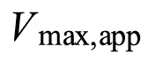 = apparent maximum reaction velocity
    
_S_ = free substrate concentration,

 = apparent Michaelis-Menten constant,

The apparent maximum reaction velocity is decreased depending on the concentration of the inhibitor and its affinity to the enzyme-substrate complex.

with  = free inhibitor concentration

_I_ = free inhibitor concentration

 = dissociation constant of the enzyme-substrate-inhibitor complex

with the variables as defined above.

## Mixed inhibition - simple setting with one inhibitor‌
    
In a mixed inhibition, the inhibitor binds reversibly to the enzyme or the enzyme/ substrate complex with different affinities (and different dissociation constants). The inhibitor binding site is different from the substrate binding site on the enzyme molecule. The apparent Michaelis-Menten constant is changed and the apparent maximum velocity is decreased.

with

 = apparent maximum reaction velocity

_S_ = free substrate concentration,

 = Michaelis-Menten constant in the absence of the inhibitor.

The apparent maximum velocity and the apparent Michaelis-Menten constant are calculated as follows:

with

 = maximum reaction velocity

_I_ = free inhibitor concentration,

 = dissociation constant of the (enzyme-substrate)-inhibitor complex.

with    
 = dissociation constant of the enzyme-inhibitor complex and the variables defined as above.

## Non-competitive inhibition - simple setting with one inhibitor‌
    
The non-competitive inhibtion is a special case of a mixed inhibition in which an inhibitor binds reversibly to the enzyme and/or to the enzyme/substrate complex with the same inhibition constant (KI=KIu=KIc). The reaction velocity is described by the same equation as in a mixed inhibition and the apparent maximum velocity is described by the same equation as in an uncompetitive inhibition.

## Irreversible inhibition‌
    
Principally, an irreversible inhibition is a time-dependent inhibition (TDI) in which recovery is only due to de novo protein, e.g. enzyme synthesis. Thus, the in vivo production and degradation of enzyme has to be taken into account by PK- Sim®. Turnover of any protein inherently is a function of both, protein synthesis (a zero-order process) and protein degradation (a first-order rate process). In view of the kinetic nature of these processes, the rate constant of degradation frequently is the sole determinant of the "steady-state" concentration of each protein as it oscillates between the basal and the induced/repressed state. The natural enzyme turnover in PK-Sim® is represented as shown below.

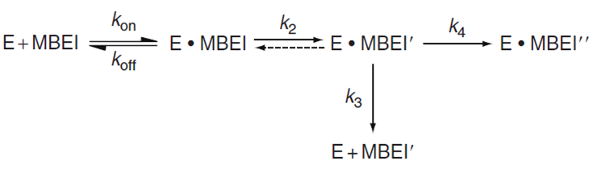

Initial enzyme concentration E0 and turnover rate constants kdeg are set to default values based on literature.

The rate of inactivation follows a hyperpolic kinetic pattern. Generally, TDI has a slow onset, but potentially its effects are more profound than those of reversible inhibitions. The most prominent example of a practically irreversible inhibition is the inactivation of CYP-mediated reactions in the presence of NADPH.

A common model for mechanism-based inactivation is illustrated below:

According to Silvermann et al. \[[72](../references.md#72)\], a mechanism-based enzyme inactivator (MBEI) requires a step to convert the compound to the inactivating species (k2). This step, which is generally responsible for the observed time dependence of the enzyme inactivation, usually is irreversible and forms a new complex (EI') which can have two disctinctive fates:

*   the EI' is a reactive species and forms a covalent complex with the enzyme (Einact) (k4).
*   the species generated is released from the enzyme as a product/metabolite P of the inactivator and the enzyme is again available as active enzyme (k3).

The ratio of product release to inactivation is termed the partition ratio and represents the efficiency of the mechanism-based inactivator: the partition ratio is described by k3/k4.

The two principal kinetic constants that are useful in describing mechanism-based inactivation are **kinact** (the maximum rate of inactivation) and **Kkinact_half** (in literature also often referred to as KI, the concentration at which the inactivation rate is half-maximal). Based on the reaction scheme shown above and with the typical assumption of quasi steady-state, it can be shown that **kinact** is a complex mixture of k2, k3, and k4, while **Kkinact_half** is a complex mixture of k1, k-1, k2, k3, and k4:

The implementation in PK-Sim® of one mechanism-based inactivator follows the equation shown below:

Note that irreversible inhibition in PK-Sim® also always includes reversible binding of the mechanism-based inactivator to the enzyme so that it also acts as a competitive inhibitor. This process is defined by its dissociation constant Ki. By default (assuming the mechanism-based model based on \[[72](../references.md#72)\]), Ki equals Kkinact_half. The user may choose a different value if applicable.

If more than one compound other than the mechanism-based inactivator competes for the binding at the enzyme, this can easily be implemented by specifying for the respective compound a reversible (e.g. competitive) inhibition process. This process automatically accounts for the so called **substrate protection of the enzyme**. An example where there is one substrate and one mechanism-based inactivator simultaneously competing for the binding site is illustrated below.

This model could be represented in PK-Sim® as follows

Note that substrate protection can only be modeled by specifying a reversible inhibition process for the substrate (enter a Ki value).


Given the variability and uncertainity associated with experimental determination of enzyme turnover rates, a sensitivity analysis for the enzyme half life should be considered in the modeling approach.



Please note that for the mechanism-based inactivator no clearance process is defined via the inactivation process by default. In theory, for every inactivated enzyme molecule, also one inactivator molecule is cleared; this must be separately defined by the user in form of additional metabolization/excretion processes for the inhibitor.


## Enzyme Induction‌

Enzyme induction can occur as a result of either increased **de novo synthesis of enzyme** or (in very rare cases and currently not implemented in PK-Sim®) a decrease in degradation following protein stabilisation induction. Some examples of induction proccesses are:

*   CYPs 1A1, 1A2 and 1B1 induced by aryl hydrocarbon receptor (AHR) that is activated by binding of e.g. dioxin, benzoapyrene, omeprazole (in vitro), tobacco smoke

*   CYP3A induced primarily by pregnane X receptor (PXR) that is activated by binding of e.g. rifampicin, phenobarbital, nifedipine

*   Activation of the pregnane X receptor induces a number of Phase II enzymes involved in drug metabolism as well as numerous transporters

Implementation of induction in PK-Sim® uses the following parameters:

*   EMax: maximum in vivo induction effect (Dimension: dimensionless)

*   EC50: concentration of the inducer to reach half the maximal in vivo induction effect (Dimension: concentration)

In an induction, EMax ranges from 0 (=no induction) to infinity. A value of 1 means that the effect is twice the effect without induction. Modelling of suppressed de novo synthesis (suppression) (as seen for example in some cytokines) is also possible with PKSim using the induction specification of a compound. In a suppression, EMax ranges from 0 (=no suppression) to -1 (full suppression, no synthesis anymore).

If the reaction of the enzyme Ex and the substrate Sj follows a Michaelis-Menten kinetics, the rate of the enzyme Ex degradation/production and the substrate Sj degradation are given by:

## Multiple Inhibitors - Equations used by PK-Sim®‌

The enzyme turnover for Enzyme X in the presence of n competitive (CI), m uncompetitive (UI), o non-competitive (NI), p mixed-type inhibitors (MI), q mechanism-based enzyme inactivators/time dependent inactivators (TDI) and r inducers (IND) is given by:

If the reaction of the enzyme Ex and the substrate Sj follows a Michaelis-Menten kinetics, the rate of the substrate Sj degradation is given by:

In the above equation, the substrate Sj may also be an inhibitor of all kind, e.g. CI, UI, NI, MI, TDI or IND.

Similarly, if the reaction of the enzyme Ex and the substrate Sj follows a first order kinetics, the rate of the enzyme Ex degradation/production and the substrate Sj degradation are given by:

In the above equation, the substrate Sj may also be an inhibitor of all kind, e.g. CI, UI, NI, MI, TDI or IND.

Please note that

*   As for all other inhibition types, there is no reversible auto-inhibition (which means: if a compound is substrate and reversible inhibitor of the same enzyme, it does not appear in the Km\_interaction\_factor.) In the formula above it's done by excluding the substrate from the sum terms (a#j, b#j, etc.).

*   For mechanism-based inactivators auto-inhibition can be accounted for by specifying a specific clearance pathway via the affected enzyme.

*   Free (unbound) concentrations of all inhibitors are used (e.g. TDI\_u,l(t) means: unbound concentration of TDI\_l).

# PK-Sim® - Administration Protocols

An administration protocol is a set of data describing administration type, dose and dosing regimen. These properties can be specified within the building block **Administration Protocol**. For each project, a number of administration protocols can be defined. They can be saved as templates and then be shared among several projects and users.

## Definition of new Administration Protocols in PK-Sim®‌

To create a new administration protocol, do one of the following:

*   Click **Administration Protocol**  in the **Create New Building Blocks** Group of the **Modeling & Simulation** Tab

*   Right mouse click on **Administration Protocols** in the **Building Block Explorer**

and select  **Add Administration Protocol...**

*   Use the short cut **Ctrl+Alt+A**

A dialog will open in which the properties of the administration protocol can be defined. You can choose between **Simple protocol** and **Advanced protocol**. To switch between these two views select the respective protocol type in the uppermost checkboxes of the window.


Note that when switching between simple and advanced protocol several of the already defined parameters will be reset. When switching from simple to advanced protocol, the dosing schedule will be transferred. This is not true for the opposite direction.


Using the **Simple protocol**, drug administration via different routes can be defined by means of a single or predefined multiple dosing scheme. Using the **Advanced protocol**, multiple dosing regimens and treatment cycles of any scheme and combination can be defined. By default, the **Simple protocol** is activated. In either case, dose and dosing scheme are visualized in the lower panel of the window. Depending on the dose unit selected, the Y-axis description will change accordingly.

The administration protocol is initialized by giving it a **Name** in the respective input field. The name is used to identify the protocol when its parameters are saved in the project and/or as a template. Then, choose between **Simple protocol** and **Advanced protocol** and set the properties of the protocol.

### Simple Protocol‌

In order to define a simple protocol in the **Protocol Properties** field of the Simple protocol template please follow the instructions summarized in the following table. Depending on the choice of administration protocol the required input parameters change.

|Administration Type|Description|
|--- |--- |
| Intravenous Bolus | 1.  Select the administration type **Intravenous Bolus** from the drop-down menu  2.  Enter the dose and select the appropriate dose unit from the drop-down menu  3.  Select the appropriate dosing interval from the drop-down menu  4.  In case a multiple dosing regimen is selected, the protocol end time has to be defined.  5.  Confirm and close window by clicking **OK** |
| Intravenous Infusion | 1.  Select the administration type **Intravenous Infusion** from the drop-down menu  2.  Enter the dose and select the appropriate dose unit from the drop-down menu  3.  Select the appropriate dosing interval from the drop-down menu  4.  In case a multiple dosing regimen is selected, the protocol end time has to be defined.  5.  Enter the infusion time and select the appropriate time unit from the drop-down menu  6.  Confirm and close window by clicking **OK** |
| Oral | 1. Select the administration type **Oral** from the drop-down menu  2.  Enter the dose and select the appropriate dose unit from the drop-down menu.  3.  Select the appropriate dosing interval from the drop-down menu.  4.  In case a multiple dosing regimen is selected, the protocol end time has to be defined.  5.  Enter the volume of water co-administered. The default is 3.5 mL/kg body weight, which corresponds to a volume of 250 mL (8-9 fl. oz.) of water for an average human. This volume is also considered appropriate in animal dosing 103. However, if desired, the liquid volume can be adjusted according to the protocol of the (pre)clinical study.  6.  Confirm and close window by clicking **OK** |


Please note that if the administration type **Oral** is selected this will require the definition of a **Formulation** in the **Formulation** building block for the Simulation.


|Administration Type|Description|
|--- |--- |
| User Defined |1. Select the administration type **User Defined** from the drop- down menu  2.  Enter the dose and select the appropriate dose unit from the drop-down menu.  3.  Select the appropriate dosing interval from the drop-down menu.  4.  In case a multiple dosing regimen is selected, the protocol end time has to be defined.  5.  Enter the target organ into which the drug is to be administered, e.g. **Muscle** in the case of intramuscular administration.  6.  Enter the target compartment within the target organ into which the drug is to be administered, e.g. "Interstitial" in the case of intramuscular administration.  7.  Confirm and close window by clicking **OK** |

 
Please note that in case that the administration type **User Defined** is selected this will require the definition of a **Formulation** in the **Formulation** building block for the Simulation.


### Advanced Protocol‌

In order to define an advanced protocol, activate **Advanced protocol** in the **Create Administration Protocol** window. In the uppermost drop-down menu, the time unit for visualization of dose and dosing scheme in the lower panel of the window can be selected. Depending on the dose unit(s) selected, the Y-axis label(s) will change appropriately.

The table used to defined the advanced protocol consists of the following five columns:

1.  The **Start Time** at which the protocol schema starts.

2.  The **Number of Repetitions** defining the iterations of the protocol schema.

3.  The **Time Between Repetitions** defining the time lag between the iterations of several protocol schemata.

4.  The **End Time** defining the end time of the protocol schema. The end time is automatically calculated based on the input parameters.

5.  In the last column, additional protocol schemata can be added by clicking  or deleted by clicking . Please note that at least one protocol schema needs to be defined. The various protocol schemata will automatically be re-sorted according to the protocol schema start time.

In the secondary table, which can be opened by clicking  in the column **Start Time**, a number of individual schema items can be defined for the given protocol schema. Here, the following five columns can be found:

1.  The **Start Time** of schema items in relation to the start time of the protocol schema. If the start time of the schema items is **0**, the administration time equals the start time of the protocol schema.

2.  The **Dose** in units mg or mg/kg of the drug administered.

3.  The **Administration type**. You can choose from the following administration types from the drop-down menu:

	*	 Intravenous Bolus

	*	 Intravenous Infusion: requires the input of the **Infusion time** in units min, h, or s

	*	 Oral: requires the input of the **Volume of water/body weight** co- administered, which is 3.5 mL/kg BW per default (see PK- Sim® - _Formulations_) and, additionally, the definition of a **Placeholder for formulation** in column 4.

4.  The **Placeholder for formulation**. For an intravenous administration (Intravenous Bolus and Intravenous Infusion), the definition of a formulation placeholder is not necessary, because the drug is always assumed to be dissolved when given intravenously (see [PK-Sim® - Formulations](11-pk-sim-formulations.md)). However, in case of oral and user defined administration, you should add a note on the type of formulation. Later, in the simulation, the formulation placeholder can be matched with the corresponding **Formulation** building block. This may sound trivial in case only one formulation is given repeatedly at the given times. However, consider that you can set up sophisticated dosing schedules, in which various administration types and formulations are administered at various times. Then, the formulation type should already be signified in the administration protocol in order to be able to appropriately match the schedules with the various formulations. For further information please see [PK-Sim® - Simulations](12-pk-sim-simulations.md).

5.  In the last column, additional dosing schedules can be added by clicking or deleted by clicking . Please note that at least one dosing schedule needs to be defined for each protocol scheme. The various schema items will automatically be re-sorted according to the schema item start time.

**Example**

In the following screenshot, an example of an advanced protocol is given. The protocol example consists of only one protocol scheme. However, the protocol schema is repeated after 24 hours. Within one repetition, the drug is administered three times: first, an intravenous bolus loading dose of 1 mg/kg is given; second, an immediate release (IR) tablet containing 50 mg of drug is given 2 hours later; third, an enteric coated (EC) tablet containing 50 mg of the drug is given 12 hours after the intravenous dose, i.e. 12 hours after the beginning of the protocol schema. The dissolution profiles of the two formulation types have to be defined in the **Formulation** building block. The formulations can be imported and linked to the corresponding administration time points during the generation of the simulation. Here, only a "placeholder" has to be defined that can be used during the generation of the simulation to identify the different tablet types and thus, to appropriately match the administration time points and the formulation types. Since the last dose within the protocol items is administered after 12 hours and the protocol schema is repeated two times with a time between the repetitions of 24 hours, the last dose is administered after 24 + 12 = 36 hours (**End Time** of the protocol schema). This is also shown in the lower panel of the window.


Please note that the combination of the Administration type **User defined** and the **Advanced protocol** is not available in PK-Sim® 5.


## Setting or Changing Administration Protocol properties‌

To set or change the properties of an existing administration protocol:

1.  Right mouse click on the respective administration protocol in the **Building Block Explorer**

2.  Select  **Edit...**

or double click on the administration protocol in the **Building Block Explorer**

A window with the current settings will open where properties can be set appropriately. The changes are saved by closing the window by clicking on .


Please note that when you switch between simple and advanced protocol, this action will reset several parameters already defined. However, when switching from simple to advanced protocol, the dosing schedule will be transferred. This does not apply to the opposite direction.


## Cloning Administration protocols‌

To clone a protocol in the project:

1.  Right mouse click on the respective protocol in the **Building Block Explorer**

2.  Select  **Clone...**

3.  Set an alternative name for the protocol clone and, if desired, enter a description

4.  Confirm and close the window by clicking **OK** 

## Saving an Administration Protocols as templates‌

For each project, a number of administration protocols can be defined. They can be saved as a template and then be shared among several projects and users.

To save an existing administration protocol as template:

1.  Right mouse click on the respective administration protocol in the **Building Block Explorer**

2.  Select  **Save as Template...**. In case a protocol with the same name already exists, a warning appears and you have the following options:

*   Override: This action will override the existing template.
    
*   Save as: You can save the protocol under a different name. In this case, you will be asked to Rename the new template.
    
*   Cancel: This action will abort the saving process.

## Loading Existing Administration Protocols from templates‌

To load an existing administration protocol from the template database:

1.  Right mouse click on **Administration protocols** in the **Building Block Explorer**

2.  Select  **Load From Template...**

3.  Select the desired administration protocol from the user templates. In case a protocol with the same name already exists in the project, a warning appears and you will have to **Rename** the protocol that is to be loaded from template.

4.  Click **OK** 

The selected administration protocol will appear in the **Building Block Explorer**.

Administration protocols can also be directly loaded from the template database within a simulation.

## Deleting Administration Protocols‌

To delete an administration protocol from the project:

1.  Right mouse click on the respective administration protocol in the **Building Block Explorer**

2.  Select  **Delete...**

3.  Confirm by clicking **Yes**


Please note that a protocol that is used in any simulation of the project cannot be deleted.


# PK-Sim® Events

In the building block **Event** you can define special events that are to occur during simulation time. These are, for example, the ingestion of a meal and the associated physiological changes or the discrete emptying of the gallbladder independent of a meal event. It is the idea of this building block that special physical conditions such as sports or nightly sleep can be defined in the **Event** Building Block, and thus, considered in the simulation.


Please note that the **Event** Building Block does not represent an essential building block for the simulation.


## Definition of new Events in PK-Sim®‌

To create a new event, do one of the following:

*   Click **Event**  in the **Create New Building Blocks** Group of the **Modeling & Simulation** Tab

*   Right mouse click on **Events** in the **Building Block Explorer**

and select **Add Event...**

*   Use the short cut **Ctrl+Alt+E**

The following dialog will open in which the properties of the event can be selected and/or defined:

First the event is initialized by giving it a **Name** in the respective input field. The name is used to identify the event when its parameters are saved in the project and/or as a template. The name is used for the identification of the event in the simulation.

From the drop-down menu you can currently choose from the following predefined events:

*   Meal: Standard (Human)

*   Meal: High-fat breakfast (Human)

*   Meal: Ensure Plus® (Human)

*   Meal: High-fat soup (Human)

*   Meal: Mixed solid/liquid meal (Human)

*   Meal: Dextrose solution (Human)

*   Meal: Egg sandwich (Human)

*   Gallbladder emptying

In the case of the meals, the typical composition of the selected meal is provided below the drop-down menu.

The following model-relevant parameters of the meal are given:

*   Meal energy content in units of kcal or cal.

*   Meal volume in units of L or mL.

*   Meal fraction solid (value between 0 and 1), characterizing the composition of the meal with respect to solid and liquid components.

Finally, the following two parameters can be defined:

*   The decision on whether the discrete gallbladder emptying should be enabled or disabled. Enabling gallbladder emptying will activate discrete mass flow from the gallbladder into the duodenum.

*   The gallbladder emptying lag time, i.e. the lag time between the ingestion of meal and gallbladder emptying


Please note that enabling gallbladder emptying does not automatically imply active secretion of the compound into the bile! In order to simulate enterohepatic circulation of the compound, an active transport process from the liver into the bile is needed, i.e. the definition of an efflux or P-gp like efflux transport process at the apical side of the hepatocytes or a biliary clearance process, which‌ can be defined in the **Compound** Building Block, is required.



Please note that the rat lacks a gallbladder. The combination of discrete gallbladder emptying with the species rat, thus, is not possible! However, continuous bile flow from the hepatocytes into the duodenum can now be simulated in the rat as well as in all other species.



In order to additionally or alternatively activate continuous mass flow from the liver into the duodenum please change the EHC continuous fraction in the **Individual** Building Block accordingly. In fasted humans, the fraction of hepatic bile that flows into the gallbladder averages about 60-70% and, accordingly, the fraction that flows directly into the duodenum is about 30-40%. Per default, however, the continuous bile flow is set to 0% as continuous enterohepatic circulation of a drug is frequently not observed, because this would only result in a net reduction of the plasma clearance. Other parameters related to the gallbladder emptying function, such as the gallbladder ejection fraction and the half-time of gallbladder emptying, can also be parameterized in the **Anatomy & Physiology** tab of the **Individual** Building Block.


For the various meals provided, the pH in the stomach and the gastric emptying function will change significantly. Irrespective of the meal chosen, the gastric pH will be increased 5.5 and then decay exponentially. The rate of gastric emptying, which controls the transport of the drug to the absorption sites in the intestine, will change according to a function that is based on the Weibull equation. The Weibull function was parameterized based on about 100 datasets for gastric emptying profiles in humans following ingestion of various meals \[[81](../references.md#81)\].


The predefined events are, so far, only parameterized based on information obtained for human adults. Therefore, the combination of these events with children and/or the various animal species in the simulation without adjusting certain meal parameters may not be possible. This is true particularly for the meal volume, which cannot exceed the volume of the stomach of the individual!


## Setting or Changing Event Properties‌

To set or change the properties of an existing event:

1.  Right mouse click on the respective event in the **Building Block Explorer**

2.  Select  **Edit...**

or simply double click on the existing event in the **Building Block Explorer**

The window with the properties of the event will open. The properties can be set or changed appropriately. To save the changes close the window by clicking on .

## Cloning of Events‌

To clone an event in the project:

1.  Right mouse click on the respective event in the **Building Block Explorer**

2.  Select  **Clone...**

3.  Set an alternative name for the event clone and enter a description if desired.

4.  Confirm and close the window by clicking **OK** 

## Saving Events as Templates‌

For each project, a number of events can be defined. They can be saved as templates and then be shared among several projects and users.

To save an existing event as template:

1.  Right mouse click on the respective event in the **Building Block Explorer**

2.  Select  **Save as Template...**

In case an event with the same name already exists, a warning appears and you have the following options:

*   Override: This action will override the existing template.

*   Save as: You can save the event under a different name. In this case, you will be asked to Rename the new template.

*   Cancel: This action will abort the saving process.

To load an existing formulation from the template database:‌‌

1.  Right mouse click on **Events** in the **Building Block Explorer**

2.  Select  **Load From Template...**

3.  Select the desired event from the user templates

In case an event with the same name already exists in the project, a warning appears and you will have to **Rename** the event that is to be loaded from template.

4.  Click **OK** 

The selected event will appear in the **Building Block Explorer** view.

Alternatively, events can be directly loaded from the template database within a simulation.

## Deleting Events‌

To delete an event from the project:

1.  Right mouse click on the respective event in the **Building Block Explorer**

2.  Select  **Delete...**

3.  Confirm to delete the event by clicking **Yes**


Please note that an event that is used in any simulation of the project cannot be deleted.


# PK-Sim® Formulations

In the building block **Formulation** the properties of the dosage form that is administered can be defined. Most of the predefined formulations are related to formulations typically administered via the oral route, whereas others, such as the **Zero Order** and the **First Order** release function, can technically be administered into any other compartment desired. Please note that not all combinations of formulations and administration routes are possible. For an intravenous administration (bolus and infusion), formulation is not required as a drug administered intravenously is assumed to be dissolved in a medium.

## Definition of new Formulations in PK- Sim®‌

To create a new formulation, do one of the following:

*   Click on  **Formulation** in the **Create New Building Blocks** Group of the Modeling & Simulation Tab

*   Right mouse click on **Formulations** in the **Building Block Explorer** and select **Add Formulation...**

*   Use the short cut **Ctrl+Alt+F**

A dialog will open where the properties of the formulation can be selected and/ or defined.

The formulation is initialized by giving it a **Name** in the respective input field. The name is used to identify the formulation when its parameters are saved in the project and/or as a template. The name is also used for identification of the formulation in the simulation.

For the different types of empirical or user-defined release functions, the dissolution curve will be depicted in the adjacent graph as fraction of dose dissolved _vs._ time. To zoom into the plot either use the mouse wheel or keep your finger pressed on the left mouse button and move the cursor down to where you want the bottom right-hand corner to be. For **Particle Dissolution**, the dissolution function represents the result of the mechanistic dissolution model of the Noyes- Whitney type in combination with the physiological conditions, rather than an input function. Thus, the dissolution properties do not only change as a function of the physico-chemical properties of the drug and the formulation characteristic, but also with the physiological conditions of the individual or animal. The resulting fraction dissolved as a function of time within the intestinal segments represents a simulation output that can be displayed in the **Results Window** of the simulation (see [Shared Tools - Chart Component](../part-5/02-chart-component.md)).

From the drop-down menu you can choose from the following predefined formulations:

*   Dissolved

*   Weibull

*   Lint80

*   Particle Dissolution

*   Table

*   Zero Order

*   First Order

In the following sections, the different formulation functions are described in more detail.

### Dissolved‌

Using this type of formulation the drug is assumed to be administered in solution. This type of formulation can only be combined with the Administration type **Oral**. However, e.g. by using the Zero Order function with an End time = 0, a bolus administration of a drug in solution into every compartment can also be simulated. For an intravenous administration types, i.e. intravenous bolus injection and intravenous infusion, the drug is aassumed to be administered in solution. In that case only, a formulaton building block is not required.


The formulation type **Dissolved** characterizes the drug as being in solution at the point of oral administration. However, in case of poorly soluble compounds the intestinal absorption may be limited by the solubility, with the solubility (or in case of ionizable compounds the local pH-dependent GI solubility calculated using to the Henderson-Hasselbalch equation), imposing an upper bound to the absorption rate.


### Weibull‌

The Weibull function can be used to empirically describe the dissolution behavior of various dosage forms. However, this function does not characterize the dissolution properties mechanistically. The advantage of the Weibull function is its ability to fit almost any kind of dissolution curve, and it is, therefore, often used to describe experimental data, especially when the mechanism of release that underlies dissolution is not known \[[7](../references.md#7)\] \[[30](../references.md#30)\].

When applied to drug dissolution and release from pharmaceutical dosage forms, the Weibull function expresses the accumulated fraction of the drug (m) in solution at a time t according to the following equation \[[40](../references.md#40)\].

where a is the scale parameter, defining the time scale of the process, the location parameter Tlag characterizes the lag time before the onset of the dissolution or release process, and the shape parameter b characterizes the curve as either exponential (b = 1), sigmoid (b > 1), or parabolic (b < 1).
    
The following parameters have to be defined when choosing the Weibull function:
    
*   Dissolution shape corresponding to the shape parameter b and, thus, characterizing the curve as either exponential (b = 1), sigmoid (b > 1), or parabolic (b < 1).

*   Dissolution time (50% dissolved) defining the time after the start of dissolution, when 50% of the administered dose is dissolved and, thus, corresponding to the scale parameter of the Weibull function.

*   Lag time characterizing the time after which dissolution begins.

Please note that the Weibull function can only be combined with the Administration type **Oral**.

### Lint80‌
    
The Lint80 is an empirical function assuming linear release until 80% of the administered dose is dissolved. This type of formulation can also only be combined with the Administration type **Oral**.

The following parameters have to be defined when choosing the Lint80 function:

*   The **Dissolution time (80% dissolved)**, defining the time, after the start of dissolution, when 80% of the administered dose is dissolved.

*   The **Lag time** characterizing the time after which dissolution starts.

### Particle Dissolution‌
    
Particle Dissolution calculates the dissolution kinetics of spherical particles with a predefined particle size distribution based on the Noyes-Whitney approach. The details of the mechanistic dissolution model have been described by Willmann et al 102. In PK-Sim®, the particle dissolution can only be combined with the Administration type **Oral**. To simulate the particle size dependent dissolution, the following formulation-dependent parameters have to be defined in the **Formulation Building Block**.
    
*   Thickness of the unstirred water layer (thickness of the diffusion layer).

*   Particle size distribution (either normal or log normal, for polydisperse particle size distribution only).

*   Type of particle size distribution (either monodisperse or polydisperse).

*   Mean particle radius.

*   Standard deviation of the particle radius (for polydisperse, normal particle size distribution only) or the coefficient of variation of the particle radius (for polydisperse, log normal particle size distribution only).

*   Number of bins (for polydisperse particle size distribution only).

*   Minimum particle radius, i.e. the lower limit for the particle radius (for polydisperse particle size distribution only).

*   Maximum particle radius, i.e. the upper limit for the particle radius (for polydisperse particle size distribution only).

In addition, in order to use the Particle Dissolution function, the drug-related parameters have to be defined in the **Compound Building Block**. These include the aqueous diffusion coefficient, density of the drug material and the threshold for immediate dissolution. Further, you will have to indicate how the precipitated amount should be treated (either as soluble or insoluble).

### Table‌
    
Table defines the amount of drug applied per unit time as a continuous function. You can either manually specify time and fraction of the applied dose values or import dissolution data from Excel®.

In order to manually enter values:
    
*   Click on **Add Point**  to add a new row to the table

*   Enter appropriate values for **Time** and **Fraction (dose)** dissolved


The origin (0, 0) is always present. Values must be monotonically increasing in the **Time** column. The resulting function will be represented in the adjacent graphic. The absolute dose will be taken from the respective **Administration Protocol Building Block** that will later be used in the simulation.


In order to **import** experimental dissolution data from Excel®:

1.  Click  **Import Formulation**
    
2.  Select and open the Excel® file
    
3.  Import and transfer the appropriate Excel® sheet


For additional information about the import data and mapping workflow see [Import and Edit of Observed Data](../part-5/06-import-edit-observed-data.md).


### Zero Order‌
    
Zero Order defines the application as occurring in a dose-dependent manner. The required input is the time at which the entire application has been input **(End time)**.

### First Order‌
    
First Order defines the application as a first order input. The required input is the half-life of application value **(t1/2)**.

## Setting or Changing Formulation Properties‌

To set or change the properties of an existing formulation:

1.  Right mouse click on the respective formulation in the **Building Block Explorer**

2.  Select  **Edit...**

or simply double click on the formulation in the **Building Block Explorer**

The window with the properties of the formulation will open. The properties can be set or changed appropriately. The changes are saved by closing the window by clicking on .

## Cloning Formulations‌

To clone a formulation in the project:

1.  Right mouse click on the respective formulation in the **Building Block Explorer**

2.  Select  **Clone...**

3.  Set an alternative name for the formulation clone and enter a description, if desired.

4.  Confirm and close the window by clicking **OK** .

3.  ### Saving Formulations as Templates‌

For each project, a number of formulations can be defined. They can be saved as a template and then be shared among several projects and users.

To save an existing formulation as template:

1.  Right mouse click on the respective formulation in the **Building Block Explorer**

2.  Select  **Save as Template...**

In case a formulation with the same name already exists, a warning appears and you have the following opportunities:

*   Override: This action will override the existing template.
    
*   Save as: You can save the formulation under a different name. In this case, you will be asked to Rename the new template.
   
*   Cancel: This action will abort the saving process.

## Loading existing Formulations from Templates‌

To load an existing formulation from the template database:

1.  Right mouse click on **Formulations** in the **Building Block Explorer**

2.  Select  **Load From Template...**

3.  Select the desired formulation from the user templates

In case a formulation with the same name already exists in the project, a warning appears and you will have to **Rename** the formulation that is to be loaded from template.

4.  Click **OK** 

The selected formulation will appear in the **Building Block Explorer** view.

In addition, formulations can be directly loaded from the template database within a simulation (see [Simulations](12-pk-sim-simulations.md)).

## Deleting Formulations‌

To delete a formulation from the project:

1.  Right mouse click on the respective formulation in the **Building Block Explorer**

2.  Select  **Delete...**

3.  Confirm to by clicking **Yes**


Please note that a formulation that is used in any simulation of the project cannot be deleted.


# PK-Sim® Simulations

Simulations can easily be performed in PK-Sim® after having defined at least one building block for **Individuals**, **Compounds** and **Administration Protocols** in the **Building Block** panel. Optionally, populations, formulations, events and observed data may be defined. Details on these building blocks can be found in the respective sections of this manual: 
*	PK-Sim® - _Creating Individuals_
*	PK-Sim® - Compounds: Definition and Work _Flows_
*	PK-Sim® - Administration Protocols_
*	PK-Sim® - Creating Populations
*	PK-Sim® - Formulations
*	PK-Sim® - Events

Even if not all required building blocks are defined you may still set up a simulation. You will then be systematically led through each missing building block where you can specify data or parameters. For details on each building block please refer to the respective chapters of this manual.

Simulations are performed in 3 steps: Creating a simulation (see [Creating new simulations in PK-Sim®](#creating-new-simulations-in-pk-sim)), running a simulation (see [Running a simulation in an individual](#running-a-simulation-in-an-individual)) and displaying the results in the chart window (see [Analyzing results for a simulation in an individual](#analyzing-results-for-a-simulation-in-an-individual)). Experimental data can also be imported in the chart window to enable comparison to the simulated results and to facilitate model refinement.

## Creating new simulations in PK-Sim®‌

To create a new simulation:

*   Click **Create**  in the **Simulation** Group of the **Modeling & Simulation** Tab or

*   Use the short cut **Ctrl+Alt+S**

In the **Create Simulation** dialog window the simulation is set up by specifying Individual or Population simulation, selecting a compound from a list and choosing the model settings:

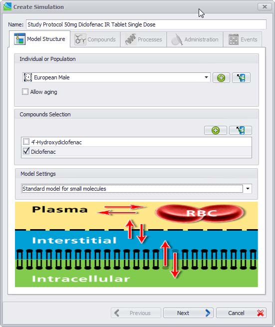

In order to create a new simulation, you are guided through five tabs of the **Create Simulation** window:

*   The **Model Structure** tab to define model properties

*   The **Compound** tab to select the compounds used for the simulation

*   The **Processes** tab to assign the relevant biological processes

*   The **Application** tab to select between different predefined applications

*   The **Events** tab to choose a specific event defined in the **Event** Building Block

### Definition of model structure‌
    
In the **Model Structure** tab of the **Create Simulation** window you need to:

• Enter a name for the simulation

• Specify an individual or population by doing one of the following:

• Select a previously defined individual or population from the drop-down menu

• Define a new individual or population by clicking **Create**  and follow the instructions of the dialog windows

• Load a new individual or population from template by clicking **Load**  and follow the instructions of the dialog windows

**Allow aging**: If a human individual or population is selected the growth of the human individual(s) during the simulation time will be taken into account when5 choosing this option. Based on the human growth and maturation functions available for most parameters in PK-Sim® (e.g. organ volumes, blood flow rates, organ composition, etc.) the parameters are updated along the time scale of the simulation. This is important for multiple drug administration to

e.g. preterm and term neonates, for which the rapid changes in anatomical and physiological properties can influence the pharmacokinetics during the simulated study circle. Please note that the use of the growth function will need additional simulation time so that it is recommended to use this option only if really needed.
    
*   Specify a compound by doing one of the following:

*   Select a compound from the list of previously created compounds in the Building Block window.
    
*   Create a new compound by clicking **Create**  and follow the instructions in the dialog windows.
    
*   Load a new compound from template by clicking **Load**  and follow the instructions in the dialog windows.
    
*   Select the model settings, i.e. either select the standard model for small molecules or the model for proteins and large molecules

#### Model settings‌

|Model Settings | Description |
|--- |--- |
|Standard model for small molecules | The PK-Sim® standard distribution model assumes 4 subcompartments per organ, i.e. compartments for blood cells, plasma, interstitial space, and cellular space. This model type considers a permeation barrier between plasma and interstitial space and takes into account that the interstitial space has a lower protein content than the plasma. It is especially suitable for small molecules.  The plasma-interstitial partition coefficients result from the lower protein concentration in the interstitial space compared to plasma and the unbound fraction in plasma. It is assumed, that the drug has the same affinity to plasma as to interstitial proteins. Thus, effects from the partitioning between plasma and interstitial space may (depending on other physico- chemical data) become important for compounds with a low fraction unbound.  The rate of permeation through the endothelial barrier between plasma and interstitial space is determined by the product of endothelial permeability and surface area. The drug dependent permeability can be defined within the Distribution Tab and the individual dependent surface area can be defined for the individual. In the present version of PK-Sim®, the endothelial permeability parameters of the plasma-interstitial barriers are not calculated from physico-chemical compound data. The default value for the plasma-interstitial permeabilities is very large, i.e. the permeabilities have to be adjusted manually, if the permeation across the plasma-interstitial barriers of the organs is expected to be restricted. Using the large default value for plasma-interstitial permeabilities, the exchange rate between plasma and interstitial in 4 subcompartments model are almost instantaneous. |
|Model for proteins and large molecules | This model type was developed to simulate the pharmacokinetics of macromolecules such as therapeutic proteins. It is an extension of the standard model for small molecules and contains a description of the transcapillary drug exchange, lymph flows and an additional sub-compartment per organ that represents the endosomal space. The endosomal compartment contains FcRn receptors that are able to protect the macromolecules from catabolism via binding to these receptors (important for e.g. IgG antibodies).|


Please note that currently only for mouse, monkey and human species specific values for the concentration of the FcRn receptor, the concentration of the endogenous IgG and the affinity of the endogenous IgG to the FcRn receptor (needed for the **Model for proteins and large molecules**) are available. In case of all other animal species just reasonable values are used as physiological default values.


### Review compound settings‌

In the **Compounds** tab of the **Create Simulation** window you can review the _Calculation methods_ selected for the partition coefficients and the cellular permeabilities. Also, you can review and override values for the _Parameter Alternatives_.

Click **Next** in order to assign the relevant biological processes. Note that you can switch between the **Tabbed view** and the **Accordion View** in the **Utilities/ Options** menu if you selected more than one compound.

### Select relevant biological processes‌

In the **Processes** tab of the **Create Simulation** window, processes like e.g. metabolic, transport, excretion and specific binding processes defined in the selected individual (or population) can be linked to the ADME properties of the selected compounds. A detailed descripton of how to set up interaction of a drug with enzymes/transporters (e.g. via a drug-drug interaction or induction) can be found in PK-Sim®\- Compounds: Defining inhibition/induction _processes_.


If, and only if, processes in individuals are linked to properties of the compounds, these processes are modeled in the simulation.



A green check mark indicates that the process is modeled when running the simulation whereas the yellow exclamation mark indicates that there is no match between the expression data defined in the individual and active processes defined in the compounds, as shown in the following screenshot.


Example 1:

Example 2:
    
Renal excretion of the compounds should be incorporated into the model. The following settings are required for the selected individual (the capability of renal excretion is a default setting):

Add a renal clearance process for the selected compound in Compound → Biological processes → Transport & Excretion → Renal clearances, as exemplified in the following screenshot:

Link the process in the individual with the biological process of the compound (if not yet automatically done):


If you wish to simulate a renally impaired individual, decrease the GFR properties in the selected individual, not in the compounds!


Click on **Next** in order to assign an application to your simulation

### Select administration‌
    
In the **Administration** tab of the **Create Simulation** window, the administration protocol can be loaded from the project database or from a template. Further, a novel administration protocol can be defined and used. In addition, in the case of oral and user defined administration types, a formulation is required for the simulation.

To insert an administration do one of the following:
    
*   Select a previously defined protocol from the **Administration Protocol** drop- down menu

*   Define a new administration by clicking **Create**  and follow the instructions of the dialog windows

*   Load an administration from the template data base by clicking **Load**  and follow the instructions of the dialog windows

In case of oral and user defined administration, you will have to additionally map the formulation(s) defined in the **Formulation** building block. In case of sophisticated dosing schedules, different formulations can be chosen for the various administration times. For an intravenous administration (Intravenous Bolus and Intravenous Infusion), the definition of a formulation name is not necessary, because the drug is always assumed to be given in solution. For these administration types, therefore, no match with formulations has to be made. For further information please see _PK-Sim® - Administration Protocols_


None or exactly one administration protocol can be assigned to every compound used in the simulation. Each administration protocol can be assigned to maximally one compound.


### Select events (optional)‌
    

In the **Events** tab of the **Create Simulation** window, events such as the administration of meals and/or discrete gallbladder emptying can be defined at various points of the simulation.

Events are optional for creating a simulation. Possible predefined events are currently the application of a meal to simulate fed conditions for an oral administration and gallbladder emptying independent from meal administration. To insert an event do one of the following:

*   Select a previously defined event from the **Event** drop-down menu

*   Define a new event by clicking **Create**  and follow the instructions of the appearing dialog windows

*   Load an event from the template data base by clicking  and follow the instructions of the appearing dialog windows

Click **OK**  to finish the **Create Simulation** process and to close the window.

If you have successfully created a simulation, it will appear in the simulation window with its name and its components:


The green check marks indicate that the building blocks used in the simulation have the same settings as the original building blocks saved in the building block explorer window. Changing the settings in the simulation is done locally without affecting the original building blocks in the building block explorer window.


## How to set up a parent/metabolite simulation‌

From version 5.6.2 onwards, PK-Sim® offers two alternatives to define drug metabolites. First, metabolites can be a "sink" which means that not actively or passively transported. They possess no physico-chemical or ADME properties and cannot be used as compounds in a simulation. Second, one of the compounds in a simulation can be assigned to be a metabolite or another compound. The metabolite possesses physico-chemical and ADME properties and be transported. In addition, the metabolite can be used in further metabolizations and thus a metabolic network can be built.

If you want the compound not be treated as sink, it needs to be included into the list of compounds in the building blocks.

If you click on **Show Diagram**, a reaction network of all reactions in the simulation is shown (not just the metabolic network).

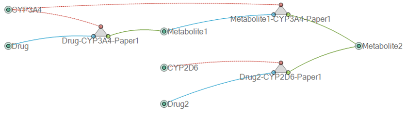

## Running a simulation in an individual‌

If a simulation was successfully created, press the **Run** simulation button  in the Modeling & Simulation ribbon or press the F5 key. If the simulation is run for the first time, ths following window will appear in which the simulation curves that will be generated in the simulation can be selected:

Per default, the peripheral venous blood plasma is already selected. If desired, select further outputs and then press **OK**. The result of the individual simulation will be automatically displayed.

In order to select another or additional outputs for the current simulation, click on **Define Settings and Run** simulation button.


By clicking **Save Settings into...** at the bottom left corner of the **Curve Selection window** the settings can be saved as a default for the project or as a user-specific default.


Two venous blood outputs can be selected: “Venous Blood” and “Peripheral Venous Blood”. “Venous Blood” refers to the compartment “Venous Blood” representing the large veins. In clinical practice it is common to sample blood at patients superficial veins, e.g. the antecubital vein. Therefore, PK-Sim® offers the opportunity to also display the pharmacokinetics of the drug in the peripheral venous plasma in order to allow a more accurate description of clinical data. Per default “Peripheral Venous Blood” is a weighted mean of skin and muscle tissue blood (about 70% contribution from skin and about 30% contribution from muscle for all species). You can change the default contribution to “Peripheral Venous Blood” by adjusting the parameters “Fraction of peripheral blood flow in organ” at “Physiology” -> “Flow Rates” -> “Peripheral Blood Flow Fraction” (select “Advanced” view for parameters). The contributions can be defined for arterial blood, bone, fat, muscle, and skin, i.e. all compartments which could possibly contribute to “Peripheral Venous Blood”. The arterial plasma is also considered because of the arteriovenous anastomoses in e.g. the skin of the hand (shunts between arteries and veins involved in the regulation of body temperature). A similar approach to describe peripheral venous plasma concentrations can be found in literature \[41\].


As the observer for peripheral venous blood sampling represents a balanced mixture of plasma concentrations of the drug in arterial blood, bone, fat, muscle, and skin please do not use the peripheral venous blood observer in the case of e.g. subcutaneous or intramuscular drug administration. This will lead to an overestimation of the concentration in plasma.


For general information about the chart component, i.e. chart settings and options etc., please see [Chart Component](../part-5/02-chart-component.md).


If you would like to cancel the running process, press the **Stop** button next to the **Run** button.


If you wish to change the settings of the simulation, click on the **Parameters** tab. If you have simulated a population, there are two more tabs **User Defined Variability** and **Distribution** in which the settings also might be changed. For both, individual and population simulations, there are three views on the parameter settings to select at the bottom of the window:

*   Simple view: in this view, not all parameters are displayed

*   Advanced view: all parameters are displayed

*   Hierarchy view: all parameters are displayed as located in the spatial model structure

You may change the parameter settings for your simulation in order to e.g. achieve a better fit to the observed data. The settings in the building blocks will be unaffected.


It is recommended to select all parameters under consideration as **Favorites** and to document the source of all parameter values changed from the default in the column **Value Description**. Then you have a comprehensive overview about the essential input of your simulation, which you can document by copying just the Favorites table.



If you change the parameter settings in the **Parameter** tab, the green check marks (traffic lights) on the Results tab will turn red indicating that the displayed simulation results were not performed with the current settings:    Press the **Run** simulation button in the **Modeling & Simulation** ribbon or press the **F5** key again to re-run the simulation with the current settings and display the results.



If parameter settings were changed in the simulation, the red traffic lights in the **Simulation** window indicate that the **local settings** in the simulation are different from the settings in the **Building Block**, i.e. the **global settings**:   A right click on the red traffic lights in the simulation window allows for two possibilities:    *   Update from building block: The simulation settings (local) will be updated with the (global) settings of the building block. This is useful if you want to discard the settings of your simulation and get back to the original settings defined in the building block.  *   Commit to building block: The (local) settings of the simulation will be committed to the building block (global settings). This is useful if you want to make these settings available in other simulations.  *   Configure: Instead of updating a single building block within your simulation you can also Configure the entire simulation and update or exchange several building blocks at a time. To do so, right mouse click on the simulation and select Configure. The Create Simulation dialog will open where you can exchange the parameters and building blocks of your simulation. In the case of building blocks for which changes were made in the simulation, the name will be supplemented by the warning This is not the template building block!. To update the settings of the simulation select the appropriate building block from the drop-down menu.


## Analyzing results for a simulation in an individual‌

As described in the previous chapter **Run simulation**, clicking on **Run** in the **Modeling & Simulation** ribbon or pressing **F5** starts the calculation of the simulation. The results will be automatically displayed after finishing the calculation. The calculated results can the be exported to various file formats.


For more information on displaying and editing the charts, see [Chart Component](../part-5/02-chart-component.md)
    
For more information on uploading observed data, see [Import and Edit of Observed Data](../part-5/06-import-edit-observed-data.md)


Generally, two different views are available and switching between these view can be done by clicking on **Show PK-Analysis** and **Show Chart** button on the bottom of the chart window:  

*   Chart view  (default): The simulated curves and the observed data are displayed

*   PK-Analysis view : The calculated PK parameters for the selected simulated curves are displayed.

### Chart view‌

The simulated curves can be displayed. If simulated curves selected in the curve selection window are missing after (re-)running a simulation, most probably these are not selected in the chart. The graphs can be selected by clicking on **Chart Editor** on the right hand side of the chart. Curve options, axis options and chart options can be selected here and the general layout of the chart can be configured.


For more information on displaying and editing the chart Display, go to [Chart Component](../part-5/02-chart-component.md)


For comparison, observed data in MS Excel® format (\*.xls and \*.xlsx) can be loaded and displayed in the chart as well. If observed data were added to the **Observed Data** Building Block, they can be added to the chart by dragging and dropping them onto the chart.


For more information on how to load observed data and compare them to your simulated data, go to [Import and Edit of Observed Data](../part-5/06-import-edit-observed-data.md)


Multiple results windows

If you wish to display different curves or use different settings for the same simulation, you can add new results charts windows by clicking on the **Results** button  in the Ribbon group **Simulation**.

Special features for population simulations

If you wish to display other percentiles or other curves without simulating again, click on the **Results** button  in the ribbon group **Simulation**. You will be directed to the **Curve selection for chart** window (see above).

### PK-Analysis view‌

If a simulation has been successfully created, click **Show PK-Analysis** on the bottom of the chart window. PK parameters are then calculated and displayed next to the chart.

The calculated pharmacokinetic parameters are:

1.  In all simulations:

|PK parameter |Description |
|--- |--- |
|AUC_tEnd | Area under curve from tstart to tend of the simulation.  |
|AUC_inf | Area under curve extrapolated to infinity (using the terminal 10% of data points).   , where # is the terminal elimination rate (calculated from the terminal 10% of simulated points).|
|%AUC(tlast-inf) | Percentage of AUCinf after end of simulation time.   |
| AUC\_tEnd\_norm | Area under curve extrapolated to infinity and normalized to the dose dose in drug mass per body weight.  |
|AUC\_inf\_norm | Area under curve extrapolated to infinity and normalized to the dose \[dose in drug mass per body weight\].  |
|AUC Ratio (AUCR) | AUC_I/AUC (Area under the plasma concentration-time curve of the substrate in the presence of the inhibitor / Area under the plasma concentration-time curve of the substrate in the absence of the inhibitor) |
|C_max| Maximum concentration|
|C\_max\_norm | Maximum concentration normalized to dose dose in drug mass per body weight |
|C\_max Ratio (Cmax\_R) | C\_max\_I/C_max (Maximum concentration of the plasma concentration-time curve of the substrate in the presence of the inhibitor / Maximum concentration of the plasma concentration-time curve of the substrate in the absence of the inhibitor)|
|C_tEnd | concentration at the end of simulation |
| t_max | Time at which the maximum concentration is assumed |
| Half-Life | Terminal half life time (calculated from the terminal 10% of data points).    , where # is the terminal elimination rate (calculated from the terminal 10% of simulated points).|
| MRT | Mean residence time is calculated by:  The infusion time is set to 0 for non intravenous administrations. The AUMCs are calculated according to:  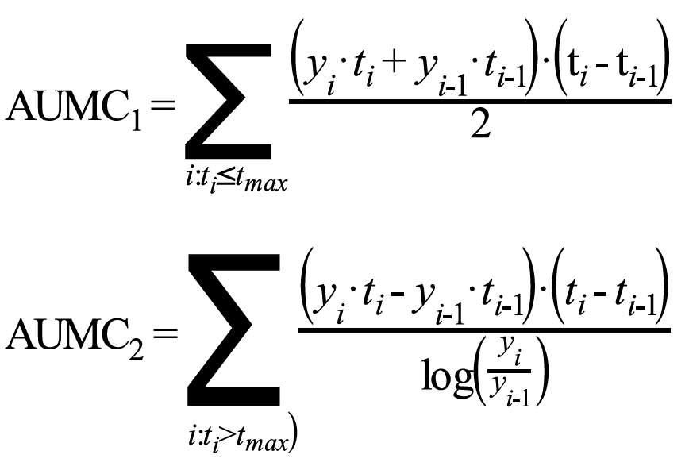  , where # is the terminal elimination rate (calculated from the terminal 10% of simulated points).|
|

2.  In simulations with intravenous administration:

|PK parameter | Description |
|--- |--- |
| VSS(plasma) | Volume of distribution at steady state calculated from the plasma curve according to:  |
|Vd(plasma) | Apparent volume of distribution is calculated from the plasma curve according to:  , where # is the terminal elimination rate (calculated from the terminal 10% of simulated points). If simulation time is short, the distribution volume may be incorrect. Run a longer simulation (to approach steady state) and reevaluate the distribution volume. |
|Vss(phys-chem) | Predicted volume of distribution = Volume-weighted mean organ to plasma partition coefficient calculated from physico- chemical compound data. |
|Total plasma clearance CL | Total clearance calculated from plasma curve according to:    |
|Total body clearance | D/AUC - Total body clearance of drug or apparent clearance (CL/F for extravascular application), dimension is ml/min/kg |

3.  In simulations with oral administration

|PK parameter | Description |
|--- |--- |
|Vss(plasma)/F | Volume of distribution at steady state calculated from plasma curve (see above) divided by bioavailability|
|Vd(plasma)/F | Apparent volume of distribution calculated from the plasma curve according to  (see above) divided by bioavailability|
|Total plasma clearance/F | Total clearance calculated from plasma curve according to   divided by bioavailability |
|Fraction absorbed | Absorbed fraction of applied oral dose. Please note that, e.g. in the case of enterohepatic circulation, this fraction may exceed 1 |
|Bioavailability | The bioavailability is only calculated on request. After pressing the button **Bioavailability** a second simulation with an intravenous (i.v.) short infusion is carried out (internally without being displayed) using identical parameters to the last simulation with oral (p.o.) administration. The bioavailability is then calculated from AUCinf (p.o.)/AUCinf (i.v.) in the venous blood compartment. For a proper estimate of the AUCinf (p.o.) it is recommended to simulate as long as total gastrointestinal transit takes. After changing any parameter the results of previously run simulations are no longer valid. In such a situation, the **Bioavailability** button is deactivated until the p.o. simulation has been executed with the current parameters.|

4.  In simulations with multiple administrations

|PK parameter | Description |
|--- |--- |
|AUC\_inf\_tD1 | Area under the concentration vs. time curve from the first data point extrapolated to infinity (further administrations are not considered!)|
|AUC\_inf\_tD1_n | oArmrea under the concentration vs. time curve from the first data point extrapolated to infinity (further administrations are not considered!) normalized to dose, with dose in drug mass per body weight|
|....tDi-tDj | Respective PK parameter from the administration time of the first dose until the administration time of the second dose |
|....tDlast-tDEnd |Respective PK parameter following the last application |
|....tDlast-1- tDlast | Respective PK parameter in the intervall between the (last -1) application and the last application|
|C\_trough\_dDi|Trough concentration just before the i-th dose is administered|
|C\_trough\_dlast|Trough concentration just before the last dose is administered|

All values are calculated using the standard equations for PK-values (see e.g. M. Rowland, T. N. Tozer, “Clinical Pharmacokinetic Concepts and Applications”, (1994) Lippincott Williams & Wilkins, Philadelphia). For extrapolation to infinity an exponential function is used on the basis of the last 10% of the calculated time steps. AUC is calculated by extrapolating the first time steps to t = 0. Depending on the curve shape the result of this extrapolation may be sensitive to time resolution. This may lead to some variability in AUC and thus, in clearance and distribution volumes.

By clicking on **Export to Excel**®**...** the calculated PK-parameters (including the simulated concentration-time profiles) can be exported to MS Excel® format.

## Running and analyzing a population simulation‌

### The population simulation analysis‌

PK-Sim® version 5.3 offers a completely redesigned population simulation analysis that is both extremely flexible and user friendly. This new module is directly integrated in PK-Sim® and does not rely on the Matlab®-based toolbox of MoBi® to run as in previous versions. The original first step of choosing the organ and compartment in which time profiles and PK-parameters will be simulated did not change. The new analysis function offers a variety of analyses and graphical displays: Time Profile, Box Whisker, Scatter and Range Analysis that will be explained in detail in the following sections of the manual.

### Running a population simulation‌

Unlike for simulations in single individuals, additional variability for parameters in population simulations may be defined. In the **User Defined Variability** tab, parameters from all building blocks that need to be varied may be selected and specific distributions/variabilities can be set. In the **Distribution** tab, these settings are graphically visualized.


For more information on adding variability to a defined population, go to PK-Sim® - Creating Populations.


Once all parameters are set, click the **Run** simulation button  in the **Modeling & Simulation** group or press the **F5** key. The **Population Simulation Settings window: Curve selection** window will appear in which organs and compartments are selected in which time profiles and PK-parameters will be calculated.
    

Choose the organ and the compartment by expanding the respective drop-down menue and select by ticking the box in the right column of the table. Press **OK** to start the simulation run.

By clicking into the **Save Settings** at the bottom left corner of the **Curve Selection window** the settings can be saved as user-specific default.

### Analyzing a population simulation‌

After the simulation has been calculated, the **Create Time Profile Analysis** window opens up next in which the graphical display of simulated time profiles can be specified. If you do not want to plot time profiles, close this window and choose the analysis type you require from the **Analysis** button.

For plotting time profiles, use the **Output** tab to specify in which of the previously selected organs/compartment you want to analyze and plot time profiles. Highlight the respective organ/compartment and add it to the right panel. In the panel below, the **Outputs: Select distribution statistics for display**, you may specify which statistical quantity of your output will be graphically displayed.


You may change the name, the unit and the scaling of selected output in all plot types. Changing the name may be useful when graphically displaying several parameters and the parameter name is printed along the y-axis.



The calculated PK-parameters of all individual curves can be exported using the **Export PK-Analyses to CSV...** item from the context menu of the simulation.



The underlying data of population analysis can be exported to Excel® using the **Export to Excel**®**...** item from the context menu of the chart view. Two sheets are created containing the data as original and transposed matrix.


#### Definition of groupings

Output may be grouped using population parameters and PK-parameters. The **Population Parameters** tab offers grouping by population parameters e.g. Characteristics of individual (weight, age, etc.), anatomy or physiology. A comprehensive list itemizes each PK-parameter in the organs/compartments specified in the **Outputs** tab. In order to select a parameter as a grouping criterion, expand the tree underlying each group of criteria and use the **Add** or **Remove**button to add or remove a specific grouping PK-Parameter to the right panel. Highlight the respective grouping and click on the **Create Grouping** button to specify the grouping intervals (binning).

For PK-parameters with numerical values like C_max or AUC grouping can be done into equally sized intervals using the **User defined limits**. Alternatively, grouping by numerical PK-parameters can be done into equally populated intervals of varying size using the **User defined (equally populated) number of bins**. For PK-parameters that assume string values like gender or race grouping is defined by **Value mapping**. Groupings have to be named and the name of the grouping appears later on as an item in the list of grouping parameters.

##### User defined limits

Grouping by customized intervals is available in both the **Population Parameter** and the **PK-Parameter** tabs. If you decide on defining the limits of each bin, the minimum and maximum values of your grouping criterion are automatically entered in the table listing the grouping intervals.

Continue as follows:

*   Define the maximum value of the first bin.

*   Add additional bins by clicking on the **\+** button in the right column of the table that lists the binning intervals.

*   In your last bin, the upper limit of you last bin is the maximum value of the parameter.

*   For each interval, select a label and change color and symbol (used in scatter plots) by changing default settings.

##### User defined (equally populated) number of bins

If you decide on using equally populated bins for grouping of your output, labels for the individual bins have to be designed for the display.

In the **Label Generation** panel, do the following:

*   Decide on the number of bins used for grouping.

*   Choose from the drop-down menu a symbol that will be used in a scatter plot.

*   Choose a start and end color for plotting the output in the first and the last interval. The color gradient in between is set automatically. Colors in individual intervals can be changed in the **Generated Label** panel below.

*   Individual intervals are named using the selected **Naming pattern** that can be customized. Per default it consists of the selected **Template** e.g. alphabetic or numerical labelling together with the lower and upper limit of the interval. However, any of these elements may be omitted. More information on customizing the label generation are available directly within the software.


When you finish defining the grouping intervals, the grouping appears in the list of selected parameters. If you highlight a specific grouping, the lower panel of the **Population Parameters** and the **PK-Parameters** shows the distribution of the individuals of the population when stratified by this grouping along with the label of each bin.


##### Value mapping for string parameters

Population parameters such as gender, race and population name can be grouped by their string values. This grouping can be used to customize labels e.g. F or M instead of Female or Male and/or the relative order of these labels in the analysis (i.e. which label should come first) menu serves the design of customized labels.

#### The Time Profile Analysis

In the **Time Profile** tab, concentration-time profiles or fraction-time profiles can be plotted. First, in the **Selected Outputs** window, select from list of previously specified organs/compartments the concentration-/fraction-time profile(s) that you want to plot. Please note that concentration and fraction cannot be used at the same time for a given analysis. Second, if you want to display by grouping, select from the **Available Fields** panel a grouping criterion specified in the **Population Parameters** or the **PK-Parameters**.

There are several ways to visualize stratified results:

*   If you drag a grouping criterion into the **Panes** panel, time-profiles in each subgroup will be displayed in a separate panel on the right. More than one grouping criterion may be selected and the respective number of panels will be generated.

*   If you drag a grouping criterion into the **Colors** panel, time-profiles in each subgroup will be displayed in one color. Colors were previously selected in the **Outputs** window. Only one grouping criterion may be selected here, to be able to differentiate the subgroups.

*   If you want to display results grouped by two criteria, use the **Panes** and the **Colors** panels simultaneously. In this case, it may wise to select only one output because curves from different compartments can only be differentiated by their progression.

For each curve PK parameters are calculated and can be shown by clicking on the **Show PK-Analysis** button.

*   Chart view  (default): The calculated curves and the observed data are displayed

*   PK-Analysis view : The calculated PK parameters for the selected calculated curves are displayed. See “PK- Analysis view”.

If you hover over the simulated time-profiles, details of the curve are displayed, e.g. the organ/compartment in which the time-profile was simulated, the statistical quantity that is plotted and the x- and y-values of the underlying data points.

Details of your grouping can be changed:

*   Go back to the **Population Parameters** or the **PK-Parameters** tab.

*   Highlight the name of the grouping in the panel listing the selected parameters.

*   Right mouse click on the name of the grouping and select **Edit** from the menu.

*   Confirm and close the window by clicking **OK** 


Use the magnifying glass to zoom into an area that you wish to enlarge.



Use the magnifying glass to zoom into an area that you wish to enlarge.


#### Displaying Observed Data in the Time Profile Analysis

In order to display **Observed Data** in your Time Profile Analysis do and note the following:

*   Drag and drop the observed data from the Building Block panel into the Analysis panel.

*   Either display specific files or folders of observed data in the building block.

*   Use the **Chart Options** to specify the settings for display of the observed data.

*   When observed data is displayed for the first time, it appears in all analysis panels by default.

*   In the Chart Options, observed data can be grouped by meta data and is displayed in the respective panel. To apply the grouping also to the observed data the meta data field of the observed data must be named like the field in the analysis and the value must match.

*   Once observed data is dragged into the analysis panel, it is associated to that simulation and can be removed by removing the observed data from the simulation tree.


For comparison charts observed data can not be removed from the analysis, but only made invisible by unticking the **Visible** box in the Chart Options.


#### The Box Whisker Analysis

In contrast to the Time Profile Analysis, population parameters and PK- parameters serve not only as grouping criteria in the Box Whisker Analysis, but may also be plotted. Any parameter selected in the **Population Parameters** tab and **PK-Parameters** tab is listed in the **Selected Outputs** panel of the **Box Whisker Plot** tab. Select a parameter for plotting by ticking the respective box. Grouping criteria are defined as described above and can be selected from the **Available Fields**. For grouping along the x-axis, several criteria may be selected by dragging to the **X-Grouping** panel. Grouping by color may be used for one criterion only and a corresponding legend is automatically created. The box comprises 25% (lower rim) to 75% (upper rim) of the values. The whiskers extend from 2.5% to 97.5% of the values in the population. The distance between the lower and upper box rim is called the inner quartile range (IQR). Outliers are values which lie outside the range from lower whisker limit - 1.5 time IQR to upper whisker limit + 1.5 time IQR.

A separate panel is created for each of the selected output parameters in the graphical display. The name and unit of the output parameters is printed along the Y-axis.

#### The Scatter Plot Analysis

In the **Scatter Plot Analysis** population parameters and PK-parameters can also be used as grouping criteria and be plotted. Grouping criteria are defined as described above. In addition to grouping in different panes or by different colors, you can group your output by symbols. Do so by dragging a grouping criterion into the **Symbols** panel. The symbols need to be defined along with the other grouping criteria in the **Population Parameter** or **PK-Parameter** tab.

#### The Range Plot Analysis

Similar to the **Scatter Plot Analysis**, the **Range Plot Analysis** offers continuous plotting of parameters on both axis. Grouping by **Population Parameters** and/or **PK-Parameters** is done as decribed above. The range plot displays the median of the parameter as a thick line and the parameter range that comprises 5-95% of individuals of the population.

Details of your analysis can be changed by right mouse click into the plot and selecting **Edit**.

### Cloning a Simulation‌

In certain cases, it can be helpful to clone a simulation, e.g. in order to keep all parameters defined in the simulation, such as the partition coefficient method, and exchange only one particular building block, e.g. the administration protocol. This can easily be done by cloning an existing simulation and subsequently exchanging the respective building block using the **Configure** functionality (see above).

To clone a simulation in the project:

1.  Right mouse click on the respective simulation in the Simulations Explorer
    
2.  Select **Clone...** 
    
3.  The **Cloning Simulation dialog**, which is identical to the **Create Simulation dialog** for new simulations, will open. You will have to enter an alternative name for the simulation clone.
    
4.  You can now go through the **Cloning Simulation dialog** and exchange parameters and/or entire building blocks of your simulation clone. To update the settings of the simulation select the appropriate building block from the drop-down menus.
    
5.  Once all parameters and building blocks are appropriate confirm and close the window by clicking **OK** 


Please note that a simulation can only be cloned if the local simulation settings are in agreement with the global settings of the building blocks, as indicated by **green check marks**.


### Comparison chart for individual or population simulations in one plot‌

The comparison chart function allows for comparison of results of different individual or population simulations in one plot.

To create a comparison plot for simulation in individuals proceed in the following way:

*   Click on the **Comparison Chart** button  in the Ribbon group **Simulation** and select **For Individual Simulations**. A new entry in the Simulation window will appear, **Comparison Chart 1**.

*   Open the comparison chart (if not already open). An empty chart will be displayed.

*   Drag and drop the simulations you want to compare from the Simulation window into the empty comparison chart.

*   Select the simulated curves you would like to display in the comparison chart.

*   If desired, add observed data from the building block by drag and drop to the chart.


To rename a comparison chart, right mouse click on the respective summary chart in the Simulation window, select **Rename** and enter the new name of the chart.


In contrast to previous versions, PK-Sim® version 5.3 offers a comparison chart also for population simulations. To create a comparison plot for simulations in populations proceed in the following way:

*   Click on the **Comparison Chart** button  in the Ribbon group **Simulation** and select **For Population Simulations**. A new window **Select simulations to use in comparison** opens up. Select the simulations you want to compare by ticking the respective boxes. In addition, you can select a population as a reference population and specify labeling, symbol and color for plotting.

*   When you have approved your selection of the curves by clicking OK, the **Comparison chart** chart offers you to look at the distribution of population parameters in the set union of the populations.

*   You can then select the analysis type for your comparison from the **Analysis** button and then proceed with selection output and grouping criteria as secribed above.


For a comparison of populations, only the intersecting set of output appears, e.g. if you selected venous plasma concentrations as output in all populations, it appears in the list of **Outputs** in the time profile analysis tab.


If you define a population as a reference population, it will not be grouped into subpopulations. This might be useful when you want to compare variability in subgroups of one population with the variability of a reference population. This is illustrated below.

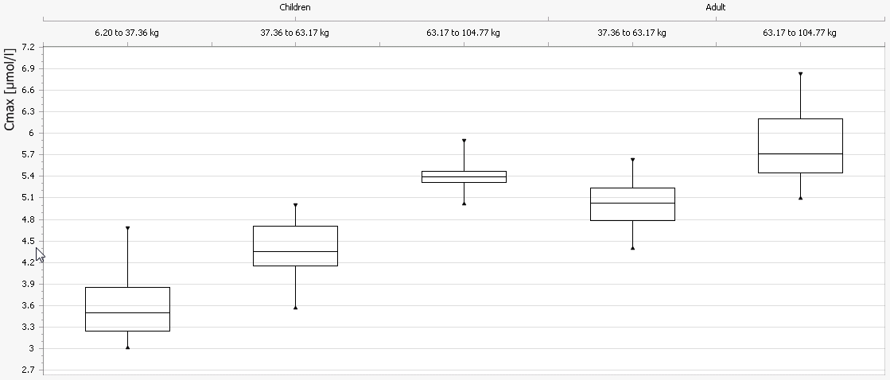

# PK-Sim® - Importing and Exporting Project Data and Models

## Importing Observed data‌

The Open Systems Pharmacology Suite offers a convenient handling of experimental data that you wish to compare with your simulations, e.g. observed data. The dialogues that cover this feature are called by clicking on the  **Observed Data** button in the **Import/Export** ribbon bar. The following steps are described in detail in Shared Tools - Import and edit of Observed _Data_.

## Importing Individual and Population Simulation‌

A new feature of PK-Sim® that was launched with version 5.3 is the **Import** function of individual and population simulations. It allows you to use simulations that have been modified outside of PK-Sim® - most likely using MoBi® - in the PK-Sim® environment. This has several advantages:

*   Simulations are handled in the well-known PK-Sim® environment.

*   An imported simulation can be handled for the most part like any other simulation built in PK-Sim®.

*   All simulations can be saved in one project file.

*   The user has access to all new parameters defined in MoBi®. This is especially useful when a simulation was enhanced for instance with a submodel that requires some parameterization.

In summary, the user will be able to simulate complicated scenarios like drug-drug-interactions, parent-metabolite interactions and pharmacokinetic/ pharmacodynamic scenarios in PK-Sim® after importing the respective models.

To load an individual simulation, do the following

*   Click on the **Individual Simulation** icon in the **Import/Export** tab and specify the file to be imported. The simulation will be imported into the project and will be available from the Simulation Explorer.

*   Any imported simulation behaves exactly like any standard PK-Sim® simulation with the exception that its structure cannot be altered. That means that it is not possible to swap parts of the simulation using the building block concept described in [Modules, Philosophy, and Building Blocks](../part-2/01-modules-philsophy-building-blocks.md).

*   If an imported simulation contains parameters that are unknown in PK-Sim®, they can be found in the simulation parameter tree under the node MoBi®.

To load a population simulation, do the following

*   Click on the **Population Simulation** icon in the **Import/Export** tab. In the **Simulation** panel of the opening window, you have to select the file to be imported.

*   In the **Population** panel, the population used to run the population simulation needs to be specified. There are three different ways of defining the aforementioned population:

*   Use a population that is defined as building block in your current project. Available populations are itemized in the drop down menu of the **Population** field. In addition, you can define a new population by clicking on the **Add** button or load a population from a template by clicking on the **Load from template** button.

*   Load a population from a CSV file. This is typically a file that was previously generated from a population (and saved in CSV format). You use this option if you want to manually modify the default distribution generated by PK-Sim® for a given parameter or if you wish to vary parameters that were created in MoBi® and that PK-Sim® is not aware of. The file is selected by specifying the population file path.

*   Allocate the number of individuals. This is typically used when importing a simulation that was entirely created in MoBi® and is not based on a PK-Sim® model. In that case, all distributed parameters defined in the simulation will be randomly varied according to their distribution. Also all parameters marked with the flag “Can be varied in a population” in MoBi® can be varied manually after importing in the **User Defined Variability** tab of PK-Sim®.

## Export To Excel®‌

You can export the simulation results (concentration-time profiles within all included organs and compartments) to MS-Excel® by

*   Right mouse click on the simulation name within the **Simulations Explorer** and select **Export results to Excel**

A window opens where you can enter the Excel® file name and the file type (\*.xls or \*.xlsx). Then Excel® is automatically started showing the exported data.

## Export To MoBi®‌

You can export a PK-Sim® simulation to MoBi® by one of the following steps:

*   Click on the **MoBi** icon  in the **Export** group of the **Modeling & Simulation** tab

*   Right mouse click on the simulation name within the **Simulations Explorer** and select **Export To MoBi...** 

The program MoBi® will open with the exported simulation. You can then save the exported simulation within MoBi® in MoBi® format (\*.mbp3 file).


Please note that if the active window in PK-Sim® corresponds to a building block rather than a simulation, the **MoBi** icon  in the **Export** group of the **Modeling & Simulation** is deactivated.


## Export to \*.pkml file for MoBi®‌

The **Shared Modeling File (\*.pkml)** can be used to load single building blocks of a PK-Sim® simulation into a MoBi® project. You can also load a whole simulation from a \*.pkml file into a MoBi® project in order to couple two models. To export a PK-Sim® simulation to a \*.pkml file:

*   Right mouse click on the simulation name in the **Simulations Explorer**

and select **Save Simulation to MoBi pkml format ...**

A window opens where you can choose the directory and enter the \*.pkml file name. The file is saved an can be subsequently opened from MoBi®.

## Export to PDF‌

Via exporting the simulation to PDF format a report will be generated. For details please see [Reporting](../part-5/08-reporting.md).

## Export for Matlab / R‌

A \*.xml file can be used to access a PK-Sim® model from within Matlab® (cf. [Working with Matlab® and R](../part-6/02-r-introduction.md)) or the software R (cf. [R Toolbox for MoBi®](../part-6/02-r-introduction.md)). To export a PK-Sim® model to a \*.xml file:

*   Right mouse click on the simulation name within the **Simulations Explorer** and select **Export for Matlab / R ...**

A window opens where you can choose the directory and enter the \*.xml file name. The file is saved and can be subsequently opened from Matlab® or R.


Matlab® is not included in any PK-Sim® license. This software must be purchased separately.


## Exporting Simulation Structures To File‌

You can export a PK-Sim® simulation to a text file that contains all model and simulation details: model structure, rate equations and parameter values. You can export the simulation by

*   Right mouse clicking on the simulation name within the **Simulations Explorer** and selecting **Export Simulation Structure To File...**

A window opens where you can choose the directory and enter the file name. The file is saved and can be subsequently opened with a suitable text editor.

## Exporting the Project History To File‌

You can export the project history that contains any user action to an Excel® file. In order to do so:

*   Click on the **Create Report** icon  in the **Export** group of the **Modeling & Simulation** tab

A window opens where you can choose the directory and enter the \*.xls file name.

## Exporting Population data‌

You can export the physiological parameters which are varied within a population to a table (\*.csv format) by

*   Right mouse click on the population name within the **Building Blocks Explorer**

and select **Export To CSV...**

*   If you have created a population simulation you can also export the population data by right mouse click on the simulation name within the **Simulations Explorer** and select **Export To CSV...**

A window opens where you can choose the directory and enter the \*.csv file name.

# PK-Sim® Conversion of Projects from Previous Version

PK-Sim®4.2 project (file extension \*.pkprj) are not supported any more by PK- Sim®5.6. If you try to open a 4,2 version project, the following message will appear:‌

##   Working with MoBi®‌

*   MoBi®‌ Documentation

# MoBi®‌ - First Steps

This section guides you to your first project with MoBi® and familiarizes yourself with the software's user interface. First, the window structure of MoBi®and the basic steps for setting up a new MoBi® project are described and second how to set up and carry out a simulation. Additionally, the import of a PK-Sim® simulation is explained. However, more sophisticated applications can be performed in MoBi®, and you are referred to the following chapters for a more detailed description.

To create your first MoBi® project, simply follow the steps described in the sections below.

## Start the Program‌

After successful installation, MoBi® can be found under **Programs** in program group **Open Systems Pharmacology** in the Windows® **Start menu**. Start the program by clicking on this menu entry and an empty workspace will appear.

## MoBi® - Window Overview‌

In this section, we give a brief overview of the MoBi® window architecture and introduce some nomenclature.

A typical MoBi® window looks like screenshot below. The window contains different subviews; although some of them are visible only after creating a project, we describe them right here in a comprehensive way.

*   The tabs **File**, **Modeling & Simulation**, **Import/Export** etc. with a **Ribbon Bar** specific for the selected tab in the upper part of the window provide shortcuts to functions on the currently selected building block or simulation,

*   the **Building Block Explorer** on the left, which gives access to all building blocks of the project,

*   the **Simulation Explorer** on the left,

*   the **History Manager** at the bottom that shows the history of model development,

*   the **Building Block Editor** with a building block specific layout. Generally, it consists of a **List**, **Tree** or **Diagram Area** of all elements of the building block and a **Properties Editor** where you can edit the properties of the selected Element.

You can rearrange the window by different actions:

*   Click  to hide the ribbon bar or  to show it,

*   Click  to auto hide the **Building Block Explorer**, the **Simulation Explorer** or the **History Manager** or  to dock it,

*   Click  to close these views or click the corresponding symbol in the Views group in the **Utilities** ribbon bar to open it,

*   Furthermore, you can drag these views and dock them to a different location. To do so, click on the title bar of the view, drag it around and drop it on one of the icons like 

In the following we describe some details of the different subviews.

The **Modeling & Simulation ribbon bar** is separated into the **History** group, **Create Building Blocks** group, the **Simulation** group, options for specific **Workflows** and the **Project** functionality that helps to manage and display the units of parameters. **Views** contains the selection of the basic windows in MoBi®, the building block explorer window, the simulation explorer, and the history manager window.

The **Building Block Explorer** consists of the different building blocks for Molecules, Reactions, Spatial Structures, Passive Transports, Observers, Events, Simulation Settings and the Start Values defined for Molecules and Parameters. Additionally, you may find imported observed data in the building block window. More elaborate information on the concept of building blocks with an explicit explanation of all building blocks of the MoBi® concept can be found in [The Building Block Concept](02-building-block-concepts.md).

A detailed introduction on how to use the building block concept to develop a project in MoBi® is given in [Model Building and Model Components](03-model-building-components.md). An in-depth explanation on how to use the **Create simulations** ribbon to define specific simulations from the different building blocks can be found in [Setting up a Simulation](04-setting-up-simulation.md).

Once you have defined the simulations in the current project, the **Simulations Explorer** lists all of them. For details, see [Simulation Results](05-simulation-results.md).

The **History Manager** lists all modeling steps and gives the opportunity to look at earlier versions and thus at the modeling history of the project. For details, see [History Manager and History Reporting‌](../part-5/10-history-manager-history-reporting‌.md).

## Create a Project‌

The first step to start working with MoBi® is to create a new project. To do this, click on the **New Project** command in the File menu. You can either work with amount or concentration based reaction networks which needs to be specified when creating a new project. Empty building blocks are automatically created shortly after in the **Building Block Explorer**: Molecules, Reactions, Spatial Structures, Passive Transports, Observers, and Events. Some of these building blocks need to be filled with data, which is successively done in the next sections.

## Enter Molecules‌

You now need to create molecules which are later used as reaction partners. Do this by the following steps:

1.  Click the + symbol in front of the  Molecules folder in the **Building Block Explorer**. Alternatively, double-click the  Molecules folder.
    
2.  Double-click the  **Molecules** entry to edit this building block. A new tab with an empty space will open.
    
3.  Click the newly visible icon  **New** in the context ribbon, or right-click  into the empty space below the **Molecules** tab and choose **Create Molecule** from the context menu. A new window titled "New Molecule" will open.
    
4.  Enter "A" as name and press the **Enter** key, or click **OK**. The molecule "A" appears in the left part of the **Molecules** tab, and a tab on the right shows the properties of the molecule.

5.  Within the properties window, uncheck the box  **Stationary** to define a fully mobile molecule.
    
6.  Enter "100" into the input box named **Value**, which represents molecule A's start amount in µmol.
    
The window should now look like this:

In the same way, create a second molecule, name it "B". Also, uncheck the box  **Stationary**, but this time leave the **Value** input box at its default 0. "B" will become our reaction product, so its initial amount is 0 µmol. You may also enter all these changes in one step in the "New Molecule" window together with the molecule's name prior to clicking **OK** or pressing **Enter**.

## Enter a Reaction‌

1.  Click on the + symbol in front of the  Reactions folder in the Building Block Explorer.
    
2.  Double-click the newly visible building block name "Reaction" in the Building Block Explorer. A new tab with an empty space will open.
    
3.  We will now make all needed previously created molecules available for the reactions to be defined. To do this, click the newly visible ribbon button  **Insert Molecule**, or right-click  into the empty white edit space of the Diagram Area and select **Insert Molecule**. A new window titled "Molecule" will open, showing an input box for manual name entry and a list of available molecules.
    
4.  Mark both molecules "A" and "B" by clicking on them with the mouse  while simultaneously keeping the **Shift** key pressed. Then release the **Shift** key and click the **OK** button. Green circular symbols will appear on the Diagram Area for each molecule.
    
5.  Click the ribbon button  **New**, or click again into the white space of the Diagram Area to get the context menu and select **Create Reaction**. A new window titled "New Reaction" will open.
    
6.  Enter "R" into the **Name** input box.
    
7.  Click the  **Add Formula** button. You will be asked for a reaction formula name. Enter "R" into the New Name input box, and the circular red error symbol  will vanish. Press **Enter** or click **OK**.
    
8.  Back in the "New Reaction" window, the circular red error symbol  in the Formula Name combobox has now vanished. Press again **Enter** or click **OK**. A reaction triangle symbol  with the name "R" underneath will now appear in the Diagram Area in addition to the molecules "A" and "B".
    
9.  You can now move the reaction triangle or either molecule within the Diagram Area by clicking on them, holding the left mouse button  and moving the mouse into the desired direction. To move a reaction, its grey center needs to be clicked on. To move a molecule, it needs to be clicked on in its darker green center.


Practice this procedure before advancing to the next step!


10.  Now you are going to connect molecules to a reaction to use them as educt and product. Some preparations are needed:

*   First, move the reaction triangle and the molecules into a position where "A" is on the left of the reaction triangle, and "B" on the right. Educts of a reaction are by default connected to the blue circle at the left triangle corner of a reaction, and products to the right green circle on the right triangle.
    
*   Connections can be drawn by either "grabbing" (keeping the left mouse key  pressed) the outer light green rim of a molecule and pulling it to the corresponding place of a reaction triangle, or by "grabbing" the corresponding reaction port (i.e., the colored circle) and pulling it to the desired molecule.
    
*   In each case, a hand symbol  will appear in place of the standard arrow mouse pointer .


Try it first without making a connection by just hovering with the mouse over a reaction or molecule symbol!


*   A line will be extended from the reaction or the molecule symbol. If it does not connect, the line will disappear as soon as you release the mouse key.
    
*   If you want to delete a connection (or if you produced a connection by mistake), click on the connection (which will then be highlighted by green squares) and then press the **Delete** key on your keyboard.

11.  To complete the reaction where "A" reacts to "B", click onto the blue circle in the reaction triangle (educt port), keep the left mouse key  pressed, and pull the line to molecule "A". Release the mouse key, and a connection line will be displayed between molecule "A" and the left corner of the triangle.
    
12.  Move the mouse pointer to the green reaction triangle circle (product port) on the left, click it, hold the left mouse key  , and pull a connection to molecule "B".
    
Below the Diagram Area you find a window with the three tabs **Properties**, **Stoichiometry**, and **Parameters**. Click the tab **Stoichiometry**. If the previous steps went well, you should see the molecule "A" listed in the "Educts" part with a stoichiometric coefficient of 1, and molecule "B" listed in the "Products" part, also with a stoichiometric coefficient of 1.

Now start to create a kinetic equation; in this example assuming an irreversible first order kinetic of molecule "A" reacting to "B". To proceed, define a first order rate constant as a reaction parameter.

1.  Click the **Parameters** tab, and then the **Add Parameter** button. A new window titled "New Parameter" will open.
    
2.  Input "k1" into the **Name** input box.
    
3.  Select Inversed Time as **Dimension** in the combobox, and enter 0.001 as **Value**. Then press **Enter** or click **OK**. The new parameter "k1" should be visible in the parameters list. Like for the molecule values, you can always change the entered values in the right part of the edit tab in case you pressed **Enter** prematurely.
    
4.  Click the **Properties** tab in the window. In the lower right of the window, there is a list called "Possible Referenced Objects". Click on the + sign in front of reaction name "R", and the reaction parameter "k1" that was just created will appear. Drag and drop the parameter "k1" into the left part of the window, to the blank space below the list with the molecules "A" and "B" and their corresponding paths and dimensions. "k1" will appear just below both molecules.
    
5.  Below this list, an input box with a red error symbol  is present. Enter the following formula into the input box right next to the error symbol: "A\*k1". The error sign will disappear, and the screen should look like in the figure below.
    

## Create Start Values for the Simulation‌

Now, you need to create the Molecules and Parameters Start Values. In our example, these are the initial amounts for the two molecules.

1.  In the building block explorer, right-click  the entry  **Molecule Start Values**.
    
2.  Right-click  it, select  **Create Molecule Start Values Building Block** from the context menu. A new window named "Create new start values" opens.
    
3.  Enter the name "1" (or any other name you prefer) and click the **OK** button. A window showing the start values for the molecules "A" and "B", 100 and 0 µmol, opens in the edit window of the screen. The values could be edited if other values than the defaults are required for the simulation.
    
4.  Repeat the procedure with the next building block,  **Parameter Start Values**: Right-click  it, select  **Create Parameter Start Values Building Block** from the menu, enter "1" as name in the "Create new start values" window, and click **OK**. This building block, however, should not show any values since our simple model does not contain any relevant parameters.


Start values can also be created during the next step (Simulation Creation Wizard window) by using the  icons which start the same parameter generation procedure. Compare and [Create a Simulation](04-setting-up-simulation.md#creating-a-simulation).


## Create and Run a Simulation‌

Now you are ready to create a simulation using all the generated building blocks of the previous sections.

1.  Click the ribbon tab **Modeling & Simulation**.
    
2.  Click the ribbon button  **Create**. The simulation creation wizard opens, showing you the default values for all building blocks to be used for the simulation.
    
3.  Enter a "1" into the Name input box, and the circular red error symbol  will vanish.
    
4.  Click the now activated **Finish** button in the bottom of the window. After a few seconds, a tabbed simulation window should appear in the edit window.
    
5.  In case any warnings appear on the screen, you can ignore them at this point and click **OK** again.
    
6.  Click the green arrow  ribbon button to run the simulation, or alternatively press the **F5** key.
    

Finally, after the computation is now done, we want to visualize the simulated results. In the simulation window, click the **Results** tab. On the right, a vertical **Chart Editor** bar is visible. Clicking it or hovering over it with the mouse pointer will bring up the possible selections for displaying the result curves.

1.  Click into the checkbox  on the right of molecule "A" (Column "Used") in the Data Browser, the top section of the Chart Editor.
    
2.  Repeat the previous step for molecule "B". Two curves should be visible.


The above description refers to an Editor Layout set to "Standard View". This should be the case in a fresh installation.

In other layouts, if you do not see any molecules, subsequently click on the + symbols in front of compartments, like "Organ" until you will see the checkboxes for the molecules "A" and "B" .


In the Chart Options section, the chart editor allows you to select grid lines and scales. You may want to try this option as well. You can look at the kinetics curves by clicking into the chart section and making the Chart Editor disappear.


Congratulations, you have done your first simulation using MoBi®!


## Running a PK-Sim® Simulation‌

If you want to run a simulation in MoBi® that you have already created in PK- Sim®, proceed with the following steps:

1.  Save your project as PK-Sim® simulation to a .pkml (see [Export To MoBi®](../part-3/13-importing-exporting-project-data-models.md#export-to-mobi).
    
2.  Open the .pkml file using the **File** menu and choose the  **Open Simulation** command.
    
3.  In the Simulations Explorer, double-click the  simulation icon or the name of your simulation left to it.
    
4.  Click the run  ribbon button of press the **F5** key. Wait until the calculation is done.
    
5.  Select the **Results** tab.
    
6.  Click the vertical **Chart Editor** bar on the right edge of the window (see the previous section).

7.  In the Data Browser section of the chart editor, select the proper organ and compartment as in your PK-Sim® project, for example Peripheral Venous Blood, and then Plasma. Check the box  in the column "Used". A PK curve should appear; if all went right, the results displayed in MoBi® should be the same as displayed with your original PK-Sim® simulation.
    
## Exit MoBi®‌

After a successful simulation session, MoBi® can be closed by selecting **File** -\> **Exit** from the menu bar; alternatively, press **Alt+F4**. Before the program is closed you are asked to save the current project. If you answer "Yes", all data belonging to the project are saved using the filename and folder you choose. You can reopen this project in a later session and continue your work at exactly the point where you left it.

# MoBi®‌ The Building Block Concept

The building block concept in MoBi® offers large flexibility during model establishment and greatly supports extrapolation to e.g. different species or patient subgroups. The building block concept focuses on the actual physical interactions of the components in a system, i.e. once two molecules are defined as associated reaction partners, they may interact in any compartment of a system given their simultaneous availability. This availability, in turn, is dependent on the structural organization of a model, i.e. if two containers are linked by so-called neighborhood relation and if active or passive transport of the components is generally possible. The building block concept thus greatly supports the structural separation between properties of the compound which are defined by basic physico-chemistry of the molecule, and the physiology of the organism which is set by organism-specific parameters in the fundamental spatial structure of the model.


Defining a neighborhood between compartments is a prerequisite for exchange processes like active or passive transports.


The kinetic rate laws that describe the dynamics of the transport processes have to be defined independently in the building block **Passive Transport**. Logical containers in turn represent descriptive entities which support organization and visualization of the models. An important information on containers is also the hierarchy of its sub-models (parent vs. child) which ultimately defines path names and thus identifiers of the different containers, molecules and reactions.


Two different species like mice and humans are not necessarily different in their spatial structure. (By default, the spatial structures are even equal!) These two species differ in their parameter start values such as organ sizes, the blood flow rates, etc..


## Molecules‌

Generally, molecules can be any kind of countable entities. Mostly, molecules will be chemical or biological compounds and can either be quantified by amount or by concentration.

It is important to specify whether a molecule may move freely through all containers of a model, which is the default setting, or if it is stationary, i.e., it is immobilized in the current container. In the latter case, for example, the molecule may represent a membrane-bound receptor protein. Non-stationary molecules imported from PK-Sim® projects are automatically associated with their distribution calculation method (e.g., PK-Sim® standard, Rodgers and Rowland, etc.) which describes the basic ADME properties of a compound. Enzymes, metabolizing processes and transporters imported from PK-Sim® projects can be found in the Molecules building block as stationary molecules.


Being substrate of a transporter, unlike being the substrate of an enzymatic reaction, is considered to be a drug property. Therefore, **active transports** are found under the drug properties in the Molecules building block.


## Reactions‌

Reactions define the causal interplay of the various molecules in a model. Note that, they are not associated with a particular location or container, but are rather physical rules for the interactions of the components of a system. If two molecules are defined as potential reaction partners, they will therefore react everywhere at any time throughout the model, as long as both molecules are simultaneously available in the same compartment. The inherent precondition for a reaction to be _created_ is that all reaction partners are present; the precondition to _really take place_ is that the amounts of the corresponding partners are not equal to zero.


Reactions are defined independent of the location and take place wherever all reaction partners are present in non-zero amounts.


This concept has important implications for systems where more than one molecule is of interest and hence several molecules are simultaneously included in the overall model structure.


If both, drug A and drug B are known to bind the same binding partner, the mere structural consideration of both binding reactions leads to **competitive binding**, if the availability of the binding partner becomes limiting.



Drug-drug-interactions such as competitive inhibition of CYP3A4 can easily be described by defining a competitive inhibition in the reactions building block. Competitive inhibition takes place in compartments where drugs and CYP3A4 are simultaneously available.


## Passive Transports‌

The building block "passive transport" defines transport processes such as diffusion and convection. By MoBi®definition, passive transports are only **non-molecule mediated transports** between two containers connected via a neighborhood, which have to be defined by the spatial structure of the model. Target and source containers can be defined by setting tag identifiers as a mandatory condition.


It is possible to establish passive transports like between the plasma and interstitial compartments of all organs with one equation, if the neighborhoods between these compartments were defined in the spatial structure. The kinetics for this passive distribution have to be defined only once.


## Observers‌

Observers visualize specific simulation results, while not interfering with the mass balance of the molecules under consideration. Observers can be derived by formulas including molecules and parameters. Basically, there are **Molecule Observers**, which keep track of the amount or concentration of a single molecule, and **Container Observers**, which describe amount or concentration of molecule in different containers, for which a spatial neighborhood relation was defined. Container observers can also be used to summarize amounts of several molecules within containers.


MoBi® internally works with amounts rather than concentrations. Hence, all concentrations in a MoBi® project are defined as observers or parameters as amount divided by volume of the compartment.


## Events‌

Events describe conditional changes during a simulation, usually a time- dependent change of values or formulas, but also complex events like drug administration, nutritional uptake or physical exercise. MoBi®allows for any kind of change which can be described by means of an if condition.


An event is explicitly defined by a boolean formula including an "if" condition, which is will very often depend on time, specific parameters or the amount or concentration of a specific molecule.


An important distinction is whether an event only occurs once or repeatedly whenever the condition is true.

## Simulation Settings‌

The simulation settings can be managed separately from the actual simulations and can hence be used in different simulations in a project. When a new project is created, a default simulation settings building block is created. Simulation settings are divided into four distinct groups:

*   Output Intervals: start and end time point of a simulation and resolution of a simulation; can be edited in this view in the **Output Intervals** tab.

*   Solver Settings: solver parameters such as tolerance, use of Jacobian etc.; can also be edited in this view in the **Solver Settings** tab.

*   Output Selection: outputs that will be available for plots; cannot be edited in this view but will be listed in the **Output Selection** tab after a successful simulation run in the **Simulation Creation Wizard**.

*   Chart Templates: a set of chart templates can be managed in the **Chart Editor** as described in [Tools](07-tools.md); is part of the simulation settings, but not visible in this view.

## Molecule Start Values‌

This building block defines the start values of the molecules in the model. These are the initial amounts or concentration of all molecules and molecule- related parameters. The impact of an individual molecule (molecule in the sense of MoBi e.g. compound) can be assessed by setting the initial values of all other molecules to zero. This is an important concept in PBPK modeling that allows for successive consideration of different molecules and differentiation of their effects. In addition, specific values to enzyme concentrations derived from relative expression values that were extracted from the protein expression database in PK-Sim® can be assigned. If you want to exclude a specific molecule from a specific container, de-select the "is present" checkbox.

## Parameter Start Values‌

This building block defines the start values of the parameters in the model. This allows for the setting of specific physiological parameters if different individuals, species or patient subgroups are to be considered.


The size of the organs of a species, i.e., the containers, are defined in this building block. This means that scaling from one species to another or scaling from adults to children can be done by exchanging the parameter start values of the organs, blood flows etc..


## Observed Data‌

This building block defines the start values of the parameters in the model. This allows for the setting of specific physiological parameters if different individuals, species or patient subgroups are to be considered.


The size of the organs of a species, i.e., the containers, are defined in this building block. This means that scaling from one species to another or scaling from adults to children can be done by exchanging the parameter start values of the organs, blood flows etc..


# MoBi®‌ Model Building and Model Components

After having made yourself familiar in the previous chapters with the building block concept and with the general structure of the program and projects ([“MoBi® \- Window Overview”](02-building-block-concepts.md#window-overview)), this section describes the practical approach how to build MoBi® models by stepwise entering content into the building blocks. Also, this knowledge is of use to upgrade models imported from PK-Sim®, as will be described in [Setting up a Simulation](04-setting-up-simulation.md).


Always watch for the helpful tool tips that appear when hovering for a few seconds with the mouse pointer over an input box or its description.


## MoBi® - Projects‌

### New Project‌
    
Your first step is to create a new project.

To create a new project select **New Project** on the **File** ribbon tab or alternatively press **Ctrl+N**.

The ribbon bar **Modeling & Simulation** with the different Ribbon Groups for creation of building blocks, simulations, and more will appear. Empty building blocks are now present for Molecules, Reactions, Spatial Structures, Passive Transports, Observers, and Events and are shown in the **Building Block Explorer**. You can now edit a building block by double-clicking the corresponding entry.

### Other project actions in the File tab‌
    
1.  Open a Project

To open a project select **Open Project (Ctrl+O)** on the **File** tab.

A **File Selection Dialog** will open in which a project file (mbp3 file) can be selected. Alternatively, you can also choose one of the **Recent documents**.

After selection, the MoBi® project is opened.


You can alter the Number of recently opened projects: on the **Utilities** tab click **Options** and select the **General** tab.



Only one project can be opened at a time! This project may, however, contain several simulations. To work on more than one project in parallel, MoBi® can be started several times.


2.  Close a Project

Close a project by selecting **Close Project** in the **File** tab. A confirmation dialog opens if there are unsaved changes.

3.  Save a Project       

To save the current project select **Save Project (Ctrl+S)** in the File tab or use the quick action button .

You can then choose either  **Save Project**, which saves the project under the name already given or  **Save As** to save the project with a new name in another file. The currently opened project will be saved with all information.

## Parameters, Formulas, and Tags‌

In all building blocks that are now created, there may be a need to create and edit parameters, to work with formulas or other elements like tables. This section describes the general options you have for parameters and formulas, and the general procedures to work with them.

Parameters are typically listed in a separate tabbed view, named "Parameters"; compare the figures within this Chapter for their exact location which will vary, depending on the building block. A parameter is used to describe physical or physiological properties of a molecule, a reaction or transport, a spatial structure, an event or an application.

For improved readability, two categories of parameters exist: "regular" and "advanced" parameters. In any parameter list of a building block, a checkbox exists above the list which is named  **Show Advanced Parameters**. If this box is checked, only those parameters tagged as "advanced" are displayed. Any parameter can be tagged as being "advanced" by checking the box  **Advanced Parameter** when a parameter is created or edited.

Parameters can be newly created, copied, moved, edited, or loaded from a pkml file:

*   A parameter is added by clicking on the  **Add Parameter** button that is present in a parameter tab view, or by right-clicking the building block item's name (molecule, reaction, etc.) in the tree, list, or diagram view and choose **Create Parameter** from the context menu that appears.

*   Instead of newly creating a parameter, you may also load it from a file. Use the **Load Parameter** button or context menu entry for this purpose and select a pkml file (e.g., a previously saved building block or simulation) that already contains a suitable parameter.

*   A third option is to **copy and paste parameters** between building block items by pressing **Ctrl+C** (on the source parameter, like from an already entered molecule or reaction) and **Ctrl+V** after moving to the target area and after clicking into the empty parameter space. Instead of **Ctrl+C** to copy a parameter, you can use **Ctrl+X** to cut a parameter from its current position.

Within the different building blocks, there are slight differences in the procedure and in the selectable options which will be explained in the corresponding sections in this chapter. In the Molecules and Reactions building blocks, parameters may be of **different types**: Local, Global, and Property. As these names already suggest, the differences are the following:

*   Parameters defined as Local can only be used locally, i.e., within the corresponding reaction or for a molecule where a local parameter is defined.

*   Parameters defined as Global can also be used in other formulas, i.e., they appear in the reference lists described in [Working with Formulas](#working-with-formulas). Furthermore, they are located in different places of a simulation hierarchy, as described in [Molecular Properties](04-setting-up-simulation.md#molecular-properties).

*   Parameters defined as Property are identical to Global parameters except that they will not be listed and set in the parameter start values.


A change of the parameter type will influence the path wherever this parameter is used in a formula (compare [Working with Formulas](#working-with-formulas)).

Furthermore, this different path will make this parameter appear in different locations within the simulation hierarchy. Global parameters appear below the reaction list in the top level hierarchy, local parameters below the reaction list in the container level where the reaction occurs.


Any parameter needs to have a **Dimension** assigned to it or the option Dimensionless has to be selected from the Dimension combobox. This feature is needed for the automatic dimension validation provided by MoBi®. Typical dimensions are concentration, volume, time, or the more complex dimensions for flow or rate constants.


If the box Validate Dimensions is  unchecked in Utilities -> Options -> General, the dimension field is not used in the model.


A parameter can be assigned to a **Group** using the combobox of the field. This information is only used for display purposes to show the list of parameters in e.g. a given container and will enable a grouped view instead of default flat view. You can switch from flat to grouped view by ticking the **Group parameters** box.

In the combobox of the field **Formula Type**, you can select if the parameter is defined as:

*   a constant, consisting of a numeric value and a unit;

*   a formula, having a formula name and a formula string (i.e., a mathematical expression) including references to the formula items;

*   a table, using individual data pairs from which a value is interpolated over the simulated time;

*   a value distributed around a constant value or between two limits (only available for parameters of spatial structure containers);

*   a calculation method parameter, whose formula will be defined depending on the selected calculation method of each molecule in the model (only available for parameter of spatial structure container). Currently, this calculation method cannot be edited within MoBi® and is imported from PK-Sim® together with the parameter.

In the bottom part of the **Create** or **Edit** window are several input options that have different effects on the parameter:

*   Checking  **Parameter is state variable** will open additional input fields for the right hand side of a differential equation (explained in detail in [State Variable Parameters](#state-variable-parameters)).

*   Checking  **Plot Parameter** will tag this parameter so that it can be visualized in a chart with the simulation results (see [Chart Component](../part-5/02-chart-component.md)).

*   Checking  **Advanced Parameter** will hide this parameter from the lists if

Show Advance Parameters is  un-checked in the parameter list view.

*   For all parameter types, **a description can be added** into the input box at the bottom, for example to quote a reference. Clicking into the text field will open an edit dialog into which you can enter or paste any text of your choice.

You may also **add tags to any parameter** which is done by first clicking the **Tags**

tab in the parameter window. This will switch you to the tag list view.

*   To add a tag, click the "Add Tag" button and enter the tag in the input box.

*   To delete a tag, click the symbol that appears behind every tag in the list.

Parameter tags are used for the evaluation of formulas of the type "Sum", see [Sum Formulas](#sum-formulas). The general rationale behind tags is explained in, [How Tags are used](#how-tags-are-used).

Each parameter can be edited by selecting it from the parameter list, upon which the parameter edit dialog right of the list is updated to show the selected parameter, then allowing to edit it.

### Working with Constant and Distributed Parameters‌

A constant parameter is simply entered as a number in the field **Value**. You may use decimal points, exponential notation, and minus signs (e.g., 2.34; 1.2E-6;

-150). Next to the value, its unit will be shown; the default unit is selected by your choice in the Dimension field, but it can be changed to other units listed in the combobox, e.g. from 1/min to 1/sec or 1/h.

Examples for constant parameters are given below, like the property "Molecular weight" for a molecule (see [Molecule Parameters](#molecule-parameters)) or the rate constant for a reaction (see [Reaction Kinetics](#reaction-kinetics)).

**Distributed parameters** (only available for parameters of spatial structure containers) describe a variation around a constant value or between two numerical limits. Within a given MoBi® simulation, a distributed parameter has a fixed value (default defined by the value in the field **value**). A distributed parameter can be used only to calculate the percentile of the parameter value given a certain distribution. Distributed parameters are useful if population statistical data are to be defined within a model. To define such a parameter, use the **Create Distributed Parameter** command from the context menu of a spatial structure item, like for containers (e.g. organ sizes) or neighborhoods (e.g., blood flow rate). In addition to what is entered for constant parameters, the **Distribution Type** has to be selected. Available options are:

*   Discrete Distribution, which is identical to a constant parameter; this feature is implemented for the purpose of simply disabling the distribution function without going through the parameter creation process again.

*   Uniform Distribution, where a parameter will be uniformly distributed between a **Minimum** and a **Maximum**, both have to be defined as numeric values. This is done by the same rules for value and units as used for the constant parameter value.

*   Normal Distribution, where a parameter is varied around a **Mean** value using a **Standard Deviation** \- both values have to be specified.

*   LogNormal Distribution, where a parameter is logarithmically varied around a **Mean** value using a **Geometric Standard Deviation** \- both values have to be entered.

If you use one of the different distributions, a **percentile** will be automatically calculated for the parameter value define in field **value** given the defined distribution. The functionality of this feature is particularly useful in combination with the script toolboxes for MoBi®.

### Working with Formulas‌

A parameter can be defined by a formula that may also use other parameters. A formula string defines the formula. Additionally to parameters, formulas are used in the kinetics equations of reactions and transport processes as well as in the monitor equation of observers. See the corresponding sections for a description. To define a formula, select Formula in the combobox **Formula Type**.

Each formula needs a formula name. The combobox **Formula Name** allows you to select from already existing formulas or to enter a new name. A new formula can be entered by clicking the  **Add Formula** button and you will be asked for the formula name. Then press **Enter** or click **OK** to return to the main window.


It is a good idea to use a name related to the object where the formula is used (e.g., parameter, reaction, observer) - you may even use identical names here.


To enter or edit a **formula string**, click into the unnamed input box above the **Description** field and then use your keyboard. This formula string will be evaluated by the solver once the simulation is run. It is written as a mathematical term that comprises numeric values, arithmetic operation signs, and names of parameters or their alias names. As long as the formula has errors or is incomplete, a red error sign  is displayed left of the empty input box. Hovering the mouse over this warning symbol will show you a tool tip on the validity of the equation (e.g., missing references or syntax errors).


Useful workflows with parameter aliases or with reference paths to aliases are described below, see [Reaction Kinetics](#reaction-kinetics) and [Passive Transports](#passive-transports).

  
In a formula, the following characters may be used:

*   numbers can be entered as described for constants

*   the arithmetic operation signs **+**, **-**, *****, **/**, **^** (for exponents)

*   round brackets **(**, **)**

*   the constants **pi** and **e**

*   the mathematical functions **ACOS**, **ASIN**, **ATAN**, **COS**, **COSH**, **EXP**, **LN**, **LOG** (identical to **LN**, natural logarithm), **LOG10**, **MAX**, **MIN**, **POW**, **SIN**, **SINH**, **SQRT**, **TAN**, **TANH**; if two operators are required (**MAX**, **MIN**, **POW**), a semicolon is used for separation, e.g., _POW(3;2)_ which corresponds to _3^2_

*   the random number generator functions **RND** and **SRND**, both to be used with the dummy argument **()**

*   if conditions, using the notation <\condition> **?** <\formula string for true> **:** <\formula string for false>

*   in the conditions, the operators **<**, **>**, **<>**, **>=**, **<=**, **=** ; alternatively: **LT**, **GT**, **NEQ**, **GEQ**, **LEQ**, **EQ**, for which the use is <\function>(<\expression1>;<\expression2>)

*   conditions can be composed out of sub-conditions that are logically connected by **AND**, **OR**, or inverted by **NOT**. An alternative symbol for **AND** is **&**; an alternative symbol for **OR** is **|**. Besides logical conditions, the numbers 0 and 1 can be used as arguments.


The above mathematical functions are defined as in the C programming language. For standard reaction kinetic models, these functions are not required at all. It is recommended to use events rather than "if conditions" in a formula.


Furthermore, defined **aliases** can be used in a formula as described in the next paragraph.


As opposed to mathematical functions, constants, and operators aliases are case sensitive.


Below the formula name and above the formula string, there is a **Reference Table** showing a header line above the columns named **Alias**, **Path**, and **Dimension**. On the right hand side of the reference table, there is a second table (separated by a vertical bar) titled **References to add**. From this left part, references are moved to the right Reference Table part by drag & drop.


In some cases, e.g. when working with formula-defined molecule parameters, it may be helpful to expand this window to have enough working space. To do so, use the vertical bars between the window sections and drag them with the mouse.


References can be of two different kinds:

*   An **absolute path** reference specifying the complete path to a referenced object (e.g., parameter, another formula). An example for this would be "Organism| Organ|Volume".

*   A **relative path** reference specifying the truncated path relative to the current formula. The expression ".." is used for "one level up", using a structure similar to that of file systems paths. An example for such a relative reference would be "..|..|Volume".

You need to choose between absolute and relative path by selecting the corresponding radio button in the References to add a section of the window. If you select relative, you will be asked for a **Local Reference Point**. This reference point depends on the level on which you create your formula (e.g., the organism or an organ level) and may be specified in the expandable selection tree (see below). Recommendations of how to choose your reference point are given within this chapter. Click **OK** to finalize your selection.

The selected local reference point will be displayed with its absolute path in the "References to add" window. In case you need to correct or alter the local reference point, click on the **...** icon right of the path. This will re-open the reference point selection window.

To add a reference to a formula, after having selected the reference point:

1.  Find the reference by name in the **Possible Referenced Objects** tree. Click on the + signs in the displayed tree to get to deeper levels of selectable points.

2.  Click on the object's name, then drag it to the Reference Table area left to it; drop it there by releasing the mouse button. The object will be added to the list, usually with its name as the alias. If that name already exists in the list, the alias name is automatically renamed by adding a number. The path and dimension of the object are also added.


Not all entries in the tree are allowed to be moved to the left, depending on the context of the formula. A + sign displayed next to the mouse pointer indicates an allowed reference.


3.  If needed, you may edit the alias name of the object manually. Alias names need to be identical to the names that are used in the formula string. Simply click on the alias name and change or override (or copy/paste) the name. For example, if you added several "Concentration" parameters from different molecules to a reaction kinetics equation, it may be helpful to manually add the molecule name next to them.

4.  In the same way as for aliases, it is also an option to manually edit the path. However, the standard procedure would be to remove the object and add it again, using a new local reference point.

5.  Dimensions can be changed by clicking on the displayed dimension and selecting a different one from the combobox.


A reference path may also contain a global part, like "|MOLECULE", which is recognizable by being written in all capital letters. The reference to "|MOLECULE" means that this part of the path refers to a parameter or property of the currently evaluated molecule, whatever its name. This is useful in formulas that are computed for all molecules present in a container. Compare the formulas in [Observers](03-model-building-components.md#observers) or [Passive Transports](#passive-transports). A global reference is selected automatically by MoBi® where appropriate.


To **remove an object from the reference list**, right-click it and select **Remove**from the context menu.


You will find several useful examples for adding references within this section and within ???.


Clicking on the **Formulas tab** in the edit window will show a list of all formulas used in the reaction building block. This list is a quick overview of formula names within one building block. Clicking on a formula in the list will show the references and the equation for the selected formula. Right-clicking on a formula in the list opens a context menu that allows you to **Rename**, **Clone** and **Remove** formulas.

### Sum Formulas

In addition to the formulas described in the previous section, sum formulas can be used to calculate sums of a specified parameter name. As a selection criterion, parameter tags can be specified.

To define a parameter or a reaction by a sum formula, use the following procedure:

1.  Select Sum Formula in **Formula Type** combobox.
    
2.  To create a new sum formula, click the  **Add Formula** button, upon which you will be asked for the formula name. Then press **Enter** or click **OK** to return to the main window.
    
3.  In the **Formula Name** combobox, you may alternatively select an existing sum formula name.
    
4.  In the **Parameter Criteria** field, right click into the empty white space and select either a New match tag condition. (The New not match tag condition is available too if needed). You will then be asked to enter a tag to match; or select one after clicking the combobox arrow. All parameters carrying the specified condition will be summed; if more than one condition is used, they will be connected with a logical AND. The general rationale behind tags is explained in (How Tags are used](#how-tags-are-used).
    
5.  Conditions can also be removed using the context menu that appears when right-clicking into the white space in the **Parameter Criteria** field.

### Working with Tables‌

A parameter can be defined by a table that is made up out of pairs of simulation- time and corresponding functional value. The parameter value as a function of time that is used in the simulation will be interpolated between these values. To enter a table:

1.  Select Table as **Formula Type**. A table layout will open below the Formula Type combobox.
    
2.  To create a new table formula, click the  **Add Formula** button, upon which you will be asked for the formula name. Then press **Enter** or click **OK** to return to the main window.

3.  In the **Formula Name** combobox, you may alternatively select an existing table formula name.

    
A formula name needs to be entered or selected before entering any value points.

    
4.  To add a data point, click the **Add Value Point** button.
    
5.  Enter a time value in the **X** (Time) input box and a parameter value in the **Y** value input box. Units of the values can be selected as described for a constant parameter value.
    
6.  You may check **Restart Solver** box in case the solver generates errors when arriving at these time points.
    
7.  More data points can be entered by clicking **Add Value Point** again, or by clicking on the button in the right to the values lines. You can delete a data pair by clicking the **delete** button .
    
8.  If you would like to use the first derivative of the interpolation, check **Use Derivative Values**. Values before the first and after the last data point of the series are set to 0.


Data points cannot be edited, but have to be deleted and newly entered. Data point units can be changed, leading to a recalculation of the associated value to its new unit.


### Working with Table Formulas with Offset‌

A table described in [Working with Tables](#working-with-tables) may need to be reused and shifted by a constant time value. For example, PK-Sim® uses this logic to build up repeated advanced application protocols (compare PK-Sim®

*   Administration Protocols). To enter a table formula with offset:
    
    1.  Select Table Formula with Offset as **Formula Type**.
        
    2.  To create a new table formula with offset, click the  **Add Formula** button, upon which you will be asked for the formula name. Then press **Enter** or click **OK** to return to the main window.
        
    3.  In the **Formula Name** _combobox_, you may select an existing table formula with offset.
        
    4.  In the box below the formula name, there is a selection to a **path with a table object**. Upon clicking the "..." icon, you can select one such object from a path tree. This must be a parameter, a transport or a reaction defined by a table defined as described in [Working with Tables](#working-with-tables). Only when you select a valid object, the  **OK** button will become active, and you can successfully continue.
        
    5.  Below the table object path, there is a selection to a **path with an offset object**. Upon clicking the "..." icon, you can select one such object from a path tree. This must be a parameter containing a time, i.e., its dimension has to be Time.
    
    Only when you select a valid object, the  **OK** button will become active, and you can successfully continue. The X values of the table selected before will be shifted by the constant time value given in the selected parameter of this step.

### State Variable Parameters‌

A parameter can also be defined as state variable. This means, that the parameter value is defined by a differential equation. To do this, click the  checkbox **Parameter is state variable** when entering or editing a parameter. The parameter value of a parameter _p_, for example, is defined as: , with  representing the expression for _change of parameter value per unit time step_ defined by the formula on the right hand side (_RHS_). Once the checkbox is active , the parameter edit view is extended by an additional input box for a formula. This formula defines the **Right Hand Side** of the parameter's differential equation. This right hand side equation itself is entered in the same way as a constant or formula type parameter. The formula in the top half of the parameter edit view now defines the initial condition for the differential equation of the parameter. The value of the parameter is defined when the differential equation is solved during the simulation of the model.


Once the  **Parameter is state variable** checkbox is deactivated again, the input box for the RHS will disappear. The parameter is no longer a state variable, and the right hand side (RHS) formula reverts to RHS = 0. If you have accidentally deactivated the checkbox and then reactivate it, the formula you may have previously defined as RHS is not lost, since all created formulas are stored. To reinstate the formula you may have previously defined as the RHS, select the formula from the combobox after the formula type explicit formula is selected.


### How Tags are used‌

Containers and neighborhoods within a spatial structure, elements of an application, or parameters may be labelled with tags. These tags, together with the name given to a container or neighborhood, may be used for selectively enabling observers, active or passive transports, or events. They are used for formula evaluations of the formula type "sum".

Tags can be entered when creating or editing a tag-carrying entity. The detailed procedures are described within this chapter in the corresponding sections describing spatial structures, observers, events, or parameters. Generally, one or more names are entered in a special input window of the corresponding entity.

Tags are evaluated in fields of observers, transports, or event groups titled "In Container with" or "Between Containers with". More than one condition can be used, being one of the following classes:

1.  Match tag condition: the condition is fulfilled when the tag name is matched.

2.  Not match tag condition: the condition is fulfilled when the tag name is **not** matched.

3.  Match all tag condition: the condition is fulfilled for all tags (not available for transport processes or sum formulas).

More than one condition can be combined for evaluation; the combinations are connected with a logical AND. The detailed procedures when and how to enter tag conditions are described in this chapter ([Sum Formulas](#sum-formulas), [Transport Processes](#transport-processes), [Observers](02-building-block-concepts.md#observers), [Events and Applications](#events-and-applications)).

Models generated in **PK-Sim**® make extensive **use of tags**: For example, open a PK-Sim® model and look under [Passive Transports](#passive-transports) for one part of the blood flow through the organs of an organism called "MassTransferBloodPool2OrgPl". This is a passive transport process that occurs from the arterial plasma compartment to the plasma compartments of all organs except for the lung. Consequently, this transport process is occurring under the following conditions:

1.  Source container: tagged with "Arterial Blood" and tagged with "Plasma".

2.  Target container: tagged with "Plasma" and not tagged with "Arterial Blood" and not tagged with "Lung".

Similarly, observers or events can be included or excluded from being created in different parts of the spatial structure. The molecule observer "Fraction excreted", for example, makes use of the tag "Urine", so this observer is only created in the urine container.

## Spatial Structures‌

A spatial structure can be an organism consisting of organs, cells and other substructures. Alternatively, it can be a laboratory setup, like a test tube or a flow chamber with interconnected compartments. Typically, each structure is described by physical parameters, in particular by volume. Containers of a spatial structure can be defined as Physical, which may contain molecules in the simulation. They can also be defined as Logical, meaning they do not represent a real container with molecules but instead just representing a grouping of sub-containers. Containers are also grouped in categories like Organism, Organ, and others. This way, the physical makeup of an organism is described.

The complex structure of a complete organism can be inspected, used, and modified after loading a simulation that was generated in PK-Sim® (see [Load a Simulation]([Setting up a Simulation](04-setting-up-simulation.md#setting-up-a-simulation)). Alternatively, a spatial structure can be loaded on its own by using the  **Load Spatial Structure** command in the Building Block Explorer and selecting the pkml file generated in PK-Sim® or MoBi®. The operations described below for creating new structures can also be used to modify imported structures.


In the process of this and the next sections of this chapter, you will create an example project. An already completed project file named "ManualModel_Sim.mbp3" is automatically installed together with MoBi® in the default program data directory. The entry "Examples" in the program start menu in the "MoBi" group will lead you to the proper path.


A very simple spatial structure named "Organism" has already been automatically created by executing the **New Project** command. For becoming familiar with editing spatial structures, proceed further:

1.  Click on the + sign next to "Spatial Structures" in the Building Block Explorer.

2.  Edit the "Organism" by double-clicking on it or by using the **Edit** command of the context menu that appears after right-clicking on **Organism**.

The screen should now look as shown in the following figure:

In the **Edit** window of a spatial structure, you have a diagram area like in the

Edit Reactions mode, which is used here to display the physical and logical arrangement of organs or reaction vials and their interactions. On the left of the **Diagram Area** is a miniature view of the entire diagram which is thought to be helpful in navigating within larger spatial structures. Below the miniature view is a tree view of the spatial structure including any neighborhoods.

### Creating a Spatial Structure‌

For continuing with our example project, construct a simple spatial structure which consists of a surrounding top level container having two interconnected sub-containers. A common tag will be added to both sub-containers which will be used later for restricting some computations (e.g., observers) to be only done for the two sub-containers. Tags are also used for restricting events or selecting source and target for transport processes. Check the corresponding sections for their use.

1.  First, **rename the top level container** from its default name that was initially created. Right-click the greenish oval symbol with the name "Organism" inside. A context menu will come up; select  Rename from it.

2.  You will be asked for a new name. Enter "BigVial" and press **Enter** or click OK.

3.  A new window named "Rename also" will open, where a list of object references to the renamed spatial structure will appear. Leave all the checkboxes checked , and continue by clicking **OK**. The names in the Diagram Area and in the tree views will now show "BigVial".
    
4.  Now create two sub-containers. Right-click again into the light green oval symbol in the Diagram Area, but this time select  **Create Container**.
    
5.  A new window named "New Container" opens, similar to the creation of molecules or reactions. Enter "Vial1" as name, and leave the Container Type on Organ. Select Physical Container in the right combobox below the name input box.
    
6.  Click the **Add Tag** button below the Container Type. You are asked for a tag name. Enter "Obs" as a tag name.
    
7.  Finally, click **OK** or press **Enter**.

After this step, the top container "BigVial" has expanded in the Diagram Area, and a new oval "Vial1" has appeared within the expanded range. Now, repeat the "Create Container" steps 4 to 7. Make sure to right-click into the green-shaded "BigVial" area surrounding "Vial1", but not into "Vial1" and not in the white area outside the outer "BigVial"! A good place would be some distance to the right of "Vial1". Name the second sub-container "Vial2" and tag it also with "Obs". You can then expand the view by dragging "Vial2" to a more distant point from "Vial1" using the mouse. The screen should now look like this:

The spatial structure can be handled in a similar way as the reactions diagram area. You can zoom in and out using the mouse wheel and the **Ctrl** key, through the context menu or the ribbon icons, and you can move structures around by dragging and dropping. Structures can be expanded by clicking on the + sign in the upper right, or they can be collapsed by clicking on the - sign. Templates can be saved or applied, and a **Layout** function can be applied using the context menu after right-clicking. Sometimes the display needs to be refreshed, using the  **Refresh** entry in the context menu.

Any container or sub-container may have parameters associated with it. They can describe physical or biological properties of the container that are required for processes like transports or reactions. What is needed in our practice model is the volume parameter which is used to calculate concentrations required for kinetic equations or for plotting concentrations after a simulation has been performed.‌‌

As for molecules or reactions, parameters become accessible after clicking the "Parameters" tab in the lower section of the edit window. To enter a spatial structure parameter:

1.  Click on "BigVial" either in the Diagram Area or in the edit tree.
    
2.  Click the "Parameters" tab.
    
3.  Click the button  **Add Parameter**, upon which a window named "New Parameter" opens.
    
4.  Enter "Volume" into the Name input box, select Volume in the Dimension input box, then enter "1" into the Value input box. The Formula Type remains on "Constant".
    
5.  Finally, click **OK**, and the new parameter "Volume" will appear in the parameter list.
    
6.  Repeat this procedure for the sub-containers "Vial1" and "Vial2", but set their volume values to smaller values, like 0.1 and 0.2 liters.

A Spatial Structure (whole or in part) can also be loaded from or saved to a template (pkml) file. Right-clicking into the Diagram Area will open a context menu that show a **Load Container** and a **Save As** entry.

To **save a Container of a Spatial Structure** as pkml file:

1.  Right-click on it in the Diagram Area or in the tree view, and select **Save As** from the context menu.
    
2.  In the file browser window that will open, select a location where it is saved and choose a name to save it.

The selected container, including all its sub-containers, parameters and neighborhoods between the sub-containers will be saved.

To **load a Container into a Spatial Structure** from a pkml file:

1.  Right-click onto the desired target position for it in the Diagram Area or in the tree view, and select **Load Container** from the context menu.

2.  Select a folder and then a pkml file from the file browser window that will open.
    
3.  If the pkml files contains more than one container, select the desired container.
    
The selected container, including all its sub-containers and neighborhoods between the sub-containers, will be loaded. If duplicate names occur, you may be asked to enter a new name. Any desired neighborhood relations (see [Creating Neighborhoods](#creating-neighborhoods)) to already existing containers in the spatial structure will have to be newly created.

You may also load and save an entire Spatial Structure building block as pkml file. This is described in detail for molecules in [Loading, Editing, and Saving Molecules](#loading-editing-and-saving-molecules) and applies also for a spatial structure.


A collection of template files with predefined building blocks is automatically installed together with MoBi® in the default program data directory. The entry "Templates" in the program start menu in the "MoBi" program group will lead you to the proper path.


### Creating Neighborhoods‌‌

Within a spatial structure, transport processes may occur (see [Active Transporter Molecules](#active-transporter-molecules) or [Passive Transports](#passive-transports)). If you plan to define a transport process within a project, it is necessary to define a neighborhood for a transport to become active. Creating a neighborhood works similar to connecting reaction partners with a reaction triangle:

1.  Move the mouse to one of the connected containers until the mouse pointer changes from the standard arrow  to a hand symbol .

2.  Hold the left mouse button and drag the connection, displayed by a line, to the container you want to have as a second neighborhood partner until the line hits its rim. In our case, connect "Vial1" with "Vial2".

3.  You will be asked for a neighborhood name that is required to proceed. Enter "V1V2Connection" and click **OK**. In the Diagram Area, the thin initial line is replaced by a bold line showing a circle half-way in the connection. Also, the neighborhood appears in the tree view of the spatial structure.

The screen now looks like this:

Like the containers, the neighborhood may contain parameters and may carry tags. These parameters could describe the physical makeup of a neighborhood, and these values may later be used in the formulas of transport processes. If you look at simulations imported from PK-Sim®, you will see examples for such parameters. The spatial structure of such a PBPK model is much more complex, but editing it works in the same way as described for our simple example.

## Molecules‌

The Molecules building block contains all molecules with their default start values, molecule-specific parameters and properties. A molecule has a name, typically the name of the compound. Parameters and properties can be defined by you to describe the physico-chemistry, like solubility or lipophilicity. These parameters may later be used in reactions, passive and active transport processes, or may influence events. Also, active transporter molecules and transport processes are defined for each molecule, if relevant for the model.

Start by opening a Molecules building block for editing. In the **Building Block Explorer**, open the Molecules folder and edit the Molecules building block by either right-clicking it and selecting "Edit", or by double-clicking on it. A new tab with an empty space will open. This is the work space where you can add new molecules or load molecules from other projects. You may notice that the ribbon of the MoBi® window has changed, being tabbed "Edit Molecule", to offer you clickable ribbon buttons for molecule-related actions (compare in [Enter Molecules](01-first-steps.md#enter-molecules)).

### Creating New Molecules‌
    
To create a new molecule:

1.  Click in the newly visible ribbon **Add** on the button  **New**, or right-click into the Diagram area (the empty space below the tab "Molecules") and choose **Create Molecule** from the context menu that appears. A new window titled "New Molecule" will open.
    
2.  Enter a molecule name into the "Name" input box.
    
3.  Alternatively, a molecule can be created based on a PK-Sim® template. This can be achieved by using the button **PK-Sim Molecule** in the **Add** ribbon or **Add PK-Sim Molecule** from the context menu in the diagram area.
    
4.  Enter a name for the PK-Sim molecule and the four physicochemical properties as listed.
    
At this point, you may already input a value for the "Default Start Amount" which is set to zero by default. Also, you may define molecule parameters after clicking on the "Parameters" tab of the "New Molecule" window (see below). Both operations, however, can also be done after the molecule is created (see below), which is finalized by pressing the **Enter** key or by clicking **OK**. The newly created molecule name now appears in the left part of the Molecules edit tab, and a tab on the right shows the properties of the molecule.
    

### Loading, Editing, and Saving Molecules‌
    
Alternatively to newly creating a molecule, **molecules can be loaded from a pkml file**. This file can be    

*   a PK-Sim® export containing molecules (see [Export to \*.pkml file for MoBi®](../part-3/13-importing-exporting-project-data-models.md#export-to-pkml-file-for-mobi), for how to create such a file),

*   an entire previously saved MoBi® simulation,

*   a saved Molecules building block from a previous project,

*   or a previously saved molecule file.


A collection of template files with predefined building blocks is automatically installed together with MoBi® in the default program data directory. The entry "Templates" in the program start menu in the MoBi program group will lead you to the proper path.


Use one of such files an proceed in the following way:

1.  Click the  **Load** ribbon button, or right-click into the empty space below the tab "Molecules" and choose **Load Molecule** from the context menu that appears.

2.  Select a folder and then a pkml file from the file browser window that will open.

3.  If the pkml file contains more than one molecule, select one or more from the list that is displayed. If one or more molecule names are already in use in the current project, you will be asked for alternative names.

You can **edit the molecule properties** for the molecule in the tree that is currently being highlighted.

*   Within the properties window, the checkbox  **Stationary** determines if the corresponding molecule will be transported by [Passive Transports](#passive-transports) processes described below (see [Passive Transports](#passive-transports)) - this box should thus be checked  only for immobile molecules, like membrane-bound receptors or transporters.

*   Select the **Molecule Type** specification from the combobox. This has only influence on the icon depicted in front of the molecules in the molecules tree view to the right. Selectable options are  Drug,  Enzyme,  Transporter, Complex, Metabolite,  Protein, and Other Protein.

*   The **Default Start Amount** determines what default value will be used whenever "Molecule Start Values" are created (see “Molecule Start Values”). The value should be left on 0 for all molecules which only will be created in the process of the simulation. For complex spatial structures, it might be an alternative strategy to set all default start amount values to 0 and set everything manually in the molecule start values for those containers where a molecule is present in known concentrations.

*   The **Used Calculation Methods** at the bottom right of the edit window shows three comboboxes for the selection of calculation methods for the distribution of the molecule within a model exported from PK-Sim®. The calculation method defines which method is used to calculate parameter values of parameters located in the "Spatial Structure" ("MoleculeProperties") which have the **Formula Type Calculation Method**. These selections are only needed if you want to use distribution methods from PK-Sim®. Otherwise, leave them on No Calculation Method. For further information on this subject, please refer to the discussion of the different distribution models in the PK-Sim® manual ([Simulations](../part-3/12-pk-sim-simulations.md)). If you select a certain "Calculation Method" you can get tool tip information on the equations and specific parameters used in the "Calculation Method" by hovering with the mouse over the "Category" entry.

To **save a molecule** as pkml file:

1.  Right-click on its name in the molecules tree, and select **Save As** from the context menu.

2.  Select a location where it is saved in the file browser window that will open and select a name to save it.

In a similar way, you can **save an entire molecules building block**.

1.  Go to the Building Block Explorer, right-click your building block (the default name would be "Molecules", it would be the level under the building block group "Molecules"), and select **Save As** from the context menu.

2.  Select a location where it is saved in the file browser window that will open and select a name to save it.

You can **load such a molecules building block** into any project by right-clicking the building block group (top level) and selecting **Load Molecules Building Block**. Also, you can use any saved molecules building block to **load individual molecules** from it into other projects, using the **Load Molecule** function described above.


If you are frequently building models in MoBi® where new molecules have to be defined, it is a good idea to once configure your typical **default molecule** and save it in your working directory. You can then compile your molecules building blocks by repeatedly loading your default molecule and each time changing the name to your desired molecule names.


Any molecules building block can also be **removed** (i.e., deleted), **renamed**, or **cloned** (i.e., copied under a different name) using the corresponding context menu functions.


The above operations, including save and load, are functions available for all other building blocks through the context menu that appears on right-clicking with the mouse at the corresponding positions.


### Molecule Parameters‌

Molecule parameters can created, loaded, copied, or changed after clicking on the Parameters tab in the right half of the window. For comprehensive information on parameters and parameter handling, see above [Parameters, Formulas, and Tags](#parameters-formulas-and-tags).

A molecule parameter needs to have a name, a parameter type (Local, Property, or Global), a dimension, a value or a formula, and it may be a state variable.

*   A typical local parameter is "Concentration", defined by the formula "Amount/ Volume".

*   A typical property is "Molecular weight" which is used for calculating weight- based concentrations.

*   An example for a global parameter might be a total start amount from which the start amounts of differently bound molecules are calculated.

*   A description can be added into the input box a the bottom, like for giving a literature reference from where you obtained this value.

More examples for molecule parameters can be found by looking at a molecule in a simulation imported from PK-Sim®. If you enter a formula-defined or a state variable parameter, please refer to the general section defining how to use this functionality (???).

As an example, we create the property "Molecular weight" for the molecule created above.

1.  Click  **Add Parameter**, and a "New Parameter" window will open.

2.  Enter "Molecular weight" as parameter name.

3.  Select the Parameter Type Property from the combobox and confirm the security question.

4.  Select MolecularWeight in the Dimension combobox - you can narrow down your search by entering the first few characters after clicking this combobox field.

5.  Leave "Formula Type" on Constant and enter the molecule's molecular weight in g/mol into the "Value" input box.

6.  Finally, press the **Enter** key or click **OK**. The screen should look like in the screen shot below.

As a second example, load the parameter "Concentration" from a PK-Sim® simulation export (see [Export to \*.pkml file for MoBi®](../part-3/13-importing-exporting-project-data-models.md#export-to-pkml-file-for-mobi) for how to create such a file).

1.  Click the **Load Parameter** button or select it from the context menu.

2.  Select a pkml file that you previously generated in PK-Sim® and select Concentration from the list. This local parameter is defined by a formula, and it is useful to have it in every molecule which is later used in a reaction kinetic equation.


For a detailed description of the creation and use of formulas see below, [Reactions](#reactions).



For **continuing our test project**, enter three molecules and name them "A", "B", and "C". Uncheck the checkbox  **Stationary** for each molecule to allow transport processes. Set the **Default Start Amount** for molecule "A" to 50 µmol and leave "B" and "C" at the default, 0 µmol. It will be needed to practice in the next sections.


### Active Transporter Molecules‌

In addition to the molecules described so far, active transporter molecules and transport processes related to them can be created. Since their use requires

that a spatial structure and neighborhoods have been created, they and the dependent active transport processes are described below in [Active Transporter Molecules](#active-transporter-molecules).

## Reactions‌

In a Reactions building block, all (bio-)chemical reactions which are of interest for the current project are defined. Like a molecule, each reaction has to have a unique name, a reaction kinetics equation, may have parameters, and it also needs reaction partners.

Like in the Molecules section, you first need to select a reaction building block for editing.

1.  In our newly created project, open the Reactions folder and edit the Reaction building block by either right-clicking it and selecting **Edit**, or by double- clicking on it.

2.  A new tab with an empty diagram area will open. This is the work space where you can add new reactions and molecules or load reactions from other projects. Again, the ribbon of the MoBi® window changes to a reaction-related view, named "Edit Reaction".

Working with reactions is done mostly using the Reaction Diagram. We describe the most important features in this section, for more details see [Diagrams Overview](06-diagrams-overview.md)

### Reactions and Molecules‌

When creating a simulation (see [Setting up a Simulation](04-setting-up-simulation.md)) the reactions defined in this building block are combined with the molecules from the Molecules building block. When we use the term **Molecule** in this section we refer to Molecule names only, which define the relationship between the Reactions to the Molecules from the Molecules building block.


If you insert a molecule that has not yet been defined in the Molecules building block, this may cause an error later when setting up a simulation. Remember to define that molecule later.


To have access to molecules as reaction partners for the reactions you want to create, it is advisable to first insert the molecules that you need into the Diagram Area, our work space. Alternatively, you may insert the molecules after reactions are created. To insert molecules:

1.  Click the newly visible ribbon button  **Insert Molecule**, or right-click into the Diagram Area and choose **Insert Molecule** from the context menu that appears. A box listing all molecules available in this project will appear.
    
2.  You can either enter a name manually into the "Molecule Name" input box, or select as many as you wish from the list below this input box. Multi-select is done in the standard Windows® way by keeping the **Shift** key (for a contiguous part of the list) or the **Ctrl** key pressed (for individual selection) followed by clicking with the mouse on the desired molecule range or molecule names.
    
3.  Click **OK** to execute the operation. For each molecule, a green circular symbol appears in the diagram area.
    
The added **molecules can be moved** by the mouse within the diagram area. To do this, left-click a molecule on its dark-green center, hold the mouse button and drag it with the mouse. Release the mouse button when the molecule sits at its desired place.

To **create a new reaction**:

1.  Click the ribbon button  **New**, or right-click into the diagram area at the position where you want to have the new reaction, then choose **Create Reaction** from the context menu that appears. A new window titled "New Reaction" will open with the "Properties" tab selected.
    
2.  Enter a reaction name into the "Name" input box, e.g. "R1".
    
3.  Below the name, you can check the box  **Create process rate parameter**. If this box is checked, a parameter which equals the reaction rate equation is automatically generated when a simulation is build. You can use this parameter to refer to the reaction rate in any equation. It can also be used to plot the reaction rate (additionally check the box **Plot Process Rate Parameter**) .
    
4.  Next, you can choose the Formula Type from a combobox - by default, Formula is selected.
    
5.  If you want to use a formula that has already been defined, you may select it from the "Formula Name" combobox. To create a new formula, click the  **Add Formula** button. You will be asked for a reaction formula name. It is a good idea to use a related name for the reaction and for the reaction's formula - you may even use the same names here. Then press **Enter** or click **OK** to return to the "New Reaction" window.
    
6.  You may then continue to create reaction parameters (like rate constants) and the reaction formula, but that can be done later as well.
    
7.  Finally, press **Enter** or click **OK**.


For completing our example and to get more practice, repeat steps 1 to 6 to enter a second reaction that you name "R2".


A **reaction triangle** symbol showing the reaction name "R1" underneath will be created in the Diagram area. This triangle  has differently colored circles on its corners:

*   The blue circle, by default on the left, is where the educts are to be connected (see where already two reactions are present).

*   The green circle, by default on the right, is where the products are connected.

*   The red circle on the top is where reaction modifiers, like catalysts or inhibitors, are connected - i.e., those molecules that do not change in the course of the reaction, but influence the reaction kinetics.

Like molecules, reaction triangles can be dragged with the mouse to a desired position within the diagram area. Click into the grey center of a reaction triangle and hold the left mouse key to drag the reaction symbol.

### Connecting Molecules and Reactions‌

Now you may want to connect molecules to the reaction and verify or change the stoichiometry. There are two ways to connect a molecule to a reaction as educt, product, or modifier:

*   You can either click on the corresponding circle of the reaction triangle (i.e., blue for educt) and drag it towards the desired molecule, holding the left mouse button pressed and releasing it when the connection line that is protruding from the triangle connects to the proper molecule.

*   Alternatively, you can drag the light-green rim of a molecule symbol towards the desired position of a reaction triangle until the connection line connects to the correct target circle.

In both cases, the correct position of the mouse pointer to start the action is indicated by a change of the mouse pointer from an arrow symbol  to a hand symbol . As long as you keep the left mouse button pressed, the connection is not yet finalized. So, if the connection line appears to connect to the wrong target, continue moving the mouse towards the desired target symbol and only release the mouse button when the correct points are connected. You should get an arrangement like shown for reaction R1 in below.


In case a wrong connection is established, you can click on a connection, after which it is highlighted by light green squares, and then press the **Delete** key on the keyboard.


Now, continue and check the **reaction's stoichiometry**. If you have connected one or more molecules to the reaction, you should see them appearing in the properties tab of this reaction.

1.  Click the reaction triangle. Below the Diagram area, the **Properties Editor**, a three-tabbed window, is shown.

2.  Click the **Properties** tab, and you see the Alias names (how they will be used in the formula, see next section), the path, and the dimension of the amount of molecules .

3.  Clicking on the **Stoichiometry** tab will list the educt and product stoichiometric coefficients. By default, these coefficients are set to 1, and you need to change that manually if your reaction has a different stoichiometry, e.g. if two molecules form a dimer.

### Reaction Kinetics‌

You are now ready to define **reaction parameters**, like kinetic rate constants, Michaelis-Menten parameters (kcat or KM), or binding constants. These parameters will then be used for the equation that defines the reaction kinetics. A new reaction parameter is defined by the following procedure:

1.  Click the Parameters tab in the edit reactions window.
    
2.  Click the  **Add Parameter** button. A "New Parameter" window opens (compare molecule parameter creation, “Molecule Parameters”).
    
3.  Enter a parameter name, like "k1" as a first order rate constant in our example.
    
4.  Select the parameter type (Local/Property/Global). For a rate constant only used in one single reaction, the recommendation is to choose Local, whereas Global is the right choice if several reactions need this parameter and you want to define it only once.
    
5.  Select the proper dimension in the **Dimension** combobox, which is Inversed Time for the first order rate constant in our example.
    
6.  Enter a value for your parameter, 0.01 as an example. If needed, select a different dimension unit in the combobox to the right of the value input box. The parameter may also be defined by a formula or data table, or you may make the parameter state variable (compare [Parameters, Formulas, and Tags](#parameters-formulas-and-tags)).
    
7.  Optionally you may enter a description.
    
8.  Finally, press **Enter** or click **OK**.
    
Alternatively to entering it manually, you may also load it from a file or copy and paste it from another reaction in the same way as described above, see [Parameters, Formulas, and Tags](#parameters-formulas-and-tags). Any setting of a parameter can be edited later, and as many parameters as you need can be added to a reaction. The figure below shows what the screen would look like after one parameter has been added.

The following steps describe how to enter a **kinetic equation** to the reaction:

1.  Click the **Properties** tab again, and notice the red error sign  left of the empty input box (see lower left). Hovering with the mouse over this warning symbol will show you a tool tip with information on the validity of the equation - currently the problem is that it is still empty. Examples for kinetic equations are a irreversible term, like "k1\*A", an equilibrium like "k1\*A- k2\*B", or a Michaelis-Menten type of equation.
    
2.  If you want to use relative paths (compare ??? for a discussion of the rationale behind the paths), select the corresponding radio button on the right hand side, and then the corresponding reference point in the tree window that pops up.
    
3.  All variables you use in the kinetic equation will have to be present in the reference list. The molecules that were previously drawn to the reaction (educts, products, or modifiers) are already present with their corresponding amount parameters.
    
4.  To add the reaction parameters that you defined before to the reference list, click on the + sign next to the reaction name in the tree display in the "Possible Referenced Objects" part of the window. Drag and drop all reaction parameters that you want to use in your formula into the references area left of the tree, where product and educt molecule references are listed.
    
5.  If you need molecular concentration parameters in the formula, select Relative path and choose one container. Open this container in the possible referenced objects tree by clicking on the + sign next to it, then open MoleculeProperties underneath it, open the needed molecule and drag the concentration parameter (which needs to be created beforehand in the Molecules building block, see [Molecule Parameters](#molecule-parameters)) into the references area left of the tree. Finally, you may want to edit the automatically generated alias names to have molecule names as part of the aliases. Just click into the alias name field and edit the name.
    
6.  Besides reaction and molecule parameters, parameters of other building blocks, like the volume of a spatial structure, might be needed. They have to be defined first, so look up the corresponding sections in this chapter to see how to do that.

7.  Finally, enter your kinetic equation into the empty input box below the references; for our example, enter "k1\*A". This will let the error symbol  disappear, if everything is properly defined and if all parameters are defined in the references. Compare your results to the series of screen shots of the Quick guide in [Enter a Reaction](01-first-steps.md#enter-a-reaction).


To complete reaction R2 (created above, see [Reactions and Molecules](#reactions-and-molecules)) which you will need for continuing with the model building, connect molecule "B" as educt to R2, then "C" as product, as done for R1 in the previous section. Then define another k1 parameter for R2, this time set it to 0.005. Note that the name k1 appears twice, but is assigned to different reactions - thus they can both be separated. Next drag k1 to the references list, then enter k1\*B as reaction kinetics formula. We will need a working reaction system if we move on to setting up a simulation later on.

If using the same rate constant name for two different reactions is too confusing, use different names for the rate constants in different reactions.


### Additional Features for Editing Reactions‌

There are more features available to handle reaction building. Some of which are briefly described here:

*   you can delete an object using the **Delete** key or the context menu,

*   you can zoom, for instance by pressing the **Shift** key and selecting a rectangle by dragging the mouse,

*   different layout features like usage of templates and auto layout mechanisms are available.

To get more details on which techniques are available in all diagrams, see [Diagrams Overview](06-diagrams-overview.md).

Instead of the diagram area, the graphical display of all reactions, you can switch to a list view by clicking the **List tab** in the upper part of the edit window. Reactions are listed by name with their stoichiometry and kinetic equations. Right-clicking the lines allows you to edit, rename, save, and remove any reaction by selecting the corresponding entry in the context menu.

## Transport Processes‌

In MoBi®, passive and active transport processes use common logics in their setup. However, for technical reasons they are defined in different building blocks: a separate passive transports building block for those passive processes that are generic for all molecules, while the active and passive transport processes specific to the molecules are defined in the molecules building block. Typical examples for all groups are mentioned in the sections below.

### Passive Transports‌
   
Passive transports which will affect all non-stationary molecules can be defined in this building block. Examples are passive diffusion, the flow of body fluids like blood, or perfusion processes. Open the building block for editing by opening the folder "Passive Transports" in the Building Block Explorer, and then double- clicking the building block which is by default also called "Passive Transports". A passive transport is defined by source (origin) and target (sink), while the transport rate is defined by a kinetic formula. Often, it is desired to define transport processes by a generic type of equation, e.g., _in all organs from blood to interstitial space_. This is done by selecting the corresponding container tag conditions which previously should be defined to contain such container type information (see [Creating a Spatial Structure](#creating-a-spatial-structure)). Further, passive processes that should transport all present and non-stationary molecules require a kinetic equation with generic references to molecule concentration or amount. By default, MoBi® uses relative reference paths with such generic names. This will be shown in the following example process.

For **creating a new transport** or loading one from a previously saved file:

1.  Select the corresponding ribbon button  **New** or  **Load**. Alternatively, you may right-click into the empty white space in the left part of the edit window and select **Create Passive Transport** or **Load Passive Transport** from the context menu. If you choose **New** or **Create**, a window named "New Passive Transport" opens.

2.  Enter a name for this transport process, for example "Diffusion".
    
3.  Define descriptors for target and source containers:
    
    *   Right-click into the corresponding empty space below "Condition" and "Tag", then either select New match tag condition or New not match tag condition.
        
    *   A window where you will be asked for the tag name will open.
       
    *   A tag can simply be the name of a container of a spatial structure; you can select from the available names by clicking the drop-down arrow. In our example project, select "Vial1" as "New match tag condition" for "Source Descriptor", and select "Vial2" as "New match tag condition" for "Target Descriptor". Selecting the "not match condition" will simply invert the selection.
        
    *   The arrangement of neighborhood connections set up in the spatial structure (see [Creating Neighborhoods](#creating-neighborhoods)) will restrict the pattern of transport streams.
       
4.  Define which molecules are transported. Per default, the checkbox  **All** is selected, which means that all molecules which are present in the corresponding compartments are transported. Exceptions can be defined in the Exclude List. In order to add a molecule to the Exclude List, click the  **Add Molecule** button within the section Exclude List. Molecules listed in the Exclude List will not be transported. If the checkbox **All** is un-checked, you can add molecules to the Include List. Then, only molecules listed in the Include List are transported.
    
5.  If the box  **Create process rate parameter** is checked, a parameter which equals the transport rate equation is automatically generated when a simulation is build. You can use this parameter to refer to the transport rate in any equation. It can also be used to plot the transport rate (additionally check the box **Plot Process Rate Parameter**) .
    
6.  In order to define a transport rate, go to the Tab **Kinetic**. Select Formula in the Formula Type combobox.
    
7.  Click the  **Add Formula** button. You will be asked for a reaction formula name. Name the formula "Diffusion". Press **Enter** or click **OK**.
    
8.  Next you need to compile the referenced values for the diffusion formula. To have more space for easier navigation, you may either click **OK** and edit the formula in the larger space of the edit window, or you may increase the size of the window by pulling on its rims with the left mouse button pressed.
        
A **diffusion equation** typically requires you to use concentration differences between two connected containers. Also, a diffusion constant is required which may be molecule-dependent.  

*   To have such values as molecule parameters available, you need to go back to edit the Molecules building block and introduce them (see [Molecule Parameters](#molecule-parameters)).

*   If transport rates depend primarily on the processes rather than on the molecular properties (e.g., blood vessel flow rates), it might be better to attach such parameters to the neighborhood (see [Creating Neighborhoods](#creating-neighborhoods)).

*   If only one global diffusion coefficient is needed (e.g., if all molecules diffuse rather similarly), you may define it as a parameter to the transport process. Use the "Parameters" tab in the edit window of the newly created passive transport, and create a diffusion constant in the way described for the other building blocks, using the "New Parameter" button.

*   Another alternative is to just enter a diffusion constant as a numerical value into the formula input box, as it is done below.

In any of the above cases, the tree view within the field "Possible Referenced Objects" allows you to pick parameters from a variety of building blocks.


If you notice later that a parameter would rather be placed at another location, you can move a parameter by clicking to the left of it, pressing **Ctrl+X** and inserting it with **Ctrl+V** at the proper position. However, all "Possible Referenced Objects" list entries pointing to this parameter need to be entered again manually.


Continuing with our example, let us enter a simple diffusion equation based on a constant multiplied with the concentration difference between source and target container.

1.  Make sure that the molecules created above all have a "Concentration" parameter. If not, see [Molecule Parameters](#molecule-parameters) how to proceed.

2.  To make the concentrations available for the diffusion formula, work with the "Possible Referenced Objects" tree view, as described in [Reaction Kinetics](#reaction-kinetics). Select "Relative path", and choose "BigVial\|Neighborhoods\|V1V2Connection" as reference point. The relative path will result in source and target molecule paths that are generic for all molecules, whereas selecting an absolute path will be molecule-specific.

3.  Successively expand the "Possible Referenced Objects" tree view by clicking on the + signs to the left of "BigVial", then again "BigVial" in the level that opened, there on "Vial1", then on "MoleculeProperties", then on "A" (or any other molecule name). The "Concentration" parameter should now appear, if present.

4.  Drag and drop exactly this "Concentration" parameter to the white references area to the left of the tree. The alias name "Concentration" and the path "SOURCE|MOLECULE|Concentration" should appear in the list.‌

5.  Then open the tree below "Vial2" -> "MoleculeProperties" -> "A" and drag exactly this "Concentration" parameter into the references as well. This time, the alias should be named "Concentration1" and the path should read "TARGET|MOLECULE|Concentration".‌

6.  Compare your screen to to the images below. If you want to change the aliases manually, you can do so by clicking on any name input box and replace the corresponding name with another.

7.  Now enter the formula "0.001\*(Concentration-Concentration1)" into the formula input box below the references. The error symbol  that was displayed to the left of this input box should now disappear, if everything is typed correctly. Compare your result again with the images below.


The resulting formula is a generic formula. The example model has 3 different molecules, "A", "B", and "C". Each of them will be transported by the above passive transport, as long as they are all present in the compartments "Vial1" and "Vial2" and the checkbox "All" is selected, which is the case in our example.


### Molecule-specific Passive Transports‌

Besides generic transport processes, molecule-specific passive transports may be required. An example is a molecule's clearance from the body which is not further characterized and cannot be attributed to specific enzymes or transporters.

As with generic passive transports, molecule-specific transports only affect non-stationary molecules. Following the logic of MoBi®, molecule-specific transport processes are to be defined in the "Molecules" building block. Refer to [Creating New Molecules](#creating-new-molecules) and open your Molecules building block for re-editing by double-clicking or by use of the context menu. If it is still open, you can click the Molecules tab in the edit window.

To create a molecule-specific transport process:

1.  In the molecules building block and in the molecules tree, right-click on the molecule that you want to be transported.
    
2.  Select **Create Passive Transport** from the context menu.
    
3.  A "New Passive Transport" window opens.
    
4.  Then follow the same protocol as given for the generic passive transports, “Passive Transports”.
    
Like with the generic passive transports, you may also load an existing process from a pkml file. Existing passive transports appear below the affected molecule in the tree view. Selecting such a process by clicking it will display an edit window as for the active transports.

### Active Transporter Molecules‌

An active transport process, as opposed to a passive transport, requires a transporter molecule (like a protein channel) that works similar to an enzyme. Unlike a chemical reaction, however, this process does not change a molecule but transfers it between containers, for example, from the intercellular space into a cell. As with passive transports, active transports only affect non-stationary molecules. Following the logic of MoBi®, all active transporter molecules and their transport processes are to be defined in the "Molecules" building block. Refer to [Creating New Molecules](#creating-new-molecules) and open your Molecules building block for re-editing by double-clicking or by use of the context menu. If it is still open, you can click the Molecules tab in the edit window.

First, an active transporter molecule needs to be defined:

1.  In the molecules building block and in the molecules tree, right-click on the molecule that you want to be transported.

2.  Select **Create Transporter Molecule** from the context menu.

3.  You are asked for a transporter name. Either enter a new name (e.g., "PGP"), or the name of an already existing transporter molecule if the very same transporter is active for several molecules in your list and has been previously defined.

4.  Press **Enter** or click **OK**. In the molecules tree, a transporter molecule is displayed, and a transporter entry is added to the molecule selected in step 1.

5.  In the transporter entry below the selected molecule, you may enter a description and parameters, as for any molecule.

6.  Click on the transporter molecule at the top level of the molecules tree to modify this molecule's parameters, as described above in, [Molecule Parameters](#molecule-parameters). This may be the initial amount of transporter or a concentration parameter.

7.  Right-click on the transporter attached to the molecule to be transported, and select **Create Transport** from the context menu. A window named "New Active Transport" opens.

8.  Enter a name into the Name input box, like "PGP Transport". Then, follow the steps described in the previous section “Passive Transports” for selecting source and target, define a transport rate parameter and entering a transport kinetics formula.

9.  The kinetics formula of an active transport process is entered into the formula input box within the Tab **Kinetic** so that the red error symbol  will disappear. A typical active transport formula will be dependent on the transporter concentration, substrate concentration in source and target container, and on molecule specific parameters, like a KM value for substrate and transporter. You will need to add all the required concentrations and parameters as references, or you may enter them in numeric form into the equation.

Continuing with our **example project**, let us enter a transport called "PGP" for molecule "A" and a transport process called "PGP Transport A" which runs in the opposite direction of the above passive transport, i.e., from "Vial2" as source to "Vial1" as target. As references for the transport equation, you need the concentration parameters of "PGP" and of "A" from the references tree. The alias of the PGP concentration is renamed to "C\_PGP", and that of molecule "A" to "C\_A" by just overriding the default names. The equation to be entered is "0.001\*C\_PGP\*C\_A". The figure below shows what the screen should look like after everything is properly set up.


If more than one molecule is transported by the very same transporter, you just create the same transporter molecule twice, i.e., with the same name under the second molecule. This will only create a new active transport, but no duplicate transporter molecule. You can then proceed like for the first molecule and create a transport process.



If two molecules compete for the same transporter, you can add inhibition terms to the transport equations that use all molecules, either as transporter substrate or as transporter inhibitor.


## Observers‌

An observer which can be displayed in a chart (see [Simulation Results](05-simulation-results.md)) is an output derived from one or several molecules or parameters by a defined formula. There are two classes of observers: **molecule observers** and **container observers**; creating and editing of both classes will be explained in this section. The main difference between those two classes is that a container observer can be computed for every molecule in every container (or for a selectable subset of both), whereas an molecule observer can be used to compute a value from one or more molecules specified in its formula, but for all or a selectable subset of containers.

In our **example project**, a spatial structure named "Observer" has already been created by initially executing the **New Project** command. To proceed further, click on the + sign to the left of "Observers" in the building block explorer, and then open the "Observer" for editing by double-clicking on it or by using the **Edit** command of the context menu that appears after right-clicking on "Observer". In the edit window, you can choose between the tabs "molecule observer" (the default selection on opening) and "Container Observer".

For **creating a new observer** or loading one from a previously saved file, select the corresponding button  **New** or  **Load** from the context-dependent ribbon and there select the proper observer type. Alternatively, you may right-click into the empty white space of the edit window and select **Create Molecule (resp. Container) Observer** or **Load Molecule (resp. Container) Observer** from the context menu. If you choose **New** or **Create**, a window named "New Molecule (resp. Container) Observer" opens.

Each **observer class has a conditions** attached to it that determines for which molecules and in which parts of the spatial structure an observer is calculated. Observers can be selected by inclusion or exclusion criteria based on their tags by selecting New match tag condition or New not match tag condition. Tags are either the name of a container or they can be manually added (compare “Creating a Spatial Structure”). All conditions entered for one observer are connected by a logical "and". Make sure you have entered proper data into these fields, or otherwise an observer is not generated in a simulation and warnings will be reported when creating a simulation (see [Create a Simulation](#part-4/04-setting-up-simulation.md#create-a-simulation)). As a further option, you may select the Add match all tag condition, which selects all containers.

All conditions, parameters, formulas, names, and paths that have been defined for any observer may later be edited, renamed, or deleted. Use the corresponding context menus, or override the entries in input boxes, comboboxes, or checkboxes.

### Molecule Observers‌
    
To work with molecule observers, make sure the tab "Molecule Observer" in the edit window is selected. To create a new molecule observer, use **Create Molecule Observer** as described above, upon which the "New Molecule Observer" window opens (see image below). For our test project, we want to create an observer that calculates the molar concentration from the amount of molecules, doing so for each molecule and each compartment except for "BigVial".

1.  Enter the name "MolarConcentration" in the Name input box, and select Concentration as Dimension below.
    
2.  Check the box "All" in the section "Calculated For Molecules".
    
3.  Check the box **All** in the section "Calculated for following molecules". If this checkbox is selected, the observer is defined for all existing molecules. Exceptions can be defined in the Exclude List. In order to add a molecule to the Exclude List, click the  **Add Molecule** button within the section Exclude List. The observer is not defined for molecules listed in the Exclude List. If the checkbox **All** is un-checked, you can add molecules to the Include List. Then, the observer is defined only for molecules listed in the Include List.
    
4.  Then right-click into the white space below "In Container with", and select New match tag condition from the context menu.
    
5.  You are asked for a tag name. Select "Obs" from the combobox or enter it manually. The "New Molecule Observer" window should now look like:

	
    
6.  The next step is to create the Monitor formula which defines how the value of the observer is calculated from the molecule or parameters. At this point, at least a formula **name** is required for the observer creation; all other data like the observer formula can be defined at a later point, if needed. Click on the "Monitor" tab in the "New Molecule Observer" window.
    
7.  Click the  **Add Formula** button. You will be asked for a reaction formula name; enter the name "MolarConcentration"; if this formula name is already existing, you may select it in the combobox instead of adding a new formula. In any case, the error symbol  will disappear from the "Formula Name" line as well as from the "Monitor" tab, and the **OK** button becomes active.
    
8.  • You can now continue to create the formula in the "New Molecule Observer" window. In this case, it is advisable to enhance the size of this window to have more work space.

	• Alternatively, you can click **OK** or press **Enter** and return to the edit window, where you need to click the "Monitor" tab again. Let us continue our example in the edit window since there is more space to select references.
        
9.  On the right hand side of the Monitor window, you will see the "References" column. The screen now looks like in the screen shot below:

	
    
10.  The formula for molecular concentration you will need to enter is the ratio of molecule amount and container volume. For both, you need the references, similar to all previously described formulas. For the amount of molecules, this is straightforward: just drag and drop the word "MOLECULE" from the "Possible Referenced Objects" tree on the right to the white space below "Alias/Path/Dimension" on the left. The alias "M", the path "..", and the dimension "Amount" will appear. This alias "M" stands for the corresponding amount for each molecule the observer is calculated for, according to the conditions defined previously, visible under the "Properties" tab.
    
11.  Since our concentration observer should be computed for containers of different hierarchical levels (in case the spatial structure will be extended in the future), you need to select "Relative Path" by clicking the corresponding radio button on the right. The first time you do that in this window, you will be asked for entering a path by the window shown below. To completely visualize the path, press the **\*** key or click on all + symbols to the left of the names. You may select any of the containers here and then use its corresponding Volume parameter; however, do not use any of the "MoleculeProperties" branches, as that would invalidate the path. To complete our example observer, click on "Vial1" and then on the OK button; see the following image.
    
	
    
12.  On the right hand side of the edit window, the "Possible Referenced Objects" tree, "Vial1" is now highlighted. Open the "Vial1" tree by clicking on the + symbol to the left of "Vial1". You will see the parameter "Volume" below it, after "MoleculeProperties".
    
13.  Drag and drop exactly this "Volume" to the left, below the "M". The alias "Volume", the path "..|..|Volume", and the dimension "Volume" should appear. Compare the screen shot below with your monitor window.
    
14.  Finally, enter the formula "M/Volume" into the input box below the references (showing a red symbol  next to it before the formula is entered), and all should look like in this image.
    
	
    
15.  The warning symbol disappears, you can see the still highlighted "Volume" that was used to drag the reference path, and you will see the amount of molecules M. In case there was a mistake and you need to reset the Local Reference Point, click on the **...** symbol to the right of the path and re-enter it. Wrong references above the formula can be deleted by right-clicking on them and selecting **Remove** from the context menu.

If you have already loaded or created a concentration parameter when building the molecules (see [Molecule Parameters](#molecule-parameters)), you may wonder why you cannot use this reaction parameter for the observer. This is indeed an alternative option. Instead of dragging and dropping "M" and "Volume", you can use the "Concentration" parameter with the correct relative path, which can be found under "Vial1/MoleculeProperties/A", if you repeatedly click on the corresponding + signs to open up the paths. As formula, this time just insert "Concentration", and you are done. you will use this method again for the container observers, so it will be further elaborated there.

Examples for many other molecule observers can be best studied when opening the observer building block in a simulation exported from PK-Sim®.

### Container Observers‌    

To work with container observers, make sure the tab "Container Observer" in the edit window is selected. For our test project, we want to create an observer that calculates the sum of our two metabolites, B and C. This creation procedure is almost identical to molecule observers, but the paths you get are different, and you will use different properties and formulas.

1.  To create a new container observer, use "Create Container Observer" as described above, upon which the "New Container Observer" window opens, similar to the molecule observer.

2.  Enter "SumMetabolites" as Name, "Concentration" as "Dimension".

3.  Then click the "Add Molecule" button within the section "Include List". You will be asked for a molecule name; select or enter "C" and click **OK**. Select the Add match all tag condition, which means that the observer will be calculated for all containers.

4.  You need to select a target container tag in the "In Container with" field in the same way as described in [Molecule Observers](#molecule-observers) or for "Source" or "Target" in [Transport Processes](#transport-processes). For our example project, use the same condition as for the example molecule observer: select New match tag condition from the context menu and then Obs from the combobox.

5.  Click on the "Monitor" tab, then click the  **Add Formula** button. Enter "SumMetabolites" as Formula Name. Then click **OK** or press **Enter**. (As described above for the molecule observers, you may also continue the formula work in the "New Container Observer" window.)

6.  Since the display returns to the properties tab, you need to click the "Monitor" tab again. Set the relative path as described for the Molecule Observer to "Vial1".

7.  In the "Possible Referenced Objects", open the "Vial1" paths all the way down until you see the "Concentration" parameters for molecules "B" and "C".

8.  Drag and drop both of them successively to the reference list.

9.  Enter "Concentration + Concentration1" into the formula input box left of the red symbol , which should disappear upon completion.

The screen should look like in the screen shot below:

## Events and Applications‌

An event is used to change an entity, like the amount of molecules or a reaction rate, when a given condition is met. This condition can be, for example, that a given simulation time is reached, or that the concentration of a molecule has exceeded a certain value. Thus, such a programmed event is used to reflect external changes to the simulation, like the application of a drug or a sudden physical change in the spatial structure, like a vessel rupture.

In the drug delivery case, however, you rather want to use an application instead of an event to have more options available for drug release and repeated applications. Since the generation of an application in MoBi® can be rather complicated and is beyond the scope of this manual, we will restrict the description to adapting applications that were previously imported from PK-Sim®, where complex applications schemes can be generated more easily.

Events and applications are grouped in an events building block, where events are sub-grouped in event groups. To create such a structure, you may need to create a new events building block using the context menu of the building block explorer or the corresponding ribbon button of the Modeling & Simulation tab. In our example, an empty events building block named "Events" has already been created automatically. Simulations imported from a PK-Sim® project also contain such a building block that contains the applications.

To add events or applications to the project, you need to open the events building block for editing. This can be done by double-clicking on it or by using the **Edit** command of the context menu in the building block explorer.

### Event Groups and Events‌
    
To **create a new event group**, either    

*   use the  **New** ribbon button,

*   or right-click into the white space in the event edit window and select the  Create Event Group command.

A window named "New Event Group" will open. Then proceed with:

1.  Enter a unique name into the Name input box, like "EventGroup1".

2.  Enter a condition to define for which containers the event will be applicable. In order to do so, click into the white space below the "In Container with" field, and select New match tag condition or New not match tag condition \- depending if you want to include or exclude containers with a specific name or tag. You can enter more than one condition, which will be combined by a logical "and". A further option is to select the Add match all tag condition, which selects all containers.

3.  After this, you will be asked to enter a container tag for your condition, where you can select from available tags in a combobox. In our example project, select BigVial as a New match tag condition. This will make the event group effective for the entire spatial structure you created above.

4.  As always, you may enter a description into the input box at the bottom.

5.  Click **OK** or press **Enter** to finalize the event group. The new event group should now be listed in the left part of the event building block edit window. The right part should show the previously specified event group tag conditions.

As in other instances, you may define parameters for an event group. To access the parameters window, click on the "Parameters" tab in the right part of the edit window. Entering a parameter entry works in the same way as described for molecules, reactions, or for spatial structure containers. Examples for event group parameters are values for event timing or amounts of molecules that you want to set within the individual events of this event group.

After the event group is created, individual events can be defined for this group. Right-click your event group, and you will see the options you have in the context menu. These are:

*   Edit \- this has the same function as selecting the name.

*   Rename

*   Save As \- saves the selected event group to a pkml file.

*   Remove \- deletes the selected event group.

*   Create Application \- see [Applications](#applications).

*   Load Application \- see [Applications](#applications).

*   Create Event \- creates a new event within the current event group.

*   Load Event \- loads an existing event from a pkml file.

*   Create Event Group \- creates a new event group below the highlighted event group.

*   Load Event Group \- loads an existing event group from a pkml file below the highlighted event group.

*   Create Container \- see [Applications](#applications).

*   Load Container \- see [Applications](#applications).

To create an event, click the Create Event option. A window named "New Event" will open (see image below). Then proceed with the following steps:

1.  Enter an event name in the Name input box, e.g. "E1".

2.  If your event should only be executed once during the simulation, check the box  **One Time Event** below the name. This is a useful option if, for example, you want to set an amount of molecules to a new value at a given time. For this example, check this box.

3.  The section "Condition" below the checkbox requires that you enter an event condition name, which is comparable to a formula name of a reaction or a parameter. Enter "E1" into this input box.

4.  To have more space for building the condition, close this window now by clicking **OK** or pressing **Enter** to complete the event building in the edit window. However, all required data could also be entered in the "New Event" window.

	

5.  Continue working with the right part of the edit window with building the event in the "Properties" tab. From the Possible Referenced Objects tree, you need the TIME variable, which reflects the simulation time. The procedure is the same as described for referenced objects used in reaction equations (see [Reaction Kinetics](#reaction-kinetics)): Drag the TIME with the mouse to the left hand side and release it in the white space below the "Alias" header under the "Condition". "Time" should appear in this field.

6.  There is still a Condition equation to be entered, as indicated by the red error sign  in front of that input box. The easiest way to let an event happen at a given simulation time would now be to enter the formula "Time > 500", which would execute the event at 500 minutes. The use of "> 500" instead of "= 500" is advantageous since it might well be that during the simulation, the exact value of 500 will never be assumed, depending on the time step. If you plan to quickly test different values for this time, it is advantageous to define this execution time as a parameter which can be altered in the simulation.

7.  Define a time parameter as an event parameter (alternatively, it can be set as an event group parameter if it is needed in several events of this group). Click the "Parameters" tab, then the button  **Add Parameter**. A "New Parameter" window opens.

8.  Enter "E1Time" as parameter name.

9.  Select Time from the combobox "Dimension".

10.  Enter "500". If you prefer to do this in other units than minutes, you may change the dimension (e.g., to "h") in the combobox to the right of the value.

11.  Click **OK** or press **Enter**. The new parameter will appear in the parameters list.

12.  Click the "Properties" tab. Drag and drop the newly created parameter "E1Time" from the Possible Referenced Objects list on the right into the white space below the already added "Time" reference. To find this parameter, you need to look below the E1 event, so click on the + sign to open that part of the reference tree. In case you have defined the parameter under the event group, you will find it below the event group.

13.  Enter "Time > E1Time" into the formula input box, after which the error sign  to the left of it should disappear.

14.  What is still needed is the assignment which determines what will happen when the event condition is fulfilled. As an example, we will set the amount of molecule "A" in the container "Vial1". To proceed, click the button **Add Assignment**. A window named "New Event Assignment" will open.

15.  Enter "SetA" as name into the Name input box.

16.  Click the **...** on the left hand side of the "Changed Entity" input box below Name. A window named "Select Changed Entity" will open. Select the molecule "A" in "Vial1" as target. To see it and be able to click it, you need to open the levels BigVial|BigVial|Vial1 by clicking successively on the + sign to the left of them. Then click on **A**. The window should look like the following screen shot.

	

17.  Click the **OK** button. The red error symbol  to the left of the "Changed Entity" input box should now be gone, and a path to molecule A, "BigVial| Vial1|A", should be visible.

18.  Check the box  **Use Assignment As Value**, then enter "50" into the Value input box. This will set the amount of molecules to 50 µmol in "Vial1" when the event is executed. Finally, click the **OK** button or press **Enter**. The screen should look like in the following image, and the event is now completed.

Instead the amount of molecules, an event allows for changing a number of assignments, like reaction or transport rate constants, container volumes or neighborhood parameters. The entire formula of a reaction or transport may be changed by not checking "Use Assignment As Value" during the creation of an assignment, and by selecting Formula instead of Constant in "Formula Type". Also, you may change several assignments upon one condition: just click the button "Add Assignment" again, and you can go through the above steps 14 to 18 again and have another value changed.

Instead of a one time event, you can have an **event permanently active** if you uncheck the box  **One Time Event** in "Properties". In our example of setting the amount of molecule "A" to 50 µmol at above 500 minutes, this would result in keeping the amount of "A" constant at 50 µmol after 500 minutes.

An assignment can be changed by the following actions:

*   Click the **...** symbol to the right of "Changed Entity Path", and you will see the Select Changed Entity window again to alter the above choice.

*   In the "New Formula" input box (or row in case of several assignments), you can change between different values or formulas for the target assignment.

*   The box  **Use Assignment As Value** can be changed to insert a formula at the assignment.

*   The  symbol has the same function as the button **Add Assignment**.

*   Clicking the  symbol will delete the corresponding assignment.


The above actions allow for basic editing of assignments. For all other and deeper changes, the recommended workflow is to delete and re-create an assignment.


### Applications‌

An application is basically an event group with a more complex structure than that described in the previous section. In almost all cases, the application will be created within PK-Sim®and then transferred to MoBi®. The scope of this section will be limited to working with this recommended workflow.

The image below shows two example applications imported from PK-Sim®, one

i.v. and one oral. You can see the two application in the tree view of the event edit window. Each application consist of the application group, the application start event, and the protocol schema item. To make changes, look at the parameters of the protocol schema item, as displayed in the image.

You may make changes in the following parameters of this group:

*   Altering **DosePerBodyWeight** will change the dose per kg body weight. This will only work if it was used in the original PK-Sim® project, which can be recognized by having a formula in the **Dose** parameter.

*   Altering **Dose** will let you change the absolute drug dose administered. If the original PK-Sim® project contained a dose per body weight, that formula will be overridden by the absolute value.

*   The time where the drug administration starts can be altered by changing the

Start time parameter.

*   The volume of water per body weight can be changed for oral applications only by using the parameter **Volume of water / body weight**. This will only work if it was used in the original PK-Sim® project, which can be recognized by having a formula in the **Amount of water** parameter.

*   Altering **Amount of water** will let you change the absolute amount of water administered with the drug. If the original PK-Sim® project contained a volume of water per body weight, that formula will be overridden by the absolute value.

*   The other parameters of this block should not be changed.


The descriptions at the bottom section of each parameter gives you more information on each parameter.


More complex changes, like changing complex dosing schemes or changing dissolution patterns are much easier to achieve using the user interface of PK- Sim® and then exporting the corresponding simulation. Within a MoBi®project, you may then combine drug applications from several PK-Sim® exports. The following describes the workflow for this operation:

1.  Save all applications of interest as PK-Sim® simulations to pkml files (see [Export To MoBi®](../part-3/13-importing-exporting-project-data-models.md#export-to-mobi)).

2.  Load your MoBi® project.

3.  Right-click the Events entry in the building block explorer, select  **Load Event Group Building Block**.

4.  Enter the name and location of your pkml file. You may be asked for a new building block name. A new Events building block is created.

5.  When creating a simulation ([Create a Simulation](04-setting-up-simulation.md#create-a-simulation)), you can now select between several possible application building blocks.


A collection of template files with predefined building blocks is automatically installed together with MoBi® in the default program data directory. The entry "Templates" in the program start menu in the MoBi program group will lead you to the proper path.



Descriptive names for each of these applications building blocks could be helpful. Use the  **Rename** function from the building block context menu for this purpose.


## Molecule Start Values‌

Molecule start values are needed to define the initial amounts of all molecules present in the molecules building block used in a simulation for all containers. These values are either imported when loading a simulation, or they can be created automatically and edited manually, if needed.


Molecule and Parameter Start Values can also be created within the Simulation Creation Wizard (compare [Create a Simulation](#part-4/04-setting-up-simulation.md#create-a-simulation)).


To automatically create molecule start values by MoBi®:

1.  Right-click the entry **Molecule Start Values** in the building block explorer.
    
2.  Select **Create Molecule Start Values Building Block** from the context menu that appears.
    
3.  A window called "Create new start values" opens. Enter a unique name for the building block.
    
4.  In the comboboxes below, you can select between different molecules or spatial structure building blocks from which the start values are calculated.
    
5.  Click **OK** or press **Enter**.
    
6.  If the name you have entered is already in use, you may be asked for entering a new name.
    
7.  An edit window opens, containing all created parameters.

All molecule or concentrations are automatically set to their default values as defined in the selected molecules building block, and these values are used for all containers in the selected spatial structure. All molecules are set to the status IsPresent in all physical containers.


Start values which are defined by a formula are displayed as "<NaN>" at this stage, which means that their values are not determined before the simulation is created.


Instead of creating molecule start values, you may load them from a previously saved simulation or a saved molecule start value building block, a pkml file.

1.  Right-click the entry **Molecule Start Values** in the Building Block Explorer.
    
2.  Select **Load Molecule Start Values Building Block** from the context menu that has appeared.
    
3.  Select the pkml file in the file explorer window.
    
Molecule start values can also be imported from Excel-files which is detailed below.

To edit a molecule start value building block, double-click on it or use the context menu in the Building Block Explorer and select **Edit**. An edit window opens, analogue to the one used when creating new start values. You can now

*   manually override the start concentrations or dimensions for every molecule in every container;

*   manually change the "IsPresent" state for each molecule;

*   use the  **Extend** ribbon button to automatically add new molecules in case more of them have been created or loaded in the molecules building block after initially creating the start values or executing the last **Extend** command;

*   use the combobox "Is Present" in the upper right to make global selections for the "IsPresent" state for all molecules, where you can check or uncheck it for all molecules or selected molecules, giving you a high degree of flexibility in defining the presence of molecules only in desired organs. The  **Apply** button has to be pressed after a global selection. Manual changes (see second bullet) are still possible afterwards.


Restricting the presence of molecules to certain organs may improve your computing performance, but use it carefully to keep your model valid!


Restricting the presence of molecules to certain organs may improve your computing performance, but use it carefully to keep your model valid!

A complete start values building block can be saved as pkml file by

1.  Right-clicking on its entry in the Building Block Explorer.

2.  Select the command **Save As**.

3.  Select a folder and file name under which it is saved for later use.

A start values building block can also be cloned by choosing the **Clone** command from the context menu in the Building Block Explorer. The name "Clone of <\building block name>" is chosen by default, and you may be asked for a different name if it is not unique. Cloning is particularly useful if you want to create several sets of similar start values building blocks with few manual changes to test different simulation scenarios.

Every start values building block can also be renamed by choosing the **Rename** command from the context menu in the Building Block Explorer. This operation allows you to choose more descriptive names for cloned building blocks.


For our **test model**, create new molecule start values and set the concentration of molecule "A" in "Vial2" to 0. Then, set the concentration of "PGP" to 1 µmol. Uncheck the  **IsPresent** box for the unnamed path elements which represent the top level container "BigVial".


## Parameter Start Values‌

Parameter Start Values are needed to define the values of various parameters present in the molecules and spatial structures building blocks used in a simulation. For example, this is true for the volume parameters of containers. These values are either imported when loading a simulation, or they can be created automatically and edited manually, if needed. Handling of this building block is very similar to the procedure described in the previous section for Molecules Start Values. In particular, cloning, loading from and saving to a pkml file is done in the same fashion (see previous section).

To automatically create Parameter Start Values by MoBi®:

1.  Right-click the entry **Parameter Start Values** in the Building Block Explorer.
    
2.  Select **Create Parameter Start Values Building Block** from the context menu that opens.
    
3.  A window called "Create new start values" opens. Enter a unique name for the building block.
    
4.  In the comboboxes below, you can select between different molecules or spatial structure building blocks from which the start values are calculated.
    
5.  Click **OK** or press **Enter**.
    
6.  If the name you have entered is already in use, you may be asked for entering a new name.
    
7.  An edit window opens, containing all created parameters.

All parameter start values are set to the values used in the corresponding building block.

To edit a parameter start value building block, double-click on it or use the context menu in the building block explorer and select **Edit**. An edit window opens, analogue to the one that is used for creating new start values. You can now

*   manually override the displayed values or dimensions.

*   use the  **Extend** ribbon button at the top to automatically add new parameters in case more of them have been created or loaded in the selected building blocks after initially creating the start values or executing the last **Extend** command.

Again, cloning and manual parameter changes at this level allow for quickly switching among different simulation scenarios.


The example model is now ready for setting up a simulation which is described in the next chapter (see [Create a Simulation](#part-4/04-setting-up-simulation.md#create-a-simulation)).


## Import Molecule and Parameter Start Values from Excel‌

A major new feature of MoBi®™ 3.5 allows import of Molecule and Parameter Start Values from Excel files on an existing building block. This features enables easier maintenance of start values and exchange with other software tools. The import is started through the context menu of the respective building block.

Files might be of older (.xls) or newer format (.xlsx). The Excel®™ file may include several worksheets and selection of relevant worksheets is part of the import workflow. The workflow includes an import step that validates and creates a start value on each row. Once the import step is successfully completed and all rows are validated, the start values are transfered into the selected building block. This workflow prevents improperly specified or formatted data from from being partially imported.

It is not necessary that the target building block of the import is empty. If there is a collision of existing and imported start values (a collision is defined by matching name and path), the imported value takes precedence.

A valid Excel file for import of Molecule Start Values must have columns specified for Path, Molecule Name, Is Present, Value, Unit, Scale Divisor and columns must appear in that order.

You may update Molecule Start Values by importing a file of a valid format that contains new values only and is empty otherwise. Upon import for updating, existing Molecular Start Values matching the empty columns remain as is and only those matching the non-empty columns are updated.

|Path| Molecule Name | Is Present | Value | Unit | Scale Divisor |
|--- |---            |---         |---    |---   |---            |
|M\|W | A | 1 | 30 | µmol | |
|M\|W | B | 50 | µmol | 3.5 |

Upon import, the heading row will be ignored and can contain any values indicating the purpose of this column; however, all columns must have a heading.


**Scale divisor**: Internally, very small numerical values are divided by the scale divisors to get to an order of magnitude which is reasonable for the solver. The purpose is to reduce numerical noise and to enhance computation performance. This is also important when working with a broad variety of magnitudes of values. The scale divisors specify a typical scale for each species. Per default, all scale divisors are set to 1. The scale divisors are defined in the Molecule Start Value building block for each start value. If you work with with very small amounts and/or a broad variety of magnitudes of values and your simulation yields implausible results (numerical noise, negative values etc.), use the Calculate Scale Divisor to adjust the scale divisor for computational purposes.


A valid Excel file for import of **Parameter Start Values** must have columns specified for Path, Parameter Name, Value and Unit and columns must appear in that order.

|Path | Parameter Name | Value | Unit |
|--- |--- |--- |--- |
|M\|W | B | 321 | g/mol |

## Editing of Molecule and Parameter Start Values‌

Start values can be edited which allows the user to quickly modify the list of start values. However, the user has to take care that the data entered manually makes sense within the existing building block. Refreshing a start value will allow the user to revert any modifications made to a start value, formula or dimension and use the values for start value, formula and dimension in the original builder. This is realized by finding the original builder using the container path of the start value.

# MoBi®‌ - Setting up a Simulation

After having made yourself familiar with the processes of building model components in MoBi® \- Model building and model components, this section describes the workflows of setting up a simulation using these components. There are two ways to set up a simulation:

*   Load an existing simulation (pkml file) into the MoBi® project.

*   Create a new simulation from existing model components (building blocks). These two workflows of setting up simulations will be described in the following.

1.  ### Load a Simulation‌

Existing simulations can be loaded by either:

*   Clicking on the  **Load Simulation into Project** button in the Import Ribbon Group.

*   Right-click on an existing simulation in the Simulations Explorer and select 

Load Simulation in the context menu.

In both cases a new window is opened from where the existing simulation can be selected. After loading the pkml file, the simulation and the corresponding building blocks are automatically added to the Building Block Explorer and the Simulations Explorer.


When working with PK-Sim®, simulations can be directly exported to MoBi® as described in [Export To MoBi®](../part-3/13-importing-exporting-project-data-models.md#export-to-mobi).


## Create a Simulation‌

To create a simulation, a full set of building blocks is needed. All building blocks and the workflows to create them are described in MoBi® \- Model building and model components.

A simulation can be created by:

*   Clicking on the  **Create** button in the Simulation Ribbon Group.

*   Right-clicking on an existing simulation in the Simulations Explorer and select  Create Simulation in the context menu.

Creating a simulation opens the **Simulation Creation Wizard** in a new window as shown below

In the first step of the simulation creation you can choose the building blocks from which the simulation will be created. Using the combobox you can browse through the existing building blocks and select the desired item. You also need to specify a unique name for the new simulation. which you may also do later in the simulation creation process.

In the first step of the Simulation Creation Wizard, you can also create new Molecule and Parameter Start Values building blocks by clicking on the  button. This follows the same workflow as for the creation of the Molecule and Parameter Start Values as described in [Molecule Start Values](02-building-block-concepts.md#molecule-start-values) and [Parameter Start Values](02-building-block-concepts.md#parameter-start-values).

Clicking on **Next**  will bring you to the second step of the simulation creation as depicted. Here you can edit the selected (or newly created) Molecule Start Values building block (for details see [Molecule Start Values](02-building-block-concepts.md#molecule-start-values)). You can also Save the displayed Start Values as a new Molecule Start Value building block using the  **Save Changes as new building block** button.

Clicking on **Next**  will bring you to the third step of the Simulation Creation as shown. Here you can edit the selected (or newly created) Parameter Start Values building block (for details see [Parameter Start Values](02-building-block-concepts.md#parameter-start-values)). You can also save the displayed start values as a new parameter start value building block using the **Save Changes as new building block** button.


Changes of start values will affect newly created simulations. Adding them to the project, will leave the original start values building blocks unaffected. **Save Changes as new building block** will create a new building block under a different name.



Newly created Molecule and Parameter Start Value building blocks in step one, or Start Values building blocks saved in steps two and three during the simulation creation process will only be added to the project when the simulation creation is completed by clicking **Finish**  and not cancelled prematurely.


The third and fourth steps after clicking **Next**  allow you to edit the Output Intervals and Simulation Settings which is described in more detail in “Simulation Settings”.

In the last step, you can choose to immediately run the simulation upon completion of the simulation creation process by selecting the checkbox  **Run Simulation** as depicted.

Finish the simulation creation by clicking on **OK** . MoBi® now generates the new simulation, the progress of which is visualized by a progress bar. During this process the simulation is also checked for consistency, and possible issues will be reported.

### Warnings and Errors‌

If the simulation creation process detects inconsistencies in the creation process, they will be displayed either as  Warning or  Error depending on their severity.

Errors and warning messages are shown in a notification viewer at the bottom of the page similar to the history viewer. Warnings and error notifications are described in more detail in the viewer as such describing

*   the origin of the message

*   the warning text

*   the warning type

The list of warnings and errors is constantly updated, i.e. if a warning is resolved, the entry is removed from the list. Likewise the viewer can be hidden or shown by pressing the **Notification** button in the _Views_ section of the _Building block_ section of the page.

Warning Non-fatal inconsistency. Warnings are generated, for example, in these cases:

*   References in formulas for non-essential objects like observers are faulty. In this case, the affected observer is simply omitted in the created simulation.

*   An error in the dimension of a formula, if the option Validate Dimension is selected in Options/User Settings/General (which is the MoBi® default).

*   An empty condition is present in an event.

Error Fatal inconsistencies. In this case, the simulation cannot be created. Errors are generated, for example, in case of:

*   Missing or wrong references in formulas for essential objects like Molecule Start Values.

*   General syntax errors in formulas.

You can choose if only errors, only warnings or both are displayed by clicking (activating/deactivating) the  Errors and  Warnings buttons in the top row of the Notifications window. Warnings are grouped according to their category.

The  Warnings and  Errors displayed in the Notifications View can also be saved in a Log file (csv format) using the  **Save Log...** button. You may apply changes and selections to the Notifications table as for any table, see Shared Tools - Features of _Tables_, which can be helpful for longer lists. A double-click on the error mesage or the warning directly opens the editor in the corresponding building block.

## Simulation Settings‌
    
Simulation Settings allow you to specify the resolution of the results as well as the _output time intervals_ for which results should be generated. Furthermore, you can edit the _properties of the solver_ used for solving the differential equations which the MoBi® simulation model is based on.
    
## Output Intervals‌
    
Output Intervals specify the simulation times at which simulation results are stored. In MoBi® you can specify a variable number of Output Intervals (as depicted below).
    

Each Output Interval is defined by the following options:

| | |
|--- |--- |
|**Start Time**: | Starting time of the Output Interval. |
|**End Time**: | End time of the Output Interval. |
|**Resolution**: | Defines the resolution with which simulation results are displayed and stored. A higher resolution increases the smoothness of the plotted curve.
    
Each set of options defines a _separate_ simulation Output Interval 

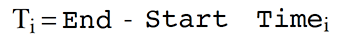

with the corresponding number of output time points

Additional output intervals can be defined and added to the list by clicking on the  **Add** button to the right of the list.


*   Output Intervals can be overlapping.
    
*   The _total_ time of simulation is from t = 0 to the highest specified End Time.
    
*   The changes made to the Output Intervals during simulation creation will become the default settings for the next simulation created.


The solution will be produced at the following time points for a number of _k_ Output Intervals:

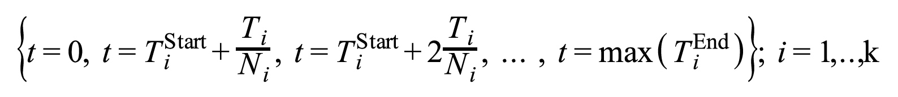

Special points (e.g. times of Events such as Applications) will be added automatically.

MoBi® uses the CVODE differential equation solver. The solver settings can be accessed and edited either in the Simulation Wizard when creating a simulation (as depicted below) or in the simulation edit mode in the Settings tab.


For more information on the solver, please refer to the documentation of the CVODE solver: [CV_Guide.pdf] https://computation.llnl.gov/casc/sundials/documentation/cv_guide.pdf.


The following options can be changed by the user:

| | |
|--- |--- |
|MxStep | Maximum number of internal steps to be taken by the solver in the attempt calculate one time step. |


For some "difficult" problems, the predefined value of MxStep might be too small. In case of such difficulties, try to increase the value of MxStep.


| | |
|--- |--- |
|H0 | Initial step size. |
|Hmin | Minimum absolute value of step size allowed. Increasing Hmin may speed up the simulation but also reduces the accuracy of the solver. |
|Hmax | Maximum absolute value of step size allowed. Reducing Hmax may slow down the simulation but also increases the accuracy of the solver. |
|AbsTol | Absolute tolerance of solver accuracy. |
|RelTol | Relative tolerance of solver accuracy. |

The parameters RelTol and AbsTol define a vector of error weights, ewt, defined as:

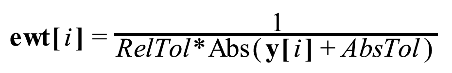

where _y_ is a variable vector _y_ = _f_(t).

This vector is used in all error and convergence tests, which use a weighted root mean square (RMS) norm on all error-like vectors _v_:

| | |
|--- |--- |
|UseJacobian | If the Jacobian matrix of the ODE system should be supplied to the solver, use the value '1', otherwise use '0'. The default value is '1'. Using the Jacobian usually speeds up the simulation. However, for large-scale problems, it might be necessary to switch off this feature (depending also on hardware configuration). |

## Editing Simulations‌

Once a simulation is created from existing building blocks as described in “Create a Simulation”, the basic structure of the simulation model is fixed.

In a simulation, you can only change the values of parameters. Also, if the value of a parameter is defined by an explicit formula you can only edit the numeric value of the formula, but not the formula definition. This means, that for example the kinetic formula of a reaction or the formula used for a certain observer are no longer editable. They may only be changed by changing a parameter the used formula depends on.


It is recommended to select all parameters under consideration as **Favorites** and to document the source of all parameter values changed from the default in the column **Value Description**. Then you have a comprehensive overview about the essential input of your simulation, which you can document by copying just the Favorites table.



If you change the value of a parameter defined by an explicit formula, the Formula Type will switch to _Constant_ and the parameter is no longer dependent on the specified formula, but stays on the newly specified numeric value.



After changing a parameter value, the parameter can be reset to its original value by clicking on the icon **Reset Parameter to default** , which appears after changing a value. (If a formula dependency of a parameter is overwritten by changing the parameter value, a yellow warning sign  appears.



If you need to change formulas, edit the corresponding building block and create a new simulation instead of editing the simulation.
    
In the following sections, a brief overview is given on where you can find the parameters that are specified in the building blocks from which the simulation was created. The examples given in some cases refer to a standard PK-Sim® simulation which was exported to MoBi®.


### Molecular Properties‌

If you define parameters for molecules of the Molecules building block used, it depends on the Parameter Type where you can find them in your simulation.

| | |
|--- |--- |
|Global | The parameter is attached to the respective molecule at the first level of your Simulation Hierarchy tree.|
|Local | The parameter is attached to the respective molecule where it is located in a physical container, e.g., accessible by double- clicking on a molecule located at the "Organism\|Liver\|Plasma" level of your Simulation Hierarchy tree. |
|Property | The same as _Global_. |

Transporter properties defined for transporting molecules can be found below "Neighborhoods" in the Simulation Hierarchy tree, but are no longer editable, as mentioned before.

### Container and Neighborhood Properties‌

The container parameters are located at the same level where they were originally defined in the Spatial Structures building block, e.g., accessible by double- clicking the "Plasma" container at the "Organism\|Liver" level.

Parameters associated with Neighborhoods, e.g., "Surface Permeability Area", are also located at the same level on which they were originally defined in the Spatial Structures building block. For the kidney, for example, "Surface (Permeability) area" can be found under "Neighborhoods\|Kidney\_int\_Kidney_cell".

Properties of Passive Transports, which are also associated to Neighborhoods are not directly editable in a simulation; as mentioned, they are only editable at the building block level.

### Reaction Kinetics‌

Parameters associated with reactions are also specified by the property Parameter Type. Thus, the same rules as for molecule parameters apply also to reaction parameters as specified above.

Properties of reactions can be viewed directly at the hierarchy level where the reaction is located. However, they are not directly editable in a simulation, they are only editable at the building block level.

### Event and Application Properties‌

Parameters associated with Event and Application Properties can be accessed at the root level of the simulation hierarchy tree through the "Events" and "Applications" subtree. They are located at the same relative location as the Events building block from which the simulation was created.

### Container Layout‌

The Container layout of a simulation is based on the layout of the Spatial Structure building block from which the simulation was created. A detailed description of how the layout of the container structure can be edited is given in “Spatial Structures” and “Spatial Structure Diagram”.

## Update and Commit Changes Between Simulations and Building Blocks‌
    
Within the **Simulation Explorer**, each building block item of the **Configuration** tree is displayed with a green or red traffic light. The traffic lights indicate if the building block item of the simulation is consitent with the corresponing general **Building Block**. If a **Building Block** or parameter settings within a **Simulation** are changed, the red traffic lights in the **Simulation** window indicate that the local settings in the simulation are different from the settings in the general **Building Block**.
    
A right click on the red traffic lights in the **Simulation** window allows for two actions:

*   Update: The simulation settings (local) will be updated with the (general) settings of the building block. This is useful if you want to discard the settings of your simulation and get back to the original settings defined in the building block. Updating from a Spatial Structure or Molecule Building Block will open a dialogue that allows you to check your configuration. You may check here automatically applied changes in the Molecule Start Values and Parameter Start Values and adjust them manually.

*   Commit: The (local) changes of the simulation will be committed to the general building block. This is useful if you want to make these changes available in other simulations.


The Update and Commit logic in MoBi is slightly different from the one used in PK-Sim.


## Running a Simulation‌

To run a simulation, use the simulation edit mode by either double clicking  on the simulation in the Simulation Explorer or by right-clicking  on the simulation and select  **Edit** from the context menu.

Now you can run the simulation by one of the following options:

*   Click the  **Run** button in the Simulation Ribbon Group

*   Press the function key **F5**

Alternatively, select the  **Run** option within the simulation context menu (opens when right-clicking on the simulation in the **Simulation Explorer** ). Selecting the  **Undo** option from the menu bar discards all changes made in the simulation and resets settings to those of the original Building Blocks.

The progress of a simulation run is shown by the progress bar in the lower right corner of the MoBi® window. A running simulation can be stopped by clicking the  **Stop** button in the Simulation Ribbon Group which will become active during a run.

The results of all simulation runs are accessible through the Simulation Explorer and the edit window. After a successful simulation run, the most recent results can be displayed in the **Results** tab in the simulation edit mode as described in MoBi® _- Simulation Results_.

## Further Options for Simulations‌

Once a simulation is created, a number of options besides simply running the simulation, are available. Clicking on the + sign of the simulation will expand the entry and show a **Configuration** entry. This again is expandable by a click on the + sign in front of it and yields a **list of all building blocks** used in the corresponding simulation.

The context menu that opens when right-clicking on the simulation in the Simulation Explorer offers the following options:

*     Create Simulation \- opens the Simulation Creation Wizard (see [Create a Simulation](#create-a-simulation)).

*     Load Simulation \- loads a new simulation into the project (see [Load a Simulation](#load-a-simulation)).

*     Run \- runs the simulation.

*     Refresh \- discard all changes made in the simulation.

*     Edit \- opens the simulation in the edit window (same as double-clicking).

*     Rename \- renames the simulation.

*     Remove \- deletes the simulation from the project.

*     Save As \- saves the simulation as pkml file.

*     Start Population Simulation \- calls the Population Simulation Analysis in PK-Sim®, loads the simulation and runs the population simulation (see “Running and analyzing a population simulation” for description).

*    Start Parameter Identification \- calls Parameter Identification tool (see [Parameter Identification](07-tools.md#parameter-indentification) for description).

*     Export simulation for Matlab®/R \- generates an xml file for use with the MoBi® toolbox developed for Matlab® and R (see [Matlab® - Introduction](../part-6/01-matlab-introduction.md) and [R - Introduction](../part-6/02-r-introduction.md) for its use).

*     Export results to Excel® \- generates an MS Excel® output file containing all result data (see [Simulation Results](05-simulation-results.md)).

*     Export to PDF \- generates a PDF report of the model (see [Reporting](../part-5/08-reporting.md)).

*     Create Simulation Report \- generates a plain text (txt) file containing all simulation information.

*   Export Simulation as Matlab® Differential Equations ... \- exports the system of ordinary differential equations (ODE) of the simulation to m-files for MATLAB®. Into the output directory defined, several m-files defining the ODE system are written. The most important files are:

	*   _ODEMain.m_. This is the main function. Calling this function from the MATLAB® command window by typing _tout, yout = ODEMain_ will provide the numerical solution to the ODE system, whereby _tout_ is the time- point vector and _yout_ the solution matrix, containing the time-dependent changes of the modeled species. The matrix entry ordering is as specified and explained in the file _ODEInitialValues.m_.

	*   _ODERHSFunction.m_. This file contains both the parameters and the differential equation definitions. Parameters are transformed from a hierarchical structure used in MoBi® to a flat structure used in MATLAB®. Therefore a renaming is necessary to P_number using a consecutive numbering. The hierarchical MoBi® correspondence is provided as a commentary.

	*   _ODEInitialValues.m_. This file specifies the initial conditions. The hierarchical species names of MoBi® are transformed into vectors in MATLAB®. The MATLAB® commentary provides information on the MoBi® species - vector relationship.

	*   _ODEoptions.m_. This file contains numerical settings as chosen in MoBi®. The ode15s solver is used within MATLAB® (cf. _ODEMain.m_) . Please consult the MATLAB® help for additional information.

*    Export Model as Tables \- exports Reactions, Parameters and Molecule Start Values into separate worksheets of an Excel® file.

### Workflow - Merging simulations into a project‌

In addition, simulations from one project can be merged into another project.

If two building blocks of the same name are merged together, a conflict management offers the following resolution options:

*   Leave \- Keep the existing and disregard the new

*   Replace \- Overwrite the existing with the new

*   Clone \- Keep the existing and assign a new name to the merged

*   In some cases, combine the two

The following specific conflict resolution logic exists for each building block:

| | |
|--- |--- |
|Reaction | Leave, Replace, Clone |
|Observer | Leave, Replace, Combine molecule list when formula is the same |
|Passive Diffusion | Leave, Replace, Combine molecule list when formula is the same
|Molecule Start Values/ Parameter Start Values | Leave, Replace |
|Spatial Structure | None|
|Molecules | Leave, Replace, Clone |
|Events | Leave, Replace, Clone |

The merge conflict resolution function approximates the Windows Explorer® method of resolving copy/paste conflicts. A dialog will present the user with the appropriate options and the number of remaining conflicts. The user can also specify whether or not to apply the option he picked to all remaining conflicts.

# MoBi®‌ Simulation Results

Simulation results are stored during a simulation when observers are defined as described in “Observers”. The results are available for display once an existing simulation has been run. The simulation results of a simulation are listed in the simulation explorer tree below the corresponding simulation. To display the simulation results, either double-click on the results or right-click  on them and select  **Show Data** in the context menu. The results can then be accessed in a new tab in the main window. The most recent results are also shown in the "Results" tab which can be accessed in the simulation edit mode.

To display the simulation results in a chart window use the Chart Editor as described in detail in Shared Tools - Chart Component.


Results of different simulations can be displayed in the same chart. Simply drag&drop a simulation result node from the Simulation Explorer into an existing chart. The corresponding repository is displayed in the data browser. For better overview you can select the column Repository in the data browser table using the **Column Chooser**. Then you can select data from both result repositories for display.


## Observed Data‌

To compare the simulation results with observed (i.e., experimental) data, e.g., measurements of blood plasma concentrations, the Open Systems Pharmacology Suite comes with a powerful tool for importing observed data which is described in [Import and Edit of Observed Data](../part-5/06-import-edit-observed-data.md), which is also available in MoBi®.

### Importing Observed Data‌
    
To import observed data either use the  **Observed Data** button in the "Modeling&Simulation" ribbon group "Import" or right-click  on the **Observed Data** building block in the Building Block Explorer and select  **Import Observed Data from Excel** in the context menu. MoBi® supports the import of MS Excel® worksheets in a defined format which is also described in detail in _Shared Tools - Import and edit of Observed Data_.

Once the import has been completed, the imported data are added to the "Observed Data" building block in the Building Block Explorer. The building block that contains the observed data may be renamed by right-clicking  on it and selecting Rename in the context menu.
    
### Display Observed Data‌

The imported datasets can be displayed either in a new chart or within an existing chart.

To display the data in a new chart right-click  on the data and select  **Show Data** in the context menu.

To display the dataset in an existing chart window, simply drag&drop the dataset into the chart. The observed dataset is then also listed in the data browser of the chart editor.
    
### Deleting imported Observed Data‌
    
To delete imported observed data from the project right-click  on the data and select  **Remove** in the context menu (or simply press the **Delete** key on your keyboard to delete the selected data). This also removes the data from the chart and the data browser of the chart editor.

## Exporting Simulation Results and Parts of a Simulation Model‌

MoBi® supports the export of simulation results to MS Excel® as xls or xlsx spreadsheets as well as the export of an image of the chart.

### Export Data‌
    
To export simulation results, right-click  on the simulation in the simulation explorer and select  **Export results to Excel** in the context menu.
    

All existing results of the selected simulation are exported! In case the simulation produces a large number of results (high number of compartments, molecules, or observers), you may reach the limit of MS Excel® file size.


MS Excel® is automatically started and new worksheets, one for each simulation, are created.
    
### Export an Image of a Chart‌
    
Charts can be exported by copying an image of the chart to the clipboard:

*   Right-click  on the chart and select **Copy as Image**

*   Press **Ctrl+C** when viewing the chart

Then change to an image processing program and insert the image of the chart using the paste function. MS Windows® standard for this operation is **Ctrl+V**.

### Export Parts of a Simulation Model‌

Specific parts of a model can be exported as editable list into xls format. The export is done per simulation and initiated by context menu in the simulation explorer. Upon initiation of the export, the user has to specify the path for import and either use the suggested file name or else override it. The exported parts comprise reactions, molecules and parameters that will be exported into one sheet each in the export file.

# MoBi®‌ Diagrams Overview

In this chapter you find an overview and details of the diagrams usage.

For the three building blocks **Reactions**, **Spatial Structure**, and **Simulation**, diagrams (also known as flow charts) are available in addition to the structure by lists or trees for the following reasons:

*   Reactions and molecules form networks, which are much easier to comprehend from a graphical representation.

*   The spatial structure consists of hierarchical containers, which are connected by so called neighborhoods; a two dimensional diagram can represent the structure much more naturally than a one dimensional list or tree.

*   The simulation is built from a spatial structure and reaction networks within each compartment; so here the most complex graphical representation is required.

These diagrams are used for three purposes: visualization, navigation and editing of complex models.

In the following sections we will first describe these general concepts and features (using examples from a Spatial Structure diagram), and then the features specific for the different building block diagrams.

## General Visualization, Scrolling and Zooming‌

Obviously, you can comprehend two-dimensional network structures much easier in appropriate graphical representation. The most common example is an organism model exported from PK-Sim® to MoBi®, but you may also have simpler spatial structures (see “Spatial Structures” for an example).

You may zoom and scroll within the diagram, if the whole model cannot be displayed at once.

To scroll the diagram, use one of the following options:

*   Use the scrollbars.

*   Use the mouse wheel to scroll vertically or press the **Shift** key while using the mouse wheel to scroll horizontally.

*   For the spatial structure and simulation, there is a **Diagram Overview** to the left of the diagram and above the model tree. Here, the current clipping is marked by a rectangular frame. You can pick this frame at its edge and move it to select the displayed clipping of the diagram, i.e., to scroll the diagram.

	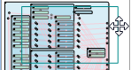

To zoom the diagram, use one of the following options:

*   Press the **Ctrl** key and use the mouse wheel to zoom in and out.

*   Press the **Shift** key and drag the mouse to select a rectangle to zoom into the selected area.

*   Right-click in the diagram to open the **context menu** and select a zoom command from the submenu **Diagram**.

*   In the **Diagram Overview** (see above), use the mouse to grab the frame at the corner and resize it to zoom the diagram.

For visualization, model containers are represented by **container nodes**, which can be expanded and collapsed (see next section). Other model entities are represented by **elementary nodes** and **links**. Neighborhoods, for example, are represented by a neighborhood node and links.

## General Navigation, Expand and Collapse‌

You do not want to remain a passive viewer of these pictures, instead you want to use the graphical representation for navigation within the model and even for editing the model.

Of course, the navigation by the diagram and list or tree view is synchronized. You can navigate to some entity in the tree view or list and when you double click it, the diagram view is adjusted to show this entity and the **Properties Editor** opens.

Alternatively, you can navigate to some entity in the diagram, double click it, and the list or tree view is adjusted to show the entity and the properties editor opens.

In the spatial structure and simulation view, you can navigate into subcontainers and return to the parent container by expanding and collapsing a container. Do one of the following:

*   Click the **expand** symbol  in the top left corner of a container to expand the container. Except for the parent containers, the superstructure is often masked out for clarity.

*   Click the **collapse** symbol  to collapse a container. A possibly hidden superstructure is redisplayed.

*   At anytime you can right-click into the diagram to open the context menu and select **Show all children** to show all hidden children of a container.

*   Press **Shift** and click  to expand a container without hiding other containers.

*   Press **Shift** and click  to collapse a container without redisplaying hidden structures.

*   Press **Ctrl** and click  /  to expand resp. collapse a container recursively.

## General Editing‌

Editing is a more complex topic than navigating. You can make three kinds of changes:

*   Model changes by adding or removing entities

*   Diagram changes for example by changing or fixing the location of nodes

*   Display changes like zooming and scrolling and Diagram options

The model and diagram state after changes is stored within the project, diagram options are stored within the user settings, zooming and scrolling is not stored.

You can perform many changes via the context menu. To open the **context menu**, right-click somewhere into the diagram. Depending on the location context, different menu items are displayed. The following context menu is shown when you right-click on a container.

The different context menu items are described in the sections below.

#### Model Changes‌

To edit the model, do one of the following:

*   Select  **Create Container** from the **context menu** to add a new container (or any other entity type).

*   Select  **Load Container** to load a previously saved container (or any other entity type).

*   Select  **Rename** to rename an entity.

*   Double click the entity or select  **Edit** from the context menu to focus and edit an entity.

*   Select  **Save** to save an entity separate from the project. You can load such entities in the same or into other projects.

*   Select  **Remove** to remove an entity.

### Diagram Changes‌

You can rearrange the position of nodes or hide nodes in order to get a better visualization in general or for publishing (you can export diagrams as bitmaps, see [More Actions](#more-actions)).

#### Selection of Nodes
    
First select a single diagram node or a collection of diagram nodes you want to change. Do one of the following:
    
*   Click a node to select it.

*   Press the **Ctrl** key and click a node to add it to the selection

*   Press the **Ctrl** key and drag a rectangle to add all nodes inside the rectangle to the selection

*   Select **Select / All Children** from the **context menu** to select all children of a container.

*   Select **Select / Visible linked nodes** to select all visible nodes, which are linked to nodes in the current selection.

*   Select **Select / Invert selection** to invert the selection within a container.

#### Basic Actions‌

Now you can move, hide or resize the selected nodes:

*   Drag the mouse to move the selected nodes. After moving a container, its neighborhood node positions are automatically adjusted.

*   Select **Diagram / Location fixed** from the **context menu** to fix the location of selected nodes and prevent them from automatic movement (neighborhood node adjustment or Auto layout). You can deselect the checkbox, if you want to re-enable automatic movement.

*   Select **Hide Selection** to hide the selected nodes.

*   Select **Show all children** to show all hidden children of a container.

*   If your collection contains not only container nodes but also elementary nodes, you can select **Large**, **Middle**, **Small** from the submenu **Nodesize** to change the node size of selected element nodes (neighborhoods, molecules, reactions, observers).


You may use different node sizes to emphasize important reactions and molecules or to minimize marginal reactions or molecules.


*   Select  **Undo Diagram Layout change** to undo diagram changes like collapse/expand or auto layout. Model changes break the undo sequence, and also hide/show cannot be undone. Observe that the **History Manager** only stores model changes but not diagram changes.

*   Select  **Diagram / To front** or  **Diagram / To back** to bring an element into front resp. back of another element/container in case of overlapping of containers and other nodes.

*   Select  **Refresh** to refresh a diagram, for example after changing the Diagram Options (see [Display Changes](#display-changes)).

#### Layout Actions

Instead of laying out the diagram by these basic actions you can also lay out the selected containers by using **diagram templates** or **auto layout algorithms**.

Auto layout of nodes via forces (repulsion by electrical charges, attraction by springs) is generally available, but yields inferior results in case of complex node networks. In the **Reaction** diagram, the context menu item "Auto layout in layers" yields good results in most cases, so using this function is recommended here.

The first template is often already used. When opening a Spatial Structure for an organism without diagram information (e.g., from PK-Sim®), a SpaceOrganismTemplate.mbdt is used - from the corresponding users profile (default path is C:\\Users\\<USER>\\AppData\\Roaming\\Open Systems Pharmacology\\MoBi\\3.0), if available, or else from the MoBi® installation folder.

Here are two tips, how you can benefit from templates:


You may define your own default organism template. For this purpose, save the organism container that you have modified according to your needs at the above location as SpaceOrganismTemplate.mbdt. (Saving templates is described below).



You can layout an organ in a simulation with all compartments expanded and reaction and transport networks arranged. Then save this organ container as template and apply this template to a selection of other organs.


To use a container template for layout:

1.  Layout a container manually as described in the previous section.
    
2.  Right-click in this container and select **Layout / Save Container as named Template** from the **context menu** to save the diagram information of the container and all contained elements as a template.
    
3.  Select one or more containers, which you want to layout with this template.
    
4.  Right-click on one of these containers and select **Layout / Apply named Template to Selection** to apply the container template to the selected containers. The diagram settings from the template and its contents will be transferred to the selected containers; the children are identified by their path.
    
In case of missing information in the template the respective element remains unchanged. In case of template elements not available in the container nothing happens.


You can use spatial structure templates for a simulation, but not vice versa.


In addition, you may use the following features:

*   To save and load a diagram template, select the analogous items from the diagram context menu (right-click on the diagram pane).

*   Select **Layout / Apply named Template to Container recursive** to apply a template to a container recursively; that means the template is applied to each subcontainer of the container. For example you can apply an organ template to all organs inside an organism by selecting this context menu item at the Organism container.

*   Select **Layout / AutoLayout children** to apply a force-based auto layout.

#### More Actions‌

You can export a container as bitmap:

*   Select **Diagram / Copy as bitmap** from the container or diagram context menu to copy the selected container or diagram as bitmap into the clipboard, from which you can insert it into documents or slides.

*   Select **Diagram / Save as bitmap** from the container or diagram context menu to save the selected container or diagram as bitmap to a file.

### Display Changes‌

We have already explained in “General Visualization, Scrolling and Zooming” how to change the display of a diagram by zooming and scrolling.

You can change the general appearance of the diagrams in the **Diagram Options**

tab within the **User Settings** dialog (click  **Options** in the Utilities ribbon tab).

All these options are stored in the user settings and apply to newly opened diagram tabs. Refresh a diagram to apply the diagram options to an existing diagram tab (see “Basic Actions”).

The default node sizes apply only to newly created elementary nodes, because current node sizes may have already been changed by the user.

Here you can change the **diagram colors** for nodes and links.

You can change the **default node size** for reaction, molecule and observer nodes. You can show or hide

*   the snap grid of the diagram pane,

*   the molecule properties container in the spatial structure and simulation diagram,

*   the observer links in the simulation diagram,

*   Molecule nodes, which are unused in the simulation diagram containers.

## Reactions Diagram‌

### Visualization‌
    
The Reaction building block consists of a list of reactions. Each reaction has educts and products, which are listed in the stoichiometry tab of the reaction properties editor. In the reactions diagram the reaction is represented by a triangle with a blue educts port, a green products port and a red modifiers port.

Modifiers are molecules which influence the reaction, but which are neither consumed nor produced, e.g., enzymes. Modifiers, like educts and products, are listed in the properties tab of the reaction properties editor, so they can be used within formulas.

Besides these reaction nodes, the reaction diagram can contain molecule nodes. The molecule nodes themselves do not represent any model objects (neither from the reactions building block nor from the molecules building block), they only represent molecule names. Instead, an educt is represented by the connection between the educts port of a reaction node and a molecule node with the educt name. Products and modifiers are represented analogously by connections to the corresponding ports.
    

    
In the reaction diagram, no containers are used, so the remarks from “General Navigation, Expand and Collapse” do not apply here.
    

The diagram colors can be changed in the diagram options (see [Display Changes](#display-changes)).


### Model Changes‌
    
You can **insert reactions and molecule nodes** by the context menu as described in “Model Changes”.
    
To **add an educt, product or modifier to a reaction**, connect a molecule node with its name to the corresponding port of the reaction node by doing one of the following:

    1. Move the mouse to the outer circle or the molecule node until the mouse pointer looks like ; now you are in connection mode.

    2.  Click and hold the left mouse button and drag the mouse to the intended port. A straight connection line is shown during dragging the mouse.

    3.  When you reach the vicinity of a port, the connection line snaps to that port. Move the mouse to the vicinity of the intended port.

    4.  Release the mouse button. A colored bended connection line is drawn now.

    Alternatively, you can establish a connection in the opposite direction: Move the mouse first to the port until you are in connection mode () and connect to a molecule node as described before.

To **remove an educt, product or modifier from a reaction**, disconnect the molecule node from the corresponding port of the reaction node by clicking on the connection line (it will then be marked by four squares) and pressing the **Delete** key.

In the same way, you can remove an unconnected molecule node by clicking it and then pressing the **Delete** key.

### Diagram Changes‌

To move a molecule or reaction node, move the mouse to the center of the node until the cursor looks like  click it and move it around.

In circular reaction-molecule networks you may swap the positions of the educts and products port for some reaction nodes. To do so, check **Connect Educts right** in the **context menu** of a reaction node.

To apply an auto layout in layers to a reaction diagram, select **AutoLayout in layers**. This auto layout yields good results in most cases. Molecules and reactions are ordered from basic educts on the left to final products on the right. Any swapped ports for educts and products are therefore reset by this action.

You can emphasize and minimize reaction and molecule nodes by changing their node size in the context menu.


In more complex reaction-molecule networks, some molecule names may be used in many reactions. In such cases, you may prefer more than one molecule node for this molecule name to avoid long connection lines with many intersections. You can create so called **twin nodes** by inserting a molecule node with the same name. Ports are now connected to the nearest twin node of a molecule name - at least after a **Refresh**. You cannot connect them to a twin node further away.


## Spatial Structure Diagram‌

Most features of spatial structure diagrams have been explained in the general sections before.

To **insert a neighborhood** between two physical containers:

1.  Move the mouse to the boundary of one of the physical containers you want to connect by a neighborhood until the cursor looks like ; now you are in connection mode.
    
2.  Click and hold the left mouse button and drag the mouse to the other physical container. A straight connection line is shown when dragging the mouse.
    
3.  When you reach the vicinity of a physical container, the connection line snaps to that container and turns from a thin red line to a thick black line. Move the mouse to the vicinity of the intended container.
    
4.  Release the mouse. A **New Neighborhood** dialog appears.
    
5.  Enter a unique name and click **OK**. A new neighborhood is generated.

## Simulation Diagram‌

Most features of simulation diagrams have been explained in the general sections before.

For the layout of a simulation diagram, you have an additional option. You can layout the underlying spatial structure and reaction diagrams first and then select **Apply current layouts from Structure and Reaction** from the **context menu** to apply that spatial structure layout to the container structure of the simulation diagram and to apply the reaction layout to the reaction-molecule network inside each physical container.

If you have opened (and possibly edited) the spatial structure diagram before you have opened the simulation diagram for the first time, the current spatial structure diagram (and the reaction diagram, if applicable) is automatically used as a template. Otherwise, when opening a simulation for an organism without diagram information (e.g., from PK-Sim® ) for the first time, the same SpaceOrganismTemplate.mbdt is used.

In the **Diagram Options** of the User Settings ([Display Changes](#display-changes)) you can show or hide

*   the molecule properties container in the spatial structure and simulation diagram,

*   the observer links in the simulation diagram,

*   molecule nodes, which are unused in the simulation diagram containers.

# MoBi®‌ Tools

## Search Function‌

MoBi® contains a powerful search function to find parameters, molecules, reactions, or other elements in a project or simulation. This function is useful to locate parameters or elements of building blocks or simulations (e.g., molecules, parameters, container) within the current project.

To perform a search, make sure that the search window at the right side of the MoBi®window is expanded; like the Chart Editor or History window, the Search window can be collapsed by clicking **auto hide**  (see [MoBi® - Window Overview](01-first-steps.md#window-overview)) and made again visible by clicking the **Search** bar. If in collapsible mode, the search window can be switched to the permanently visible mode by clicking **dock** .

A search text can then be entered into the **Search** input box. This may be the name of an element of a building block or simulation or a part of a description.

The scope of the search can be selected in the **Scope** combobox:

*   Selecting Project will search through the entire project, meaning all contained building blocks and simulations.

*   Selecting Local will search only within the currently edited building block.

*   Selecting AllOfSameType will search within the currently edited building block and all other building blocks of the same type. If, for example, you are currently editing a Molecules building block and have several of them in your project, the search will show results from _all_ molecules building blocks.

Several search options can be selected by checkboxes:

*   Checking **Match whole word** will only return results where the whole word is matching what is entered in the **Search** input box.

*   Checking **Use regular expression** will treat the text in the **Search** input box as a Regular Expression in the search. See other references (e.g., http://en.wikipedia.org/wiki/Regular_expression) for the explanation of a Regular Expression if you are not familiar with them.

*   Checking **Match Case** will only return results where the upper and lower case of the characters entered into the **Search** input box matches. This checkbox cannot be used in combination with **Use regular expression** and will thus become inactivated once you select the previous checkbox.

To start the search, click on the magnifier glass icon at the right side of the **Search** input box. The results will then be displayed in the Search Results table; if nothing is found, this list will remain empty. Initially, only the building block names with search hits are listed in the results window, but you can expand the lists by clicking the symbol in front of the name.


Double-clicking a listed item will show it in the edit window where you can view it in detail or enter changes.


## Parameter Identification‌

To perform a parameter identification, proceed analogously to the Population Simulation described above. Select **Start Parameter Identification** in the context menu of a simulation and specify a directory.

The Parameter Identification Toolbox is started then.

## Project History‌

The history manager allows you to document all steps that lead to a specific project status and particular results in MoBi®. With this manager you will be able to easily step back to previous states of your project work in the current session (i.e. a session endures from start of MoBi® to closing the program). The different lines in the manager represent different steps in modeling in the current project.

Here we only give a brief description; for more details see [History Manager and History Reporting‌](../part-5/10-history-manager-history-reporting‌.md).


If you want to test different possible directions in modeling of a specific problem, you can use this functionality to step back to the "decision point" (within the current session).


You will be able to reproduce every step that you have made during the project. In the window you will see the number of steps in the column **State After Action**. You can add labels in the history to mark important steps in your project modeling history and comment them by using the **Add Label...** button in the bottom. You can also change these comments by selecting a status in history and click on **Edit Comments...**. The **Rollback...** allows the user to step back to any numbered status in the current session.

## MoBi® Options‌

The program options window can be opened by clicking the  **Options** in the **Utilities** ribbon tab. This opens the options window. MoBi® here allows the user to define some basic settings, e.g., concerning the number of recently opened projects or settings for the diagrams or (de-)activating the dimensions validation in the **General** tab.

The tabs **Diagram Options**, **Diagram Auto Layout**, and **Chart Options** enable the control of the diagrams and charts. Most of these options are either self-explanatory (like colors or sizes of diagram elements), are explained in MoBi® _\- Diagrams overview_, or may be used to empirically optimize the outcome of the auto layout function.


Since no rollback or cancel of the user settings is possible, keep track of whatever changes you have done in the user settings.


# MoBi®‌ Reuse of Project Information from Previous Versions

## Reuse of MoBi® 2 projects in MoBi® 3‌


MoBi® 3 has a completely different model structure than all previous versions. Therefore, MoBi®3 is not able to completely import MoBi® 2 files, but rather allows for loading of certain information from MoBi® 2 projects into new projects.


In MoBi®3.5, projects can either use amount-based or concentration-based reaction rates. If a MoBi®2 project is using concentration-based reaction rates and is imported into a MoBi® 3 project that is also using concentration-based reaction rates, no conversion is needed. However, if a MoBi®2 project is using concentration-based reaction rates and is imported into a MoBi® 3 project that is using amount-based concentration rates, all values will be converted based on the volume of the relevant container.

This conversion is invisible to the user and based on the following algorithm: In the container with the volume V, the compound has a concentration C=A/V, where A is the amount of the compound. If the concentration-based rate is R\_C and the corresponding amount-based rate is R\_A, then:

dC/dt=R\_C and dA/dt=R\_A, R\_A=d(V\*C)/dt=C\*dV/dt+V\*dC/dt=C\*dV/dT+V\*R\_C.

*   If the volume is time-independent, then dV/dt=0 and the conversion between amount-based rates and reaction-based rates is done by just multiplying with the volume V of the container: R\_A=V\*R\_C.

*   If the volume is time-dependent, then dV/dt must be given by the user using a right hand side formula (RHS) (V\_rhs) and R\_A=C\*V\_rhs+V\*R\_C.

*   If none of this applies, dV/dt is assumed to be small and ignored Proceed in the following way to import information from MoBi®2 files:

*   Open the target project or create a new project

*   Go to **Utilities**, click **Load Information from MoBi 2 project**

*   Select the desired MoBi®2 project

You will be guided by a wizard to import data of the old project to the new one.

It is possible to load information on molecule properties, reaction networks and molecule default start values from your old MoBi®2 project into the new MoBi®3 project. The following functions will all be executed during this process:

| Function | Remarks |
|--- |--- |
| Import of Parameters used in Molecules and Reactions | In MoBi 3.5® a new logic for the import of parameters is established.  If a parameter is used in a molecule start concentration formula (regardless of if it is also used in a reaction) and is unique for just one molecule, it is added to that molecule's parameters upon import. If a parameter is used for several molecules, it is added to the molecule with the shortest name upon import. If the same is not unique, it is added to the molecule with the shortest name and in alphbetical order.  If a parameter is used only in reactions and in only one reaction, it is added to that reaction's parameters upon import. If it is used in more than one reaction, it is added to the reaction with the shortest name and in alphabetical order.|
| Import Molecules | Every species in MoBi®2 is converted to a MoBi®3 molecule. For each molecule a concentration parameter is added with a formula as used in PK-Sim 5®. If a species in your MoBi®2 project is defined as a compound, all compound parameters are added to the corresponding molecule. If only a single start value/formula is used for the species, it is converted to the default amount, otherwise the user is asked to select one. Compound species are set to non-stationary by default. Boundary species are changed to non-boundary type species. |
| Import Reactions | Every old reaction is converted into a new one. The species references are replaced with molecule/concentration references. The user is asked if links between models should be converted to reactions. If reactions with the same name, but different kinetics are used in your MoBi®2 project, only one reaction can be used which has to be decided by the user. Boundary species are imported with a stoichiometric coefficient of 0; additionally, a warning is given. |
| Import Molecule Start Values | Molecule Start Values are imported with a scale divisor. Default scale divisor is 1. |
| Import Simulation Settings | Simulation settings will be imported into a building block at the project simulation level. |
| Import Spatial Structure | THIS IS NOT A REAL SPATIAL STRUCTURE CONVERSION. It is recommended only for importing spatial structures with one single compartment, as passive transports between compartments cannot be imported. Containers and parameters may be moved to reactions or molecules. The simulation parameters (e.g., solver and time parameters) are not converted. Interaction links between models are converted to neighborhoods, their parameters are stored in the neighborhood structure. |


Values are converted to the project display unit defined in the new project so that the numerical values might change.


## Conversion of MoBi® 3.1 projects in MoBi® 3.2‌

Projects created with MoBi® 3.1 are automatically converted to the MoBi® 3.2 format when opened.

In MoBi® 3.1 in some cases it was necessary to insert manual conversion factors into formulas, if dimensions with inconsistent base units were used. In the current version such conversion factors are not longer necessary.


If you have inserted such manual conversion factors, you have to eliminate those factors and to rebuild the simulations to get proper simulation results. Please perform the following steps to identify and remove manual conversion factors and to rebuild the simulations.


1.  Open the project stored from MoBi® 3.1 with MoBi® 3.2.

2.  Open the Notifications view, which is autohidden at the bottom by default.

3.  Double click each row with message "Dimension check warning".

	The corresponding formula is opened. Remove any manual conversion factors (mostly powers of 10), if available. Do not remove other factors.

4.  Rebuild each simulation of interest, i.e. build a new simulation with the same building blocks and use the same simulation settings and modifications as in the corresponding old simulation.

5.  Run each new simulation and compare the results. In case of differences check the formulas with "Dimension check warning" again. In case you have to adjust a formula rebuild the simulation again. Otherwise compare carefully the used building blocks, simulation settings and simulation parameter modifications. If you still get different results, please contact our support ((mailto:support@systems-biology.com)<support@systems-biology.com>).

6.  If you successfully managed to rebuild the simulations with the same results, remove the old simulations from the project. (Due to the conversion factors still contained in those simulations you would produce wrong results running the old simulations with the new version of MoBi.)

## Shared Tools and Example Workflows

# Shared Tools - Features of Tables

In this chapter you find the documentation of the table view, which is generally used throughout the Open Systems Pharmacology Suite.

## Overview‌

In PK-Sim® and MoBi®, tables are often used for input and output, for instance in parameter lists, history, and the chart editor. The tables have several useful features whose availability in some cases depends on the context.

In this section we describe the most important features on the example of the table **Physiology > Organ composition** in the tab **Anatomy & Physiology** of an individual in PK-Sim®.

Before we describe the features in more detail in the following subsections, we give a brief overview of the most used concepts and actions:

*   Column width \- you can change the width of a column by dragging the separator line between two column headers .

*   Column order \- you can change the order of columns by dragging a column header to another location in the Column Header Row.

*   Sorting \- you can sort the rows by the content of a column by just clicking on the column header. The sorting column is marked by a triangle on the right of its header.

*   Filtering \- you can filter the rows by a certain value of a column by hovering with the mouse over the right hand side of the column header and clicking on the filter symbol , which then appears.

*   Grouping \- you can group the rows by dragging a column header to the grouping panel and vice versa.

Right-click on a column header to get a **context menu** with more features. In the following, we simply use **Context Menu** to denote the context menu of a column header.

The screenshot below shows a table

*   grouped by the Organs/Compartment column,

*   sorted by the Organ/Segment column,

*   filtered by Name = 'Fraction vascular',

*   and the name column moved left to the value column.

## Sorting‌

*   To sort the rows of a table ascendingly by a column, click the column header.

*   Click on the column header again to toggle the sort order between ascending and descending row values.

*   Select **Clear Sorting** from **Context Menu** to undo the sorting.

*   To sort by multiple columns, you need to press the shift key when clicking on the column headers for sorting. The ordering within a multiple column sort depends on the sequence with which the columns have been selected for sorting. To alter this sequence you deselect a column by **Clear Sorting** from **Context Menu** and then re-select it.

## Grouping‌

*   To group the rows of a table by a column, drag the column header from the **Column Header Row** to the **Grouping Panel**, if visible, or select **Group by this column** from its **Context Menu**.

*   To show the **Grouping Panel**, select **Show Group By Box** from **Context Menu**.

*   You can group by several columns hierarchically. In order to do so drag a column header to the left or to the right of another column header in the **Grouping Panel**.

*   To ungroup the rows, drag the corresponding column header from the **Grouping Panel** back into the **Column Header Row** or select **Ungroup** from the **Context Menu** in the **Grouping Panel**.


Note that the grouping feature is not available for all tables.


## Filtering‌

To filter the rows of a table do one of the following:

*   Hover with the mouse over the right hand side of the column header and click the appearing filter symbol . Then select one or more values in the values list. The filter condition is displayed at the bottom of the table, where you can delete or edit it.

*   Select **Show Auto Filter Row** from **Context Menu**. An auto filter row appears as first row in the table. There you can enter values; use * as wildcard.

*   Select **Filter Editor** from **Context Menu**. An filter editor dialog appears, where you can combine conditions for different columns.

*   Select **Show Find Panel** from **Context Menu**. The find panel with a single search field appears above the **Grouping Panel**. Here you can enter some text and all rows of which any field contains that text are displayed.

You can easily combine different filter features, as exemplary shown in below.

## Select columns‌

*   Select **Column Chooser** from **Context Menu**.

*   Drag a column header from **Column Chooser** to **Column Header Row** to show the column.

*   Drag a column header from **Column Header Row** to **Column Chooser** or outside the table to hide the column.


The column chooser is not available for organ composition table.


## Arrange columns‌

*   You can change the order of columns by dragging a column header to another location in the **Column Header Row**.

*   You can change the width of a column by dragging the separator line between two column headers .

*   You can adjust the width of a single column to fit its contents by double clicking its column header.

*   To automatically set an appropriate column width for all columns, select **Best Fit (all columns)** from **Context Menu**.

# Shared Tools - Chart Component

## Chart Display and Chart Editor‌

The chart component is used in PK-Sim® as well as in MoBi® . It consists of two views, the chart display and the chart editor. The chart display displays a chart, the chart editor is used to create and edit charts.

By default, the chart editor is auto hidden; when you hover over the vertical chart editor button on the right, the chart editor opens and you can edit the chart settings. To dock the chart editor click the auto hide button . The button icon then changes to , and the chart editor is docked. Afterwards, you are able to move the chart editor to other edges as well. To auto hide the chart editor, click the auto hide button  again.

The chart editor consists of several subviews that depend on the number of tabs specified in the chart layout and that comprise:

*   the data browser table for browsing and selecting data to be displayed in a chart,

*   the curves table and the axis table in the tab **Curves and Axis Options** for editing curve and axis properties,

*   the tab **Chart Options** for editing chart properties like title, legend position or back color.

*   the tab **Chart Export Options** for editing chart and font sizes used when exporting a chart.


The most frequently edited chart elements, axes and curves, can be edited directly from the chart display without using the chart editor. Just double click the axis or curve you want to edit or right click and select **Edit** from context menu.


## General Chart Basics‌

For a better understanding of the workflows and features of the chart component, we briefly introduce some chart basics. Charts are used to visualize data. In the Open Systems Pharmacology Suite, data consists of time series from simulation and measurements. Charts consist of axes and curves. Typically, the x-axis has the dimension time and the y-axis to dimension concentration.

Curves are based on time series, mostly one curve corresponds to a single time series, in this case the x-values represent the time axis and the y-values are the corresponding functional values of the time series. However, curves can also correspond to two time series with the same time scale, in this case the x-values are the values of the first time series and the y-values are the values of the second time series. Thus, for example, concentrations can be plotted against other concentrations.

Creating a chart consists of selecting the data and editing the curve / axis / chart settings. The chart settings and chart export settings can be reused to create uniform charts for a sequence of simulation projects.

In the next sections, we describe the basic workflow and the subviews in detail.

## Creating a Chart‌

Creating a chart consists of two steps:

1.  Select the data for the curves in the data browser.
    
2.  Edit the chart settings
    
    *   Edit curve options,
        
    *   Edit axis options,
        
    *   Edit chart options.
        
We describe these steps in the following subsections.

## Selecting Data‌

The data browser contains one row for each available time series. Depending on the complexity of your model, there can be thousands of rows. (For convenience, trivial time series with the constant value 0 are automatically excluded.)

Properties of the time series are displayed in the columns of the data browser, e.g., Organ/Container, Compartment, Molecule, Name, Dimension, Used.

To organize these data there are three concepts, which we describe here only briefly.

*   Grouping \- you can group by a column by dragging it from the column headers to the so called grouping area and vice versa.

*   Sorting \- you can sort by a column by just clicking on the column header.

*   Filtering \- you can filter a column by moving the mouse to the right side of the column header and clicking on the filter symbol, which appears.

Right-click on the column header to get a context menu with more options.

In the figure below, data are grouped hierarchically by organ and compartment, they are sorted by molecule and filtered by the condition **Dimension = 'Concentration'**.

To select data:

1.  organize your data according to your needs,

2.  do one of the following:

*   Check the checkbox  of a row in the used column,
    
*   Drag a row from the data browser to the curves table,
    
*   Select multiple rows by holding the CTRL or the SHIFT key when clicking them and drag them together to the curves table or check the checkbox **Use selected** in the right upper corner of the Chart Editor.
    
3.  Repeat step 2 until your data selection is complete.


The creation of charts with alternative x-values, e.g., other concentrations, is explained in “Using Alternative X-Values”.


After selection, the corresponding curves are automatically shown and listed in the curves table.

To deselect data, do one of the following:

*   Uncheck the checkbox  of the row in the used column of the data browser,

*   Click the **Delete** button  on the right side of the curve row in the curves table.

*   Click the row header on the left side of the row to select the curve row and press **Delete**.

## Editing Curve Options‌

The properties of the curves can be edited in the curves table. Each curve is displayed in one row, and the properties of the curves are displayed in different columns.

The most important columns are:

|   |   |
|--- |--- |
|y-Axis | The first curve is assigned to the first y-axis Y and the dimension of the axis Y is set from the corresponding time series. The next curves are assigned to the same y-axis as long as their time series have a compatible dimension.  For the first curve based on a time series with a different dimension, a second y-axis Y2 is created with that dimension and the curve is assigned to that y-axis.  If there are curves based on time series with further dimensions, they cannot be displayed, because they do not match one of the two possible y-axis dimensions. Then this row is marked with an error symbol and you have to adjust the axes dimensions and the y-axis property of the curve manually.|
| Curve Name | The curve name is created automatically when inserting a new curve. For simulation data it consists by default of organ, compartment, molecule and name of the time series. You can overwrite this name manually.  You can select additional discriminating curve properties for curve name generation at chart options of user settings: simulation name, top container/organism name, dimension name.|
| Color | Colors are automatically selected for the first 16 curves; however, you can adjust them by clicking on the color editor in the cell. See also paragraph below for coloring curves with the same color. |
| Style | You can select between the following styles: Solid, Dash, Dot, DashDot and None (for measured data points). |
| Symbol | You can select from the following symbols: None (default for simulation data), Circle, Diamond, Triangle, and Square. |
| Thickness | You can select line thicknesses as 1, 2, and 3. (Hidden by default) |
|Visible | To hide a curve from the chart, uncheck this checkbox. |
|In Legend | To hide an entry in the legend for a curve, uncheck this checkbox. For different observed data curves, you can use for example only one legend entry. |

If a row header or cell content cannot be fully displayed, the full content is shown in a tooltip when you hover with the mouse over that field, as shown below:

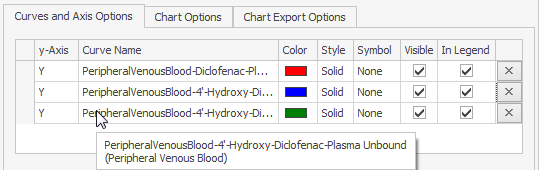

### Coloring curves with the same color‌

Often you may want to use the same color for different curves, e.g. for curves of the same molecule or organ or for observed data.

You can easily copy the color from one curve to another by just dragging the color symbol from one curve to the color field of another curve. During the dragging process, a **\+** symbol is shown.

If you want to color different curves - for instance of observed data - with the same color, you can also use the **Default Color** of the y-Axis.

1.  In the axes table, select the column **Default Color** in the column chooser (right click on column header).
    
2.  Change the **Default Color** for the corresponding y-Axis to the intended color.
    
3.  Select the curves from the data browser.
    
4.  Reset the **Default Color** for the y-Axis to White which deactivates default color.

### Creating clear legends‌

To make you legends clear and readable - especially when exporting them - you can do the following

*   Edit the curve name.

Curve names are automatically composed (in MoBi you can control the curve name composition via some settings in the Chart Options). Mostly, not all information contained by default is relevant in a certain situation and therefore the names should manually be reduced or renamed to contain the relevant information.

(If, after renaming you, are in doubt about the data of your curve you can always identify it by selecting the column y-Data from the column chooser of the curves table.)

*   Hide needless legend entries in particular for multiple observed data sets.

If you do not intend to refer to single individuals, uncheck the checkbox **In Legend** for all but one observed data set.

*   Reorder your legend entries to show the most important entries on top.

You can reorder them directly in the legend by dragging the line symbol to another symbol which moves the legend entry of the dragged curve just above the entry where it is dropped.

You can reorder them also by dragging the row headers (the small gray area on the left of a row) in the curves table.

## Editing Axis Options‌

You can edit properties of axes in the axes table. There is always one unique x- axis and one y-axis. You can add up to 2 additional y-axes by clicking the button on the right end of the y-axis row. Each axis is displayed in one row, and the properties of the axes are displayed in different columns.

You can select columns which are hidden by default using the **Column Chooser** and right click on the column header. The most important columns are:

| | |
|--- |--- |
| Axis | Type of the axis. |
| Dimension | The dimension of an axis is automatically determined by the selected data, see “Editing Curve Options” for details. You can change the dimension here manually in more complex situations. |
| Caption | This field is empty by default. Then dimension and unit are displayed as axis caption in the chart. You can enter an alternative caption here, which is displayed instead of the dimension name. (Hidden by default) |
| Unit | You can select a unit for the dimension of the axis from a list. |
| Scaling | You can switch between Linear and Log scaling. In case of Log scaling, values less than or equal to 0 are not displayed. By default, the scaling for y axes is **Log**, but in MoBi® you can change this in the Chart Options. |
| Numbers | You can select the numbers representation from Normal, Scientific and Relative. If you select Relative for a y- axis, each curve is displayed relative to its own maximum value, which then corresponds to 100% . (Hidden by default) |
| Min, Max | Empty for automatic range to show all values. You can override the values to restrict the displayed range. To return to automatic range, delete Min or Max value. |
| Default | Curves added to a y-axis get this linestyle by default. This way, Linestyle in the chart, curves can be easily correlated with their y-axes. You can change the default linestyles here, which are by default solid for y, dashed for y2 and dotted for y3. |
| Default Color | If a color different from White is selected, curves added to a y-axis get this color by default. (Hidden by default) |
| Grid | You can check this to display grid lines at the major ticks of the axis. |


The Min and Max values are overridden by zooming the chart.


## Editing Chart Options‌

You can edit the properties of the chart in the chart options tab.

| | |
|--- |--- |
| Name | Name of the chart, which is used as tab header. |
| Title | Title is displayed above the chart. |
| Description | A description is displayed below the chart. To insert line breaks press the **Enter** key. |
| Legend Position | You can select whether the legend is displayed at the right or at the bottom of the chart, inside or outside of the diagram area. |
| Chart Color | The color of the chart. |
| Diagram Background | The color of the diagram background. You can change these colors in the Chart Options. |
| Side Margins Enabled | You can check to leave about 5% margins at each side of the chart or uncheck to fit the diagram area exactly to the Min and Max values of the curves. |

## Editing Chart Export Options‌

You can export charts to the Working Journal or other applications by copy & paste. To copy the chart, just right click into the chart area and select Copy to clipboard.

You can define the size of the exported chart in the **Chart Export Options**. Then, the exported chart is independent of the current size of the application window. You can also define the font sizes of the exported chart to get readable legend entries in your slides for example.

In the **Chart Export Options** tab, you can select **Preview these settings in Chart Display** to preview any changes you have made in the settings of the **Chart Export Options**. You can select **Include origin data** and show the title of the PK-Sim® or MoBi®file, the name of simulation and the date of creation beneath the Chart®, as illustrated in the image below. This can be useful for example, if you want to refer to the simulation state used in a chart in a presentation.

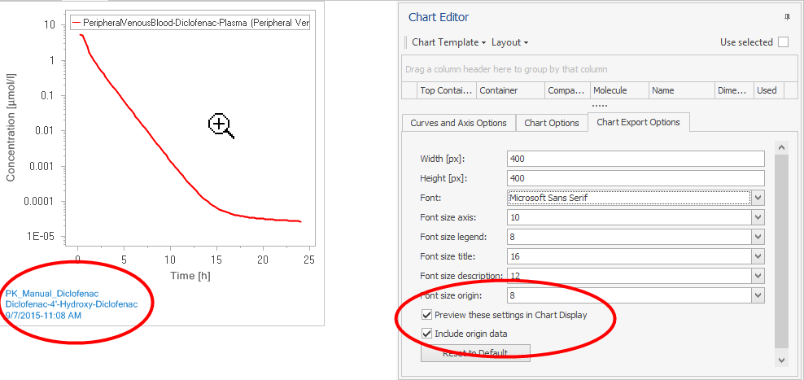

You can edit the following properties of the exported chart in the tab **Chart Export Options**.

| | |
|--- |--- | 
| Width \[px\] | The width of the chart in pixel units. |
| Height \[px\] | The height of the chart in pixel units. |
| Font | Here you can select the text font. The standard font is Microsoft Sans Serif. |
| Font size axis | You can adjust the font size of the axis via a drop down menu. |
| Font size legend | You can adjust the font size of the legend via a drop down menu. |
| Font size title | You can adjust the font size of the chart title in case you have defined one in **Chart Options**. |
| Font size description | You can adjust the font size of the description of the chart in case you have defined one in **Chart Options**. |
| Font size origin | You can adjust the font size of the origin data in case you have selected the **Include origin data** option. |

## Zooming the Chart‌

To zoom into the chart, do one of the following:

*   Hover the mouse over the chart. A zoom symbol appears. Press the left mouse button and drag the mouse to select a rectangle. Release the mouse button to zoom into the selected rectangle.

	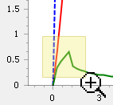

*   Explicitly define the range to be displayed in the Min and Max columns in the Axis Options.

*   Use the mouse wheel while the mouse pointer is located in the chart area.

To reset the zoom right click on the chart area and select **Reset Zoom (Ctrl+0)** or use the shortcut **Ctrl+0** (Do not use the 0-key from the numeric block, but from the typewriter keys.).

## Further Actions‌

### Saving and managing chart settings‌
    
You can save the chart settings (Chart Options and Chart Export Options, Curve and Axes Options) in different Chart Templates and reuse them in a simulation. This is useful for example, if you want to switch between different settings. You can also save and load these Chart Templates to files and reuse them in other simulations.
    
Moreover:

*   in PK-Sim®, the Chart Templates are reusable in any clone of a simulation,

*   in MoBi®, the Chart Templates and Curves Selection are part of the Building Block Simulation Settings and can be reused like any other Building Blocks.

The chart manager can be accessed directly from the chart editor after running a simulation. The following options are available:

*   Apply Template: choose from a list of saved templates,

*   Create New: create a new template based on current settings for data, curves, axis and chart options,

*   Update Existing: changes the settings for the template to the current settings for data, curves, axis and chart options,

*   Manage Templates: brings you directly to the chart template manager that displays an overview of all settings in a template which can all be edited.

In the chart manager, templates can be managed in the left hand side window and settings for an individual template can be edited in the two right hand side windows.

The following options are available for managing templates:

*   Clone: useful when changing specific settings based on an existing template.

*   Save template to file: allows you to reuse this template in another simulation settings building block, simulation or project.

*   Delete template

In addition, a template can be loaded as .xml file using the  button.

In the right panel, the user can specify which curve will be selected as output and how it will be diplayed.

An automated algorithm is implemented that decides which curves are selected when a certain template is chosen. Decision criteria are based on the output path (Y-Path) and the output type (Y-Type). The following decision scenarios are feasible:

*   If a selected output matches both, Y-Path and Y-Type, it will be selected and the curve name will be used as is.

*   A selected output matches the Y-type, but not the Y-Path of a template. The Y- Path of the ouput is for example **Organism|Venous|Blood|Plasma|Diclofenac**. The algorithm will then try to find all output located in the container **Organism| Venous|Blood|Plasma**. If only one output is found, the curve name will be used as is. If two or more outputs are found, the curve name will be ignored and a new unique name will be generated based on the actual path of the ouput. Sometimes, this heuristic approach might result in many selected curves at once. If more than ten curves will be selected, the user will be asked whether be wants to proceed or choose a different template for display of the selected output curves.


All changes to a template or selection of output are made at the level of an individual simulation. The simulation settings for the project remain unchanged, until the user expicitly updates the changes to the project simulation settings building block using the context menu as shown below.


### Selecting Editor Layouts‌

You can select one of the following predefined editor layouts:

| | |
|--- |--- |
| Standard View | The chart editor is auto hidden. The data browser is displayed in the upper area of the editor, the curves and axis options are displayed in the lower area. The chart options are displayed on a different tab since they are used less often.|
| Tabbed View | The chart editor is auto hidden. Data browser, curves options, axis options, chart options are displayed on four different tabs. Use this view, when you need maximal space for data browser or curve options display. |
| Two Tabs View | The chart editor is auto hidden. The data browser and curves options are displayed on the first tab, axis options and chart options are displayed on the second tab. Use this view, if the automatic axis settings fulfill your needs. |
| Variable X-Axis View | This layout is similar to standard view, but display all columns necessary for selection of an alternative x-axis (see [Using Alternative X-Values](#using-alternative-x-values)). The chart editor is docked. Use this view, if you want to use an alternative x-Axis. (Available in MoBi® only.) |


Save your preferred Editor Layout to your user settings. Just select Save to User Settings from the Layout menu at the top of the Chart Editor.

In this layout are stored the selected view and column settings in the subviews like visibility, order, column width and grouping.


### Using Alternative X-Values‌

As mentioned in the introduction of this section, typically one curve corresponds to a single time series in which the x-values represent the time axis and the y- values are the corresponding functional values, such as concentration.

However, curves can also correspond to two time series with the same time scale. In this case, the x-values are the values of the first time series and the y-values are the values of the second time series. Thus, concentrations can be plotted against another concentration or a fraction of the dose, for example.

To select other x-values than the default ones, do the following (you can skip steps 1 and 2 when using the editor layout Variable x-Axis View):

1.  Show the x-Data column in the curves table. In detail:
    
    1.  Right-click on the columns header row of the curves table.
        
    2.  Select **Column Chooser**.
        
    3.  Drag the x-Data (and y-Data, if you like) to a position between two other column headers in the header row.
        
    4.  Close the **Column Chooser**.
        
2.  Show the dimension column in the axis table (like in step 1) and in the data browser.
    
3.  Drag the time series with same the time scale and the intended values from the data browser to the x-Data field of the desired curve in the curves table.
    
    An error symbol appears at the x-Data field, because now the x-Data and the x-axis have different dimensions, which cannot be resolved automatically.

    
    
4.  Change the Dimension of the x-axis in the Axis Table to the dimension of the x-values manually.
    
5.  Change curve or x-axis caption according to your needs. Now the concentration is plotted against the selected x-values.
    

### Chart Options in User Settings‌‌

In MoBi®, you can change the default editor layout and the default curve name generation in the **Chart Options** tab within the **User Settings** dialog (click  **Options** in the Utilities ribbon tab).

All options here are stored in the user settings and apply for newly opened charts and curves.

# Shared Tools - Comparison of Building Blocks‌

The comparison of building blocks can help when to compare different versions of a model for e.g. reporting purposes. Alterations of individual building blocks can be seen at a glance. Converting models can also lead to alterations in building blocks. This can be the case, if one version of a model uses a functionality of PK- Sim® that was not available in the older version, e.g. tagging building blocks. A further, rather special case, is a listing of extended start values upon comparison. If, in MoBi® parameter or molecule start values are incomplete, they are extended during the **Create Simulation** process. These amended start values will be listed if the respective building block before and after creation of a simulation are compared.

Generally, only two building blocks can be compared at a time. Comparison of building blocks can be done within a group. For example, to compare two different molecule building blocks, press the Control key and mark both building block by left click. Upon right click, the context menu appears as shown below.

Comparison of building blocks can also be done within a simulation when a building has been altered and the differences to the original version need to be known. This is illustrated in the example shown below in which using the **Show differences** option in the context menue will produce a list of changes. Chosing the **Update from building block** option will reset all settings in the building block to those of the original.

Comparison of building blocks can also be done between two simulations on the same kind of building block as shown below.

Comparison of building blocks yields a list as shown below that can be filtered for better overview. To do so, right click on the small filter symbol in the top right hand corner of the row header and choose the filter setting from the context menue.

Comparison can be made according to specific settings defined by the user. The value entered for **Comparison tolerance (relative)** is a multiplication factor that sets the limit for two values being equal. For example, if this is set to 0, then two values need to be exactly the same for being considered equal. In contrast, setting the relative tolerance to 1, the values are considered equal. By default, the relative comparison tolerance is set to 1E-5. Using this setting, two values are equal if \- in a first approximation - the first five digits after the decimal point are equal. The tolerance has no effect when comparing non-numerical values, like "present/ absent".

A derived parameter can be defined by a formula that uses other parameters. Choosing the option **By values**, numerical values in the formula or the output of the formula are compared. Here, no limit for being equal can be introduced and numerical values need to be identical for being considered equal. All numerical values that differ between the two building blocks are compared. Choosing the option **By formula** compares the structure of the formulas. Both comparison criteria can be limited to impacts on the results of the simulations that contains the compared building blocks.

# Shared Tools - Parameter Identification

The first three chapters provide a basic understanding of the Parameter Identification tool: background and basic workflow and illustration in a simple example.

In the following chapters you find more detailed descriptions of the features and configuration of the tool and a more complex second example of a parameter identification.

## Background‌

The models built by PK-Sim® or MoBi® depend on a lot of input parameters which are based on literature values, measurements, databases, assumptions. For a given set of input parameters a number of output curves is computed in a **simulation**.

Often, experimental data for the outputs are given and the reverse question is asked: Which input parameters lead to a simulation with output curves corresponding to the given experimental data?

This reverse problem is called **Parameter Identification**: which values of certain input parameters yield simulation outputs that fit the observed data?

A **Parameter Identification** problem is a kind of optimization problem: Minimize the residuals between observed data and corresponding simulation output by varying selected input parameters in a given range. (For a definition of residuals see the table “Scaling”)

A variety of algorithms exist to solve optimization problems. The required effort and the quality of the solution depend on several factors, e.g. number and bounds of the input parameters of interest, complexity of the model, quality of start values for the input parameters.

Because not all possible combinations of input parameter values can be evaluated, sometimes not the global optimum is found, but a so called local optimum.

The user should be aware that a **Parameter Identification** as an optimization problem can become challenging, in particular for complex situations with many input parameters of interest or missing knowledge about their range.

In a lot of situations the available **Parameter Identification** features of the Open Systems Pharmacology Suite allow you to identify unknown parameter values much easier than by manual trial and error.

## Overview of the workflow‌

Within a Parameter Identification you have to perform the following steps:

### Prepare simulations‌
    
In order to use the Parameter Identification tool, you should add all observed data you want to use to one or more simulations.

Ensure that meta data for **Organ**, **Compartment**, **Molecule** is up to date, because this meta data is used for automatic mapping to outputs.

In the simulations which will be used for Parameter Identification, select all outputs to be mapped to observed data.


Selecting the input parameters of interest as **Favorites** makes it much easier to select those parameters later in Parameter Identification.

    
### Create a Parameter Identification‌
    
A Parameter Identification can be based on one simulation or several simulations which correspond to different experiments. To create a Parameter Identification, multiselect those simulations and select  **Start Parameter Identification ...** from the context menu.

### Map outputs to observed data‌
    
A mapping of observed data to corresponding simulation outputs is done automatically according to Organ, Compartment and Molecule meta data. Additionally, you can edit the mapping manually.
    
### Define Identification Parameters‌
    
You have to select those input parameters which should be varied and identified. Each of these Identification parameters can be linked to corresponding input parameters in different simulations.
    
## Configure Optimization‌
    
You can select between three optimization algorithms, edit their standard settings or change the usage of **Lower Limit Of Quantification** (LLOQ) values.
    
### Run Optimization‌
    
After finishing the previous steps, you can run a Parameter Identification which does not block the application. So you can proceed with manual work in your project. However the changes made in referenced simulations are not reflected in the _running_ Parameter Identification.
    
### View results‌
    
After the Parameter Identification is finished, you will find the parameter values and corresponding output curves. Other views can help to assess the quality of the result, e.g. Predicted vs. Observed values for drug concentration or the correlation between Identification Parameters at the identified parameter values.

During the Parameter Identification Run you can get visual feedback about the current state. If you like, you can stop the Parameter Identification manually.

## Simple Example‌

For a hands on exercise, open the example project Theophylline.pksim5. You can open the folder with the example projects from the Start menu by selecting All Programs/Open Systems Pharmacology/PK-Sim/Examples.

1.  In the Simulation Explorer mark the two simulations "_Kaumeier IV 208 mg fit_" and "_Kaumeier oral solution 185mg_" and select **Start Parameter Identification ...** from the context menu.
    
2.  A new view for _Parameter Identification 1_ is displayed and the tab **Data** is opened. On the left, the simulations with the assigned observed data are displayed. On the right, a list of mappings from outputs to observed data is displayed. For each observed data set for concentrations and fractions the corresponding output is mapped automatically (based on the Organ, Compartment, Molecule meta data).

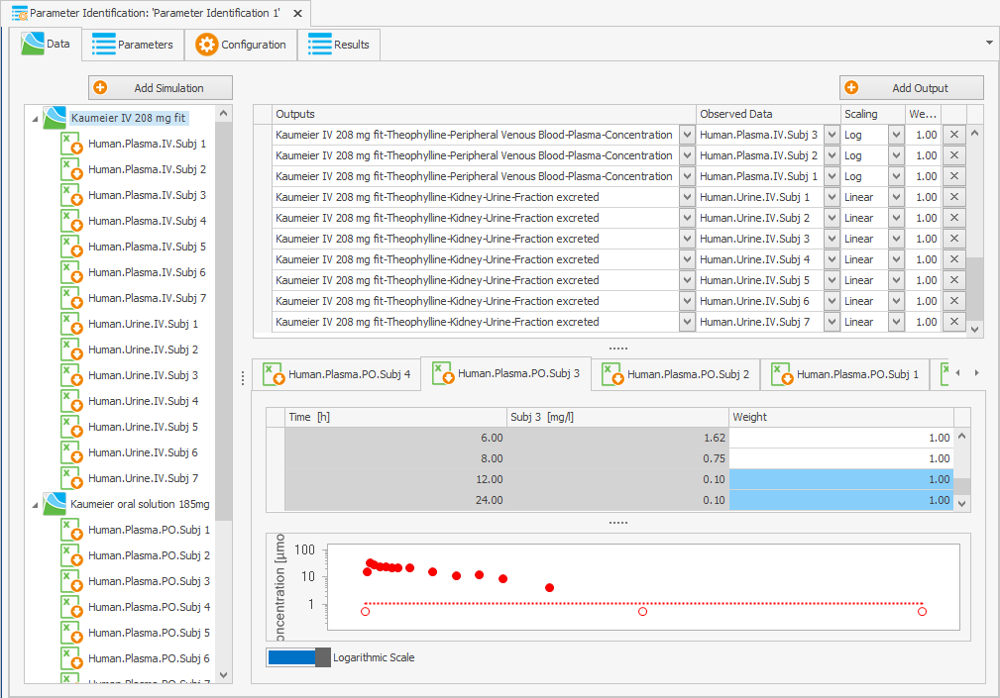
    
3.  Switch to the next tab **Parameters**. Here, you have to define the parameters for identification. On the left, a list of all parameters grouped by **Simulation** and **Organ** is displayed. You can reorder the list for a more convenient view:
    
    1.  In the column **Favorite**, filter for checked to display just the Favorites.
        
    2.  Ungroup the columns **Simulation** and **Organ** (by right click on the column names you find that entry in the context menu).
        
    3.  Group by column name.
        
    Select both Lipophilicity parameters and click the upper **Add** button, then select both GFR fraction parameters and click the upper **Add** button again. Now, you have selected two identification parameters each linked to both corresponding simulation parameters.
    
    Switch to the next tab **Parameters**. Here, you have to define the parameters for identification. On the left, a list of all parameters grouped by **Organ** and **Name** is displayed. (If you are interested only in the Favorite parameters you can filter the column **Favorite**.)
    
    By default, all **Favorite parameters** are already selected as **Identification Parameters** in the right list of Identification Parameters.
    
    In this example project _Lipophilicity_ and _Specific Clearance_ were selected as Favorites. Here we want to identify the _GFR Fraction_ instead of _Specific Clearance_.
    
    Remove _Specific Clearance_ from the list of Identification Parameters and keep the _Lipophilicity_ parameter. Then select both _GFR fraction_ parameters (Expand Kidney/GFR fraction) and click the upper **Add** button. Now you have selected one new identification parameter linked to both corresponding simulation parameters.
    
    Enter Minimum Value 0 for both **Identification Parameters** and Maximum Value 2 Log Units for Lipophilicity and 1 for GFR fraction.
    
    
        
4.  In the tab **Configuration** keep the default settings.
    
5.  In the Ribbon Bar **Run & Analyze** click **Show Visual Feedback** and then Run to start the optimization.
    
    
    
6.  Now the **Visual Feedback Window** shows the intermediate state during the Parameter Identification Run.
    
    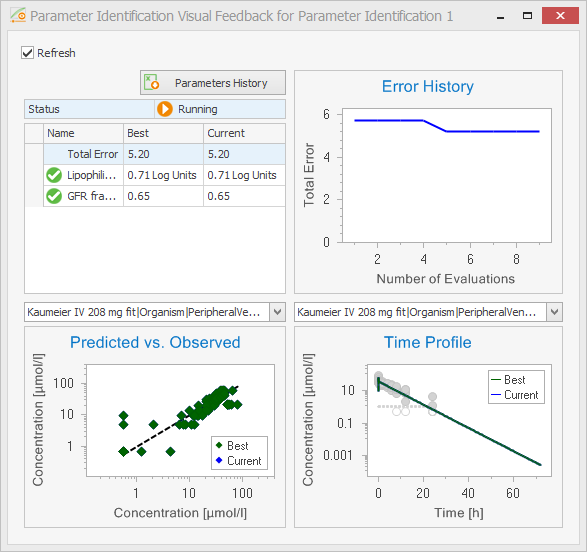
    
7.  After some iterations, the run is finished and you can switch to the tab **Results**.
    
	

You can transfer the optimized values for the parameters to the simulations by clicking **Transfer to Simulation**. Or you can select one of the **Analyses** views from the Parameter Identification ribbon. If you are not satisfied, you can change mapping of outputs or definition of Identification Parameters and run the Parameter Identification again.

## Creating a Parameter Identification‌

To create a new Parameter Identification, do one of the following

*   Mark one ore more simulations for the Parameter Identification in the Simulation Explorer and select **Start Parameter Identification ...** from the context menu.

*   In the ribbon bar **Parameter Identification** click  **Create** .

*   In the Simulation Explorer right click the Parameter Identification root node and select  **Add Parameter Identification** from the context menu.

The Parameter Identification view is displayed and the tab **Data** is opened.

To add an additional simulation, drag & drop the corresponding node from the Simulation explorer to the Simulations list in the Parameter Identification view or use the button Add simulation.

In the Simulation Explorer, the Parameter Identifications are also displayed in a tree. Using the context menu, you can

*   rename a Parameter Identification,

*   clone it in order to reuse the Identification Parameter Definition or the mapping of outputs to observed data,

*   add a Parameter Identification to a Journal page,

*   export the Parameter Identification definition to Matlab,

*   delete a Parameter Identification.

## Mapping Simulation Outputs to Observed Data‌

A mapping of observed data to corresponding simulation outputs is done automatically according to **Organ**, **Compartment** and **Molecule** meta data of observed data and path elements of the outputs.

One observed data item can be mapped to one output only, but the same output can be mapped to several observed data items.


Because meta data of observed data can be incomplete or wrong, you should check whether the right output is mapped to each observed data item. In case of different outputs with the same meta data (this can happen at least in MoBi), you should also check whether the automatically chosen output is correct.


You can also edit the mapping manually by selecting Output and Observed Data from the comboboxes.


In case of incomplete or missing meta data, it is recommended to correct the meta data first to enable automatic mapping.


For each mapping, the scaling can be defined as Lin or Log which determines the residual calculation.

**Scaling**

|   |   |
|--- |--- |
|Lin | Residuals are calculated as: Simulation value - Observed value. This means that the residuals are defined by absolute differences. If the magnitudes of values are different for different parameters, the different magnitudes of residuals should be harmonized by corresponding weights (reciprocal values). |
| Log | Residuals are calculated as: log(Simulation value) - log(Observed value) = log (Simulation Value / Observed Value). This means that the ratio of values is considered which is independent of the magnitude of the value. But for very small observed values, in particular close to 0 values, this can lead to problems, because log(10E-N) = -N can becomes large. Then, the weights should be manually adjusted or LLOQ handling should be adjusted in the **Configuration**. (See “Configuration of Optimization”) |

To reflect the quality or importance of the Observed Data item or to balance different magnitudes of values in case of Lin scaling, you can edit the weights of each mapping.

If you select a mapping, the corresponding Observed Data is displayed as table and chart in the bottom area. There you can edit pointwise weights, e.g. to reduce or remove influence of outliers.


In MoBi®, you can freely define observers to match any kind of observed data. In order to enable the automatic mapping ensure that the meta data for Organ, Compartment and Molecule is the same for corresponding observed data and observers. Therefore, you can define the observers for specific Containers and Molecules and/or edit the meta data of the observed data.


## Defining Identification Parameters‌

In the tab **Parameters** you can select the parameters which should be identified. If you have different simulations in one Parameter Identification, you have to decide, if one **Identification Parameter** is linked to _multiple_ **Simulation Parameters** or _one_ **Simulation Parameter** only. (If necessary you can even link different simulation parameters from the _same_ simulation to _one_ Identification Parameter.)

If you have, for example, two simulations for two individuals with the same compound you may have one identification parameter lipophilicity which is linked to both lipophilicity parameters in the two simulations. At the same time, you define two identification parameters for the individual reference concentrations of a certain enzyme.

In general, you should select **Identification Parameters** which are informed by the available observed data. You should be aware that the more Identification Parameters you define, the higher the complexity of the optimization problem.


For the efficient selection of **Simulation Parameters** it is helpful to mark those input parameters as **Favorites** in a Simulation. For convenience by default all **Favorite parameters** are automatically selected as **Identification Parameters**. In the Parameters list of the Parameter Identification you can filter then by _checked_ Favorites (here you cannot edit the Favorites).


If you like, you can ungroup the column Organ (via the context menu). So you get a list of Favorite Parameters with corresponding Simulation Parameters.

*   To define one Identification Parameter for all corresponding Simulation Parameters, simply select them all and click the upper Add button.

*   To define one Identification Parameter for each Simulation Parameter per Simulation, select them subsequently and click the upper Add button each time.

*   To add Simulation Parameters to an existing Identification Parameter (e.g. after adding another simulation to the Parameter Identification), select the Identification Parameter and the Simulation Parameter(s) and click the lower Add button.

*   To unlink a Simulation Parameter from an existing Identification Parameter, click the Unlink button  in the Identification Parameters Simulation Parameters list (bottom right area); the Simulation Parameter is then unlinked from that Identification Parameter and a new Identification Parameter is generated for it.

Of course, you can use other ways to filter, sort and group the list of Simulation Parameters. And you can use the Text Filter to filter by a text element in any column. Use enclosing quotation marks to search for composite strings, otherwise a search is conducted for both strings.

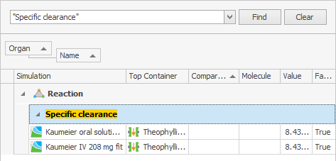

After selection of the Identification Parameters you should define their **Minimum and Maximum Values**. With these ranges you define the solution space of the optimization problem.

Per default, the value of the first corresponding Simulation Parameter is used as a **Start Value**. You can edit this value manually or reset it to the Simulation Parameter value, e.g. after change of value in simulation (see column Value in the list of Simulation Parameters).

By **Scaling** you define how the Identification Parameter is modified during optimization; if the magnitude of the parameter is not known, Log scale should be selected.

Per default, the value of the first corresponding Simulation Parameter is used as a **Start Value**. You can edit this value manually or reset it to the Simulation Parameter value, e.g. after change of value in simulation (see column Value in the list of Simulation Parameters).

By **Scaling** you define how the Identification Parameter is modified during optimization; if the magnitude of the parameter is not known, Log scale should be selected, which requires a **Minimum Value** \> 0.

In special cases you may want to couple two simulation parameters but not by the same value, e.g. you know that the specific clearance of metabolite is half of compound's specific clearance. In this case you can add both Simulation Parameters for specific clearance to one Identification Parameter, check **Use as Factor** and use e.g. a Minimum Value of 0.5 and Maximum Value of 2. Then both specific clearances are varied in parallel by multiplication of the respective simulation value with the same factor between 0.5 and 2.

## Configuration of Optimization‌

You can configure the handling of LLOQ values, select among three optimization algorithms and edit the settings of the selected optimization algorithms.

When checking **Calculate Sensitivity** at the end of the optimization, the partial derivatives are calculated locally for the optimized parameter values. From those, a **Covariance Matrix** and **Correlation Matrix** are calculated which give some information about _local sensitivity_ of **Identification Parameters**.

Additionally, you have special options to vary calculation methods (PK-Sim only) or to start multiple optimizations with randomized start values.

### Handling of LLOQ values‌
    
You can decide if data values below LLOQ should be used or removed and how they should be handled in the residual calculation.
    
**Remove data below LLOQ**
    
|   |   |
|--- |--- |
| Never (default) | All LLOQ values are used. In particular, for sparse data, the information that for a certain time point the value was measured and is between 0 and LLOQ can be relevant. |
| Always | No LLOQ values are used. And in case of Log Scaling of outputs, no 0 values are used. |
| Reduce trailing | Sometimes observed concentrations end with several trailing .L.L.O.Q values.  In particular when only the Observed data below LLOQ is transformed, those trailing values should be reduced because the ratio between untransformed simulation values and transformed observed values can become large and cause trouble for Log scale outputs. |
    

If in Observed Data LLOQ values are contained as 0 values, for **Remove data below LLOQ** the option Always should be used. Otherwise, those values can distort the optimization results, because log(0) resp. log(eps=10E-20) is evaluated in the residual calculation and these single residuals may dominate the whole optimization.

      
**Transform data below LLOQ**
    
|   |   |
|--- |--- |    
| Observed data and simulated data below LLOQ set to LLOQ (default) | Observed data and simulation data are transformed consistently to avoid artificial residuals, especially for log scaled outputs.  Values below LLOQ are set to LLOQ to avoid discontinuity for values little above and little below LLOQ. |
| Observed data below LLOQ set to LLOQ/2 | This option is left for backward compatibility. Here, simulation data below LLOQ is not transformed in residual calculation in contrast to observed data. |

### Optimization Algorithms‌
    
The three available optimization algorithms have specific advantages and disadvantages. While for simple optimization problems (e.g. 1 - 3 Identification parameters which are well informed by sufficient and not contradicting observed data) each of the algorithms works stably and fast, there can be big differences in applicability, robustness and performance in more complex situations. In such cases, some optimization experience is often required. The descriptions and hints given here can only give some basic support, for more detailed information follow the references.
    

We recommend the following general approach:

    
1.  You should start with the Levenberg-Marquardt algorithm and the option Standard (= single optimization run) which are the default settings.
    
2.  If the result of a Parameter Identification is not satisfying, choose one of the following options:
    
    *   In case you do not have enough time and/or hardware resources available, switch to Monte-Carlo algorithm and the option Standard;
        
        Afterwards, you may perform an additional Levenberg- Marquardt run using optimal parameter values produced by Monte-Carlo as the new start values.
        
    *   Otherwise (enough time and hardware resources): perform parameter identification using Levenberg-Marquardt algorithm with option Multiple optimization.


#### General hints

*   Levenberg-Marquardt algorithm is faster than Monte-Carlo algorithm. However, it is susceptible to being trapped by local minima.

*   Using Levenberg-Marquardt algorithm: sometimes increasing the value of **Finite derivative step size** parameter (e.g. setting it to 1e-4 or 1e-3) might improve the result of parameter identification.

*   Using multiple optimization (along with any algorithm): if some single optimization runs fail with **Out of memory** exception: reduce the value of **Max. number of processors to use** program option. You can find it under Utilities/ Options (both PK-Sim and MoBi

#### Monte - Carlo

In each iteration, every free parameter value is separately varied one step upwards and one step downwards from its current value and the objective function is calculated.

If the objective function improves (residual sum of squares becomes smaller), the variation is accepted.

Here, the variation order is a random permutation. The variation steps are taken at random within in the given parameter intervals and the probability for a step near to the current parameter value is higher than for a step far from the current value, corresponding to the projection grade parameter (alpha).

When a parameters variation shows improvement, its projection grade is decreased, otherwise it is increased.

This iteration is performed until the break condition holds.

**Algorithm parameters**

|   |   |
|--- |--- |
| Break condition for relative error improvement | Termination occurs when the relative improvement of the error evaluation is less than the break condition. |
| Scale of projection degree (alpha) | Start value for projection degree. Termination occurs when the minimal alpha is larger than 10 times alpha. |
| Maximum number of iterations | The maximum number of iterations performed. |

#### Levenberg - Marquardt

For a description of this algorithm see

Henri P. Gavin: "The Levenberg-Marquardt method for nonlinear least squares curve-fitting problems" (May 2016) http://www.people.duke.edu/~hpgavin/(http://www.people.duke.edu/%7Ehpgavin/ce281/lm.pdf) ce281/lm.pdf

K. Madsen, H.B. Nielsen, O. Tingleff: „METHODS FOR NON-LINEAR LEAST SQUARES PROBLEMS” (2nd Edition, April 2004) http://(http://www2.imm.dtu.dk/pubdb/views/edoc_download.php/3215/pdf/imm3215.pdf) www2.imm.dtu.dk/pubdb/views/edoc_download.php/3215/pdf/imm3215.pdf

**Algorithm parameters**

|   |   |
|--- |--- |
| Relative chi- square convergence criterium (ftol) | Termination occurs when both the actual and predicted relative reductions in the sum of squares are at most ftol. Therefore, ftol measures the relative error desired in the sum of squares. |
| Relative parameter convergence criterium (xtol) | Termination occurs when the relative error between two consecutive iterates is at most xtol. Therefore, xtol measures the relative error desired in the approximate solution. |
| Orthogonality convergence criterium (gtol) | Termination occurs when the cosine of the angle between fvec and any column of the jacobian is at most gtol in absolute value. Therefore, gtol measures the orthogonality desired between the function vector and the columns of the jacobian. |
| Initial step bound factor | Used in determining the initial step bound. This bound is set to the product of factor and the euclidean norm of diag*x if nonzero, or else to factor itself. In most cases, factor should lie in the interval 0.1, 100. 100 is a generally recommended value. |
| Maximum number of iterations | The maximum number of iterations to perform. If the number of calculation iterations exceeds MAXITER, then the algorithm returns. If MAXITER = 0, then the algorithm does not iterate to adjust parameter values; however, the user function is evaluated and parameter errors/covariance/ Jacobian are estimated before returning. |
| Maximum number of function evaluations | Termination occurs when the number of calls to objective function is greater or equal this value by the end of an iteration. |
| Finite derivative step size (epsfcn) | Used in determining a suitable step length for the forward- difference approximation. This approximation assumes that the relative errors in the functions are of the order of epsfcn. If epsfcn is less than the machine precision, it is assumed that the relative errors in the functions are of the order of the machine precision. |

#### Nelder - Mead

This algorithm does not use the defined bounds defined for the Identification Parameters.

For a description of this algorithm see

Nelder, John A.; R. Mead (1965). "A simplex method for function minimization". Computer Journal 7: 308–313

**Algorithm parameters**

|   |   |
|--- |--- |
| Convergence tolerance | Relative convergence tolerance |
| Maximum evalutions | Termination occurs when the number of calls to objective function is greater or equal this value |

### Variation of calculation methods and multiple optimizations‌

#### Multiple optimization
    
As explained above, optimization results can depend on the start values, if different local optima exist. This can happen for instance, if more identification parameters are selected and the observed data is heterogeneous. In such situations performing multiple optimization with randomized start values (randomly chosen from the range defined for the Identification Parameters) can lead to different results. Results can compared manually by the global error.
    
If multiple optimizations all return the same result, this is more likely a global optimum.
    
Depending on the number of processors in your computer and the corresponding setting in the General Options (Menu Utilities), optimizations are performed in parallel.
    
#### Calculation Methods Variation
    
In PK-Sim® often it is not clear, which Calculation Method is most appropriate to fit given observed data. Using the **Calculation Methods Variation** you can optimize simulations for different calculation methods e.g. for the Partition Coefficients, and compare the results.

If you have more than one molecule, you can decide whether the calculation methods should be **All the same** for all molecules or if different combinations of molecules and calculation methods should be tested.

Also, here optimization are done in parallel as long as processors are available to the Open Systems Pharmacology Suite.

### Display of intermediate and final results‌

#### Visual Feedback‌
    
During the optimization run, you can view intermediate results. Click **Show Visual Feedback** in the Ribbon bar **Run & Analyze**. A new window is displayed.
    

    
In this window the status of the optimization run is displayed and a table with the best and currently tested Identification Parameter values and the resulting total error.
    
The error history is displayed in a chart. You can use this information to stop the optimization run manually in certain situations and to assess if the optimization run had decreased the error substantially.
    
In the lower area you can select an output mapping and the current comparison between simulation and observed data values is displayed.

You can click the button **Parameters History** to export a table with all parameter value vectors tested during the optimization . And you can export the error history to Excel by right click into the chart. You can use this information for evaluation of the solution path, e.g. to assess the sensitivity of parameters.

In case of **Multiple optimization** or **Calculation Methods Variation** the Visual Feedback window gives an overview about the status of the different optimizations. You cannot switch to the detailed Visual Feedback view here.

### Results of Parameter Identification‌
    
After the optimization run is finished, you can view the results in the tab Results.

Status, elapsed time, number of evaluations and the resulting total error are displayed in the upper table.

Below, you find a table with the optimal values, start values and ranges for all Identification Parameters.

You can copy and paste both tables for documentation of the results e.g. to the Working Journal.
    

In case of **Multiple optimization** or **Calculation Methods Variation** you can compare the identified parameter value vectors and total errors for different Calculation Methods or Start Values in the tab Results.
    

### Analyses‌
    
From the ribbon Run & Analyze you can select different charts to analyze the optimization result and assess its quality.

#### Time Profile
    
For the different outputs, simulation and observed data values are displayed in different colors.

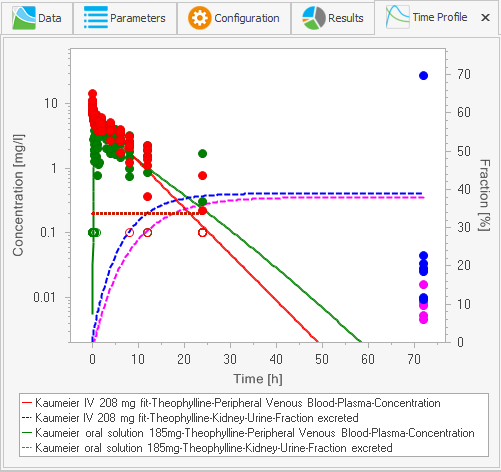

#### Predicted vs. Observed

For each observed concentration value a point is plotted with observed value as x-Value and corresponding simulation value as y-Value.

In case of different dimensions of the outputs you have to switch the x-Axis dimension to see the respective outputs.

#### Residuals vs. Time

This chart is similar to the Time Profile chart, but on the y-axis the (absolute) residuals used in the optimization are plotted. The chart includes scaling, weights and LLOQ usage and the values are dimensionless, so you can assess the actual influence of the observed data.

#### Histogram of Residuals

Using this chart, you can check if the residuals are distributed normally - the normal distribution is indicated by the black curve. Strong deviations from normal distribution indicate that the scaling of the parameters may not be appropriate or the model does not reflect the observed data.

#### Correlation Matrix

Based on the partial derivatives calculated locally at the found optimal parameter values, the **Correlation Matrix** and **Covariance Matrix** give some information about _local sensitivity_ of **Identification Parameters**.

The correlation between two identification parameters based on the observed data is high (positive or negative), if the entry in the correlation matrix is near to 1 or -1\. Entries between -0.5 and 0.5 indicate a low correlation.

You can use the correlation information to select the parameters to identify. In general, you will often observe correlations, if you have selected many identification parameters, see for example the results if you add the Specific clearance as an identification parameter.


Keep in mind that all information in this analysis is calculated only at the optimal values and is not necessarily valid in general.


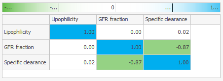

#### Covariance Matrix

The Covariance matrix gives additional statistical information and can be used to estimate confidence intervals for the identification parameters.


Keep in mind that all information in this analysis is calculated only at the optimal values and is not necessarily valid in general.

  

### Confidence Interval‌
    
From the ribbon Run & Analyze in the ribbon bar **Confidence Intervals** you can select different confidence interval charts to assess the quality of the Parameter Identification results.

Keep in mind, that **Visual Predictive Check interval** and **Prediction** interval are only available for measured quantities.


Even if the curves itself are positive, the lower ranges can become negative. Because negative values cannot be displayed in a log scale chart the curves are not visible then. In that case just switch the scaling for the corresponding y-Axis to linear, which is anyway recommended for fractions.


For more detailed background information about the _confidence intervals_, _model error_ and data error see \[[23](../references.md#23)\], \[[20](../references.md#20)\], \[[2](../references.md#2)\].

#### Confidence Interval

This chart displays the 95% confidence interval of the _model error_, which is based on the uncertainty of estimated parameters. This uncertainty is based on an estimation of the error between the mean value of used observed data compared with the mean value of the (unknown) total data.

#### Visual Predictive Check Interval

This chart displays the 95% Visual Predictive Check interval, which corresponds to the uncertainty based on the _data error_. The _data error_ is the standard deviation of the distribution of the used observed data.


You should check, if the distribution of observed data corresponds to the calculated interval, e.g. about 95% of the data points should lie in the calculated interval and the shape of the interval fits to the observed data.


If major deviations exist, the reliability of the Parameter Identification result is in question.

In that case you should consider to

*   improve the optimization, e.g. by different settings in the tab **Configuration**,

*   improve the _error model_, e.g. changing weights or scaling of outputs in tab **Data**,

*   improve the model itself.

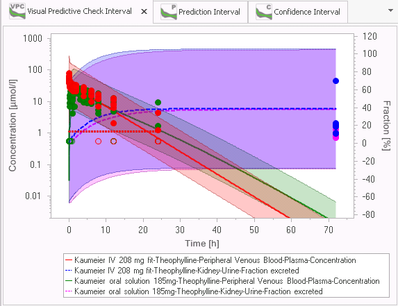

#### Prediction Interval

This chart displays the 95% Prediction interval, which corresponds to the combination of the _model error_ and the _data error_. It shows, how much future measured data are expected to differ from the model predictions.

## More Features‌

### Reuse of a Parameter Identification‌

Parameter Identifications are saved in the project files and can be attached to the **Working Journal**. So you can rerun Parameter Identifications after modification of the original simulations as long as used outputs and simulation parameters are kept in the simulation.

You can also clone a Parameter Identification by selecting **Clone** in the context menu of a **Parameter Identification** in the **Simulation Explorer**. In the cloned Parameter Identification you may define different Identification Parameters or a different configuration.

Sometimes you may have different simulations for the same observed data to compare model alternatives. In this case you can also reuse a Parameter Identification by cloning it. Afterwards, you can replace a used simulation with another simulation (with same or similar observed data, outputs and simulation parameters) by selecting **Replace Simulation ...** in the context menu of the simulation in the Data tab.

The mapping definition with weights, the definition of Identification Parameters and the Configuration remain the same as long as the corresponding parameters are available.
    
### Export of Parameter Identification to Matlab®‌

If you want to use the Matlab® optimization capabilities for optimization, you can export the Parameter Identification to Matlab® by selecting the corresponding entry from the context menu of a **Parameter Identification** in the **Simulation Explorer**.

Into the selected folder then are exported:

*   the simulations as .xml-Files,

*   the configuration of the Parameter Identification as .xml-File,

*   a example script for optimization and display of results as .m-File.

Before calling that script ensure in Matlab® that the path contains the directory "Open Systems Pharmacology\\MoBi Toolbox for Matlab".

# Shared Tools - Sensitivity Analysis

The first two chapters provide a basic understanding of the Sensitivity Analysis tool.

In the following chapters you find more detailed descriptions of the features and configuration of the tool.

## Motivation‌

The models built by PK-Sim® or MoBi® depend on a lot of input parameters which are based on literature values, measurements, databases, assumptions. For a given set of input parameters a number of output curves is computed in a **simulation**.

Often, those input parameter values are not well known. If experimental data for the outputs are given and the model output does not fit the experimental data, then the values for the input parameters have to be adjusted.

Because PBPK models can be complex and contain numerous input parameters, it would be useful to know which input parameters have most impact on the output curves. The Sensitivity Analysis tool provides an answer to this question.

For a chosen simulation with selected outputs, the relative impact of selected - or all - input parameters on the PK parameters of those selected output curves is calculated and displayed. In addition, the input parameters can be ranked by their impact on a certain PK parameter of an output. This way, input parameters which have the biggest impact on e.g. the AUC of the Venous Blood concentration of a given drug or on the end value of the fraction excreted to urine.

Or from the perspective of PK parameters for outputs: It is calculated how sensitive these outputs are to changes in different input parameters. In addition, for certain PK parameter of an output the input parameters can be ranked by the sensitivity of that PK parameter on the input parameter.

The general workflow to perform a **Sensitivity Analysis** for a chosen simulation consists of the following steps:

1.  Open the simulation and define the interesting outputs in the simulation settings ().
    
2.  Create a Sensitivity Analysis for that simulation.
    
3.  Select the input parameters of interest (can be all parameters) in tab Parameters.
    
4.  If necessary adjust their variation range to appropriate values.
    
5.  Start the Sensitivity Analysis. .
    
6.  View the sensitivity rankings in tab **Sensitivity Analysis** for the outputs to identify those input parameters with the highest impact.
    
7.  View the sensitivity matrix in tab **Results** for all output-PK Parameter combinations and all input parameters for details.
    
In the following, we explain the mathematical background of the sensitivity analysis provided.

## Mathematical background‌

To calculate the sensitivity of a PK Parameter of a certain output = PKj  to an input parameter = \[ pi \]

*   the input parameter is varied/perturbed around the value in the simulation by a (small) change = \[ # pi \] ,

*   a new simulation is performed for the changed input parameter value (all other input values remain unchanged)

*   the change of the PK Parameter \[ = # PKj \]  is calculated as the difference between the values in the new simulation and the original simulation.

The sensitivity for the PK Parameter to that input parameter is then calculated as the ratio of the relative change of that PK Parameter \[ = (# PKj) / PKj \] and the relative variation of the input parameter \[ = (# pi) / pi \]:

Thus, the sensitivities are dimensionless quantities. As an example, a sensitivity of -1.0 implies that a 10% increase of the parameters leads to a 10% decrease of the PK parameter value, and a sensitivity of +0.5 implies that a 10% increase of the parameters leads to a 5% increase of the PK parameter value.

For reasons of numerical stability, a sensitivity is calculated as the average of several sensitivities based on different variations #k :

The relative variations #k are defined by multiplication of the value in the simulation with variation factors. These variation factors are defined by setting two configuration parameters "Number of Steps” \[ = n \] and “Variation Range” \[ = a \] in the following way :

For each value of k = 1 ... n, two factors are used:  and 

For the default setting n = 2 and a = 0.1, we get 4 variation factors: 1/1.1, 1/1.05, 1.05, 1.1 .

## Selection of interesting outputs for a simulation‌

Outputs of a simulation cannot be changed while creating or configuring the Sensitivity Analysis, you need to decide on the outputs before you create a Sensitivity Analysis.

To select the outputs of interest for a simulation, open that simulation and click  Define Settings and Run to display the Curve Selection Dialog.

## Creating a Sensitivity Analysis‌

To create a new Sensitivity Analysis, do one of the following

*   Mark a simulation for the Sensitivity Analysis in the Simulation Explorer and select  **Start Sensitivity Analysis ...** from the context menu.

*   Click  **Create** in the ribbon bar **Sensitivity Analysis**.

*   In the Simulation Explorer, right click the Sensitivity Analysis root node and select  **Add Sensitivity Analysis** from the context menu.

The Sensitivity Analysis view is displayed and the tab **Parameters** is opened.

For a hands on example, open the example project Theophylline.pksim5. You can open the folder with the example projects from the Start menu by selecting All Programs/Open Systems Pharmacology/PK-Sim/Examples.

In the Simulation Explorer, mark the simulation "_Kaumeier IV 208 mg fit_" and select  **Start Sensitivity Analysis ...** from the context menu.

In the Simulation Explorer, the Sensitivity Analyses are also displayed in a tree. Using the context menu, you can

*   rename a Sensitivity Analysis,

*   clone it in order to reuse the Sensitivity Analysis configuration,

*   add a Sensitivity Analysis to a Journal page,

*   delete a Sensitivity Analysis.

## Tab Parameters‌

### Selection of interesting input parameters‌
    
You can select the input parameters that are of interest to you and that you want to test in the Sensitivity Analysis in two ways:

1.  You can select all input parameters by clicking Add All Constants. Depending on the selection Simple or Advanced in the lower selection list, all parameters in the left list (not only the filtered ones) are tested in the Sensitivity Analysis. You can then remove single parameters by clicking .
    
2.  You can select specific input parameter by manually selecting them (multiple selection is possible) and clicking Add. To identify the parameters of interest it can be helpful to reorganize the parameter list view on the left and use column filters or the Find field.
    
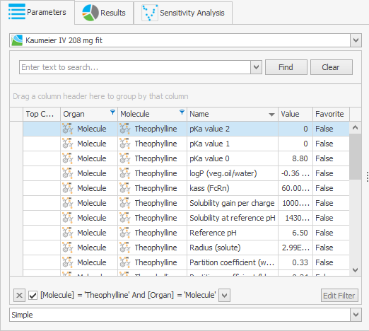


Be aware that only independent input parameters are displayed and selectable for Sensitivity Analysis, input parameters calculated by a formula cannot be selected.

  

Sensitivities are not calculated for input parameters with initial value = 0 (to prevent accidental structural model changes during sensitivity calculations); if such parameters are selected, they are ignored and not displayed in the results.

Parameters that have a table formula are not available for selection.

In PK-Sim, parameters which should not be changed are also not available for selection. In MoBi,there are no hidden parameters; thus also those parameters could be selected for Sensitivity Analysis (especially using “Add All Constant parameters” functionality). But sensitivity calculation of those parameters does not make any sense.


You can also select another simulation at the top of this tab. If you have selected parameters already which are not available in the newly selected simulation, a warning pops up.

### Adjustment of variation range‌

See “Mathematical background” for the description of the variation concept in the calculation of sensitivities.

On the right side of the tab Parameters, you can adjust the variation parameters **Number of steps** and **Variation range**. You can change the parameters by doing one of the following:

*   change the parameters individually in each row,

*   change the parameters in the top area and set the value for all input parameters by clicking **All**,

*   change the parameters in the top area, select multiple input parameters and set the value for the selected parameters only by clicking **Selection**.


Be aware that the time to compute the Sensitivity Analysis is proportional to the number of simulations

= number of input parameters * number of steps.

So in case of performance problems, think about restricting the tested input parameters or reducing the number of steps.


## Starting Sensitivity Analysis‌

In the ribbon bar **Sensitivity Analysis**, you can start and stop the calculation of the sensitivities.

Click  **Show Visual Feedback** to see a progress bar of the simulations calculation.

After the calculation is finished, you can:

*   switch to the tab **Sensitivity Analysis** to see for a selected PK Parameter a ranking of the input parameters by their impact on that PK parameter.

*   add additional **Sensitivity Analysis** tabs for other PK parameters by clicking

Sensitivity Analysis in the ribbon bar Analyses.

*   switch to the tab **Results** to see a tabular overview of all calculated sensitivites.

## Tab Sensitivity Analysis‌

Select an output and a PK Parameter for that output. (Normalized PK parameters are not displayed, because they have the same sensitivity as the corresponding non normalized PK parameters.)

Then a list of the input parameters with the most impact on that PK Parameter is displayed ranked by their impact resp. sensitivity.

For some outputs not all PK Parameters are reasonable, for instance clearance parameters for Fraction excreted outputs. Then no ranking is calculated and displayed.


For display in the chart, the parameters which contribute 90% of the cumulated sensitivity are determined. To do this the sensitivities are sorted by the absolute values and then they are cumulated in order of their sorting, according to 

with l=1,…,nP (number of parameters) and j index of PK parameter. The cumulated sensitivities as defined above include normalization to the absolute total sensitivity. Therefore, the normalized total sensitivity Stotal = SCum, nP j = 1. The cut-off is defined so that the above cut-off parameter sensitivities capture 90% of the total sensitivity.

  
## Tab Results‌

Here, the matrix of all calculated sensitivites is shown. See Warnings in “Selection of interesting input parameters” for remarks which sensitivities are calculated.


Sensitivity values in -1.0e-4 .. 1.0e-4 are displayed as 0 for reasons of clarity.


Rows correspond to the selected input parameters (with values # 0).

Columns correspond to the outputs of the simulation - for each output the reasonable PK Parameters are shown with exception of normalized PK parameters, as they have the same sensitivity as the corresponding non normalized PK parameters. (For example for Fraction excreted outputs Clearance PK Parameters are not reasonable.)

You can sort and filter rows and columns to restrict the view to the sensitivites of interest in different ways:

*   Sort rows and columns by just clicking the sort triangle symbol at the right of the header.

*   For simple filtering just move the cursor right to the sort symbol of the headers **Parameter**, **Output**, **PK Parameter** and click the filter symbol which shows up. You can select the values of interest in the filter list.

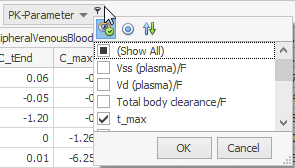

*   For more sophisticated filtering, right click the header and select **Show Prefilter**. A dialog shows up, click the + symbol and enter more complex conditions.

As a result, you get a restricted view of the sensitivity matrix.

Alternatively, you can export the full matrix (filters are not used) to Excel by clicking **Export to Excel**.

# Shared Tools - Import and Edit of Observed Data

A generic tool for handling of observed data within the Open Systems Pharmacology Suite is the formerly known PKExcelImporter. It is used in both applications (PK-Sim® and MoBi®) for importing observed data from e.g. Microsoft Excel® files with following prerequisites:

1.  A file contains one or several sheets with data tables.

2.  Column headers are in the first non-empty row.

3.  Units are given in the second header row or as part of the column header (at the end) enclosed in brackets (For example **Time \[h\]** would be interpreted as column name **Time \[h\]** and unit **h**).

4.  LLOQ values (= values below Lower Limit Of Quantification) must be preceded by a "<", e.g. "<0.2", where 0.2 is the LLOQ value. In case of different LLOQ values in one Observed Data vector the largest of those LLOQ values is used as LLOQ value.

The LLOQ value is stored at the data column and is not editable. All LLOQ values are stored as LLOQ/2 (= 0.1 in the example) to display them in the middle of the unknown range 0, LLOQ. In charts for such data a dotted line y=LLOQ is shown.

**File Selection Dialog**

In the Parameter Identification those LLOQ values can be handled differently (see [Handling of LLOQ values](04-parameter-identification.md#handling-of-lloq-values)).

To import data you should do the following:

1.  Select the input file (see [File Selection](#file-selection)).

2.  Specify the column mapping (see [Column Mapping in Import of Observed Data](#column-mapping-in-import-of-observed-data)).

3.  You can continue importing data sheets/data files by adding or changing the column mapping or selecting another input file.

4.  Enter all required meta data and set unit information.

5.  Complete the transfer of the imported data sheets to the calling application by confirming your settings.

## File Selection‌

Click on the **Observed Data** button to start the import component and specify the the excel file to be imported.


Both excel file formats (xls and xlsx) are supported and it is **not** required to have Microsoft Excel® installed on your computer.

  

By switching the file type combo box value it is possible to import a comma separated values file (csv) or a NonMem file (NMdat). For csv files, the used separator is determined automatically. Supported separators are semicolon, comma, tabulator, period or colon. Values can be enclosed in quotes.


## Preview of imported and original data‌

After selection of the file to be imported, a split window appears (see screenshot below). The left hand side shows a preview of the imported data file using the current mapping, each data table can be found in a separate tab. The right hand side window displays the mapping of imported column identifiers with the predefined data types. This mapping is performed automatically upon import but can be overridden by adjusting the controls. The preview of the imported data displays the first one hundred lines of each imported sheet.

An estimate of the number of data tables upon import using the current mapping is given in brackets in the **Import** button. This helps the user to judge whether the specified mapping produces the desired number of data tables. The **Import All** button is used to import multiple sheets at the same time.

Clicking on the **Preview Original Data** button allows the user to quickly review the original data. This might be useful in case explanatory data that is needed to perform mapping gets trimmed out during the import process. Also, in the preview of the original data, specific subsets of data can be selected for import.


**Deselecting Sheets**

You can deselect a complete source sheet from being imported by closing the tab page (clicking the  button). This can increase clarity and has a direct influence on the **Import All** button (see Import All).

  

**Sheet Navigation**

If you have a large number of sheets you may need to scroll through your preview pages. This can be done by using the mouse wheel or by using the navigator buttons on the right side. To select a specific page from a list you can use the page select button.


## Column Mapping in Import of Observed Data‌

The mapping table on the right in the **Import Observed Data** window shows the automatically generated mapping of the columns of the source sheet to the targets columns. Automatic mapping of source columns onto the target columns takes the following criteria into account:

1.  Equality of names.
    
    The target column has the same name as the source column.
    
2.  The target column supports the unit of the source column.
    
3.  If several target columns match the above criteria, the ones that have not been used in mapping are preferred to avoid multiple mapping.
    
4.  If no matching target column can be found, proceed as for meta data information on table level.
    
The mapping of source and target columns can be changed manually by using the buttons on the right hand side of each target column cell.

The predefined data types are time, concentration and error of concentrations and are available from a drop down menu. Similarly, imported data can be classified as meta data. Meta data is additional information on the imported data that applies to one or more data repository. The following meta data categories are available from the dropdown menu: molecule, species, organ, compartment, study ID, gender, dose, route and patient ID. For further information on handling and entering meta data see, “Entering Meta Data”. Units can be specified after clicking on .


A source column can only be mapped to a target column if the data types are compatible. This means, for example, that you cannot map a source column of data type 'date' to a target column of data type 'number'. Source columns of data type text can be mapped to all target column data types.

  

**Clinical Data Import**

You may have a large number of columns in your sheet when importing clinically observed data. In this case it might be a good idea to clear the default mapping and map manually only those columns you are interested in. Alternatively, use the Preview of the Original Data to select the data range that you wish to import. Use the Group By Mapping (see Using Group By in the mapping) to split the data into several parts (for example: Group By treatment to get a table for each treatment).


The icons to the left of each target entry in the mapping dialog have the following meaning:

*   The  icon indicates that meta data are requested.

*   The  icon indicates that meta data are requested which are not entered right now.

*   The  icon indicates that unit information are requested.

*   The  icon indicates that unit information are requested which are not explicitly entered right now.

*   The  icon indicates that meta data and unit information are requested.

*   The  icon indicates that the data will be split into several tables by distinct values of source column (see Using Group By in the mapping).


**Multiple Mapping**

It is possible to map multiple source columns onto the same target column. All possible combinations of those multiple mappings will result in multiple import tables.


It might be more effective to enter meta data information for a column during the mapping process, especially if you are using the multiple mapping feature.

The meta data will then be used for all columns which will be created out of this mapping.


Using Group By in the mapping

By mapping a source column on a target column using, the data sheet will be split into every distinct value of that source column. This results in multiple import tables. The label of each resulting import table contains the source column name and the respective value of the source column in that group. If used for grouping, a target column will appear as meta data in the following.



Meta Data Mapping

If meta data are requested for importing tables you can also map source columns onto such meta data fields. Then the source data gets split in the same way as for a group by mapping and the meta data fields are filled out with the distinct values of the source column.


In both, PK-Sim® and MoBi®, observed data can be organized in folders in the **Building Block** explorer. Observed data can be grouped into subfolders and shifted among folders by drag/drop or by using meta data to automatically group observed data during the import into a specific subfolder.

## Importing a file with several data sheets‌

To import a single data sheet you have to click on the **Import** button. If you want to import several data sheets in one file, click on the **Import All** button (see Import All) button. The number of currently imported tables is shown in brackets in the imports tab page caption.

You can go through each source sheet, map the columns and import the sheet as new import table. That way you would collect several import tables which can be transferred to the calling application later on.


Each required target column must be mapped onto at least one source column to enable the import buttons.

  

**Remapping And Table Replacement**

If you click the import button for a sheet that you have already imported you will be asked whether the already imported tables should be replaced by the newly imported ones, (see below).

By overwriting existing tables it does not matter how many tables have been imported by the previous mapping. If you confirm the replacement all previously imported tables which are based on the current sheet are replaced. If you dis-confirm the replacement the new tables are appended. The tables get serially numbered to get unique names.

  

**Import All**

If your source sheets are well mapped, you can use the **Import All** button to import all sheets by one mouse click.


## Entering Meta Data‌

Meta data are additional information that the calling application might request of the user. There can be meta data requested for an imported table or for each imported column (see below for an example).


All required meta data are indicated by a yellow background color and missing or invalid values are indicated by a preceding icon. In the tool tips you can get more information on the value which is requested. Optional meta data have a white background color.

  

**OK To All and Apply to All**

Meta data and unit information can be copied to other columns or tables either during the mapping or upon import in the preview. Depending on the context, this is done by pressing the **OK To All** or **Apply To All** button. Individual meta data can be applied to other imported sheets by using the button next to the combo box, the whole set of metadata is applied to all other tables using the Apply to All.


## Setting Units‌

A column unit can be set in the mapping dialog or by selecting  Set Unit from the context menu of a column in the imported table tab page (see Imported Table Tab Page Screenshot).

For a column there can be multiple dimensions defined. Each dimension can have multiple units.


If no unit information is found in the source column, the default unit is automatically set but must be explicitly confirmed.


## Completing the Import of Observed Data‌

A new tab page is created for each imported data file and you can enter meta data for tables or columns, set unit information or just view the imported data (see Imported Table Tab Page Screenshot). Changes to the error type or to units can be made in this view and are directly reflected in the chart.

On the left hand side you can see all meta data of the currently selected table and their columns. You can enter the requested information directly into this area or select  **Edit Meta Data** from the context menu of a column header.

To set a unit for a column of an imported table you can select  **Set Unit** from the context menu of a column header.

To complete the import of data tables to the calling application press the **OK** button.


Missing User Input

All required meta data and units need to be defined before finalizing the import. Each table in which meta data and/or unit information is missing, is labelled by a  icon preceeding the table name. Use the page select button  to get a list of all tables and identify those with missing information.

  

Deselecting Tables

You can deselect an imported table from being transferred by closing its tab (clicking the  button).

  

Collect From Different Sources

Before you transfer the imported tables to the calling application (and complete the import), you are free to go back to the source page and continue selecting more tables for import even from different source files.

  

The PKExcelImporter component determines the data type of a column by the first data rows. If there are values in the following rows that cannot be converted into the determined data type, those rows are skipped. If this results in an empty imported table, this table is deleted straight away and cannot be transferred.


## Editing Observed Data‌

Once a repository of observed data is imported, it can be manipulated by adding new data points, numerically changing data points or changing meta data. Changes are reversible through  and will be tracked in the project history. Numerically changing a value is reflected in real time in the preview graph below and will result in moving the data point in the data grid to the new settings

The new editing window can be accessed through double clicking the observed data in the building block view or through the context menu.


All values in the time column must be unique in a data repository.



**Editing All Meta Data**

Using the context menu of the **Observed Data** folders, the meta data values can be accessed and changed. This is very useful to supplement meta data or in reorganizing data. Changes will be applied to all data tables in that folder.


# Shared Tools - Default, Display and Base Units

The modeling tools PK-Sim® and MoBi® deal with a variety of physical quantities. Each quantity is related to a physical dimension. This dimension is displayed in a display unit, the preferred diplay unit is called default unit.

Display units can be chosen for a dimension in a project and for a user. In addition, a default display unit for each dimension can be defined.

The settings are applied in the following order:

*   Project Display Units

*   User Display Units

*   Default Display Units

The upcoming view is similar for both, display units in a project and for a user.

Units can be saved and loaded to and from a xml file. New display units can be added using the **Add Unit** button and filling up the new entry in the unit table. In addition, default display units for each dimension can be defined in the **User Settings** in the **Options** toolbar. When a new entity (parameter, molecule, ...) is created, the default display unit is used automatically.

If you want to update all display units to the default units, use the **Update all Display Units** button. This action will not change the value of a dimension.


If a view is open while reverting all units to the default settings, it might be required to close the view and open it again to verify that display units are set back to default settings.


Internally, the values for all quantities of a certain dimension are stored and calculated in the same unit, the so called **base unit** of that dimension. You find an overview of all dimensions with their base units in the appendix.

The base units are consistent since version 3.2.1; when you want to work with projects stored with previous versions, where you have used manual conversion factors in formulas, please refer to “Conversion of MoBi® 3.1 projects in MoBi® 3.2”

# Shared Tools - Reporting

## Introduction‌

The reporting engine generates reports in form of PDF documents for both applications.

The content of the document is mainly specified by the place from where the actions was called. That means, if you call the reporting generation from a context menu of a simulation the created document describes the simulation and if you call it from a building block the building block is described.

For any report you want to create the following dialog opens for specifying the output:

In the first part you can specify some information for the title page of the report like title, subtitle and author.

With the template selection you can take influence on the general report layout. A short description is given about the provided layout.

Independently from the selected template several options are supported:

**Report Options**

| Option | Description |
|--- |--- |
| Extended output (descriptions, images etc...) | Check this to extent the report by descriptions and images. |
| Draft watermark | Check this to get a watermark indicating that this report is in a draft mode. |
| Color or Gray scale | Select whether result plots should use the same color as in the application or whether all colors should be transformed to gray scales. |
| Font | Select a font. All text and all captions in plots are adjusted. |
| Open the report once created | Check this to open the pdf file directly after creation. |
| Save reporting artifacts (exported in folder <report\_name>\_Files) | Check this to get an extra folder with single files for each created plot. |

After clicking on **Create** a file selection dialog will ask you for the name and location of the pdf file to be created.

## Technical Background‌

Internally the report processing is done via LateX and the MikTex distribution for windows (version 2.9) is used.

Following LateX packages are used:

*   xcolor

*   adjustbox

*   float

*   pdflscape

*   grffile

*   tabu

*   longtable

*   needspace

*   caption

*   threeparttablex

*   textcomp

*   hyperref

*   fancyhdr

*   lastpage

*   draftwatermark

*   geometry

*   tikz

*   sectsty

*   placeins

*   tcolorbox

*   pgfplots

*   siunitx

# Shared Tools - Working Journal

## Project Documentation‌

The Working Journal allows for easy documentation of your working process with the Open Systems Pharmacology Suite. Because building PBPK and PD models is often a complex process, a documentation is necessary

*   for the modeler to remember the model building process,

*   for people who take over a model,

*   for authorities who have to evaluate the quality of modelling results.

Although it is possible in principle to use any text editor to write a documentation, the Working Journal provides several features, which give additional benefit:

*   Integrated rich text editor with the essential formatting options,

*   Easy transfer of Open Systems Pharmacology Suite content to the Journal (tables, charts),

*   Storage of simulations or building blocks as attachments to Journal Pages which can later be compared to other simulations or even reloaded,

*   Fast full text search in the complete Journal,

*   Journal Diagram as graphical overview of the model building process,

A Working Journal can be shared among several PK-Sim and MoBi project files, so one unique journal can be used within your project even if you use different project files. Even different users can access the same Working Journal at the same time - but only one user can edit a Journal Page at a time. From the technical point of view, the Journal consists of a .sbj file which contains all content, attachments and meta information.

After each important workstep, intermediate results or decision points can and should be added a Journal Page to the Journal. This should include the result, the input values, and description of decisions.

For instance, the values of the favorite parameters and result charts can be copied into the Working Journal by copy & paste and corresponding simulations and building blocks can be attached to the Journal Page directly from the context menu.

## Overview‌

To access the Working Journal, select the Tab Working Journal. Most buttons are deactivated before having created or selected a Journal for the current project file.

To add the first Journal Page, click **Add Page**. You are asked, whether you want to open an existing Journal or to create a new one.

*   If you have already created a Journal for the project (NOT project file), click

Open and select the .sbj file.

*   Otherwise, click **Create** and select a location and enter a file name for the .sbj file.

A Text Editor opens, and here it is possible to

*   edit the Title of the Journal Page, which is also visible in the Journal View (see “Journal view”),

*   enter and format text like in other text editors (you can also insert pictures or symbols, create tables, use hyperlinks etc.),

*   tag your document with keywords, e.g. the project file name, which can later be used for filtering.

The Page is saved automatically, when closing the Editor or switching to another Page.

Additionally, you can save any time explicitly using the short cut CTRL-S or the corresponding button in the file menu.

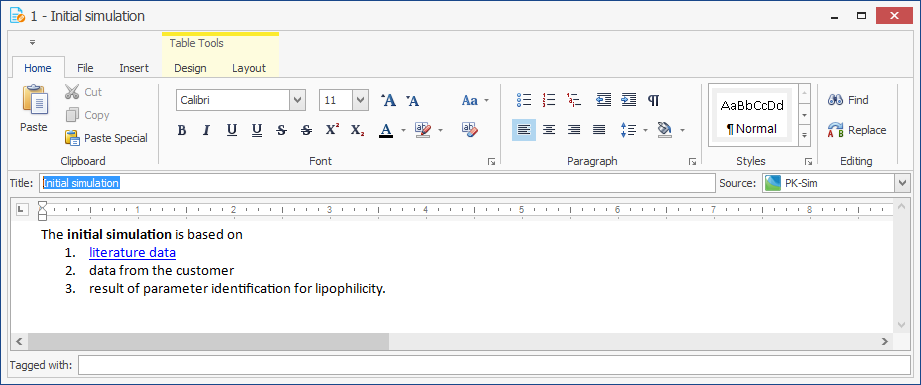

### Journal view‌

On the right side of the PK-Sim or MoBi application, the **Journal view** is shown by default. You can show and hide it like other views. In case you have removed the view, you can reopen it by clicking the corresponding button  in the Tab **Views**.

By default, the Journal pages are ordered by the creation date in a descending order. For each page, the unique index, the title, creation date, tags and the first characters of the text are displayed. You can select other columns with the coumn chooser to display for example the userid of the author. You can use the columns for sorting, filtering and grouping. This is helpful in particular in large projects, where different authors contributed or different project files are used.

To open a Journal Page in the Editor or to bring the Editor on top of the other windows, just double click on the corresponding Journal Page row. Alternatively, you can use the context menu (by right click) to edit or delete a Journal Page.

With a single click on a Journal Page row, you activate the Journal Page without bringing the Editor on top.

At the bottom of the **Journal View**, some detail information is displayed for the selected Journal Page, in particular a list of related items, if you have attached e.g. simulations or building blocks.

### Journal Ribbon group‌

After you had selected a Working Journal for your project file, all buttons in the Journal Ribbon group are active.

In the following sections we describe the available functions.

#### Add Page
    
A new Journal Page is created and displayed in the Journal Editor. Changes in the previously edited Journal Page are stored.

#### Journal Editor
    
The Journal Editor is opened on top of other windows, if you have closed or hidden the Journal Editor. Only one Journal Editor window is open at the same time.

#### Search
    
The search area is opened in the Journal view. See “Searching the Journal” for more information about searching in Working Journal.

#### Export Journal
    
The currently filtered subset of Journal Pages in the Journal View is exported to a .docx Document. This function allows you to export the complete Journal or a subset. If you would like to distinguish between public and internal Journal pages, you can use corresponding tags for example.
    
#### Refresh Journal
    
The current changes in the Journal Editor are saved and displayed in the Journal view. Moreover, changes in the Working Journal made by other users are reflected in the Journal view. Keep in mind that a Working Journal can be shared by different project files and so different users can use the same Working Journal simultaneously.
    
#### Select Journal
    
A file selection dialog is opened, which allows you to select another Working Journal .sbj file. This is usually not necessary, only in case you have selected the wrong Working Journal before.

## Adding content to a Journal page‌

Besides manually entering content into a Journal page, you can copy and paste tables and charts from PK-Sim or MoBi. So you can for example copy the

Favorites table and the simulation chart within seconds to a Journal page and in this way document input and output of your model.


It is recommended to select all parameters under consideration as **Favorites** and to document the source of all parameter values changed from the default in the column **Value Description**. This ensures a comprehensive overview of the essential input of your simulation which you can document by copying just the Favorites table.


### Copy & paste of tables‌
    
You can copy tables or selection of rows to a Journal Page.

In both cases only the visible rows and columns are copied. So you can use the sorting and filtering features of the table to restrict the transferred table content. You can also remove a column by just dragging the column header out of the table area.

To copy the visible table into the Working Journal, do the following:

1.  Right click into a row header (on the left of a row) and select
    
    *   Copy Table \- to copy the whole visible table - or
        
    *   Copy Selected Rows \- to copy all selected rows (you should have selected rows before by SHFT + Click or CTRL + Click)
        
2.  Switch to the Journal Editor, move the cursor to the intended position and select Paste from the context menu (by right click).
    
Alternatively, you can paste the tables also to other tools like Powerpoint® or Excel®.
    

    
Use short cuts for copy (CTRL+C for Selected Rows, SHFT+CTRL+C for whole table) and paste (CTRL+V).


### Copy & paste of charts‌
    
You can copy charts in standard size independent on the size of the application window. To define the chart size and also font sizes open in the **Chart Editor** the Tab **Chart Export Options** and define the properties.

To copy the chart into the Working Journal, do the following

1.  Right click into the chart area and select **Copy to Clipboard**.

2.  Switch to the Journal Editor, move the cursor to the intended position and select Paste from the context menu.

Alternatively you can paste the tables also to other tools like Powerpoint® .

## Working with Related Items‌

Additionally to the content written and copied in a Journal Page, you can attach Simulations and Building Blocks to a Journal Page as **Related Items** to save the current state of your work.

For example, you create a Journal Page to document the working state at some milestone presentation and attach the simulations used. Later, you can easily compare current simulations to those milestone simulations and identify differences. Or you can even reload the simulation in its old state and rerun it with a changed parameter value. (Reload of a simulation in MoBi results in loading missing Building blocks, too - in PK-Sim only the simulation itself is reloaded.)

To attach a Simulation or a Building Block to the active Journal Page, just select the context menu entry  **Add to Journal ...** at a Simulation or Building Block in the respective Explorer view.

The Simulation or Building Block is then displayed in the **Related Items** list at the bottom of the Journal view.

Using the icons on the right of a **Related Item** you can

*   compare the attached Simulation or Building Block to one of the current Simulations or Building Blocks of the project,

*   reload the attached Simulation or Building Block into the project using a unique name,

*   delete the **Related Item**.

## Searching the Journal‌

After you documented your project work using the Working Journal, you might want to use these "memories". To do so, you can use the meta data like Title, creation date or tags to find the Journal Page you are interested in. But often it is easier just to search for a specific keyword or phrase you used in your documentation.

To search for a word or phrase do the following:

1.  Click the  Search button in the tab **Working Journal** to open the Search area in the **Journal view**.
    
2.  Enter the phrase into the Search field (or select one previous search phrase from the list you get by clicking the  button at the right of the Search field). If necessary, open the Search Options by clicking the  button and select options.
    
3.  Click on the **Find** button.
    
4.  A list of Journal Pages which contain the search phrase is displayed. For each Page the matches are displayed in the context.
    
Double click on a Journal Page to open the Page in the Journal Editor - the **Find Dialog** of the Editor is displayed automatically; so you can browse through the find results in the Page. (A direct navigation from the match in the Journal view is not possible.)

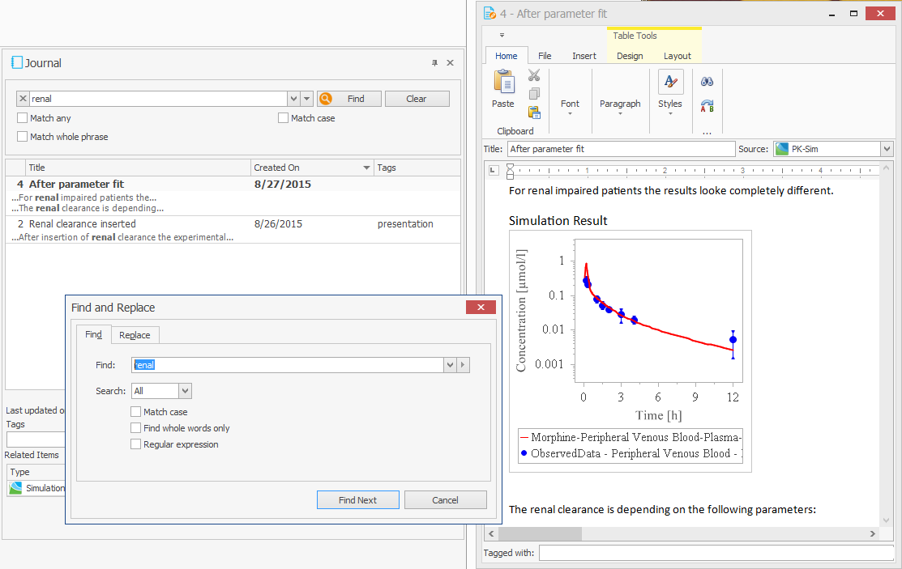

Click the  button on the left of the Search field to close the search area.

## The Journal Diagram‌

The modelling process in PBPK/PD projects is often not straight forward but requires consideration of different alternatives and testing of several approaches. So the working process is mostly not represented appropriately by just a sequence of work status. Instead, it looks like a tree with several dead ends and one path to the final solution.

Using the **Journal Diagram**, you can visualize your working process in a more appropriate way to maintain an overview of complex projects. You can use this overview for yourself or export it to project reports or slides. You can also see the Journal Diagram as a "diagram of content" of your Working Journal.

You can find the Journal Diagram at the bottom of your PK-Sim or MoBi window. It is hidden by default. If you have removed the view, you can activate it using the button  Journal Diagram in the Tab Views. There is only one unique Journal Diagram per Working Journal.

The Journal Diagram displays green rectangular nodes for each Journal Page and blue circle nodes for each attached related item at a Journal Page. You can arrange the nodes as you like just by drag & drop. If you move a Journal Page node the connected Related Item nodes are moved, too.

The green links represent predecessor-successor (or parent-child) relations in your working process. While a Journal Page representing a work status can have several successor Journal Pages, it can have only one predecessor Journal Page.

To connect two Journal Pages, do the following:

1.  click on the right connection port,

2.  hold the mouse key and drag to a left connection port of another Page,

3.  release the mouse key.

To delete a connection, select it and press the DEL key.

After you have arranged the Journal Diagram, click the Save Diagram button to save the Diagram layout to the Working Journal.


Clicking on Reset Layout to Default does immediately overwrite your layout work, so be careful using this button. (Result: All Journal Page nodes are displayed side by side in one horizontal sequence.)


You can zoom the diagram like all other diagrams by pressing the CTRL key while moving the mouse wheel.

By right click into the diagram area you get a context menu, which allows you to

*   **Copy to clipboard** the Journal Diagram (and paste it into other applications like Powerpoint® ,

*   Reset Zoom of the Journal Diagram,

*   Hide/Show Related Items to maintain the overview in large diagrams.

#include "part-5/history-manager-history-reporting‌.md"

#include "part-5/setting-up-reaction-network‌.md"

#include "part-5/setting-drug-drug-interaction-pk-sim‌.md"

## Working with Matlab® and R‌
    
# Matlab® - Introduction‌

## About the Toolbox‌

The MoBi® Toolbox for Matlab® is a collection of Matlab® functions, which allows for the processing of models developed in MoBi® from within Matlab®. For example, the Matlab® environment can be used to change parameters in a model developed in MoBi®, simulate the model, and analyze the results. This allows for an efficient operation in the model analysis stage, using the programming options as well as the function library available within Matlab® in combination with the powerful modeling interface and solver kernel included in MoBi®. In addition, the toolbox offers efficient analysis methods tailored to the needs of systems biology and PBPK modeling including parameter identification and optimization. The Toolbox can be found under Program Files (x86)/Open Systems Pharmacology/Mobi Toolbox for Matlab.

## Typical Matlab script to evaluate PK-Sim PBPK Models‌

The MoBi® Toolbox for Matlab® offers convenient access to PBPK and systems biology models developed in MoBi® or PK-Sim®.

A Matlab® code to analyze a MoBi® model typically contains the following steps:

1.  Initialize the MoBi model.
    
2.  Set parameters.
    
3.  Simulate model
    
4.  Analyze results
    
5.  Store modified model or reset.
    
The steps 2-4 are often repeated in an iterative manner, as can also be automated using the Matlab® programming options.

Even though Matlab® scripts can be programmed from scratch, it is recommended to execute **generateMatlabCodeForXML** on first usage. This will open a Graphical User Interface (GUI) which allows you to:

*   select a MoBi® model (xml) file,

*   select parameters of the model to be initialized in order to vary them from within Matlab®.

*   select entities to be retrieved after simulation, e.g. the drug plasma concentration.

Pressing the 'OK' button generates a Matlab® executable M-file, which contains the necessary Matlab®commands for executing the selected MoBi® model manipulations and evaluations.

The file is ideally suited for non-experts to start generating executable Matlab®\- scripts for MoBi® model handling as it will reveal the necessary M-file structure.

In the following, the possibilities for communication between MoBi® and Matlab® are summarized. For further details, please see the M-file help, which is available for each function of the Toolbox from within Matlab®.

## Initialization‌

### MoBiSettings‌
    
First, **MoBiSettings** have to be called in order to set the version of the MoBi- Matlab port. The version of the SimModel Component is passed as a parameter.

For further details, see the M-file help in Matlab®.

### InitSimulation‌

To initialize the MoBi® model, use the **initSimulation** function. This initializes the respective XML files. The first input parameter determines the model to be chosen. If you would like to change parameters before the actual simulation, these are best initialized beforehand and passed to **initSimulation** using a structure.

For further details, see the M-file help in Matlab®.

### Initialize parameters‌

If you call **initSimulation** with a parameter structure, the following functions can add parameters to the structure before initializing the simulation.

**initParameter** adds a parameter

**initSpeciesInitialValue** adds an initial value of a species
    
## Manipulate parameters‌

In the following, different functions are listed, which allow checking the existence of a parameter as well as getting and changing its value. Most functions come in two versions to distinguish the different types of parameters, i.e., _parameter_ and _species initial value_.

There are three kinds of parameters:

*   Readonly All parameters exist as read only parameter, the values can be read but not be varied.

*   Variable Parameters, which are set to variables during the initialization. The values can be read and varied.

*   Reference For every variable parameter a reference parameter exists. Variable parameters can be set relative to this reference parameter. The values of reference parameter can be varied.

For further details on the functions, please consult the M-file help available within Matlab®.

### Check Parameter existence‌

The following, functions allow you to check for the existence of a certain parameter (in the specified model, simulation, level):

**existsParameter** Checks the existence of a parameter and returns its description.

**existsSpeciesInitialValue** Checks the existence of a species initial values and returns its description.

### Get parameter values‌

The following functions allow you to check for the current parameter values.

**getParameter** Returns the value and other properties of a parameter.

**getSpeciesInitialValue** Returns the value and other properties of a species initial value.

### Set relative parameter values‌

The following functions allow you to change the value of an initialized parameter by changing the parameter value relative to the default.

**setRelativeParameter** Sets the value of a variable parameter relative to reference.

**setRelativeSpeciesInitialValue** Sets the value or scale factor of a specific species relative to reference.

### Set all parameter values‌

The following functions allow you to get and set the value of all initialized parameter simultaneously.

**setAllParameters** Sets all parameter values of one type (source) to the values of another type (target).

**getParameterStatus** Saves values of the given parameter type in the variable parameterStatus.

**setParameterStatus** Sets the previously stored values of the given parameter type.

### Table parameters‌

The following functions allow you to get and set the table of table parameters. 

**setTableParameter** Sets the table for a specific parameter. 

**getTableParameter** Retrieves the table of a specific parameter.

To get a value vector for a specified time profile with interpolated values taken from the table please use the **getParameter** function with a time profile parameter.

## Observer‌

Observer can not be changed, but you can check for existence or properties

**getObserverFormula** Returns the formula and other properties of an observer.

**existsObserver** Checks the existence of an observer and returns its description array.

## Time pattern‌

For a simulation a time pattern is defined. These are the points where the simulated results of species time profiles and observer time profiles are stored and made available for the user.

**getSimulationTime** Returns the time vector, unit of time and a cell array with the description of the time pattern.

**setSimulationTime** Sets the simulation time.

## Simulation‌

After the model has been initialized, and optionally parameters have been changed, the model can be simulated using **processSimulation**.

## Analysis‌

The following functions can only be executed after **processSimulation** has been executed. The functions enable the evaluation of the simulation results.

**getSimulationResult** gets the time curve of Species and Observers

**getPKParameters** Gets PK parameters of the time profile of a species or observer specified by path_id.

**getPKParametersForConcentration** Gets PK parameters of a time profile.

## How to get help‌

In the following some additional useful commands are given:

**MoBi** or **help '<ToolboxInstallationDirectory>'**, e.g. **help 'MoBi Toolbox for Matlab, help <\function name>**

Access the help within the command window for a specific function. If the function is located in a subfolder of the Toolbox, you might have to change into that folder, as it might not be included in your search path.

If you experience problems viewing the MoBi® help files in the help browser, try the following within Matlab® Start -> Desktop Tools -> View Source Files -> Refresh Start button, whereby the Start menu refers, to the one in the lower left corner of Matlab®, not Windows.

# R - Introduction

## R Toolbox for MoBi®‌‌‌

The R Toolbox is a collection of R functions which allows the processing of MoBi® models. A variety of functions is offered to manipulate models, to simulate models, and to handle simulation results.

The functions are designed very similar to the functions that are provided with the MoBi® Toolbox for Matlab®.

Details are available in the build-in help of R upon loading the R package.

## Installing the R Toolbox‌

The R Toolbox is provided to the user as a zip file. This zip file can be found in the download section http://www.systems-biology.com/uc/download.html of our web site. The standard package install via zip files is used.

On Windows, **install.packages** can install a binary package from a local zip file by setting argument repos to NULL.

Rgui.exe has a menu Packages with a GUI interface to **install.packages** that may be used.

## Appendix
    
# Appendix A.

## A.1. Dimensions and Base Units

Here you find an overview of all dimensions with their base units. Default display units are listed, where deviating from base units.

**A.1. All dimensions and base units**

| Dimension | Base unit | Deviating default display unit |
|--- |--- |--- |
| Abundance per mass protein | µmol/kg mic. protein | pmol/mg mic. protein |
| Abundance per tissue | µmol/kg tissue | pmol/g tissue |
| Age in years | year(s) | |
| Age in weeks | week(s) | |
| Amount | µmol | |
| Amount per time | µmol/min |
| Area | dm² | cm² |
| AUC (mass) | kg\*min/l | µg\*min/l |
| AUC (molar) | µmol*min/l | |
| BMI | kg/dm² | kg/m² |
| CL per mass protein | l/min/kg mic. protein | µl/min/mg mic. protein |
| CL per recombinant enzyme | l/min/µmol rec. enzyme | µl/min/pmol rec. enzyme |
| Concentration (mass) | kg/l | mg/l |
| Concentration (molar) | µmol/l | |
| Concentration (molar) per time | µmol/l/min | |
| Compliance | l/(kg/(dm*min²)) | ml/mmHg |
| Count | x10^6 | x10^6 |
| Count per mass | x10^6/kg | x10^6/g |
| Count per volume | x10^6/l | x10^6/ml |
| Density | kg/dm³ | g/cm³ |
| Diffusion coefficient | dm²/min | cm²/min |
| Dose per body weight | kg/kg | mg/kg |
| Energy | kg*dm²/min² | kcal |
| Flow | l/min | |
| Flow per weight organ | l/min/kg organ | ml/min/100g organ |
| Flow per weight | l/min/kg | ml/min/kg |
| Flow² | (l/min)² | |
| Fraction | | |
| Hydraulic conductivity | l/min/(kg*dm/min²) | ml/min/N |
| Inversed length | 1/dm | 1/cm |
| Inversed mol | 1/µmol | 1/mol |
| Inversed time | 1/min | |
| Inversed volume | 1/l | |
| Length | dm | cm |
| Log Units | Log Units | |
| Mass | kg | |
| Mass per tissue | kg/kg | mg/g |
| Molecular weight | kg/µmol | g/mol |
| Pressure | kg/(dm*min²) | mmHg |
| Resistance | kg/(dm\*min²)\*min/l | mmHg*s/ml |
| Resolution | pts/min | pts/h |
| RT | (kg\*dm/min²)\*dm/µmol | N*cm/mol |
| Second order rate constant | l/µmol/min |
| Slope | l/(kg/(dm*min²))/dm² | ml/mmHg/m² |
| Time | min | h |
| Velocity | dm/min | cm/min |
| Viscosity | min/l | s/ml |
| Vmax per mass protein | µmol/min/kg mic. protein | pmol/min/mg mic. protein |
| Vmax per weight organ tissue | µmol/min/kg tissue | |
| Vmax per recombinant enzyme | µmol/min/µmol rec. enzyme | nmol/min/pmol rec. enzyme |
| Vmax per transporter | µmol/min/µmol transporter | nmol/min/pmol transporter |
| Volume | l | |
| Volume per body weight | l/kg | ml/kg |

## References

# References

### References & Information

#### 1  
A. C. Andersen. _The beagle as an experimental dog_. Iowa State University Press. University of Michigan. 616 pages. 1970.

#### 2
N. Balakrishnan (Editor). _Methods and Applications of Statistics in Clinical Trials, Volume 2: Planning, Analysis, and Inferential MethodsArticle Title_. John Wiley and Sons. . 2014.

#### 3
L. Baxter, H. Zhu, D. Mackensen, and R. Jain. _Physiologically based pharmacokinetic model for specific and nonspecific monoclonal antibodies and fragments in normal tissues and human tumor xenografts in nude mice_. Cancer Research. 54. 1517-28. 1994.

#### 4
L.Z. Benet. _Basic Principles and Its Use as a Tool in Drug Metabolism_. in: Drug Metabolism and Drug Toxicity. J.R. Mitchell. M.G. Horning. Raven Press. New York, USA. pp. 199. 1984.

#### 5
L.M. Berezhkovskiy. _Volume of distribution at steady state for a linear pharmacokinetic system with peripheral elimination_. Journal of Pharmaceutical Sciences. 93(6). 1628-40. 2004.

#### 6
S. D. Cohen and A. C. Hindmarsh. _CVODE, a stiff/nonstiff ODE solver in C_. Comput. Phys. 10. 138-143. 1996.

#### 7
P. Costa and J. M. Sousa Lobo. _Modeling and comparison of dissolution profiles_. Eur J Pharm Sci. 13(2). 123-33. 2001.

#### 8
C. Crone and D.G. Levitt. _Capillary permeability to small solutes_. in Handbook of Physiology: The Cardiovascular System: Microcirculation. E.M. Renkin. C.C. Michel. American Physiological Society. Bethesda, MD, USA. pp. 411–466. 1984.

#### 9
C. Dordas and P. H. Brown. _Permeability of Boric Acids across Lipid Bilayers and Factors Affecting it_. Journal of Membrane Biology. 175. 95-105. 2000.

#### 10
J.B. Dressman, K. Thelen, and E. Jantratid. _Towards Quantitative Prediction of Oral Drug Absorption_. Clinical Pharmacokinetics. 47(10). 655-67. 2008.

#### 11
A. N. Edginton, S. Willmann, B. Voith, and W. Schmitt. _A mechanistic approach to the scaling of clearance in children_. Clinical Pharmacokinetics. 45. 683-704. 2006.

#### 12
A. N. Edginton, W. Schmitt, and S. Willmann. _Application of physiology-based pharmacokinetic and pharmacodynamic modeling_ towards individualized propofol target controlled infusion. Advances in Therapy. 23. 143-158. 2006.

#### 13
A. N. Edginton, W. Schmitt, and S. Willmann. _Development and evaluation of a generic physiologically based pharmacokinetic model for children_. Clinical Pharmacokinetics. 45. 1013-1034. 2006.

#### 14
A. N. Edginton, F.P. Theil, W. Schmitt, and S. Willmann. _Whole body physiologically-based pharmacokinetic models: their use in clinical drug development_. Expert Opinion on Drug Metabolism & Toxicology. 4(9). 1143-52. 2008.

#### 15
A.N. Edginton, G. Ahr, S. Willmann, and H. Stass. _Defining the Role of Macrophages in Local Moxifloxacin Tissue Concentrations using Biopsy Data and Whole-Body Physiologically Based Pharmacokinetic Modelling_. Clinical Pharmacokinetics. 48(3). 181-7. 2009.

#### 16
A. N. Edginton and G. Joshi. _Have physiologically-based pharmacokinetic models delivered?_. Expert Opin Drug Metab Toxicol. 929-34. 7(8). 2011.

#### 17
A. N. Edginton and S. Willmann. _Physiology-based simulations of a pathological condition : prediction of pharmacokinetics in patients with liver cirrhosis_. Clinical Pharmacokinetics. 47(11). 743-52. 2008.

#### 18
T. Eissing, L. Kuepfer, C. Becker, M. Block, K. Coboeken, T. Gaub, L. Goerlitz, J. Jaeger, R. Loosen, B. Ludewig, M. Meyer, C. Niederalt, M. Sevestre, H. U. Siegmund, J. Solodenko, K. Thelen, U. Telle, W. Weiss, T. Wendl, S. Willmann, and J. Lippert. _A computational systems biology software platform for multiscale modeling and simulation: integrating whole-body physiology, disease biology, and molecular reaction networks_. Front Physiol. 4. 2. 2011.

#### 19
T. Eissing, J. Lippert, and S. Willmann. _Pharmacogenomics of Codeine, Morphine, and Morphine-6-Glucuronide: Model-Based Analysis of the Influence of CYP2D6 Activity, UGT2B7 Activity, Renal Impairment, and CYP3A4 Inhibition_. Mol Diagn Ther. 43-53. 16(1). 2012.

#### 20
C.T. Ekstrom (Editor). _Introduction to Statistical Data Analysis for the Life Sciences, Second Edition_. CRC Press. . 2014.

#### 21
B. I. Escher and R. P. Schwarzenbach. _Partitioning of Substituted Phenols in Liposome-Water, Biomembrane-Water, and Octanol-Water Systems_. Environmental Science and Technology. 30. 260-270. 1996.

#### 22
P. Espie, D. Tytgat, M. L. Sargentini-Maier, I. Poggesi, and J. B. Watelet. _Physiologically based pharmacokinetics (PBPK)_. Drug Metab Rev. 41. 391-407. 2009.

#### 23
L. Fahrmeir, T. Kneib, and S. Lang. _Regression Modelle, Methoden und ihre Anwendung_. Springer Verlag. . 2009.

#### 24
F. Frezard and A. Garnier-Suillerot. _Permeability of Lipid Bilayer to Anthracycline Derivates. Role of the Bylayer Composition and of the Temperature_. Biochimica et Biophysica Acta. 1389. 13-22. 1998.

#### 25
E. Galia, E. Nicolaides, D. Härter, R. Läbenberg, C. Reppas, and J. B. Dressman. _Evaluation of various dissolution media for predicting in vivo performance of class I and II drugs_. Pharmaceutical Research. 15. 698-705. 1998.

#### 26
A. Garg and J. Balthasar. _Physiologically-based pharmacokinetic (PBPK) model to predict IgG tissue kinetics in wild-type and FcRn-knockout mice_. Journal of Pharmacokinetics and Pharmacodynamics.. 34. 687-709. 2007.

#### 27
Henri P. Gavin. _The Levenberg-Marquardt method for nonlinear least squares curve-fitting problems_. http://www.people.duke.edu/%7Ehpgavin/ http://www.people.duke.edu/~hpgavin/ce281/lm.pdf. . . 2016.

#### 28
X. Ge, S. Yamamoto, S. Tsutsumi, Y. Midorikawa, S. Ihara, S. M. Wang, and H. Aburatani. _Interpreting expression profiles of cancers by genome- wide survey of breadth of expression in normal tissues_. Genomics.. 86(2). 127-41. 2005.

#### 29
R. Gebhardt. _Metabolic zonation of the liver: Regulation and implications for liver function_. Pharmacol. Ther.. 53(3). 275-354. 1992.

#### 30
J. A. Goldsmith, N. Randall, and S. D. Ross. _On methods of expressing dissolution rate data._. J Pharm Pharmacol.. 30(6). 347-9. 1978.

#### 31
H. W. Haagard. _The Absorption, Distribution and Elimination of Ethyl Ether_. The Journal of Biological Chemistry. 59. 753-770. 1924.

#### 32
M. W. Härter, J. Keldenich, and W. Schmitt. in Handbook of Combinatorial Chemistry. Vol. 2. K. C. Nicholaou. R. Hanko. W. Hartwig. Wiley-VCH. Weinheim, Germany. 2002.

#### 33
W. L. Hayton. _Maturation and Growth of Renal Function: Dosing Renally Cleared Drugs in Children_. AAPS PharmSci. 2(1). E3. 2002.

#### 34
P. Holliger and P. J. Hudson. _Engineered antibody fragments and the rise of single domains_. Nat Biotechnol.. 23(9). 1126-36. 2005.

#### 35
H. G. Holzhutter, D. Drasdo, T. Preusser, J. Lippert, and A. M. Henney. _The virtual liver: a multidisciplinary, multilevel challenge for systems biology_. Wiley Interdiscip Rev Syst Biol Med. 2012.

#### 36
R. Kawei, M. Lemaire, J. L. Steimer, A. Bruelisauer, W. Niederberger, and M. Rowland. _Physiology Based Pharmacokinetic Study on a Cyclosporin Derivate, SDZ IMM 125_. Journal of Pharmacokinetics and Biopharmaceutics. 22. 327-365. 1994.

#### 37
G. Kersting, S. Willmann, G. Wurthwein, J. Lippert, J. Boos, and G. Hempel. _Physiologically based pharmacokinetic modelling of high- and low-dose etoposide: from adults to children_. Cancer Chemother Pharmacol. 397-405. 69(2). 2012.

#### 38
B. Krippendorf, R. Neuhaus, and P. Lienau. _Mechanism-Based Inhibition: Deriving KI and kinact Directly from Time-Dependent IC50 Values_. J. of Biomolecular Screening. 14((8). 2009.

#### 39
L. Kuepfer, J. Lippert, and T. Eissing. _Multiscale mechanistic modeling in pharmaceutical research and development_. Adv Exp Med Biol. 543-61. 736. 2012.

#### 40
F. Langenbucher. _Linearization of dissolution rate curves by the Weibull distribution_. J Pharm Pharmacol.. 24(12). 979-81. 1972.

#### 41
D. G. Levitt. _Physiologically based pharmacokinetic modeling of arterial- antecubital vein concentration difference_. BMC Clinical Pharmacology. 4. 2. 2004.

#### 42
E. D. Lobo, R. J. Hansen, and J. P. Balthasar. _Antibody Pharmacokinetics and Pharmacodynamics_. J. Pharm. Sci.. 93(11). 2645-2668. 2004.

#### 43
A. Loidl-Stahlhofen, T. Hartmann, M. Schöttner, C. Röhring, H. Brodowsky, J. Schmitt, and J. Keldenich. _Multilamellar Liposomes and Solid- Supported Lipid Membranes (TRANSIL): Screening of Lipid-Water Partitioning Toward a High-Throughput Scale_. Pharmaceutical Research. 18. 1782-1788. 2001.

#### 44
G. Loizou, M. Spendiff, H.A. Barton, J. Bessems, F.Y. Bois, M.B. d'Yvoire, H. Buist, H.J. Clewell 3rd, B. Meek, U. Gundert-Remy, G. Goerlitz, and W. Schmitt. _Development of good modelling practice for physiologically based pharmacokinetic models for use in risk assessment: the first steps_. Regulatory Toxicology and Pharmacology. 50(3). 400-11. 2008.

#### 45
K. Madsen, H.B. Nielsen, and O. Tingleff. _METHODS FOR NON- LINEAR LEAST SQUARES PROBLEMS_. http://www2.imm.dtu.dk/ http://www2.imm.dtu.dk/pubdb/views/edoc_download.php/3215/pdf/imm3215.pdf. . . April 2004.

#### 46
M. Meyer, S. Schneckener, B. Ludewig, L. Kuepfer, and J. Lippert. _Using expression data for quantification of active processes in physiologically- based pharmacokinetic modeling_. Drug Metab Dispos. 2012.

#### 47
John A. Nelder and R. Mead. _A simplex method for function minimization_. Computer Journal. 7. 308-313. 1965.

#### 48
I. Nestorov. _Whole-body physiologically based pharmacokinetic models_. Exp Opin Drug Metab Toxicol. 3. 235-249. 2007.

#### 49
M. Nishimura, H. Yaguti, H. Yoshitsugu, S. Naito, and T. Satoh. _Tissue distribution of mRNA expression of human cytochrome P450 isoforms assessed by high-sensitivity real-time reverse transcription PCR_. Yakugaku Zasshi.. 123(5). 369-75. 2003.

#### 50
M. Nishimura and S. Naito. _Tissue-specific mRNA expression profiles of human ATP-binding cassette and solute carrier transporter superfamilies_. Drug Metab Pharmacokinet. 20(6). 452-77. 2005.

#### 51
M. Nishimura and S. Naito. _Tissue-specific mRNA expression profiles of human phase I metabolizing enzymes except for cytochrome P450 and phase II metabolizing enzymes_. Drug Metab Pharmacokinet. 21(5). 357-74. 2006.

#### 52
P. Poulin, K. Schoenlein, and F.P. Theil. _Prediction of adipose tissue: plasma partition coefficients for structurally unrelated drugs_. Journal of Pharmaceutical Sciences. 90(4). 436-47. 2001.

#### 53
P. Poulin and F. P. Theil. _A Priori Prediction of Tissue: Plasma Partition Coefficients of Drugs to Facilitate the Use of Physiologically-Based Pharmacokinetic Models in Drug Discovery_. Journal of Pharmaceutical Sciences. 89. 16-35. 2000.

#### 54
P. Poulin and F.P. Theil. _Prediction of pharmacokinetics prior to in vivo studies. 1. Mechanism-based prediction of volume of distribution_. Journal of Pharmaceutical Sciences. 91(1). 129-56. 2002.

#### 55
P. Poulin and F.P. Theil. _Prediction of pharmacokinetics prior to in vivo studies. II. Generic physiologically based pharmacokinetic models of drug disposition_. Journal of Pharmaceutical Sciences. 91(5). 1358-70. 2002.

#### 56
NJ. Proctor, GT. Tucker, and A. Rostami-Hodjegan. _Predicting drug clearance from recombinantly expressed CYPs: intersystem extrapolation factors._. Xenobiotica. 34(2). 151-78. 2004.

#### 57
B. Rippe and B. Haraldsson. _Fluid and protein fluxes across small and large pores in the microvasculature. Application of two-pore equations_. Acta Physiol Scand.. 131(3). pp 411-28. 1987.

#### 58
B. Rippe and B. Haraldsson. _Transport of macromolecules across microvascular walls: the two-pore theory_. Am Physiological Soc.. 74. pp 163-219. 1994.

#### 59
T. Rodgers, D. Leahy, and M. Rowland. _Physiologically Based Pharmacokinetic Modeling 1: Predicting the Tissue Distribution of Moderate-to-Strong Bases_. Journal of Pharmaceutical Sciences. 94. 1259-1275. 2005.

#### 60
T. Rodgers, D. Leahy, and M. Rowland. _Tissue Distribution of Basic Drugs: Accounting for Enantiomeric, Compound and Regional Differences Amongst beta-Blocking Drugs in Rat_. Journal of Pharmaceutical Sciences. 94. 1237-1248. 2005.

#### 61
T. Rodgers and M. Rowland. _Physiologically Based Pharmacokinetic Modeling 2: Predicting the Tissue Distribution of Acids, Very Weak Bases, Neutrals and Zwitterions_. Journal of Pharmaceutical Sciences. 95. 1238-1257. 2006.

#### 62
T. Rodgers and M. Rowland. _Mechanistic Approaches to Volume of Distrubtion Predictions: Understanding the Processes_. Pharmaceutical Research. 24. 918-933. 2007.

#### 63
AD. Rodrigues. _Integrated cytochrome P450 reaction phenotyping: attempting to bridge the gap between cDNA-expressed cytochromes P450 and native human liver microsomes_. Biochem Pharmacol. 465-80. 57 (5). 1999.

#### 64
A. Rostami-Hodjegan and GT. Tucker. _Simulation and prediction of in vivo drug metabolism in human populations from in vitro data._. Nat Rev Drug Discov. 6(2). 140-8. 2007.

#### 65
M. Rowland and T.N. Tozer. _Clinical Pharmacokinetics and Pharmacodynamics: Concepts and Applications_. 4th edition. D.B. Troy. Lippincott Williams and Wilkins. Philadelphia, PA 19106. pp. 199. 1984.

#### 66
T. Sawamato, S. Haruta, Y. Kurosaki, K. Higaki, and T. Kimura. _Prediction of the Plasma Concentration Profiles of Orally Administered Drugs in Rats on the Basis of Gastrointestinal Transit Kinetics and Absorbability_. Journal of Pharmaceutical Pharmacology. 49. 450-457. 1997.

#### 67
J. Schlender. A manuscript including the description of the physiology base of the Japanese population implemented in PK-Sim® is in preparation..

#### 68
W. Schmitt. _General approach for the calculation of tissue to plasma partition coefficients_. Toxicology In Vitro. 22(2). 457-67. 2008.

#### 69
W. Schmitt and S. Willmann. _Physiology-based pharmacokinetic modeling: ready to be used_. Drug Discov Today. 2. 125-132. 2005.

#### 70
L. F. Shampine and S. Willmann. _Solving ODEs and DDEs with residual control_. Appl. Num. Math.. 52. 113-127. 2005.

#### 71
P. Sidhu, H. T. Peng, B. Cheung, and A. Edginton. _Simulation of differential drug pharmacokinetics under heat and exercise stress using a physiologically based pharmacokinetic modeling approach_. Can J Physiol Pharmacol. 365-82. 89(5). 2011.

#### 72
R.B. Silvermann. _Mechanism-based enzyme imhibitors_. Methods in Enzymology. 249. 1995.

#### 73
A. Strougo, T. Eissing, A. Yassen, S. Willmann, M. Danhof, and J. Freijer. _First dose in children: physiological insights into pharmacokinetic scaling approaches and their implications in paediatric drug development_. J Pharmacokinet Pharmacodyn. 2012.

#### 74
G. Tanaka and H. Kawamura. _Anatomical and physiological characteristics for Asian reference man: Male and female of different ages: Tanaka model_. Division of Radioecology. National Institute of Radiological Sciences. Hitachinaka 311-12 Japan. Report Number NIRS-M-115. 1996.

#### 75
A. Terenji, S. Willmann, J. Osterholz, P. Hering, and H. J. Schwarzmaier. _Measurement of the coagulation dynamics of bovine liver using the modified microscopic Beer-Lambert law_. Lasers Surg Med. 365-70. 36(5). 2005.

#### 76
F. P. Theil, T. W. Guentert, S. Haddad, and P. Poulin. _Utility of Physiologically Based Pharmacokinetic Models to Drug Development and Rational Drug Discovery Candidate Selection_. Toxicology Letters. 138. 29-49. 2003.

#### 77  
K. Thelen and J.B. Dressman. _Cytochrome P450-mediated metabolism in the human gut wall_. Journal of Pharmacokinetics and Pharmacodynamics. 61(5). 541-58. 2009.

#### 78
K. Thelen, E. Jantratid, J. B. Dressman, J. Lippert, and S. Willmann. _Analysis of nifedipine absorption from soft gelatin capsules using PBPK modeling and biorelevant dissolution testing_. J Pharm Sci. 2899-904. 99(6). 2010.

#### 79
K. Thelen, K. Coboeken, S. Willmann, R. Burghaus, J. B. Dressman, and J. Lippert. _Evolution of a detailed physiological model to simulate the gastrointestinal transit and absorption process in humans, part 1: oral solutions_. J Pharm Sci. 5324-45. 100(12). 2011.

#### 8
K. Thelen, K. Coboeken, S. Willmann, J. B. Dressman, and J. Lippert. _Evolution of a detailed physiological model to simulate the gastrointestinal transit and absorption process in humans, part II: extension to describe performance of solid dosage forms_. J Pharm Sci. 1267-80. 101(3). 2012.

#### 81
K. Thelen, K. Coboeken, J. B. Dressman, and S. Willmann. _Dynamically simulating the effect of food on gastric emptying using a detailed_ physiological model for gastrointestinal transit and absorption.. PAGE meeting 2012. Venice, Italy. 2012.

#### 82
Third National Health and Nutrition Examination Survey, (NHANES III). 1997\. National Center for Health Statistics Hyattsville, MD 20782 http://www.cdc.gov/nchs/nhanes.htm

#### 83
Expressed Sequence Tags (EST) from UniGene. 2010\. National Center for Biotechnology Information (NCBI) http://www.ncbi.nlm.nih.gov/unigene

#### 84
Annals of the ICRP. Basic Anatomical and Physiological Data for Use in Radiological Protection: Reference Values. J. Valentin. Vol. 32 (3-4). 2002.

#### 85
P. H. van der Graaf and N. Benson. _Systems pharmacology: bridging systems biology and pharmacokineticspharmacodynamics (PKPD) in drug discovery and development_. Pharm Res. 1460-4. 28(7). 2011.

#### 86
B. van Ommen, J. de Jongh, J. van de Sandt, B. Blaauboer, E. Hissink, J. Bogaards, and P. Bladeren. _Computer-aided Biokinetic Modelling Combined with In Vitro Data_. Toxicology In Vitro. 9. 537-542. 1995.

#### 87
M. Vossen, M. Sevestre, C. Niederalt, I. J. Jang, S. Willmann, and A. N. Edginton. _Dynamically simulating the interaction of midazolam and the CYP3A4 inhibitor itraconazole using individual coupled whole-body physiologically-based pharmacokinetic (WB-PBPK) models_. Theor Biol Med Model. 13. 4. 2007.

#### 88
W. Wang, E. Q. Wang, and J.P. Balthasar. _Monoclonal Antibody Pharmacokinetics and Pharmacodynamics_. Clin Pharmacol Ther.. 548-58. 84(5). 2008.

#### 89
O. Weber, S. Willmann, H. Bischoff, V. Li, A. Vakalopoulos, K. Lustig, F. T. Hafner, R. Heinig, C. Schmeck, and K. Buehner. _Prediction of a potentially effective dose in humans for BAY 60-5521, a potent inhibitor of cholesteryl ester transfer protein (CETP) by allometric species scaling and combined pharmacodynamic and physiologically-based pharmacokinetic modelling_. Br J Clin Pharmacol. 219-31. 73(2). 2012.

#### 90
S. Willmann, H. J. Schwarzmaier, A. Terenji, I. V. Yaroslavsky, and P. Hering. _Quantitative microspectrophotometry in turbid media_. Appl Opt. 4904-13. 38(22). 1999.

#### 91
S. Willmann, A. Terenji, H. Busse, I. V. Yaroslavsky, A. N. Yaroslavsky, H. J. Schwarzmaier, and P. Hering. _Scattering delay time of Mie scatterers determined from steady-state and time-resolved optical spectroscopy_. J Opt Soc Am A Opt Image Sci Vis. 745-9. 17(4). 2000.

#### 92
S. Willmann, J. Lippert, M. Sevestre, J. Solodenko, F. Fois, and W. Schmitt. PK-Sim®: A physiologically based pharmacokinetic 'whole-body' model. Biosilico. 1. 121-124. 2003.

#### 93
S. Willmann, W. Schmitt, J. Keldenich, and J. B. Dressman. _A Physiologic Model for Simulating Gastrointestinal Flow and Drug Absorption in Rats_. Pharmaceutical Research. 20. 1766-1771. 2003.

#### 94
S. Willmann, A. Terenji, J. Osterholz, J. Meister, P. Hering, and H.J. Schwarzmaier. _Small-volume frequency-domain oximetry: phantom experiments and first in vivo results_. J Biomed Opt. 618-28. 8(4). 2003.

#### 95
S. Willmann, W. Schmitt, J. Keldenich, J. Lippert, and J. B. Dressman. _A Physiological Model for the Estimation of Fraction Dose Absorbed in Humans_. Journal of Medical Chemistry. 47. 4022-4031. 2004.

#### 96
S. Willmann, J. Lippert, and W. Schmitt. _From physicochemistry to absorption and distribution: predictive mechanistic modelling and computational tools_. Expert Opinion on Drug Metabolism and Toxicology. 1. 159-168. 2005.

#### 97
S. Willmann, K. Hoehn, A. N. Edginton, M. Sevestre, J. Solodenko, W. Weiss, J. Lippert, and W. Schmitt. _Development of a physiologically-based whole-body population model for assessing the influence of individual variability on the pharmacokinetics of drugs_. Journal of Pharmacokinetics and Pharmacodynamics. 34(3). 401-431. 2007.

#### 98
S. Willmann, A.N. Edginton, and J.B. Dressman. _Development and validation of a physiology-based model for the prediction of oral absorption in monkeys_. Pharmaceutical Research. 24(7). 1275-82. 2007.

#### 99
S. Willmann, A.N. Edginton, M. Kleine-Besten, E. Jantratid, K. Thelen, and J.B. Dressman. _Whole-Body Physiologically-Based Pharmacokinetic Population Modelling of Oral Drug Administration: Inter-Individual Variability of Cimetidine Absorption_. Journal of Pharmacokinetics and Pharmacodynamics. 61. 891-9. 2009.

#### 100
S. Willmann, A.N. Edginton, K. Coboeken, G. Ahr, and J. Lippert. _Risk to the Breast-Fed Neonate From Codeine Treatment to the Mother: A Quantitative Mechanistic Modeling Study_. Clinical Pharmacology and Therapeutics. advance online publication. 2009.

#### 101
S. Willmann. _The in silico Child. Can computer simulations replace clinical pharmacokinetic studies?_. Original: Das In-silico-Child. Konnen Computer-Simulationen klinisch-pharmakokinetische Studien ersetzen?. Pharm Unserer Zeit. 62-7. 38(1). 2009.

#### 102
S. Willmann, K. Thelen, C. Becker, J. B. Dressman, and J. Lippert. _Mechanism-based prediction of particle size-dependent dissolution and absorption: cilostazol pharmacokinetics in dogs_. Eur J Pharm Biopharm. 83-94. 76(1). 2010.

#### 103
Y. Wu and F. Kesisoglou. _Immediate Release Oral Dosage Forms: Formulation Screening in the Pharmaceutical Industry_. in: Oral Drug Absorption: Prediction and Assessment. J. J. Dressman. C. Reppas. Informa Healthcare. New York, USA. pp. 323. 2009.

#### 104
J. Yang, M. Jamei, and K. Rowland Yeo. _Theoretical assessment of a new experimental protocol for determining kinetic values describing mechanism (time)-based enzyme inhibition_ . European Journal in Pharmaceutical Sciences. 31. 2007.

#### 105
H. Zischka, C. J. Gloeckner, C. Klein, S. Willmann, M. Swiatek-de Lange, and M. Ueffing. _Improved mass spectrometric identification of gel- separated hydrophobic membrane proteins after sodium dodecyl sulfate removal by ion-pair extraction_. Proteomics. 3776-82. 4(12). 2004.